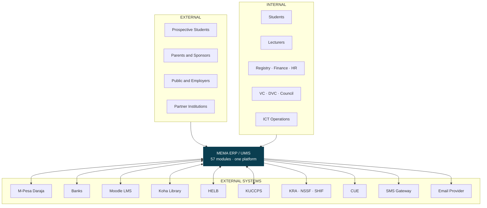
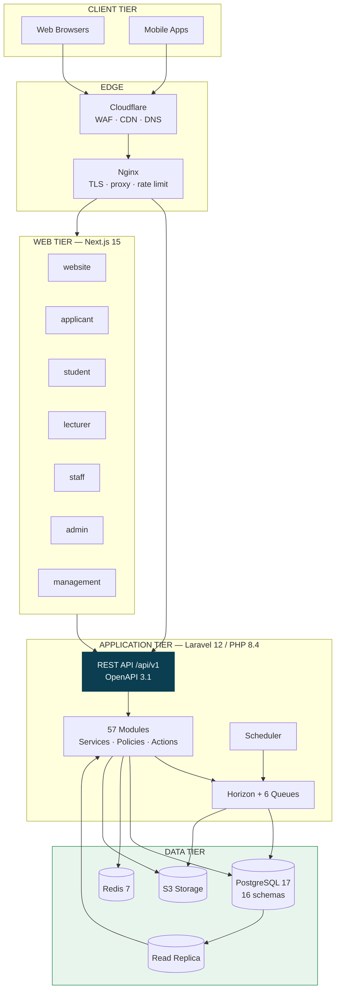
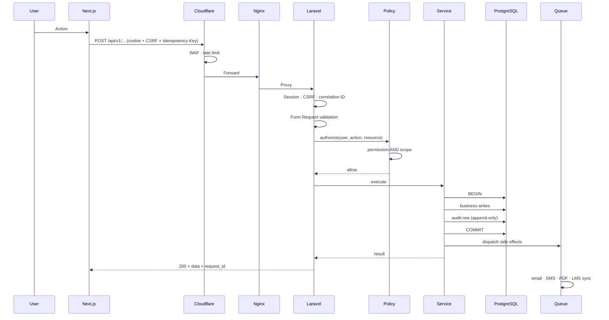
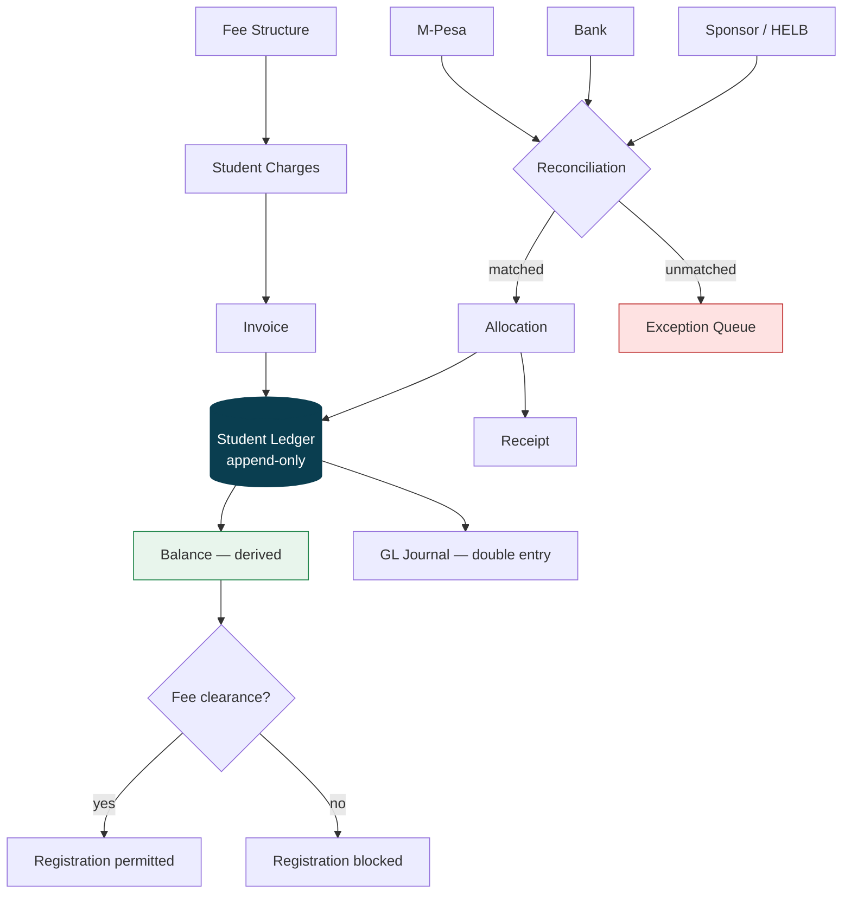
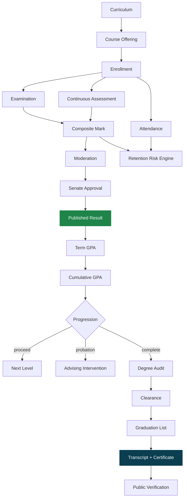

# SYSTEM LANDSCAPE DIAGRAMS

## 1. System context — who uses it and what it talks to

## 2. Container view

## 3. Request lifecycle — every authenticated write

Note the ordering: authorization before any work, audit inside the same transaction as the change, side
effects only after commit.

## 4. Security layers

```mermaid
flowchart LR
    A["Cloudflare<br/>WAF · DDoS · bot"] --> B["Nginx<br/>TLS 1.3 · headers · IP rules"]
    B --> C["Session<br/>__Host- cookie · MFA · device"]
    C --> D["Policy<br/>permission + scope · deny default"]
    D --> E["Application<br/>CSRF · allow-lists · encoding"]
    E --> F["Database<br/>constraints · least privilege · encryption"]
    F --> G["Audit<br/>append-only · immutable"]
    G --> H["Monitoring<br/>anomaly · alert · runbook"]
    style D fill:#0A3E50,stroke:#0A3E50,color:#FFFFFF
    style G fill:#E8F5EC,stroke:#1E8449
```

## 5. Money data flow

## 6. Academic data flow

