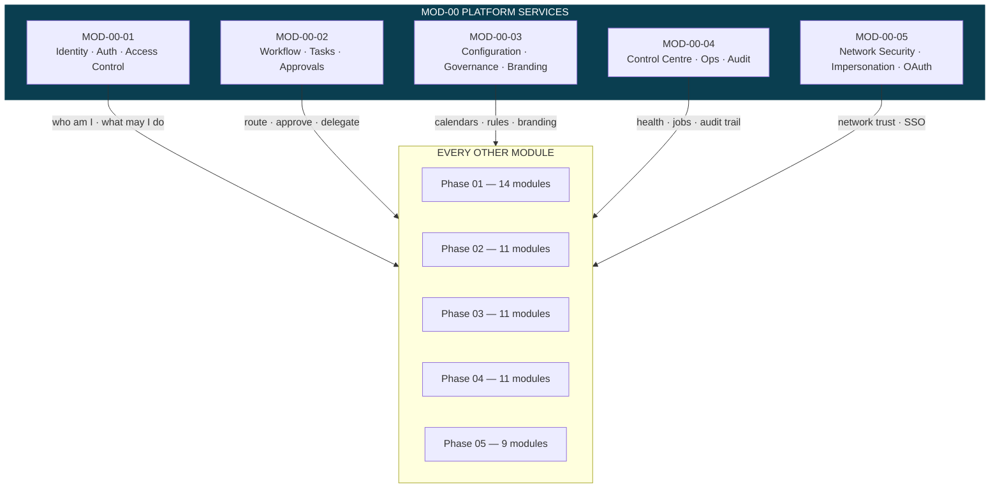
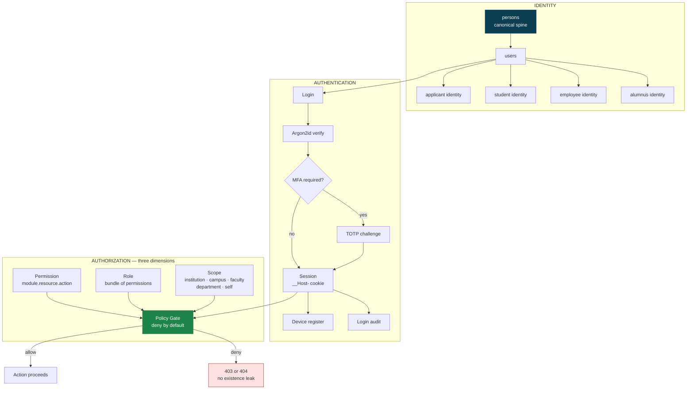
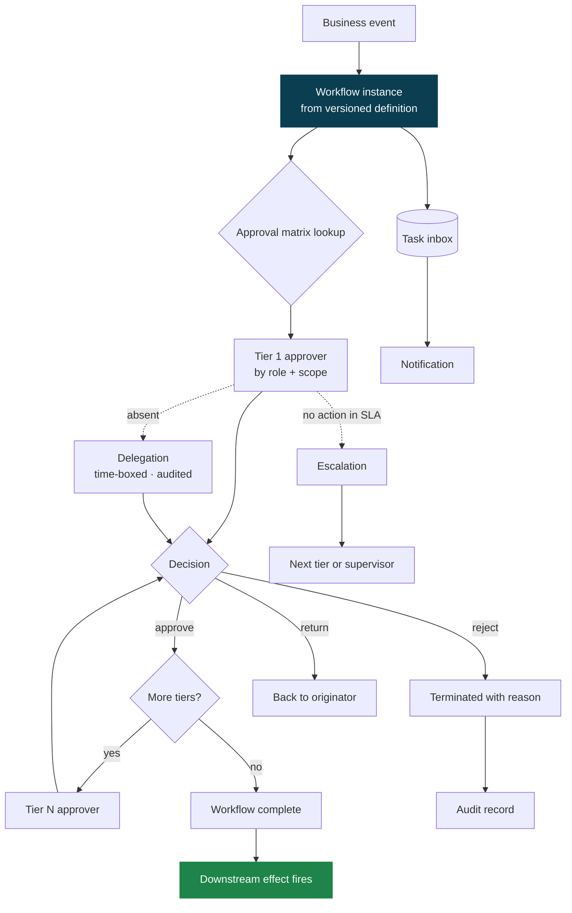
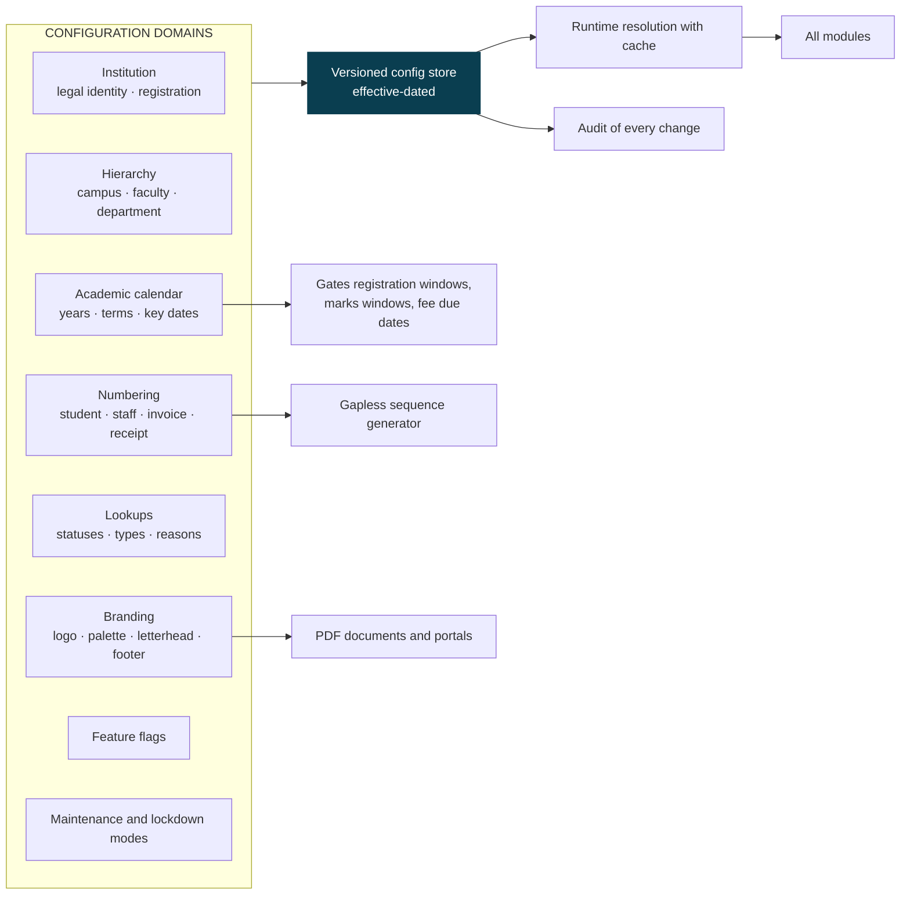
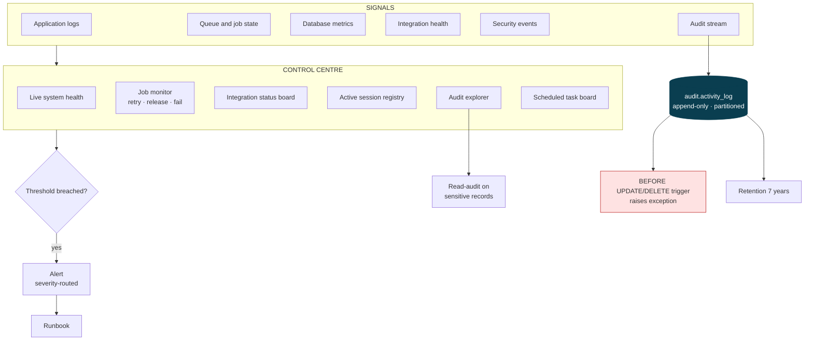
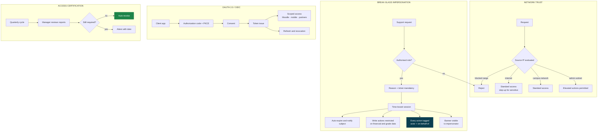

# PHASE 00 — PLATFORM ADMINISTRATION, CONFIGURATION & GOVERNANCE

`MOD-00` is the umbrella every other module stands on. Nothing in Phases 01–05 can be built correctly until
these five sub-modules exist, because they own identity, approvals, configuration, operations and audit.

Specification: [`../docs/UNIVERSITY-ERP-SRSD/PHASE-01/01-01-Identity-and-Access-Management.md`](../docs/UNIVERSITY-ERP-SRSD/PHASE-01/01-01-Identity-and-Access-Management.md)
(that filename is wrong — see defect D-06 in [`../PLAN/13-SRSD-GAP-AUDIT.md`](../PLAN/13-SRSD-GAP-AUDIT.md)).

---

## MOD-00 — Platform umbrella

---

## MOD-00-01 — Identity, Authentication & Access Control

**The rule that matters:** permission alone never grants access. A Head of Department holding
`examination.marks.approve` may approve marks *only* for offerings inside their department scope. Scope is
applied as a query filter, not a post-fetch check — otherwise the data has already left the database.

---

## MOD-00-02 — Workflow Engine, Tasks & Approval Matrix

Approval chains are **data, not code**. Changing who signs off a fee waiver is a configuration change with
its own audit record, never a deployment. Definitions are versioned: an in-flight workflow keeps running on
the version it started under.

---

## MOD-00-03 — System Configuration, Governance & Branding

Effective-dating is non-negotiable: a 2024 transcript must render under the 2024 grading scale and the 2024
letterhead, not today's. Configuration rows are never updated in place.

---

## MOD-00-04 — System Control Centre, Operations & Audit Governance

The audit table has no UPDATE or DELETE path — a database trigger raises an exception. Not a convention
enforced by discipline; enforced by the engine.

---

## MOD-00-05 — Network Security, Impersonation & OAuth 2.0 Server

Impersonation is the single most abusable feature in any ERP. It is built with the constraints above from day
one, not added after the first incident.
