# PHASE 01 — CORE PLATFORM & STUDENT LIFECYCLE BACKBONE

14 modules. This phase is the reason the system exists: a person becomes an applicant, an applicant becomes a
student, a student registers, pays, is assessed, progresses, and graduates. Everything in Phases 02–05
attaches to this spine.

| Module | Name | Spec |
|---|---|---|
| MOD-01-01 | Identity & Access Management | [spec](../docs/UNIVERSITY-ERP-SRSD/PHASE-01/01-01-Identity-and-Access-Management.md) |
| MOD-01-02 | Institutional Administration & Master Data | [spec](../docs/UNIVERSITY-ERP-SRSD/PHASE-01/01-02-Institutional-Administration-and-Master-Data.md) |
| MOD-01-03 | Programme & Curriculum Management | [spec](../docs/UNIVERSITY-ERP-SRSD/PHASE-01/01-03-Programme-and-Curriculum-Management.md) |
| MOD-01-04 | Course Catalogue & Offering | [spec](../docs/UNIVERSITY-ERP-SRSD/PHASE-01/01-04-Course-Catalogue-and-Offering.md) |
| MOD-01-05 | Recruitment & Admissions | [spec](../docs/UNIVERSITY-ERP-SRSD/PHASE-01/01-05-Recruitment-and-Admissions.md) |
| MOD-01-06 | Student Onboarding & Records | [spec](../docs/UNIVERSITY-ERP-SRSD/PHASE-01/01-06-Student-Onboarding-and-Records.md) |
| MOD-01-07 | Student Registration & Enrollment | [spec](../docs/UNIVERSITY-ERP-SRSD/PHASE-01/01-07-Student-Registration-and-Enrollment.md) |
| MOD-01-08 | Timetable & Scheduling | [spec](../docs/UNIVERSITY-ERP-SRSD/PHASE-01/01-08-Timetable-and-Scheduling.md) |
| MOD-01-09 | Student Finance, Billing & Payments | [spec](../docs/UNIVERSITY-ERP-SRSD/PHASE-01/01-09-Student-Finance-Billing-and-Payments.md) |
| MOD-01-10 | Continuous Assessment & Examinations | [spec](../docs/UNIVERSITY-ERP-SRSD/PHASE-01/01-10-Continuous-Assessment-and-Examinations.md) |
| MOD-01-11 | Grading, GPA & Academic Progression | [spec](../docs/UNIVERSITY-ERP-SRSD/PHASE-01/01-11-Grading-GPA-and-Academic-Progression.md) |
| MOD-01-12 | Graduation, Transcripts & Certification | [spec](../docs/UNIVERSITY-ERP-SRSD/PHASE-01/01-12-Graduation-Transcripts-and-Certification.md) |
| MOD-01-13 | Unified Student Portal | [spec](../docs/UNIVERSITY-ERP-SRSD/PHASE-01/01-13-Unified-Student-Portal.md) |
| MOD-01-14 | Public Website & CMS | **no spec — see defect D-02** |

## Phase dependency graph

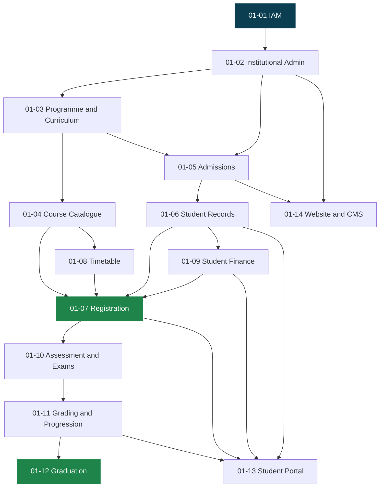
```mermaid
flowchart TB
    M1[01-01 IAM] --> M2[01-02 Institutional Admin]
    M2 --> M3[01-03 Programme and Curriculum]
    M3 --> M4[01-04 Course Catalogue]
    M2 --> M5[01-05 Admissions]
    M3 --> M5
    M5 --> M6[01-06 Student Records]
    M6 --> M7[01-07 Registration]
    M4 --> M7
    M4 --> M8[01-08 Timetable]
    M8 --> M7
    M6 --> M9[01-09 Student Finance]
    M9 --> M7
    M7 --> M10[01-10 Assessment and Exams]
    M10 --> M11[01-11 Grading and Progression]
    M11 --> M12[01-12 Graduation]
    M6 --> M13[01-13 Student Portal]
    M7 --> M13
    M9 --> M13
    M11 --> M13
    M2 --> M14[01-14 Website and CMS]
    M5 --> M14
    style M1 fill:#0A3E50,stroke:#0A3E50,color:#FFFFFF
    style M7 fill:#1E8449,stroke:#1E8449,color:#FFFFFF
    style M12 fill:#1E8449,stroke:#1E8449,color:#FFFFFF
```

---

## MOD-01-01 — Identity & Access Management

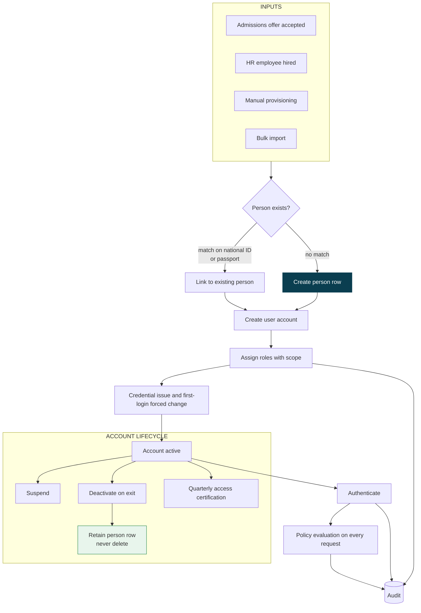
```mermaid
flowchart TB
    subgraph IN["INPUTS"]
        A[Admissions offer accepted]
        B[HR employee hired]
        C[Manual provisioning]
        D[Bulk import]
    end
    IN --> E{Person exists?}
    E -->|match on national ID<br/>or passport| F[Link to existing person]
    E -->|no match| G[Create person row]
    F --> H[Create user account]
    G --> H
    H --> I[Assign roles with scope]
    I --> J[Credential issue and first-login forced change]
    J --> K[Account active]
    K --> L[Authenticate]
    L --> M[Policy evaluation on every request]
    subgraph LIFECYCLE["ACCOUNT LIFECYCLE"]
        K --> N[Suspend]
        K --> O[Deactivate on exit]
        K --> P[Quarterly access certification]
        O --> Q["Retain person row<br/>never delete"]
    end
    M --> R[(Audit)]
    L --> R
    I --> R
    style G fill:#0A3E50,stroke:#0A3E50,color:#FFFFFF
    style Q fill:#E8F5EC,stroke:#1E8449
```

One person, many identities, one row. A tutorial fellow who was once a student and is now staff has one
`persons` record with two role assignments — never two accounts, never two histories.

---

## MOD-01-02 — Institutional Administration & Master Data

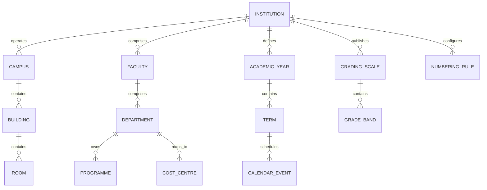
```mermaid
erDiagram
    INSTITUTION ||--o{ CAMPUS : operates
    CAMPUS ||--o{ BUILDING : contains
    BUILDING ||--o{ ROOM : contains
    INSTITUTION ||--o{ FACULTY : comprises
    FACULTY ||--o{ DEPARTMENT : comprises
    DEPARTMENT ||--o{ PROGRAMME : owns
    INSTITUTION ||--o{ ACADEMIC_YEAR : defines
    ACADEMIC_YEAR ||--o{ TERM : contains
    TERM ||--o{ CALENDAR_EVENT : schedules
    INSTITUTION ||--o{ GRADING_SCALE : publishes
    GRADING_SCALE ||--o{ GRADE_BAND : contains
    INSTITUTION ||--o{ NUMBERING_RULE : configures
    DEPARTMENT ||--o{ COST_CENTRE : maps_to
```

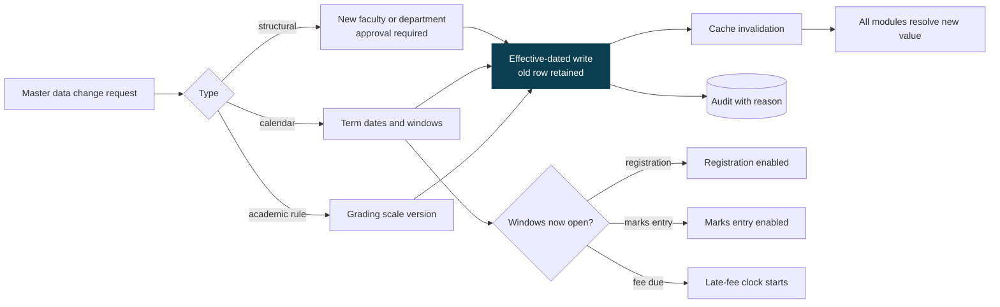
```mermaid
flowchart LR
    A[Master data change request] --> B{Type}
    B -->|structural| C["New faculty or department<br/>approval required"]
    B -->|calendar| D[Term dates and windows]
    B -->|academic rule| E[Grading scale version]
    C --> F["Effective-dated write<br/>old row retained"]
    D --> F
    E --> F
    F --> G[Cache invalidation]
    G --> H[All modules resolve new value]
    F --> I[(Audit with reason)]
    D --> J{Windows now open?}
    J -->|registration| K[Registration enabled]
    J -->|marks entry| L[Marks entry enabled]
    J -->|fee due| M[Late-fee clock starts]
    style F fill:#0A3E50,stroke:#0A3E50,color:#FFFFFF
```

---

## MOD-01-03 — Programme & Curriculum Management

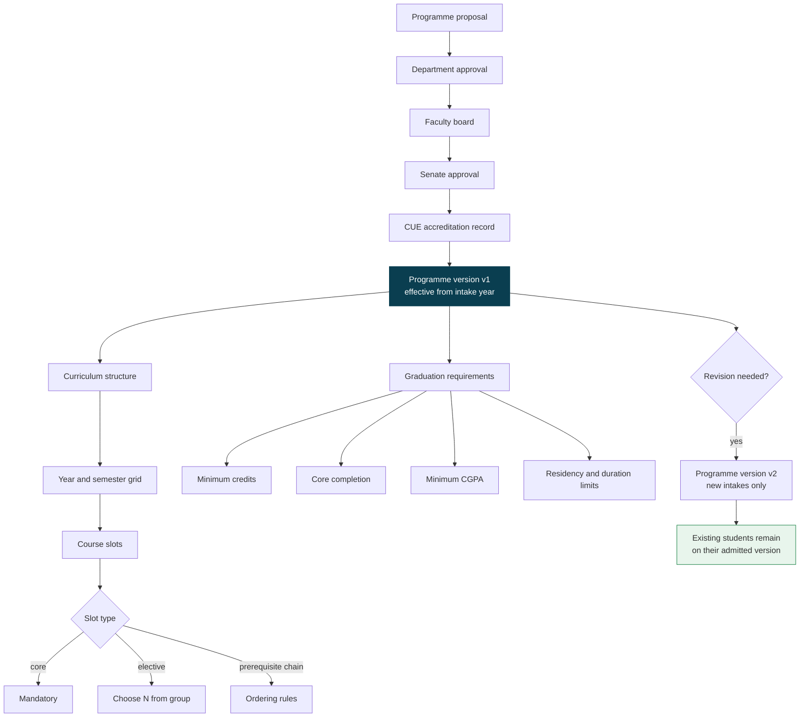
```mermaid
flowchart TB
    A[Programme proposal] --> B[Department approval]
    B --> C[Faculty board]
    C --> D[Senate approval]
    D --> E[CUE accreditation record]
    E --> F["Programme version v1<br/>effective from intake year"]
    F --> G[Curriculum structure]
    G --> H[Year and semester grid]
    H --> I[Course slots]
    I --> J{Slot type}
    J -->|core| K[Mandatory]
    J -->|elective| L["Choose N from group"]
    J -->|prerequisite chain| M[Ordering rules]
    F --> N[Graduation requirements]
    N --> O[Minimum credits]
    N --> P[Core completion]
    N --> Q[Minimum CGPA]
    N --> R[Residency and duration limits]
    F --> S{Revision needed?}
    S -->|yes| T["Programme version v2<br/>new intakes only"]
    T --> U["Existing students remain<br/>on their admitted version"]
    style F fill:#0A3E50,stroke:#0A3E50,color:#FFFFFF
    style U fill:#E8F5EC,stroke:#1E8449
```

**The versioning rule is the whole module.** A student admitted in 2024 graduates against the 2024 curriculum
even if the programme is revised in 2026. Get this wrong and every degree audit and transcript in the system
becomes indefensible.

---

## MOD-01-04 — Course Catalogue & Offering

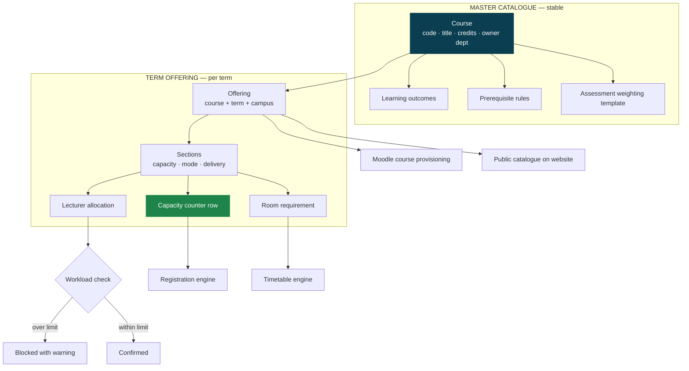
```mermaid
flowchart TB
    subgraph MASTER["MASTER CATALOGUE — stable"]
        A["Course<br/>code · title · credits · owner dept"]
        A --> B[Learning outcomes]
        A --> C[Prerequisite rules]
        A --> D[Assessment weighting template]
    end
    subgraph OFFERING["TERM OFFERING — per term"]
        E["Offering<br/>course + term + campus"]
        E --> F["Sections<br/>capacity · mode · delivery"]
        F --> G[Lecturer allocation]
        F --> H[Room requirement]
        F --> I[Capacity counter row]
    end
    A --> E
    G --> J{Workload check}
    J -->|over limit| K[Blocked with warning]
    J -->|within limit| L[Confirmed]
    I --> M[Registration engine]
    H --> N[Timetable engine]
    E --> O[Moodle course provisioning]
    E --> P[Public catalogue on website]
    style A fill:#0A3E50,stroke:#0A3E50,color:#FFFFFF
    style I fill:#1E8449,stroke:#1E8449,color:#FFFFFF
```

The separation of master course from term offering is what lets the same `CSC 201` run on three campuses, in
two modes, with four lecturers, without duplicating the course definition or its outcomes.

---

## MOD-01-05 — Recruitment & Admissions

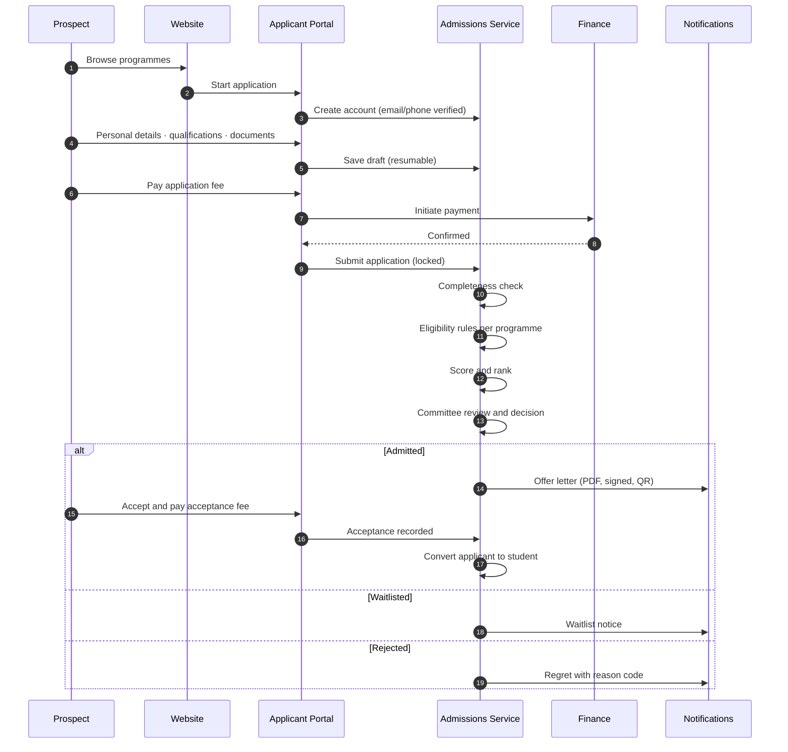
```mermaid
sequenceDiagram
    autonumber
    participant P as Prospect
    participant W as Website
    participant A as Applicant Portal
    participant S as Admissions Service
    participant F as Finance
    participant N as Notifications

    P->>W: Browse programmes
    W->>A: Start application
    A->>S: Create account (email/phone verified)
    P->>A: Personal details · qualifications · documents
    A->>S: Save draft (resumable)
    P->>A: Pay application fee
    A->>F: Initiate payment
    F-->>A: Confirmed
    A->>S: Submit application (locked)
    S->>S: Completeness check
    S->>S: Eligibility rules per programme
    S->>S: Score and rank
    S->>S: Committee review and decision
    alt Admitted
        S->>N: Offer letter (PDF, signed, QR)
        P->>A: Accept and pay acceptance fee
        A->>S: Acceptance recorded
        S->>S: Convert applicant to student
    else Waitlisted
        S->>N: Waitlist notice
    else Rejected
        S->>N: Regret with reason code
    end
```

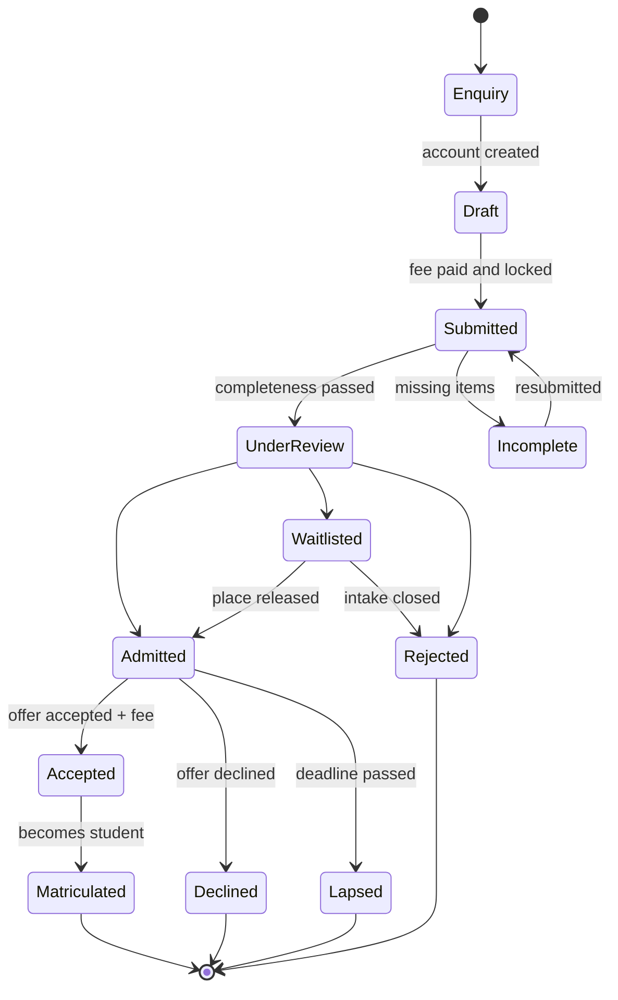
```mermaid
stateDiagram-v2
    [*] --> Enquiry
    Enquiry --> Draft: account created
    Draft --> Submitted: fee paid and locked
    Submitted --> UnderReview: completeness passed
    Submitted --> Incomplete: missing items
    Incomplete --> Submitted: resubmitted
    UnderReview --> Admitted
    UnderReview --> Waitlisted
    UnderReview --> Rejected
    Waitlisted --> Admitted: place released
    Waitlisted --> Rejected: intake closed
    Admitted --> Accepted: offer accepted + fee
    Admitted --> Declined: offer declined
    Admitted --> Lapsed: deadline passed
    Accepted --> Matriculated: becomes student
    Matriculated --> [*]
    Rejected --> [*]
    Declined --> [*]
    Lapsed --> [*]
```

Also handles the KUCCPS government-placement intake, which arrives as a batch rather than through the portal
and must reconcile against self-sponsored applications for the same capacity.

---

## MOD-01-06 — Student Onboarding & Records

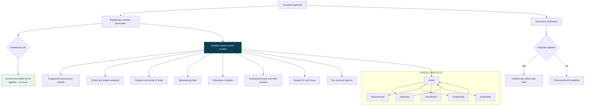
```mermaid
flowchart TB
    A[Accepted applicant] --> B[Registration number generated]
    B --> C{Numbering rule}
    C --> D["Format from MOD-00-03<br/>gapless · no reuse"]
    B --> E[Student master record created]
    E --> F[Programme and version pinned]
    E --> G[Cohort and intake assigned]
    E --> H[Campus and mode of study]
    E --> I[Sponsorship type]
    A --> J[Document verification]
    J --> K{Originals sighted?}
    K -->|yes| L[Verified with officer and date]
    K -->|no| M[Provisional with deadline]
    E --> N[Orientation checklist]
    E --> O[Institutional email and LMS account]
    E --> P[Student ID card issue]
    E --> Q[Fee account opened]
    subgraph STATUS["STATUS LIFECYCLE"]
        R[Active] --> S[Deferred]
        R --> T[Suspended]
        R --> U[Discontinued]
        R --> V[Transferred]
        R --> W[Graduated]
        S --> R
        T --> R
    end
    E --> R
    style E fill:#0A3E50,stroke:#0A3E50,color:#FFFFFF
    style D fill:#E8F5EC,stroke:#1E8449
```

Every status transition carries an actor, a date, a reason code and an audit row. "Why is this student
inactive?" must always be answerable from the record, never from someone's memory.

---

## MOD-01-07 — Student Registration & Enrollment

The highest-risk module in Phase 01: thousands of concurrent users, hard capacity limits, and money in the path.

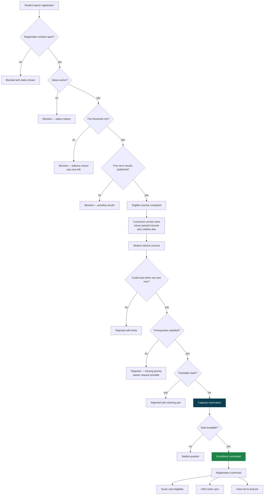
```mermaid
flowchart TB
    A[Student opens registration] --> B{Registration window open?}
    B -->|no| C[Blocked with dates shown]
    B -->|yes| D{Status active?}
    D -->|no| E[Blocked — status reason]
    D -->|yes| F{Fee threshold met?}
    F -->|no| G["Blocked — balance shown<br/>pay now link"]
    F -->|yes| H{Prior term results published?}
    H -->|no| I[Blocked — pending results]
    H -->|yes| J[Eligible courses computed]
    J --> K["Curriculum version slots<br/>minus passed courses<br/>plus retakes due"]
    K --> L[Student selects courses]
    L --> M{Credit load within min and max?}
    M -->|no| N[Rejected with limits]
    M -->|yes| O{Prerequisites satisfied?}
    O -->|no| P["Rejected — missing prereq<br/>waiver request possible"]
    O -->|yes| Q{Timetable clash?}
    Q -->|yes| R[Rejected with clashing pair]
    Q -->|no| S[Capacity reservation]
    S --> T{Seat available?}
    T -->|no| U[Waitlist position]
    T -->|yes| V[Enrollment committed]
    V --> W[Registration confirmed]
    W --> X[Exam card eligibility]
    W --> Y[LMS roster sync]
    W --> Z[Class list to lecturer]
    style S fill:#0A3E50,stroke:#0A3E50,color:#FFFFFF
    style V fill:#1E8449,stroke:#1E8449,color:#FFFFFF
```

### Capacity reservation — the concurrency-safe path

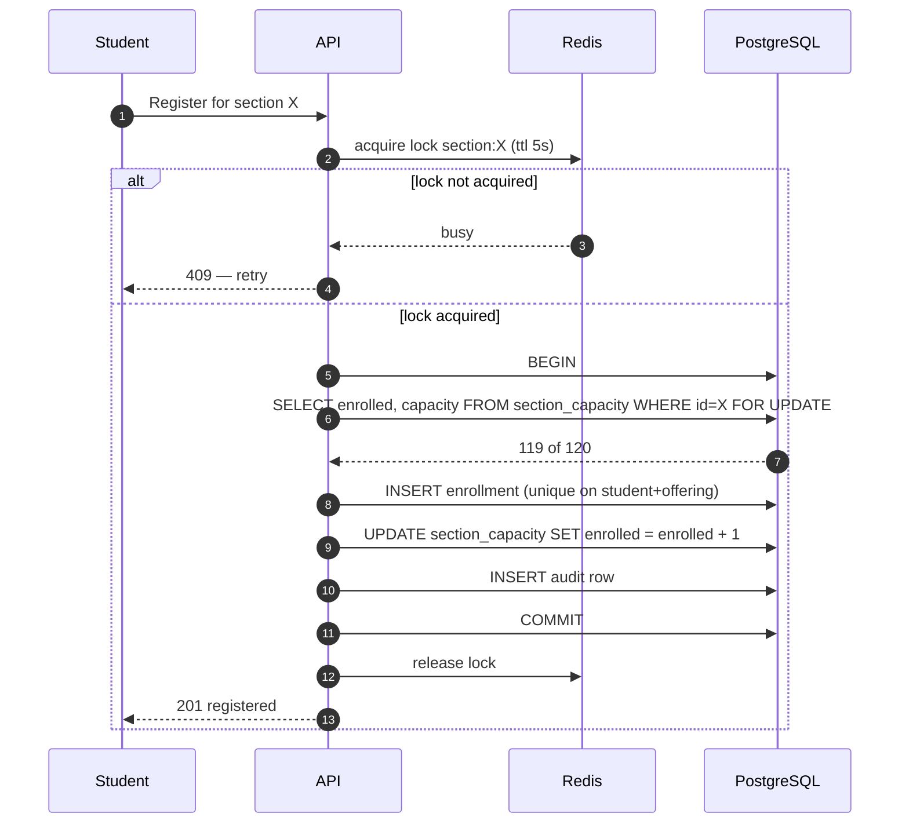
```mermaid
sequenceDiagram
    autonumber
    participant S as Student
    participant A as API
    participant R as Redis
    participant D as PostgreSQL

    S->>A: Register for section X
    A->>R: acquire lock section:X (ttl 5s)
    alt lock not acquired
        R-->>A: busy
        A-->>S: 409 — retry
    else lock acquired
        A->>D: BEGIN
        A->>D: SELECT enrolled, capacity FROM section_capacity WHERE id=X FOR UPDATE
        D-->>A: 119 of 120
        A->>D: INSERT enrollment (unique on student+offering)
        A->>D: UPDATE section_capacity SET enrolled = enrolled + 1
        A->>D: INSERT audit row
        A->>D: COMMIT
        A->>R: release lock
        A-->>S: 201 registered
    end
```

Redis is an optimisation that reduces contention. The `FOR UPDATE` row lock plus the unique constraint is what
makes oversubscription **impossible** — if Redis is down, the system is slower, never wrong.

---

## MOD-01-08 — Timetable & Scheduling

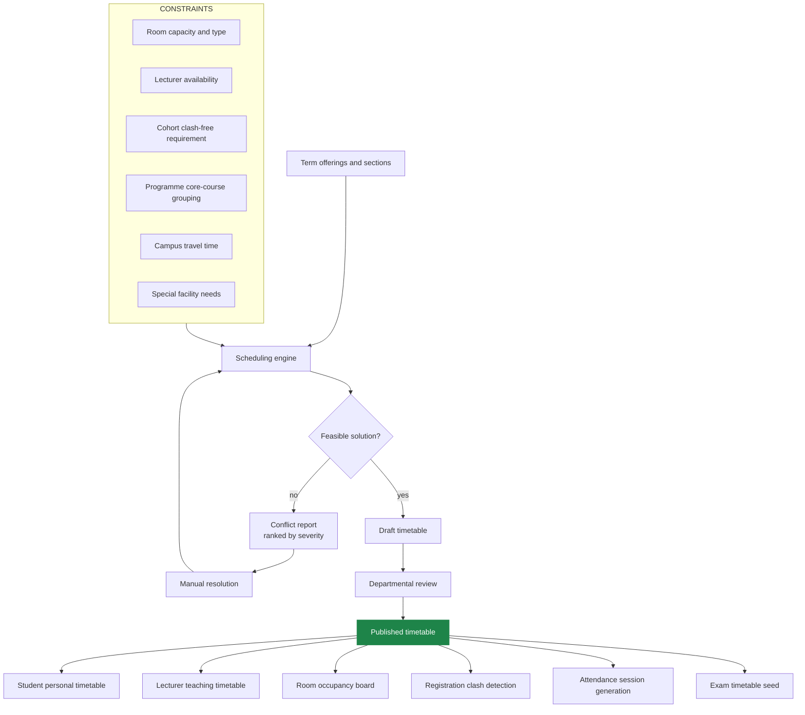
```mermaid
flowchart TB
    subgraph CONSTRAINTS["CONSTRAINTS"]
        A[Room capacity and type]
        B[Lecturer availability]
        C[Cohort clash-free requirement]
        D[Programme core-course grouping]
        E[Campus travel time]
        F[Special facility needs]
    end
    G[Term offerings and sections] --> H[Scheduling engine]
    CONSTRAINTS --> H
    H --> I{Feasible solution?}
    I -->|no| J["Conflict report<br/>ranked by severity"]
    J --> K[Manual resolution]
    K --> H
    I -->|yes| L[Draft timetable]
    L --> M[Departmental review]
    M --> N[Published timetable]
    N --> O[Student personal timetable]
    N --> P[Lecturer teaching timetable]
    N --> Q[Room occupancy board]
    N --> R[Registration clash detection]
    N --> S[Attendance session generation]
    N --> T[Exam timetable seed]
    style N fill:#1E8449,stroke:#1E8449,color:#FFFFFF
```

Room double-booking is prevented at the database level with a GiST exclusion constraint over
`(room_id, tstzrange(starts_at, ends_at))` — not by application checks that race under concurrency.

---

## MOD-01-09 — Student Finance, Billing & Payments

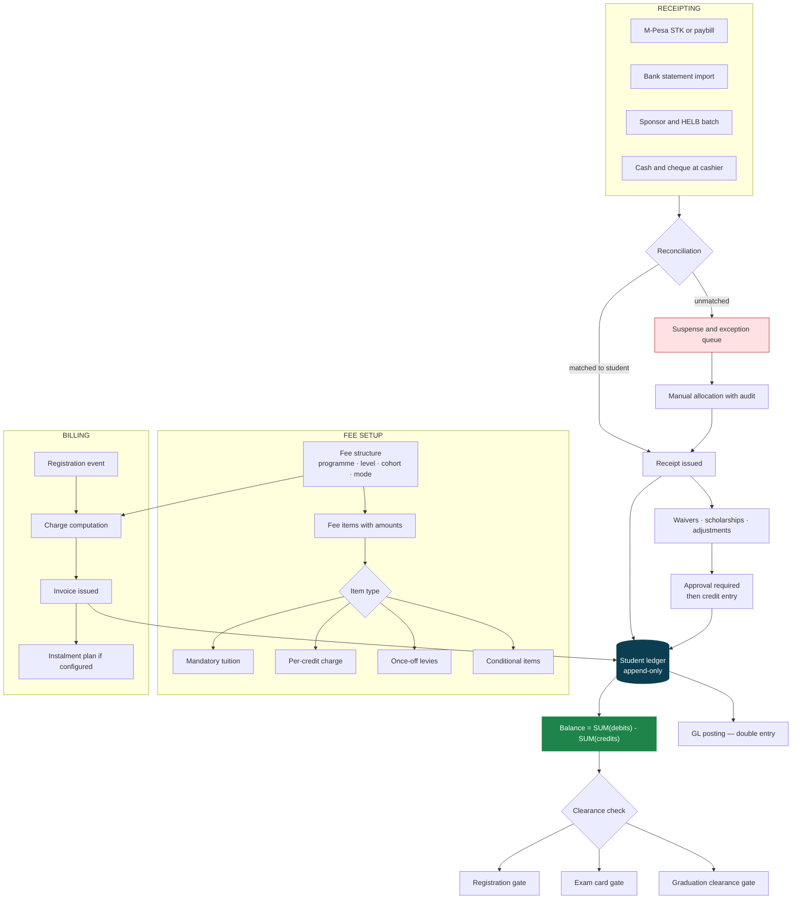
```mermaid
flowchart TB
    subgraph SETUP["FEE SETUP"]
        A["Fee structure<br/>programme · level · cohort · mode"]
        A --> B[Fee items with amounts]
        B --> C{Item type}
        C --> D[Mandatory tuition]
        C --> E[Per-credit charge]
        C --> F[Once-off levies]
        C --> G[Conditional items]
    end
    subgraph BILLING["BILLING"]
        H[Registration event] --> I[Charge computation]
        A --> I
        I --> J[Invoice issued]
        J --> K[Instalment plan if configured]
    end
    subgraph RECEIPTS["RECEIPTING"]
        L[M-Pesa STK or paybill]
        M[Bank statement import]
        N[Sponsor and HELB batch]
        O[Cash and cheque at cashier]
    end
    RECEIPTS --> P{Reconciliation}
    P -->|matched to student| Q[Receipt issued]
    P -->|unmatched| R[Suspense and exception queue]
    R --> S[Manual allocation with audit]
    S --> Q
    Q --> T[(Student ledger<br/>append-only)]
    J --> T
    T --> U["Balance = SUM(debits) - SUM(credits)"]
    U --> V{Clearance check}
    V --> W[Registration gate]
    V --> X[Exam card gate]
    V --> Y[Graduation clearance gate]
    T --> Z[GL posting — double entry]
    Q --> AA[Waivers · scholarships · adjustments]
    AA --> AB["Approval required<br/>then credit entry"]
    AB --> T
    style T fill:#0A3E50,stroke:#0A3E50,color:#FFFFFF
    style U fill:#1E8449,stroke:#1E8449,color:#FFFFFF
    style R fill:#FEE2E2,stroke:#B91C1C
```

**Balances are always derived, never stored.** A cached balance column is a bug waiting to happen; a
materialised view refreshed on ledger write gives the same speed with none of the divergence risk.

---

## MOD-01-10 — Continuous Assessment & Examinations

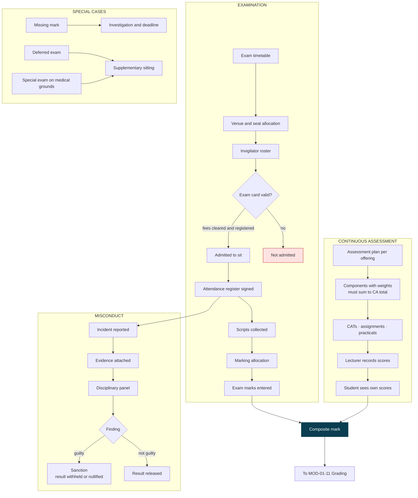
```mermaid
flowchart TB
    subgraph CA["CONTINUOUS ASSESSMENT"]
        A[Assessment plan per offering] --> B["Components with weights<br/>must sum to CA total"]
        B --> C[CATs · assignments · practicals]
        C --> D[Lecturer records scores]
        D --> E[Student sees own scores]
    end
    subgraph EXAM["EXAMINATION"]
        F[Exam timetable] --> G[Venue and seat allocation]
        G --> H[Invigilator roster]
        H --> I{Exam card valid?}
        I -->|fees cleared and registered| J[Admitted to sit]
        I -->|no| K[Not admitted]
        J --> L[Attendance register signed]
        L --> M[Scripts collected]
        M --> N[Marking allocation]
        N --> O[Exam marks entered]
    end
    subgraph MISCONDUCT["MISCONDUCT"]
        P[Incident reported] --> Q[Evidence attached]
        Q --> R[Disciplinary panel]
        R --> S{Finding}
        S -->|guilty| T["Sanction<br/>result withheld or nullified"]
        S -->|not guilty| U[Result released]
    end
    E --> V[Composite mark]
    O --> V
    L --> P
    V --> W[To MOD-01-11 Grading]
    subgraph SPECIAL["SPECIAL CASES"]
        X[Missing mark] --> Y[Investigation and deadline]
        Z[Deferred exam] --> AA[Supplementary sitting]
        AB[Special exam on medical grounds] --> AA
    end
    style V fill:#0A3E50,stroke:#0A3E50,color:#FFFFFF
    style K fill:#FEE2E2,stroke:#B91C1C
```

### Marks submission integrity chain

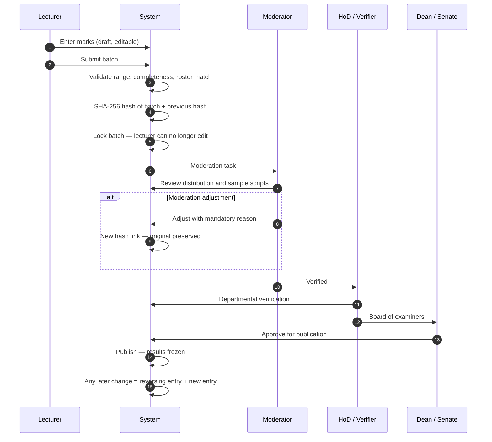
```mermaid
sequenceDiagram
    autonumber
    participant L as Lecturer
    participant S as System
    participant M as Moderator
    participant H as HoD / Verifier
    participant D as Dean / Senate

    L->>S: Enter marks (draft, editable)
    L->>S: Submit batch
    S->>S: Validate range, completeness, roster match
    S->>S: SHA-256 hash of batch + previous hash
    S->>S: Lock batch — lecturer can no longer edit
    S->>M: Moderation task
    M->>S: Review distribution and sample scripts
    alt Moderation adjustment
        M->>S: Adjust with mandatory reason
        S->>S: New hash link — original preserved
    end
    M->>H: Verified
    H->>S: Departmental verification
    H->>D: Board of examiners
    D->>S: Approve for publication
    S->>S: Publish — results frozen
    S->>S: Any later change = reversing entry + new entry
```

Five distinct roles: enter, moderate, verify, approve, publish. **No single person can carry a mark from
keyboard to transcript.** Every batch is hash-chained to its predecessor, so a silent database edit breaks the
chain and is detectable.

---

## MOD-01-11 — Grading, GPA & Academic Progression

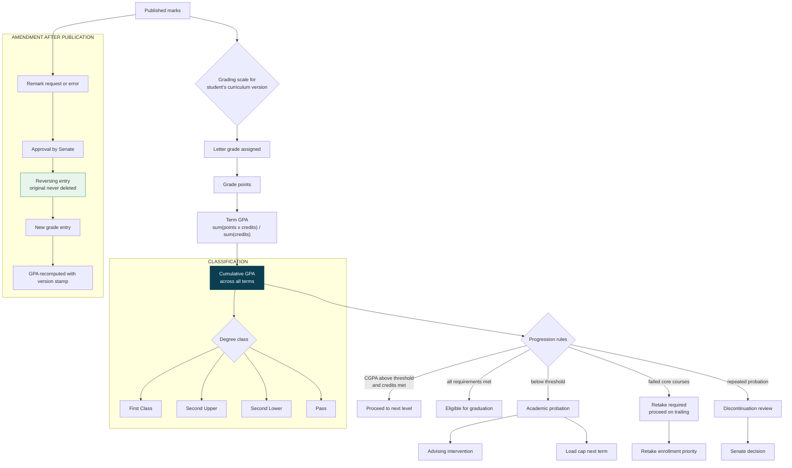
```mermaid
flowchart TB
    A[Published marks] --> B{Grading scale for<br/>student's curriculum version}
    B --> C[Letter grade assigned]
    C --> D[Grade points]
    D --> E["Term GPA<br/>sum(points x credits) / sum(credits)"]
    E --> F["Cumulative GPA<br/>across all terms"]
    F --> G{Progression rules}
    G -->|CGPA above threshold<br/>and credits met| H[Proceed to next level]
    G -->|below threshold| I[Academic probation]
    G -->|failed core courses| J["Retake required<br/>proceed on trailing"]
    G -->|repeated probation| K[Discontinuation review]
    G -->|all requirements met| L[Eligible for graduation]
    I --> M[Advising intervention]
    I --> N[Load cap next term]
    J --> O[Retake enrollment priority]
    K --> P[Senate decision]
    subgraph CLASS["CLASSIFICATION"]
        F --> Q{Degree class}
        Q --> R[First Class]
        Q --> S[Second Upper]
        Q --> T[Second Lower]
        Q --> U[Pass]
    end
    subgraph AMEND["AMENDMENT AFTER PUBLICATION"]
        V[Remark request or error] --> W[Approval by Senate]
        W --> X["Reversing entry<br/>original never deleted"]
        X --> Y[New grade entry]
        Y --> Z[GPA recomputed with version stamp]
    end
    A --> V
    style F fill:#0A3E50,stroke:#0A3E50,color:#FFFFFF
    style X fill:#E8F5EC,stroke:#1E8449
```

Progression rules are versioned configuration. When Senate changes the probation threshold in 2027, students
who progressed in 2025 must still show the 2025 rule on any recomputation or appeal.

---

## MOD-01-12 — Graduation, Transcripts & Certification

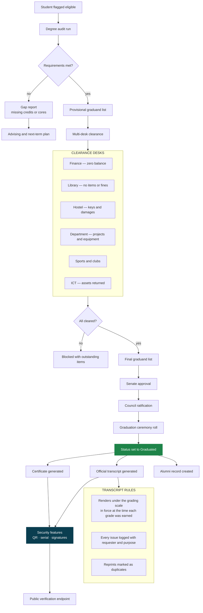
```mermaid
flowchart TB
    A[Student flagged eligible] --> B[Degree audit run]
    B --> C{Requirements met?}
    C -->|no| D["Gap report<br/>missing credits or cores"]
    D --> E[Advising and next-term plan]
    C -->|yes| F[Provisional graduand list]
    F --> G[Multi-desk clearance]
    subgraph CLEAR["CLEARANCE DESKS"]
        H[Finance — zero balance]
        I[Library — no items or fines]
        J[Hostel — keys and damages]
        K[Department — projects and equipment]
        L[Sports and clubs]
        M[ICT — assets returned]
    end
    G --> CLEAR
    CLEAR --> N{All cleared?}
    N -->|no| O[Blocked with outstanding items]
    N -->|yes| P[Final graduand list]
    P --> Q[Senate approval]
    Q --> R[Council ratification]
    R --> S[Graduation ceremony roll]
    S --> T[Status set to Graduated]
    T --> U[Certificate generated]
    T --> V[Official transcript generated]
    U --> W["Security features<br/>QR · serial · signatures"]
    V --> W
    W --> X[Public verification endpoint]
    T --> Y[Alumni record created]
    subgraph TRANSCRIPT["TRANSCRIPT RULES"]
        Z["Renders under the grading scale<br/>in force at the time each grade was earned"]
        AA[Every issue logged with requester and purpose]
        AB[Reprints marked as duplicates]
    end
    V --> TRANSCRIPT
    style T fill:#1E8449,stroke:#1E8449,color:#FFFFFF
    style W fill:#0A3E50,stroke:#0A3E50,color:#FFFFFF
```

---

## MOD-01-13 — Unified Student Portal

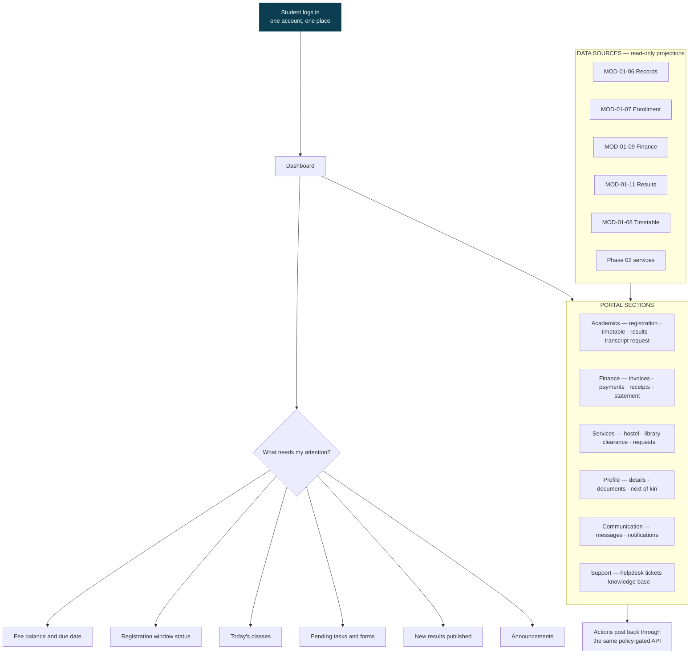
```mermaid
flowchart TB
    A["Student logs in<br/>one account, one place"] --> B[Dashboard]
    B --> C{What needs my attention?}
    C --> D["Fee balance and due date"]
    C --> E[Registration window status]
    C --> F[Today's classes]
    C --> G[Pending tasks and forms]
    C --> H[New results published]
    C --> I[Announcements]
    subgraph SECTIONS["PORTAL SECTIONS"]
        J[Academics — registration · timetable · results · transcript request]
        K[Finance — invoices · payments · receipts · statement]
        L[Services — hostel · library · clearance · requests]
        M[Profile — details · documents · next of kin]
        N[Communication — messages · notifications]
        O[Support — helpdesk tickets · knowledge base]
    end
    B --> SECTIONS
    subgraph SOURCE["DATA SOURCES — read-only projections"]
        P[MOD-01-06 Records]
        Q[MOD-01-07 Enrollment]
        R[MOD-01-09 Finance]
        S[MOD-01-11 Results]
        T[MOD-01-08 Timetable]
        U[Phase 02 services]
    end
    SOURCE --> SECTIONS
    SECTIONS --> V["Actions post back through<br/>the same policy-gated API"]
    style A fill:#0A3E50,stroke:#0A3E50,color:#FFFFFF
```

The portal owns **no** business logic. It is a presentation over the same `/api/v1` endpoints that staff apps
use, with self-scope enforced server-side — a student cannot read another student's record even by editing the
request, because scope is applied in the query, not the UI.

---

## MOD-01-14 — Public Website & CMS

> **This module has no specification in the SRSD.** It is defect D-02 in
> [`../PLAN/13-SRSD-GAP-AUDIT.md`](../PLAN/13-SRSD-GAP-AUDIT.md) — the brief treats the public website and CMS
> as core, and all 59 existing documents are silent on both. The diagram below is the proposed design pending
> your confirmation of scope (open decision D-006).

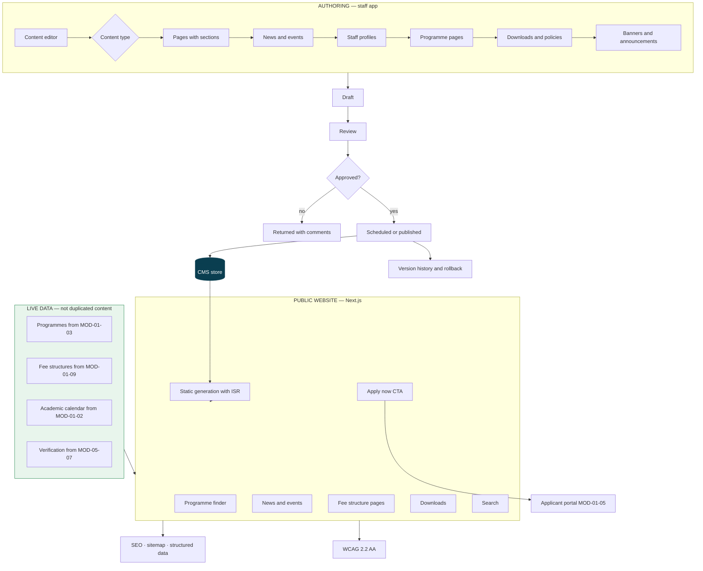
```mermaid
flowchart TB
    subgraph AUTHORING["AUTHORING — staff app"]
        A[Content editor] --> B{Content type}
        B --> C[Pages with sections]
        C --> D[News and events]
        D --> E[Staff profiles]
        E --> F[Programme pages]
        F --> G[Downloads and policies]
        G --> H[Banners and announcements]
    end
    AUTHORING --> I[Draft]
    I --> J[Review]
    J --> K{Approved?}
    K -->|no| L[Returned with comments]
    K -->|yes| M[Scheduled or published]
    M --> N[(CMS store)]
    subgraph LIVE["PUBLIC WEBSITE — Next.js"]
        O[Static generation with ISR]
        P[Programme finder]
        Q[News and events]
        R[Apply now CTA]
        S[Fee structure pages]
        T[Downloads]
        U[Search]
    end
    N --> O
    O --> LIVE
    subgraph FEEDS["LIVE DATA — not duplicated content"]
        V[Programmes from MOD-01-03]
        W[Fee structures from MOD-01-09]
        X[Academic calendar from MOD-01-02]
        Y[Verification from MOD-05-07]
    end
    FEEDS --> LIVE
    R --> Z[Applicant portal MOD-01-05]
    M --> AA[Version history and rollback]
    LIVE --> AB[SEO · sitemap · structured data]
    LIVE --> AC[WCAG 2.2 AA]
    style N fill:#0A3E50,stroke:#0A3E50,color:#FFFFFF
    style FEEDS fill:#E8F5EC,stroke:#1E8449
```

Programme details, fees and calendar dates are **read from the ERP**, never re-typed into the CMS. A fee
structure published on the website that disagrees with the one the billing engine uses is a reputational and
legal problem; there is only one source.
