# PHASE 02 — ACADEMIC SERVICES & STUDENT AFFAIRS

11 modules. Phase 01 made the record correct; Phase 02 makes the student's life work — classrooms, advising,
placements, welfare, accommodation and the staff tools that support all of it.

| Module | Name | Spec |
|---|---|---|
| MOD-02-01 | LMS Integration & E-Learning | [spec](../docs/UNIVERSITY-ERP-SRSD/PHASE-02/02-01-LMS-Integration-and-E-Learning.md) |
| MOD-02-02 | Class & Lecturer Attendance | [spec](../docs/UNIVERSITY-ERP-SRSD/PHASE-02/02-02-Class-and-Lecturer-Attendance.md) |
| MOD-02-03 | Academic Advising & Degree Audit | [spec](../docs/UNIVERSITY-ERP-SRSD/PHASE-02/02-03-Academic-Advising-and-Degree-Audit.md) |
| MOD-02-04 | Industrial Attachment & Practicum | [spec](../docs/UNIVERSITY-ERP-SRSD/PHASE-02/02-04-Industrial-Attachment-and-Practicum.md) |
| MOD-02-05 | Work-Study Programme | [spec](../docs/UNIVERSITY-ERP-SRSD/PHASE-02/02-05-Work-Study-Programme.md) |
| MOD-02-06 | Library Management Integration | [spec](../docs/UNIVERSITY-ERP-SRSD/PHASE-02/02-06-Library-Management-Integration.md) |
| MOD-02-07 | Student Affairs, Welfare & Elections | [spec](../docs/UNIVERSITY-ERP-SRSD/PHASE-02/02-07-Student-Affairs-Welfare-and-Elections.md) |
| MOD-02-08 | Accommodation & Hostel Management | [spec](../docs/UNIVERSITY-ERP-SRSD/PHASE-02/02-08-Accommodation-and-Hostel-Management.md) |
| MOD-02-09 | Student Request & Paperless Clearance | [spec](../docs/UNIVERSITY-ERP-SRSD/PHASE-02/02-09-Student-Request-and-Paperless-Clearance.md) |
| MOD-02-10 | Scholarships & Financial Aid | [spec](../docs/UNIVERSITY-ERP-SRSD/PHASE-02/02-10-Scholarships-and-Financial-Aid.md) |
| MOD-02-11 | Lecturer & Staff Portals | [spec](../docs/UNIVERSITY-ERP-SRSD/PHASE-02/02-11-Lecturer-and-Staff-Portals.md) |

## Phase dependency graph

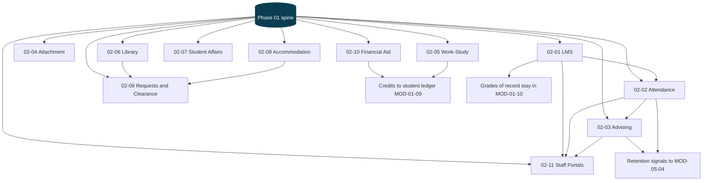

---

## MOD-02-01 — LMS Integration & E-Learning

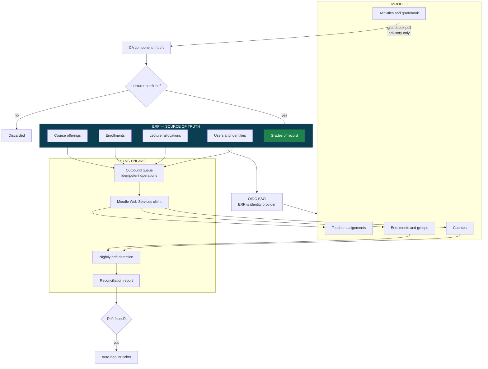

**Direction of authority is one-way.** Moodle never creates a student, never changes an enrollment, and never
owns a grade of record. Marks pulled from the Moodle gradebook are a convenience import that a lecturer must
confirm through the normal marks-submission workflow.

---

## MOD-02-02 — Class & Lecturer Attendance

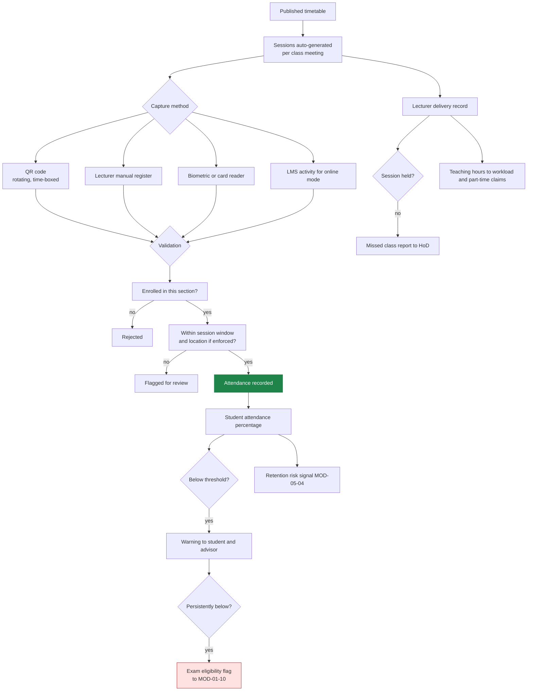

Attendance is the earliest reliable predictor of dropout — three weeks of absence shows up here long before it
shows up in results. That is why the signal feeds the retention engine directly.

---

## MOD-02-03 — Academic Advising & Degree Audit

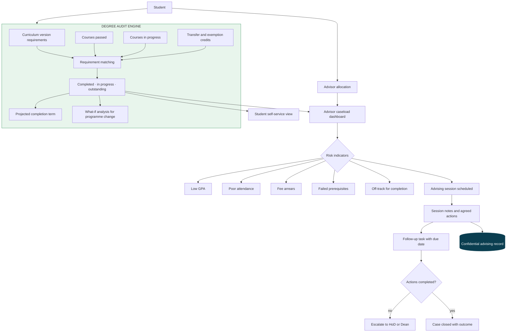

The same audit engine that advises a student in year two produces the graduation eligibility decision in year
four. One implementation, one answer — a student is never told they are on track and then refused at
clearance.

---

## MOD-02-04 — Industrial Attachment & Practicum

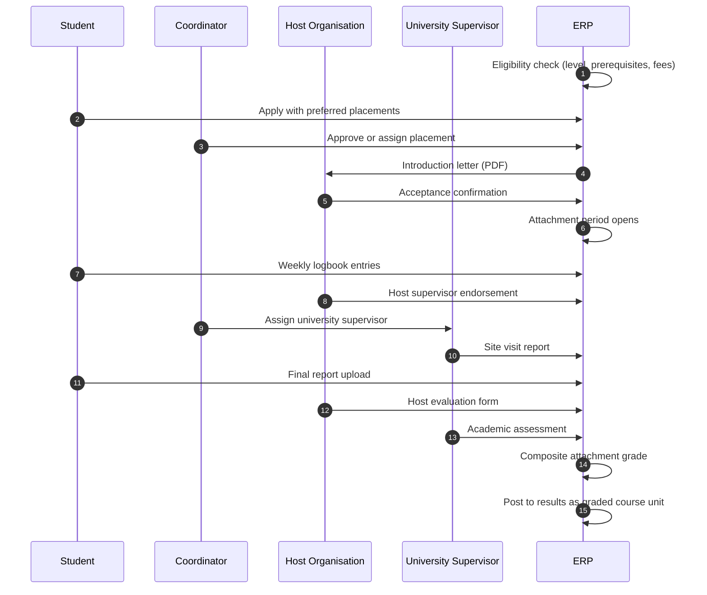

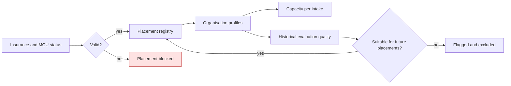

---

## MOD-02-05 — Work-Study Programme

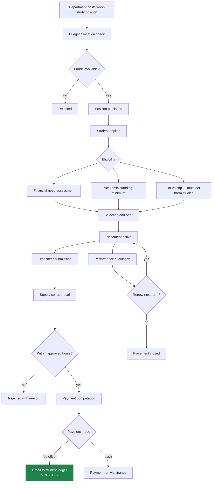

---

## MOD-02-06 — Library Management Integration

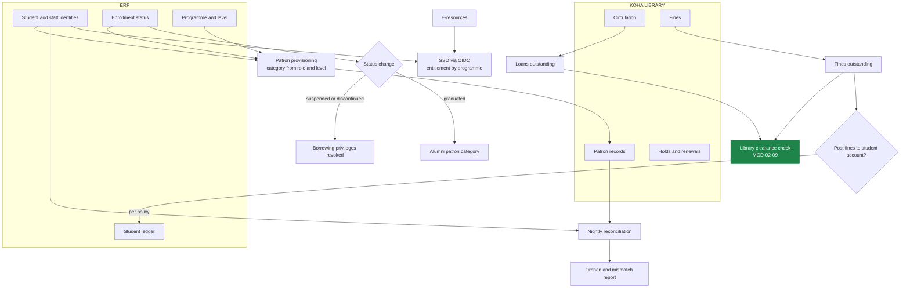

---

## MOD-02-07 — Student Affairs, Welfare & Elections

```mermaid
flowchart TB
    subgraph WELFARE["WELFARE & SUPPORT"]
        A[Counselling appointment] --> B["Confidential case file<br/>restricted access role"]
        B --> C[Session notes]
        C --> D{Referral needed?}
        D -->|yes| E[Health services or external]
        F[Disability support] --> G["Accommodations registry<br/>exam time · venue · format"]
        G --> H[Flows to MOD-01-10 exam setup]
        I[Chaplaincy and peer support]
        J[Sports and clubs registry] --> K[Membership and participation]
    end
    subgraph DISCIPLINE["DISCIPLINE"]
        L[Incident report] --> M[Investigation]
        M --> N[Disciplinary committee]
        N --> O{Finding}
        O -->|upheld| P["Sanction<br/>warning · suspension · expulsion"]
        P --> Q[Student status update MOD-01-06]
        O -->|dismissed| R[Record closed]
        P --> S[Appeal window]
    end
    subgraph ELECTIONS["STUDENT ELECTIONS"]
        T[Election configured] --> U[Voter roll from active students]
        U --> V[Candidate nomination and vetting]
        V --> W[Campaign period]
        W --> X[Voting window opens]
        X --> Y{One vote per eligible voter}
        Y --> Z["Ballot recorded<br/>voter marked as voted<br/>ballot NOT linked to voter"]
        Z --> AA[Tally on close]
        AA --> AB[Results published with audit hash]
        AB --> AC[Dispute window]
    end
    style Z fill:#0A3E50,stroke:#0A3E50,color:#FFFFFF
    style B fill:#FEE2E2,stroke:#B91C1C
```

**Ballot secrecy is architectural.** The system records *that* a student voted and *what* the tallies are, in
two separate structures with no join between them. An administrator with full database access cannot
reconstruct how any individual voted.

---

## MOD-02-08 — Accommodation & Hostel Management

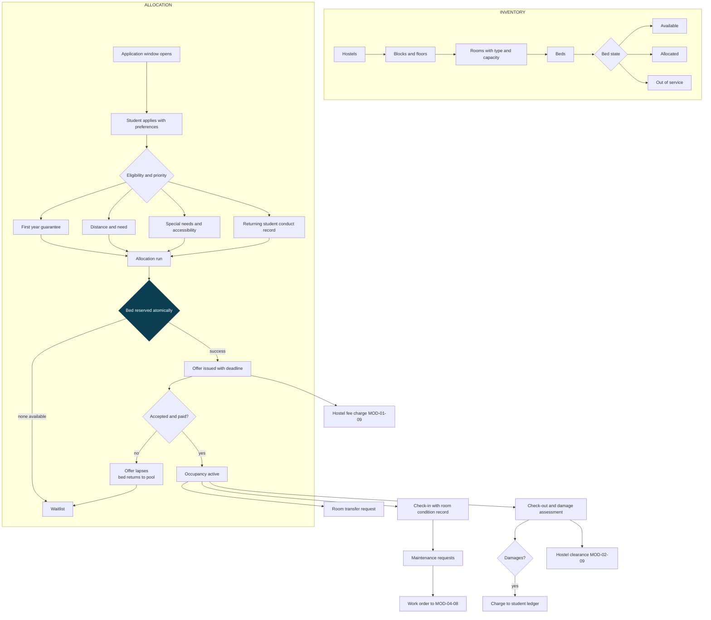

Bed allocation uses the same locked-row reservation pattern as course registration. Two students allocated the
same bed is the accommodation equivalent of oversubscription, and it is prevented the same way.

---

## MOD-02-09 — Student Request & Paperless Clearance

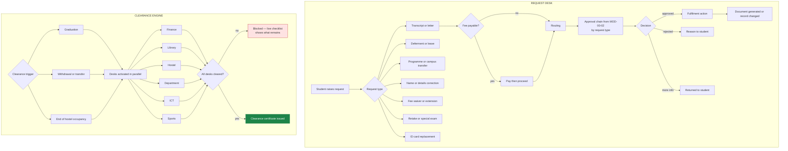

Desks clear **in parallel, not in sequence**. A student should never queue at six offices in a fixed order —
and each desk pulls its own status automatically where the data already exists in the system.

---

## MOD-02-10 — Scholarships & Financial Aid

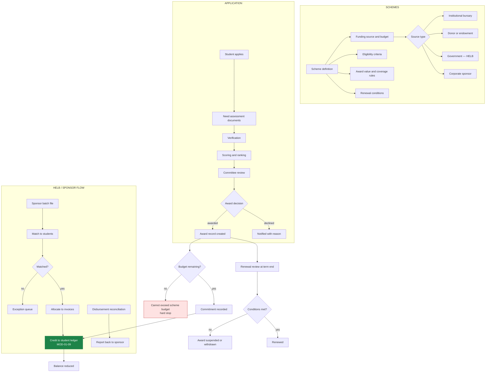

---

## MOD-02-11 — Lecturer & Staff Portals

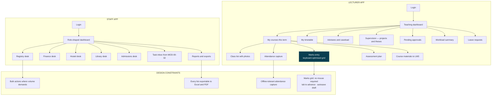

Lecturers judge the entire ERP by the marks-entry screen. If entering 400 marks takes longer than the
spreadsheet they used before, they will keep using the spreadsheet and upload at the deadline — and the
integrity chain in MOD-01-10 loses its value.
