# PHASE 03 — ENTERPRISE OPERATIONS (HR, FINANCE, PROCUREMENT)

11 modules. The administrative backbone: who works here, what they are paid, where the money goes, and what
the institution buys and owns.

> **Naming note (defect D-03).** The module names below are taken from the **files that actually exist on
> disk**. `00-MASTER-INDEX.md` lists a different Phase-03 set — including *Academic Staff Workload*, *Staff
> Promotions* and *Budgeting & Vote-Book*, which have **no specification files**. Those three capabilities are
> real requirements in the traceability matrix and are scheduled as specification work in
> [`../PLAN/13-SRSD-GAP-AUDIT.md`](../PLAN/13-SRSD-GAP-AUDIT.md). Their diagrams appear at the end of this
> file, marked as proposed.

| Module | Name | Spec |
|---|---|---|
| MOD-03-01 | HR Core & Employee Management | [spec](../docs/UNIVERSITY-ERP-SRSD/PHASE-03/03-01-HR-Core-Employee-Management.md) |
| MOD-03-02 | Organizational Structure & Departments | [spec](../docs/UNIVERSITY-ERP-SRSD/PHASE-03/03-02-Organizational-Structure-and-Departments.md) |
| MOD-03-03 | Leave Management | [spec](../docs/UNIVERSITY-ERP-SRSD/PHASE-03/03-03-Leave-Management.md) |
| MOD-03-04 | Performance Management & Appraisals | [spec](../docs/UNIVERSITY-ERP-SRSD/PHASE-03/03-04-Performance-Management-and-Appraisals.md) |
| MOD-03-05 | Training & Professional Development | [spec](../docs/UNIVERSITY-ERP-SRSD/PHASE-03/03-05-Training-and-Professional-Development.md) |
| MOD-03-06 | Payroll Management | [spec](../docs/UNIVERSITY-ERP-SRSD/PHASE-03/03-06-Payroll-Management.md) |
| MOD-03-07 | General Ledger & Chart of Accounts | [spec](../docs/UNIVERSITY-ERP-SRSD/PHASE-03/03-07-General-Ledger-and-Chart-of-Accounts.md) |
| MOD-03-08 | Accounts Payable | [spec](../docs/UNIVERSITY-ERP-SRSD/PHASE-03/03-08-Accounts-Payable.md) |
| MOD-03-09 | Accounts Receivable & Revenue | [spec](../docs/UNIVERSITY-ERP-SRSD/PHASE-03/03-09-Accounts-Receivable-and-Revenue.md) |
| MOD-03-10 | Bank & Cash Management | [spec](../docs/UNIVERSITY-ERP-SRSD/PHASE-03/03-10-Bank-and-Cash-Management.md) |
| MOD-03-11 | Procurement & Stores | [spec](../docs/UNIVERSITY-ERP-SRSD/PHASE-03/03-11-Procurement-and-Stores.md) |

## Phase dependency graph

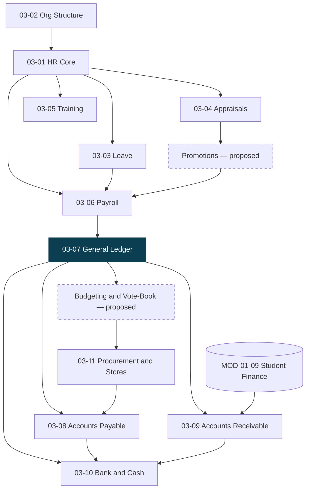
```mermaid
flowchart TB
    A[03-02 Org Structure] --> B[03-01 HR Core]
    B --> C[03-03 Leave]
    B --> D[03-04 Appraisals]
    B --> E[03-05 Training]
    B --> F[03-06 Payroll]
    C --> F
    D --> G[Promotions — proposed]
    G --> F
    H[03-07 General Ledger] --> I[03-08 Accounts Payable]
    H --> J[03-09 Accounts Receivable]
    H --> K[03-10 Bank and Cash]
    H --> L[Budgeting and Vote-Book — proposed]
    F --> H
    M[03-11 Procurement and Stores] --> I
    L --> M
    I --> K
    J --> K
    N[(MOD-01-09 Student Finance)] --> J
    style H fill:#0A3E50,stroke:#0A3E50,color:#FFFFFF
    style G stroke-dasharray: 5 5
    style L stroke-dasharray: 5 5
```

---

## MOD-03-01 — HR Core & Employee Management

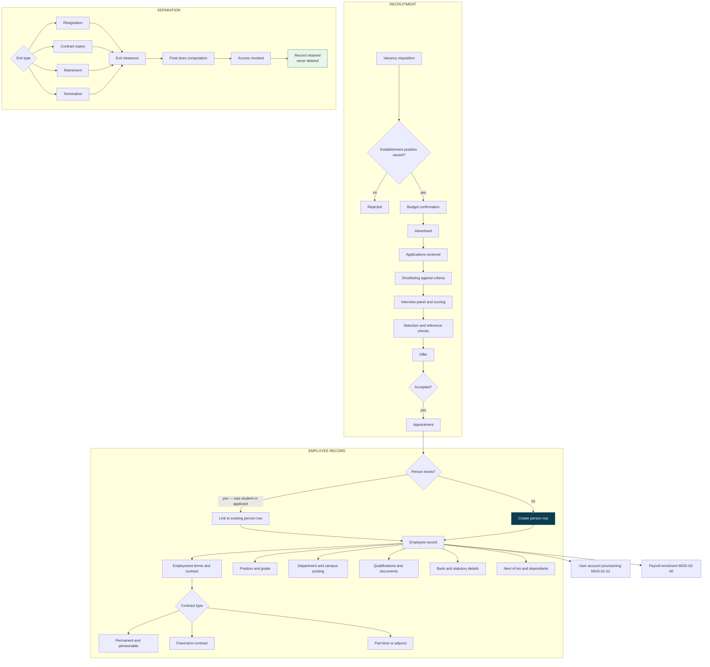
```mermaid
flowchart TB
    subgraph RECRUIT["RECRUITMENT"]
        A[Vacancy requisition] --> B{Establishment position vacant?}
        B -->|no| C[Rejected]
        B -->|yes| D[Budget confirmation]
        D --> E[Advertised]
        E --> F[Applications received]
        F --> G[Shortlisting against criteria]
        G --> H[Interview panel and scoring]
        H --> I[Selection and reference checks]
        I --> J[Offer]
        J --> K{Accepted?}
        K -->|yes| L[Appointment]
    end
    subgraph EMPLOYEE["EMPLOYEE RECORD"]
        L --> M{Person exists?}
        M -->|yes — was student or applicant| N[Link to existing person row]
        M -->|no| O[Create person row]
        N --> P[Employee record]
        O --> P
        P --> Q[Employment terms and contract]
        Q --> R{Contract type}
        R --> S[Permanent and pensionable]
        R --> T[Fixed-term contract]
        R --> U[Part-time or adjunct]
        P --> V[Position and grade]
        P --> W[Department and campus posting]
        P --> X[Qualifications and documents]
        P --> Y[Bank and statutory details]
        P --> Z[Next of kin and dependants]
    end
    P --> AA[User account provisioning MOD-01-01]
    P --> AB[Payroll enrolment MOD-03-06]
    subgraph EXIT["SEPARATION"]
        AC{Exit type} --> AD[Resignation]
        AC --> AE[Contract expiry]
        AC --> AF[Retirement]
        AC --> AG[Termination]
        AD --> AH[Exit clearance]
        AE --> AH
        AF --> AH
        AG --> AH
        AH --> AI[Final dues computation]
        AI --> AJ[Access revoked]
        AJ --> AK["Record retained<br/>never deleted"]
    end
    style O fill:#0A3E50,stroke:#0A3E50,color:#FFFFFF
    style AK fill:#E8F5EC,stroke:#1E8449
```

The same `persons` spine as students. A part-time lecturer who is also a PhD candidate is one person with two
roles — payroll and results both work correctly without a duplicate identity.

---

## MOD-03-02 — Organizational Structure & Departments

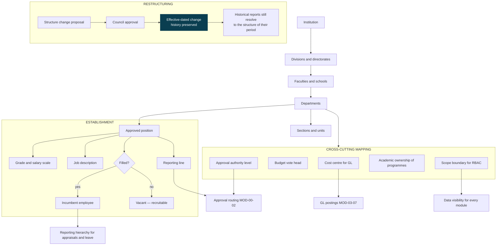
```mermaid
flowchart TB
    A[Institution] --> B[Divisions and directorates]
    B --> C[Faculties and schools]
    C --> D[Departments]
    D --> E[Sections and units]
    subgraph POSITIONS["ESTABLISHMENT"]
        F[Approved position] --> G[Grade and salary scale]
        F --> H[Job description]
        F --> I[Reporting line]
        F --> J{Filled?}
        J -->|yes| K[Incumbent employee]
        J -->|no| L[Vacant — recruitable]
    end
    D --> F
    subgraph MAPPING["CROSS-CUTTING MAPPING"]
        M[Cost centre for GL]
        N[Budget vote head]
        O[Approval authority level]
        P[Academic ownership of programmes]
        Q[Scope boundary for RBAC]
    end
    D --> MAPPING
    I --> R[Approval routing MOD-00-02]
    O --> R
    K --> S[Reporting hierarchy for appraisals and leave]
    M --> T[GL postings MOD-03-07]
    Q --> U[Data visibility for every module]
    subgraph CHANGE["RESTRUCTURING"]
        V[Structure change proposal] --> W[Council approval]
        W --> X["Effective-dated change<br/>history preserved"]
        X --> Y[Historical reports still resolve<br/>to the structure of their period]
    end
    style X fill:#0A3E50,stroke:#0A3E50,color:#FFFFFF
```

Universities restructure. A 2024 expenditure report must still show the faculty that existed in 2024, not
today's merged one — so structure is effective-dated, never overwritten.

---

## MOD-03-03 — Leave Management

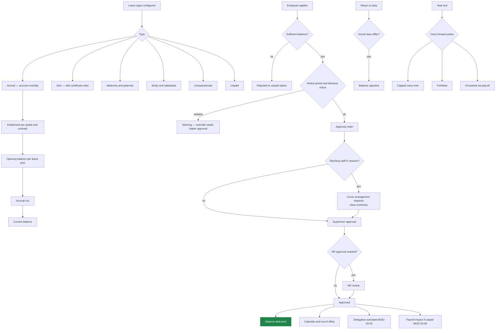
```mermaid
flowchart TB
    A[Leave types configured] --> B{Type}
    B --> C[Annual — accrues monthly]
    B --> D[Sick — with certificate rules]
    B --> E[Maternity and paternity]
    B --> F[Study and sabbatical]
    B --> G[Compassionate]
    B --> H[Unpaid]
    C --> I[Entitlement per grade and contract]
    I --> J[Opening balance per leave year]
    J --> K[Accrual run]
    K --> L[Current balance]
    M[Employee applies] --> N{Sufficient balance?}
    N -->|no| O[Rejected or unpaid option]
    N -->|yes| P{Notice period and blackout check}
    P -->|violates| Q[Warning — override needs higher approval]
    P -->|ok| R[Approval chain]
    R --> S{Teaching staff in session?}
    S -->|yes| T["Cover arrangement required<br/>class continuity"]
    S -->|no| U[Supervisor approval]
    T --> U
    U --> V{HR approval needed?}
    V -->|yes| W[HR review]
    V -->|no| X[Approved]
    W --> X
    X --> Y[Balance deducted]
    X --> Z[Calendar and out-of-office]
    X --> AA[Delegation activated MOD-00-02]
    X --> AB[Payroll impact if unpaid MOD-03-06]
    AC[Return to duty] --> AD{Actual days differ?}
    AD -->|yes| AE[Balance adjusted]
    AF[Year end] --> AG{Carry-forward policy}
    AG --> AH[Capped carry-over]
    AG --> AI[Forfeited]
    AG --> AJ[Encashed via payroll]
    style Y fill:#1E8449,stroke:#1E8449,color:#FFFFFF
```

---

## MOD-03-04 — Performance Management & Appraisals

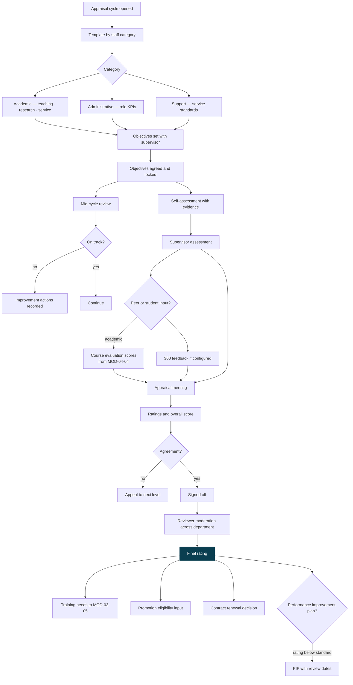
```mermaid
flowchart TB
    A[Appraisal cycle opened] --> B[Template by staff category]
    B --> C{Category}
    C --> D["Academic — teaching · research · service"]
    C --> E[Administrative — role KPIs]
    C --> F[Support — service standards]
    D --> G[Objectives set with supervisor]
    E --> G
    F --> G
    G --> H[Objectives agreed and locked]
    H --> I[Mid-cycle review]
    I --> J{On track?}
    J -->|no| K[Improvement actions recorded]
    J -->|yes| L[Continue]
    H --> M[Self-assessment with evidence]
    M --> N[Supervisor assessment]
    N --> O{Peer or student input?}
    O -->|academic| P["Course evaluation scores<br/>from MOD-04-04"]
    O --> Q[360 feedback if configured]
    P --> R[Appraisal meeting]
    Q --> R
    N --> R
    R --> S[Ratings and overall score]
    S --> T{Agreement?}
    T -->|no| U[Appeal to next level]
    T -->|yes| V[Signed off]
    V --> W[Reviewer moderation across department]
    W --> X[Final rating]
    X --> Y[Training needs to MOD-03-05]
    X --> Z[Promotion eligibility input]
    X --> AA[Contract renewal decision]
    X --> AB{Performance improvement plan?}
    AB -->|rating below standard| AC[PIP with review dates]
    style X fill:#0A3E50,stroke:#0A3E50,color:#FFFFFF
```

---

## MOD-03-05 — Training & Professional Development

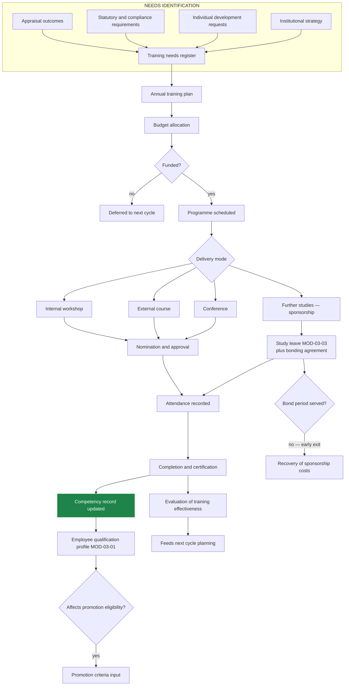
```mermaid
flowchart TB
    subgraph NEEDS["NEEDS IDENTIFICATION"]
        A[Appraisal outcomes] --> D[Training needs register]
        B[Statutory and compliance requirements] --> D
        C[Individual development requests] --> D
        E[Institutional strategy] --> D
    end
    D --> F[Annual training plan]
    F --> G[Budget allocation]
    G --> H{Funded?}
    H -->|no| I[Deferred to next cycle]
    H -->|yes| J[Programme scheduled]
    J --> K{Delivery mode}
    K --> L[Internal workshop]
    K --> M[External course]
    K --> N[Conference]
    K --> O[Further studies — sponsorship]
    L --> P[Nomination and approval]
    M --> P
    N --> P
    O --> Q["Study leave MOD-03-03<br/>plus bonding agreement"]
    P --> R[Attendance recorded]
    Q --> R
    R --> S[Completion and certification]
    S --> T[Competency record updated]
    T --> U[Employee qualification profile MOD-03-01]
    U --> V{Affects promotion eligibility?}
    V -->|yes| W[Promotion criteria input]
    S --> X[Evaluation of training effectiveness]
    X --> Y[Feeds next cycle planning]
    Q --> Z{Bond period served?}
    Z -->|no — early exit| AA[Recovery of sponsorship costs]
    style T fill:#1E8449,stroke:#1E8449,color:#FFFFFF
```

---

## MOD-03-06 — Payroll Management

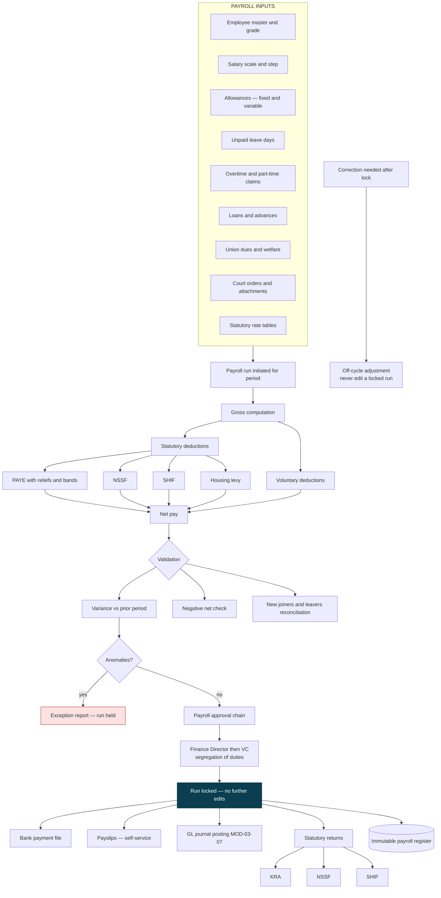
```mermaid
flowchart TB
    subgraph INPUTS["PAYROLL INPUTS"]
        A[Employee master and grade]
        B[Salary scale and step]
        C[Allowances — fixed and variable]
        D[Unpaid leave days]
        E[Overtime and part-time claims]
        F[Loans and advances]
        G[Union dues and welfare]
        H[Court orders and attachments]
        I[Statutory rate tables]
    end
    INPUTS --> J[Payroll run initiated for period]
    J --> K[Gross computation]
    K --> L[Statutory deductions]
    L --> M[PAYE with reliefs and bands]
    L --> N[NSSF]
    L --> O[SHIF]
    L --> P[Housing levy]
    K --> Q[Voluntary deductions]
    M --> R[Net pay]
    N --> R
    O --> R
    P --> R
    Q --> R
    R --> S{Validation}
    S --> T[Variance vs prior period]
    S --> U[Negative net check]
    S --> V[New joiners and leavers reconciliation]
    T --> W{Anomalies?}
    W -->|yes| X[Exception report — run held]
    W -->|no| Y[Payroll approval chain]
    Y --> Z["Finance Director then VC<br/>segregation of duties"]
    Z --> AA[Run locked — no further edits]
    AA --> AB[Bank payment file]
    AA --> AC[Payslips — self-service]
    AA --> AD[GL journal posting MOD-03-07]
    AA --> AE[Statutory returns]
    AE --> AF[KRA]
    AE --> AG[NSSF]
    AE --> AH[SHIF]
    AA --> AI[(Immutable payroll register)]
    AJ[Correction needed after lock] --> AK["Off-cycle adjustment<br/>never edit a locked run"]
    style AA fill:#0A3E50,stroke:#0A3E50,color:#FFFFFF
    style X fill:#FEE2E2,stroke:#B91C1C
```

**A locked payroll run is immutable.** Corrections are made as adjustments in the next run or an off-cycle
payment, so the register always ties to the bank file that was actually paid and to the statutory return that
was actually filed.

Statutory rates change by government notice. They live in effective-dated configuration tables — see open
decision D-011 on which rates and reliefs apply at go-live.

---

## MOD-03-07 — General Ledger & Chart of Accounts

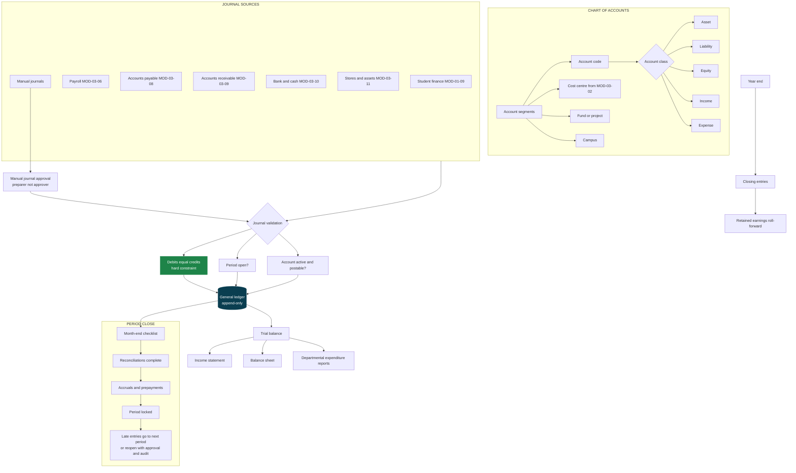
```mermaid
flowchart TB
    subgraph COA["CHART OF ACCOUNTS"]
        A[Account segments] --> B[Account code]
        A --> C[Cost centre from MOD-03-02]
        A --> D[Fund or project]
        A --> E[Campus]
        B --> F{Account class}
        F --> G[Asset]
        F --> H[Liability]
        F --> I[Equity]
        F --> J[Income]
        F --> K[Expense]
    end
    subgraph SOURCES["JOURNAL SOURCES"]
        L[Student finance MOD-01-09]
        M[Payroll MOD-03-06]
        N[Accounts payable MOD-03-08]
        O[Accounts receivable MOD-03-09]
        P[Bank and cash MOD-03-10]
        Q[Stores and assets MOD-03-11]
        R[Manual journals]
    end
    SOURCES --> S{Journal validation}
    S --> T["Debits equal credits<br/>hard constraint"]
    S --> U[Period open?]
    S --> V[Account active and postable?]
    T --> W[(General ledger<br/>append-only)]
    U --> W
    V --> W
    R --> X["Manual journal approval<br/>preparer not approver"]
    X --> S
    W --> Y[Trial balance]
    Y --> Z[Income statement]
    Y --> AA[Balance sheet]
    Y --> AB[Departmental expenditure reports]
    subgraph CLOSE["PERIOD CLOSE"]
        AC[Month-end checklist] --> AD[Reconciliations complete]
        AD --> AE[Accruals and prepayments]
        AE --> AF[Period locked]
        AF --> AG["Late entries go to next period<br/>or reopen with approval and audit"]
    end
    W --> AC
    AH[Year end] --> AI[Closing entries]
    AI --> AJ[Retained earnings roll-forward]
    style W fill:#0A3E50,stroke:#0A3E50,color:#FFFFFF
    style T fill:#1E8449,stroke:#1E8449,color:#FFFFFF
```

The ledger is append-only and double-entry at the database level: a journal that does not balance cannot be
committed. Reversals are new entries, never deletions.

---

## MOD-03-08 — Accounts Payable

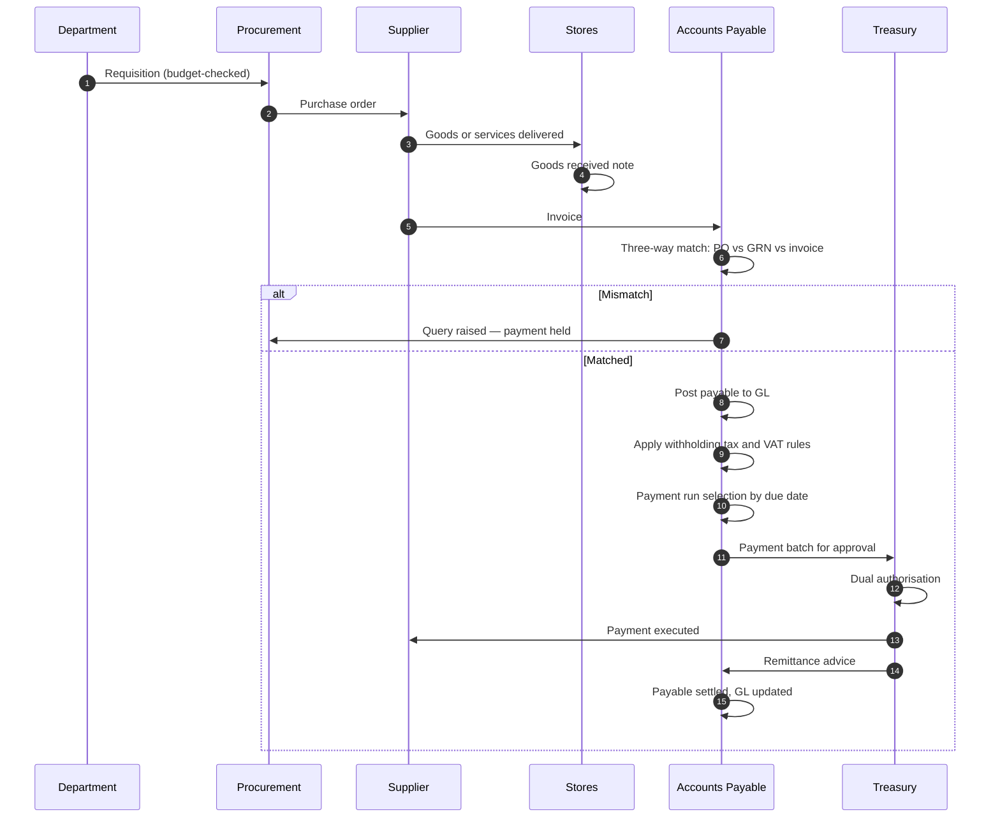
```mermaid
sequenceDiagram
    autonumber
    participant D as Department
    participant P as Procurement
    participant S as Supplier
    participant R as Stores
    participant A as Accounts Payable
    participant T as Treasury

    D->>P: Requisition (budget-checked)
    P->>S: Purchase order
    S->>R: Goods or services delivered
    R->>R: Goods received note
    S->>A: Invoice
    A->>A: Three-way match: PO vs GRN vs invoice
    alt Mismatch
        A->>P: Query raised — payment held
    else Matched
        A->>A: Post payable to GL
        A->>A: Apply withholding tax and VAT rules
        A->>A: Payment run selection by due date
        A->>T: Payment batch for approval
        T->>T: Dual authorisation
        T->>S: Payment executed
        T->>A: Remittance advice
        A->>A: Payable settled, GL updated
    end
```

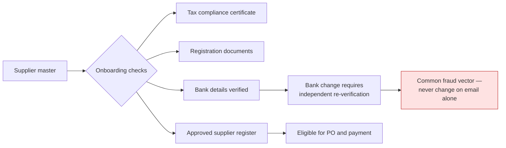
```mermaid
flowchart LR
    A[Supplier master] --> B{Onboarding checks}
    B --> C[Tax compliance certificate]
    B --> D[Registration documents]
    B --> E[Bank details verified]
    E --> F["Bank change requires<br/>independent re-verification"]
    F --> G["Common fraud vector —<br/>never change on email alone"]
    B --> H[Approved supplier register]
    H --> I[Eligible for PO and payment]
    style G fill:#FEE2E2,stroke:#B91C1C
```

---

## MOD-03-09 — Accounts Receivable & Revenue

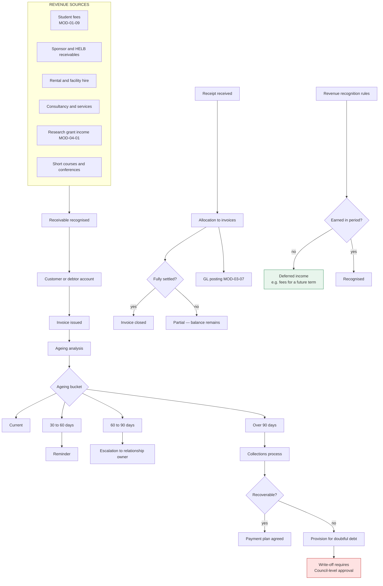
```mermaid
flowchart TB
    subgraph SOURCES["REVENUE SOURCES"]
        A["Student fees<br/>MOD-01-09"]
        B[Sponsor and HELB receivables]
        C[Rental and facility hire]
        D[Consultancy and services]
        E[Research grant income MOD-04-01]
        F[Short courses and conferences]
    end
    SOURCES --> G[Receivable recognised]
    G --> H[Customer or debtor account]
    H --> I[Invoice issued]
    I --> J[Ageing analysis]
    J --> K{Ageing bucket}
    K --> L[Current]
    K --> M[30 to 60 days]
    K --> N[60 to 90 days]
    K --> O[Over 90 days]
    M --> P[Reminder]
    N --> Q[Escalation to relationship owner]
    O --> R[Collections process]
    R --> S{Recoverable?}
    S -->|yes| T[Payment plan agreed]
    S -->|no| U["Provision for doubtful debt"]
    U --> V["Write-off requires<br/>Council-level approval"]
    W[Receipt received] --> X[Allocation to invoices]
    X --> Y{Fully settled?}
    Y -->|yes| Z[Invoice closed]
    Y -->|no| AA[Partial — balance remains]
    X --> AB[GL posting MOD-03-07]
    AC[Revenue recognition rules] --> AD{Earned in period?}
    AD -->|no| AE["Deferred income<br/>e.g. fees for a future term"]
    AD -->|yes| AF[Recognised]
    style V fill:#FEE2E2,stroke:#B91C1C
    style AE fill:#E8F5EC,stroke:#1E8449
```

Fees received in July for a September term are a **liability**, not income, until the term begins. Getting
deferred revenue right is what makes the audited accounts defensible.

---

## MOD-03-10 — Bank & Cash Management

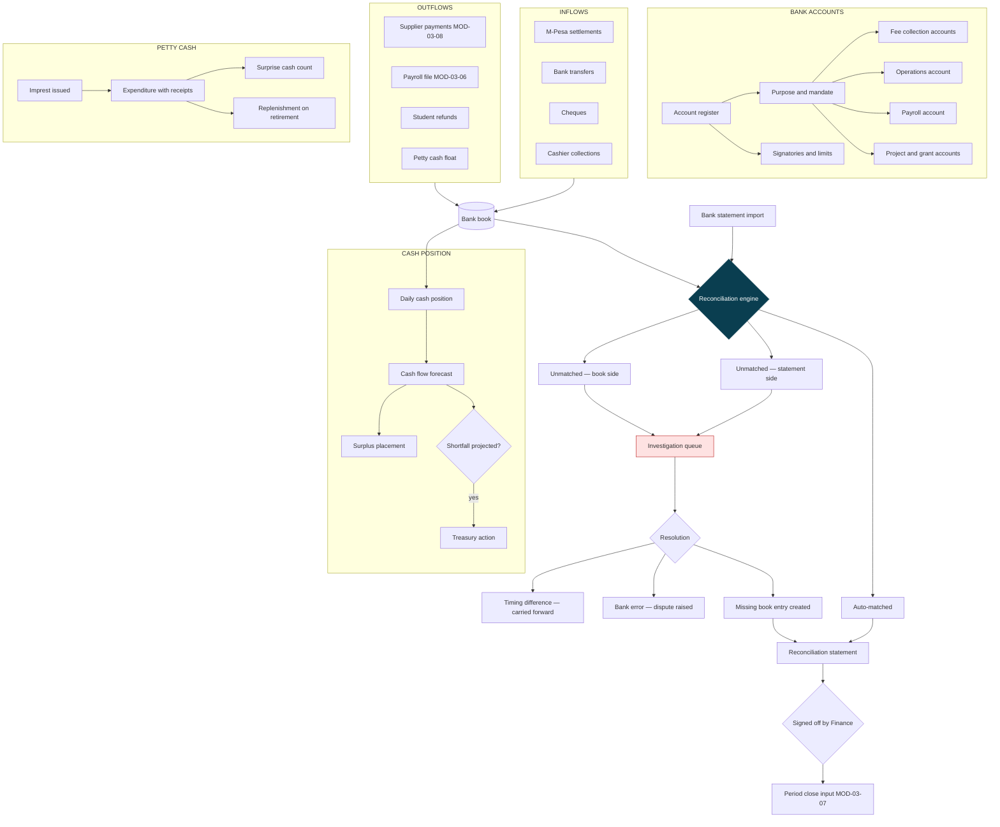
```mermaid
flowchart TB
    subgraph ACCOUNTS["BANK ACCOUNTS"]
        A[Account register] --> B[Purpose and mandate]
        B --> C[Fee collection accounts]
        B --> D[Operations account]
        B --> E[Payroll account]
        B --> F[Project and grant accounts]
        A --> G[Signatories and limits]
    end
    subgraph INFLOW["INFLOWS"]
        H[M-Pesa settlements]
        I[Bank transfers]
        J[Cheques]
        K[Cashier collections]
    end
    subgraph OUTFLOW["OUTFLOWS"]
        L[Supplier payments MOD-03-08]
        M[Payroll file MOD-03-06]
        N[Student refunds]
        O[Petty cash float]
    end
    INFLOW --> P[(Bank book)]
    OUTFLOW --> P
    Q[Bank statement import] --> R{Reconciliation engine}
    P --> R
    R --> S[Auto-matched]
    R --> T[Unmatched — statement side]
    R --> U[Unmatched — book side]
    T --> V[Investigation queue]
    U --> V
    V --> W{Resolution}
    W --> X[Missing book entry created]
    W --> Y[Bank error — dispute raised]
    W --> Z[Timing difference — carried forward]
    S --> AA[Reconciliation statement]
    X --> AA
    AA --> AB{Signed off by Finance}
    AB --> AC[Period close input MOD-03-07]
    subgraph CASH["CASH POSITION"]
        AD[Daily cash position] --> AE[Cash flow forecast]
        AE --> AF{Shortfall projected?}
        AF -->|yes| AG[Treasury action]
        AE --> AH[Surplus placement]
    end
    P --> AD
    subgraph PETTY["PETTY CASH"]
        AI[Imprest issued] --> AJ[Expenditure with receipts]
        AJ --> AK[Surprise cash count]
        AJ --> AL[Replenishment on retirement]
    end
    style R fill:#0A3E50,stroke:#0A3E50,color:#FFFFFF
    style V fill:#FEE2E2,stroke:#B91C1C
```

---

## MOD-03-11 — Procurement & Stores

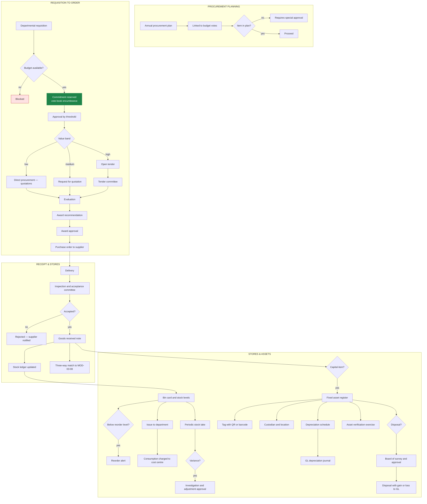
```mermaid
flowchart TB
    subgraph PLAN["PROCUREMENT PLANNING"]
        A[Annual procurement plan] --> B[Linked to budget votes]
        B --> C{Item in plan?}
        C -->|no| D["Requires special approval"]
        C -->|yes| E[Proceed]
    end
    subgraph REQ["REQUISITION TO ORDER"]
        F[Departmental requisition] --> G{Budget available?}
        G -->|no| H[Blocked]
        G -->|yes| I["Commitment reserved<br/>vote-book encumbrance"]
        I --> J[Approval by threshold]
        J --> K{Value band}
        K -->|low| L[Direct procurement — quotations]
        K -->|medium| M[Request for quotation]
        K -->|high| N[Open tender]
        L --> O[Evaluation]
        M --> O
        N --> P[Tender committee]
        P --> O
        O --> Q[Award recommendation]
        Q --> R[Award approval]
        R --> S[Purchase order to supplier]
    end
    subgraph RECEIVE["RECEIPT & STORES"]
        S --> T[Delivery]
        T --> U[Inspection and acceptance committee]
        U --> V{Accepted?}
        V -->|no| W[Rejected — supplier notified]
        V -->|yes| X[Goods received note]
        X --> Y[Stock ledger updated]
        X --> Z[Three-way match to MOD-03-08]
    end
    subgraph STORES["STORES & ASSETS"]
        Y --> AA[Bin card and stock levels]
        AA --> AB{Below reorder level?}
        AB -->|yes| AC[Reorder alert]
        AA --> AD[Issue to department]
        AD --> AE[Consumption charged to cost centre]
        AA --> AF[Periodic stock take]
        AF --> AG{Variance?}
        AG -->|yes| AH[Investigation and adjustment approval]
        X --> AI{Capital item?}
        AI -->|yes| AJ[Fixed asset register]
        AJ --> AK[Tag with QR or barcode]
        AJ --> AL[Custodian and location]
        AJ --> AM[Depreciation schedule]
        AM --> AN[GL depreciation journal]
        AJ --> AO[Asset verification exercise]
        AJ --> AP{Disposal?}
        AP --> AQ[Board of survey and approval]
        AQ --> AR[Disposal with gain or loss to GL]
    end
    style I fill:#1E8449,stroke:#1E8449,color:#FFFFFF
    style H fill:#FEE2E2,stroke:#B91C1C
```

**Commitment accounting is the point.** A department's available budget is `allocation − actual spend −
outstanding commitments`. Without encumbrance at requisition time, departments overspend on paper-approved
orders that have not yet been invoiced.

---

# PROPOSED MODULES — specification outstanding

The three capabilities below are required by the traceability matrix but have no specification file. Diagrams
are proposed designs; specifications are scheduled in the gap-audit remediation sequence.

## MOD-03-12 (proposed) — Academic Staff Workload

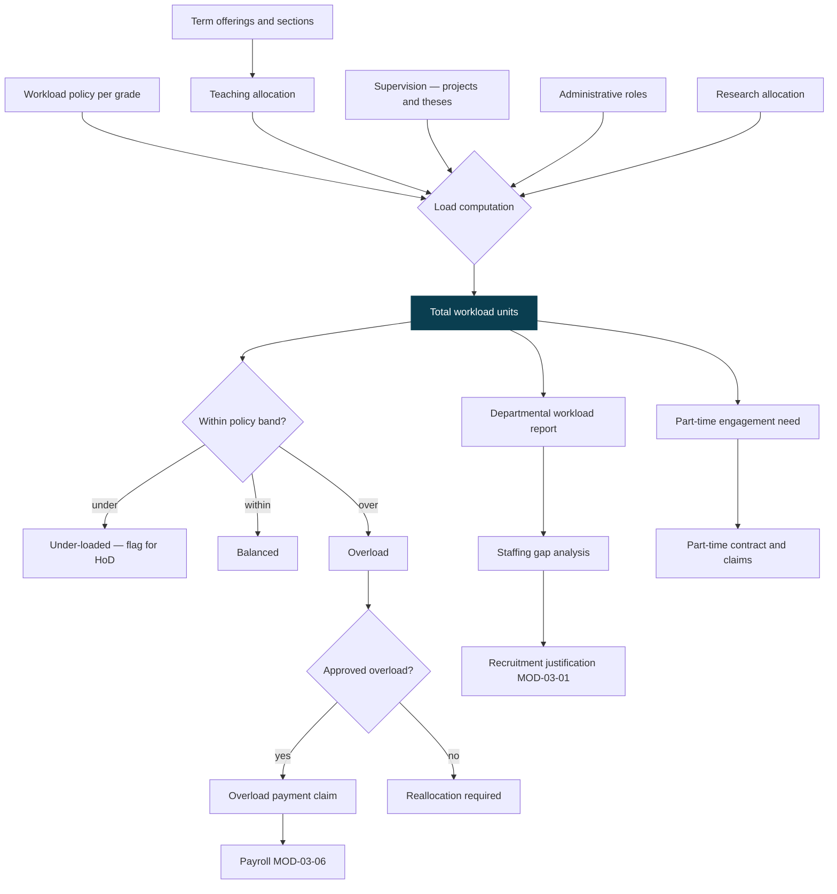
```mermaid
flowchart TB
    A[Term offerings and sections] --> B[Teaching allocation]
    C[Workload policy per grade] --> D{Load computation}
    B --> D
    E[Supervision — projects and theses] --> D
    F[Administrative roles] --> D
    G[Research allocation] --> D
    D --> H[Total workload units]
    H --> I{Within policy band?}
    I -->|under| J[Under-loaded — flag for HoD]
    I -->|within| K[Balanced]
    I -->|over| L[Overload]
    L --> M{Approved overload?}
    M -->|yes| N[Overload payment claim]
    M -->|no| O[Reallocation required]
    N --> P[Payroll MOD-03-06]
    H --> Q[Departmental workload report]
    Q --> R[Staffing gap analysis]
    R --> S[Recruitment justification MOD-03-01]
    H --> T[Part-time engagement need]
    T --> U[Part-time contract and claims]
    style H fill:#0A3E50,stroke:#0A3E50,color:#FFFFFF
```

## MOD-03-13 (proposed) — Staff Promotions

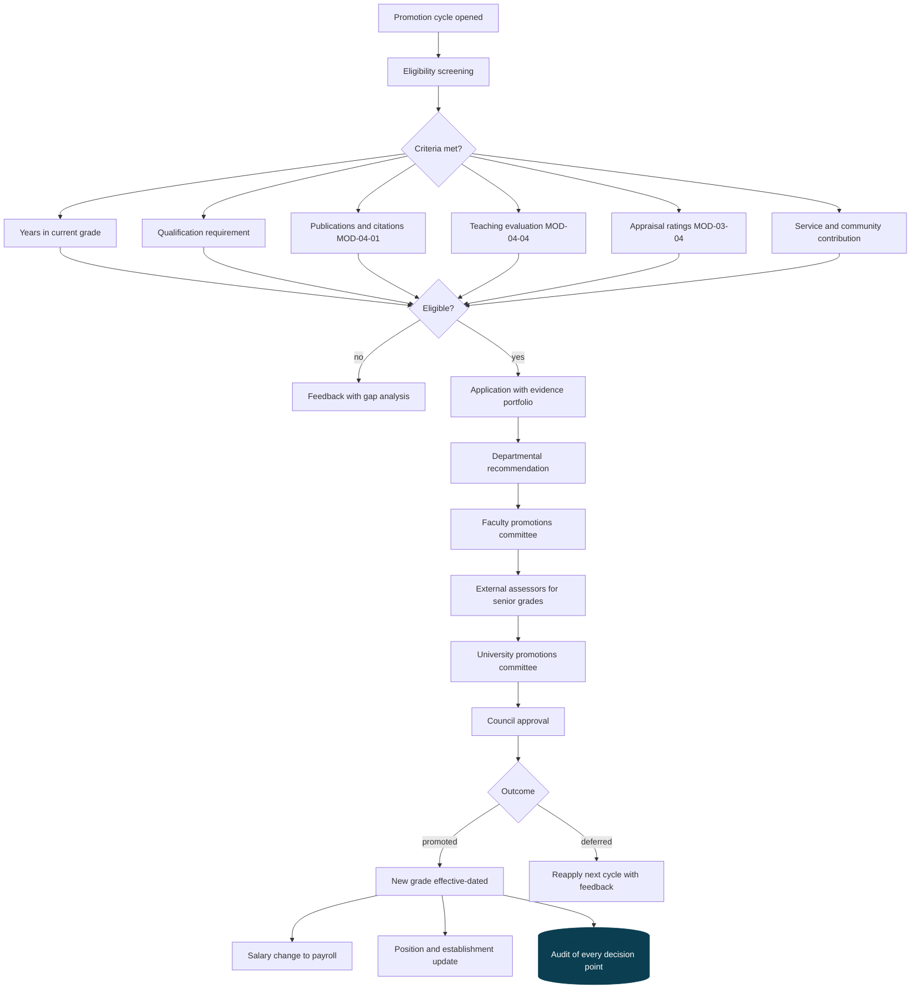
```mermaid
flowchart TB
    A[Promotion cycle opened] --> B[Eligibility screening]
    B --> C{Criteria met?}
    C --> D[Years in current grade]
    C --> E[Qualification requirement]
    C --> F[Publications and citations MOD-04-01]
    C --> G[Teaching evaluation MOD-04-04]
    C --> H[Appraisal ratings MOD-03-04]
    C --> I[Service and community contribution]
    D --> J{Eligible?}
    E --> J
    F --> J
    G --> J
    H --> J
    I --> J
    J -->|no| K[Feedback with gap analysis]
    J -->|yes| L[Application with evidence portfolio]
    L --> M[Departmental recommendation]
    M --> N[Faculty promotions committee]
    N --> O[External assessors for senior grades]
    O --> P[University promotions committee]
    P --> Q[Council approval]
    Q --> R{Outcome}
    R -->|promoted| S[New grade effective-dated]
    R -->|deferred| T[Reapply next cycle with feedback]
    S --> U[Salary change to payroll]
    S --> V[Position and establishment update]
    S --> W[(Audit of every decision point)]
    style W fill:#0A3E50,stroke:#0A3E50,color:#FFFFFF
```

## MOD-03-14 (proposed) — Budgeting & Vote-Book Control

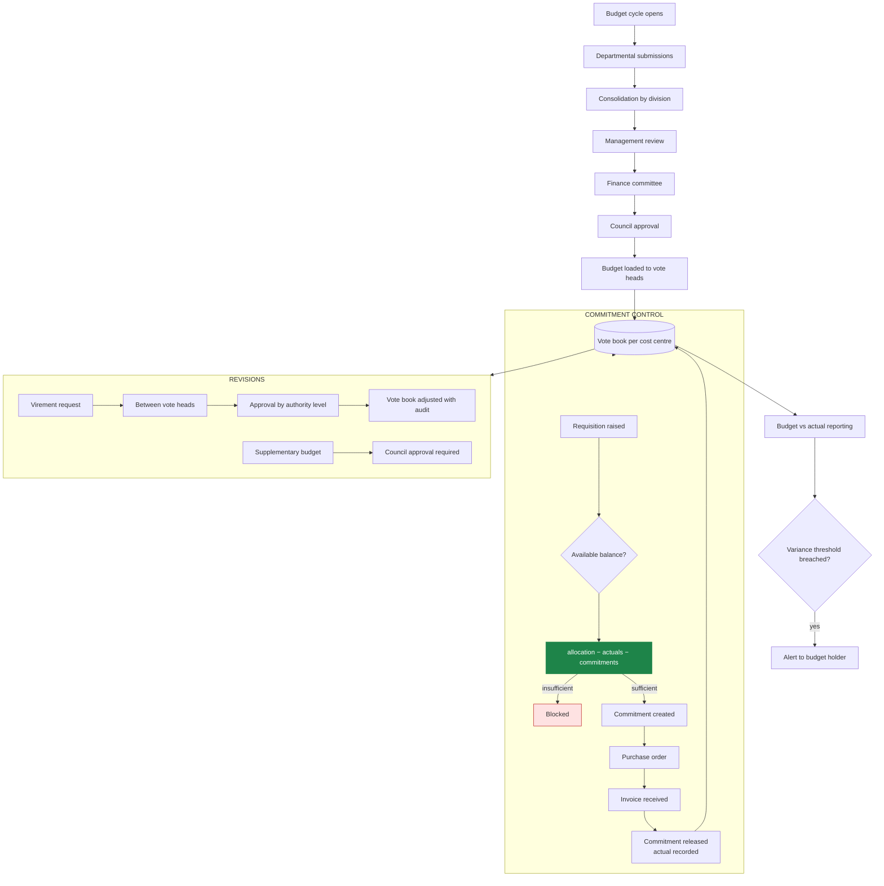
```mermaid
flowchart TB
    A[Budget cycle opens] --> B[Departmental submissions]
    B --> C[Consolidation by division]
    C --> D[Management review]
    D --> E[Finance committee]
    E --> F[Council approval]
    F --> G[Budget loaded to vote heads]
    G --> H[(Vote book per cost centre)]
    subgraph CONTROL["COMMITMENT CONTROL"]
        I[Requisition raised] --> J{Available balance?}
        J --> K["allocation − actuals − commitments"]
        K -->|insufficient| L[Blocked]
        K -->|sufficient| M[Commitment created]
        M --> N[Purchase order]
        N --> O[Invoice received]
        O --> P["Commitment released<br/>actual recorded"]
        P --> H
    end
    H --> CONTROL
    H --> Q[Budget vs actual reporting]
    Q --> R{Variance threshold breached?}
    R -->|yes| S[Alert to budget holder]
    subgraph REVISION["REVISIONS"]
        T[Virement request] --> U[Between vote heads]
        U --> V[Approval by authority level]
        V --> W[Vote book adjusted with audit]
        X[Supplementary budget] --> Y[Council approval required]
    end
    H --> REVISION
    style K fill:#1E8449,stroke:#1E8449,color:#FFFFFF
    style L fill:#FEE2E2,stroke:#B91C1C
```
