# PHASE 04 — RESEARCH, POSTGRADUATE & INSTITUTIONAL GOVERNANCE

11 modules. Research income and postgraduate outcomes are what distinguish a university from a college; this
phase also carries the governance, service and facilities layer that keeps the institution running and
auditable.

| Module | Name | Spec |
<!-- |---|---|---| -->
| MOD-04-01 | Research Grants & Projects | [spec](../docs/UNIVERSITY-ERP-SRSD/PHASE-04/04-01-Research-Grants-and-Projects-Management.md) |
| MOD-04-02 | Postgraduate Lifecycle & Thesis Tracking | [spec](../docs/UNIVERSITY-ERP-SRSD/PHASE-04/04-02-Postgraduate-Lifecycle-and-Thesis-Tracking.md) |
| MOD-04-03 | Research Ethics Review & Compliance | [spec](../docs/UNIVERSITY-ERP-SRSD/PHASE-04/04-03-Research-Ethics-Review-and-Compliance.md) |
| MOD-04-04 | Quality Assurance & Course Evaluation | [spec](../docs/UNIVERSITY-ERP-SRSD/PHASE-04/04-04-Quality-Assurance-and-Course-Evaluation.md) |
| MOD-04-05 | Senate, Council & Committee Governance | [spec](../docs/UNIVERSITY-ERP-SRSD/PHASE-04/04-05-Senate-Council-and-Committee-Governance.md) |
| MOD-04-06 | Enterprise Document Management | [spec](../docs/UNIVERSITY-ERP-SRSD/PHASE-04/04-06-Enterprise-Document-Management-System.md) |
| MOD-04-07 | Helpdesk & ICT Service Management | [spec](../docs/UNIVERSITY-ERP-SRSD/PHASE-04/04-07-Helpdesk-and-ICT-Service-Management.md) |
| MOD-04-08 | Facilities, Estates & Fleet | [spec](../docs/UNIVERSITY-ERP-SRSD/PHASE-04/04-08-Facilities-Estates-and-Fleet-Management.md) |
| MOD-04-09 | Campus Security & Incidents | [spec](../docs/UNIVERSITY-ERP-SRSD/PHASE-04/04-09-Campus-Security-and-Incident-Management.md) |
| MOD-04-10 | University Health & Clinic Services | [spec](../docs/UNIVERSITY-ERP-SRSD/PHASE-04/04-10-University-Health-and-Clinic-Services.md) |
| MOD-04-11 | Alumni Relations & Tracer Studies | [spec](../docs/UNIVERSITY-ERP-SRSD/PHASE-04/04-11-Alumni-Relations-and-Tracer-Studies.md) |

## Phase dependency graph

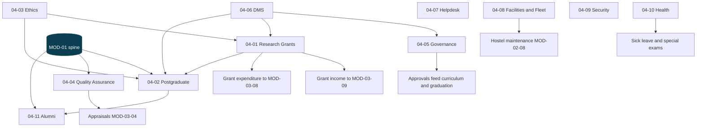

---

## MOD-04-01 — Research Grants & Projects Management

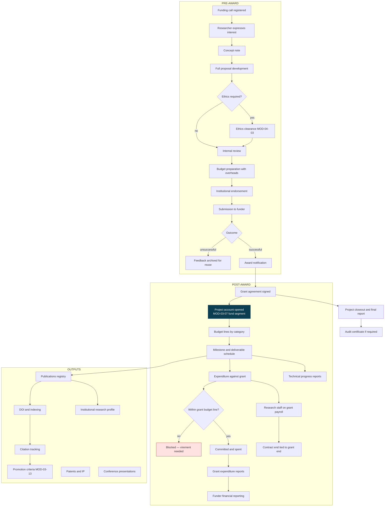

Grant money is **restricted** money. It cannot be pooled with general funds, cannot be spent outside its
approved budget lines, and must be reportable to the funder at any moment. That is why it gets its own fund
segment in the chart of accounts rather than a memo field.

---

## MOD-04-02 — Postgraduate Lifecycle & Thesis Tracking

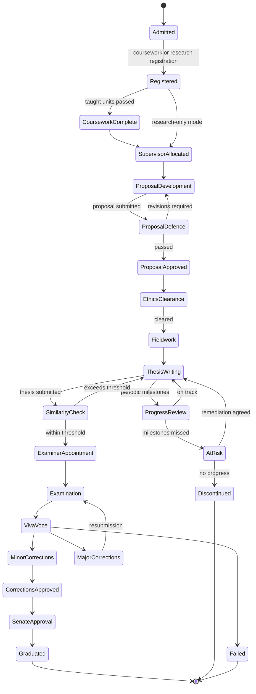

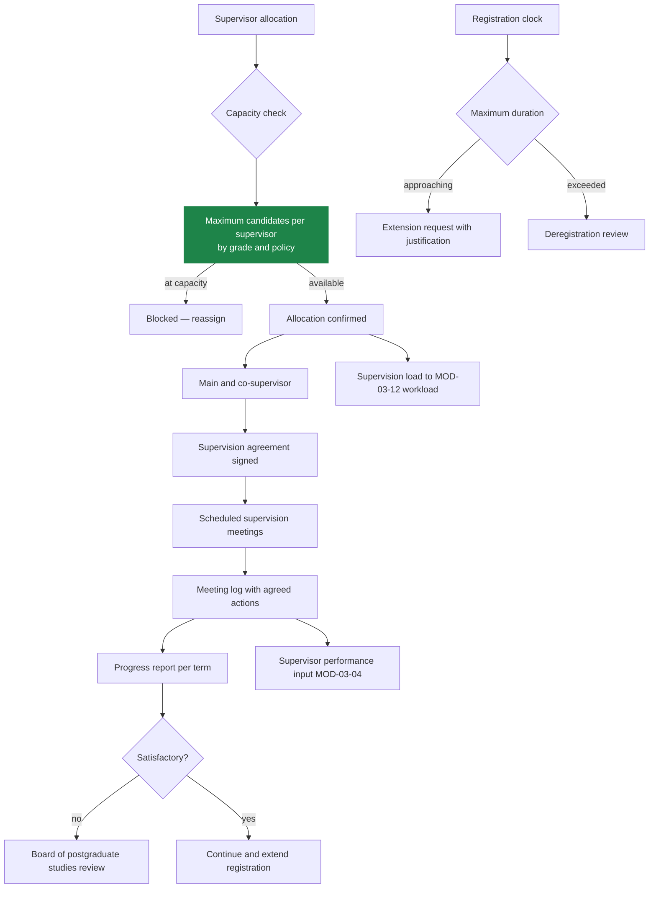

---

## MOD-04-03 — Research Ethics Review & Compliance

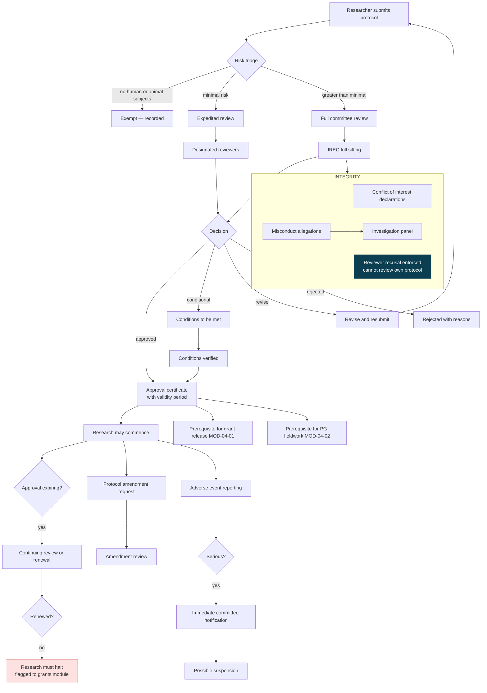

---

## MOD-04-04 — Quality Assurance & Course Evaluation

```mermaid
flowchart TB
    subgraph EVAL["COURSE EVALUATION"]
        A[Evaluation window opens near term end] --> B[Eligible respondents = enrolled students]
        B --> C["Anonymous response<br/>respondent marked, response unlinked"]
        C --> D{Minimum response threshold?}
        D -->|below| E["Results suppressed —<br/>too few to protect anonymity"]
        D -->|met| F[Aggregated scores]
        F --> G[Released after results published]
        G --> H[Lecturer sees own scores and comments]
        G --> I[HoD sees departmental comparison]
        G --> J[Dean and QA see institutional view]
        H --> K[Improvement plan for low scores]
        F --> L[Appraisal input MOD-03-04]
    end
    subgraph AUDIT["QUALITY AUDITS"]
        M[Audit schedule] --> N{Audit type}
        N --> O[Internal academic audit]
        N --> P[Accreditation self-assessment]
        N --> Q[External CUE inspection]
        O --> R[Evidence collection]
        P --> R
        Q --> R
        R --> S[Findings and non-conformities]
        S --> T[Corrective action plan with owners]
        T --> U[Action tracking to closure]
        U --> V{Closed by due date?}
        V -->|no| W[Escalation]
        V -->|yes| X[Verification and closure]
    end
    subgraph ACCRED["ACCREDITATION"]
        Y[Programme accreditation register] --> Z[Status and expiry]
        Z --> AA{Expiring within 12 months?}
        AA -->|yes| AB[Renewal process triggered]
        Z --> AC[Compliance evidence pack from ERP data]
        AC --> AD["Enrolment · staffing ratios ·<br/>facilities · outcomes"]
    end
    style C fill:#0A3E50,stroke:#0A3E50,color:#FFFFFF
    style E fill:#E8F5EC,stroke:#1E8449
```

Evaluation anonymity uses the same split-structure technique as student elections: the system knows who
responded (to close the window and chase non-respondents) and knows the aggregate, with no path between them.

---

## MOD-04-05 — Senate, Council & Committee Governance

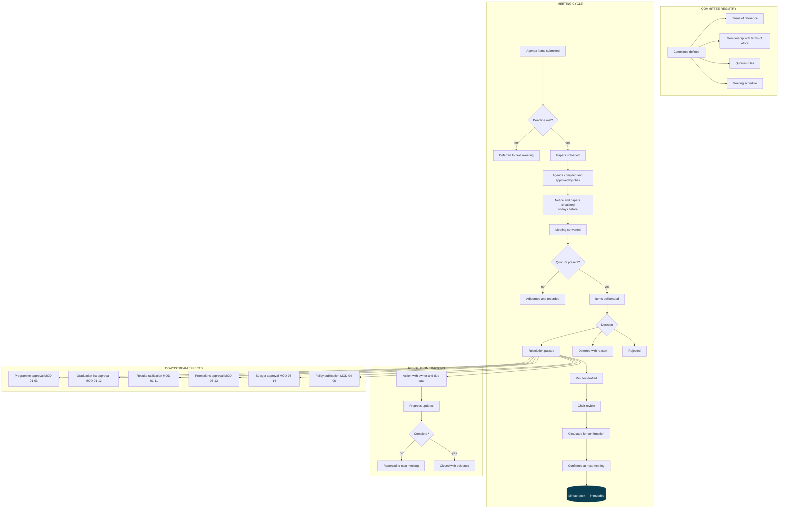

Senate resolutions are not administrative notes — they are the legal authority behind graduations, programme
changes and results. The link between a resolution and the record it authorises is stored, so any record can
answer "under whose authority?".

---

## MOD-04-06 — Enterprise Document Management System

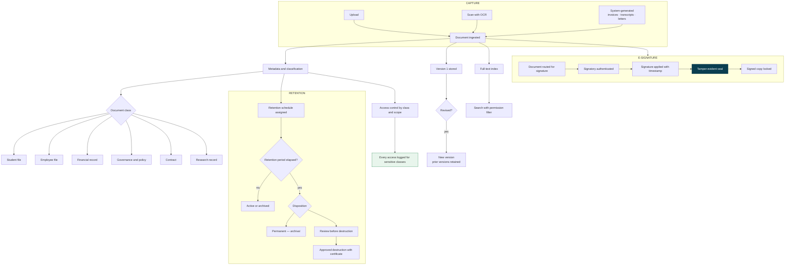

---

## MOD-04-07 — Helpdesk & ICT Service Management

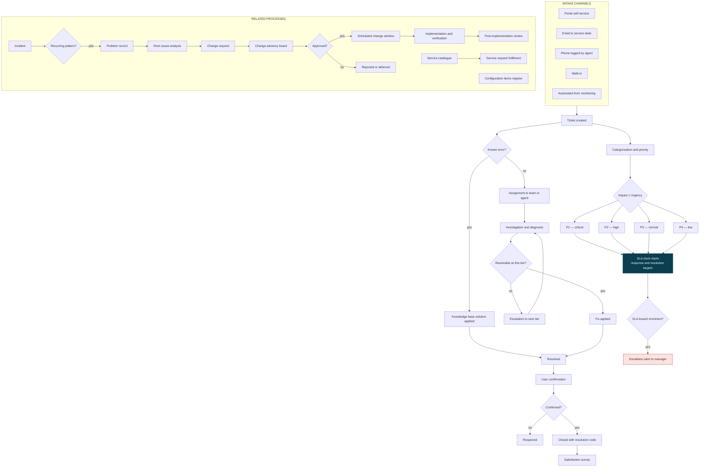

---

## MOD-04-08 — Facilities, Estates & Fleet Management

```mermaid
flowchart TB
    subgraph ESTATE["ESTATE REGISTER"]
        A[Land and title records] --> B[Buildings]
        B --> C[Floors and spaces]
        C --> D{Space use}
        D --> E[Teaching — feeds timetable MOD-01-08]
        D --> F[Office]
        D --> G[Residential — feeds MOD-02-08]
        D --> H[Laboratory and specialised]
        B --> I[Building services and plant]
    end
    subgraph MAINT["MAINTENANCE"]
        J[Work request] --> K{Source}
        K --> L[Hostel maintenance MOD-02-08]
        K --> M[Staff or department request]
        K --> N[Planned preventive schedule]
        K --> O[Inspection finding]
        J --> P[Triage and priority]
        P --> Q{Safety critical?}
        Q -->|yes| R[Emergency response]
        Q -->|no| S[Scheduled work order]
        R --> T[Assignment to team or contractor]
        S --> T
        T --> U{In-house or outsourced?}
        U -->|outsourced| V[Procurement MOD-03-11]
        U -->|in-house| W[Materials from stores]
        T --> X[Work executed]
        X --> Y[Completion and sign-off by requester]
        Y --> Z[Cost charged to cost centre]
        N --> AA[Asset maintenance history]
    end
    subgraph FLEET["FLEET"]
        AB[Vehicle register] --> AC[Licensing and insurance expiry]
        AC --> AD{Expiring?}
        AD -->|yes| AE[Renewal alert]
        AB --> AF[Driver assignment]
        AG[Trip request] --> AH[Approval by authority]
        AH --> AI[Vehicle and driver allocated]
        AI --> AJ{Vehicle available?}
        AJ -->|no| AK[Alternative or hire]
        AJ -->|yes| AL[Trip authorised]
        AL --> AM[Fuel issue and log]
        AL --> AN[Odometer and trip record]
        AN --> AO[Cost per kilometre analysis]
        AB --> AP[Service schedule by mileage]
        AP --> AQ[Service work order]
        AB --> AR[Accident and incident record]
        AR --> AS[Insurance claim]
    end
    subgraph UTIL["UTILITIES"]
        AT[Meter readings] --> AU[Consumption by building]
        AU --> AV[Utility cost allocation]
        AU --> AW{Abnormal consumption?}
        AW -->|yes| AX[Leak or fault investigation]
    end
    style E fill:#1E8449,stroke:#1E8449,color:#FFFFFF
```

---

## MOD-04-09 — Campus Security & Incident Management

```mermaid
flowchart TB
    subgraph ACCESS["ACCESS CONTROL"]
        A[Identity from MOD-01-01] --> B[Access credential]
        B --> C{Credential type}
        C --> D[Student ID card]
        C --> E[Staff card]
        C --> F[Visitor pass]
        C --> G[Contractor pass with expiry]
        B --> H[Zone permissions]
        H --> I[Gate and door events]
        I --> J[(Access log)]
        K{Status change} -->|suspended or exited| L[Credential revoked immediately]
    end
    subgraph VISITOR["VISITOR MANAGEMENT"]
        M[Visitor arrives] --> N[Host confirmation]
        N --> O[Identity recorded]
        O --> P[Pass issued with validity]
        P --> Q[Check-out]
        Q --> R{Overdue?}
        R -->|yes| S[Alert to security]
    end
    subgraph INCIDENT["INCIDENT MANAGEMENT"]
        T[Incident reported] --> U{Channel}
        U --> V[Guard patrol]
        U --> W[Student or staff report]
        U --> X[Panic or emergency button]
        U --> Y[CCTV observation]
        T --> Z[Severity classification]
        Z --> AA{Severity}
        AA --> AB["Critical — immediate response<br/>and management notification"]
        AA --> AC[Major — response team]
        AA --> AD[Minor — logged and handled]
        AB --> AE[Emergency services engaged if needed]
        AB --> AF[Incident command and log]
        AC --> AF
        AD --> AF
        AF --> AG[Investigation]
        AG --> AH[Statements and evidence]
        AH --> AI{Outcome}
        AI --> AJ[Disciplinary referral MOD-02-07]
        AI --> AK[Police referral]
        AI --> AL[Insurance claim]
        AI --> AM[No further action]
        AG --> AN[Preventive recommendations]
        AN --> AO[Action tracking]
    end
    subgraph OPS["SECURITY OPERATIONS"]
        AP[Guard duty roster] --> AQ[Patrol schedule]
        AQ --> AR[Patrol checkpoint scans]
        AR --> AS{Missed checkpoints?}
        AS -->|yes| AT[Supervisor alert]
        AU[Lost and found register]
        AV[Key and asset control]
    end
    style L fill:#1E8449,stroke:#1E8449,color:#FFFFFF
    style AB fill:#FEE2E2,stroke:#B91C1C
```

---

## MOD-04-10 — University Health & Clinic Services

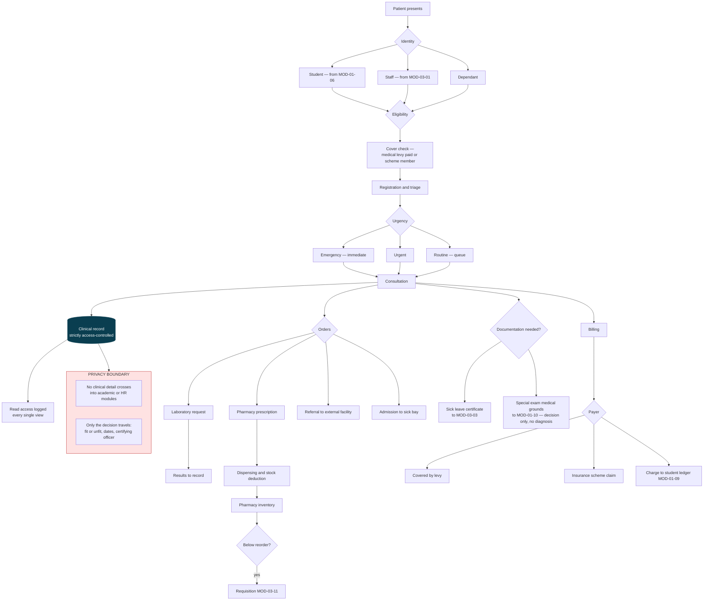

**The privacy boundary is the design.** A Head of Department approving sick leave sees "certified unfit,
3 days, by Dr X" — never the diagnosis. Health data lives in its own schema with its own role family and
read-auditing on every view.

---

## MOD-04-11 — Alumni Relations & Tracer Studies

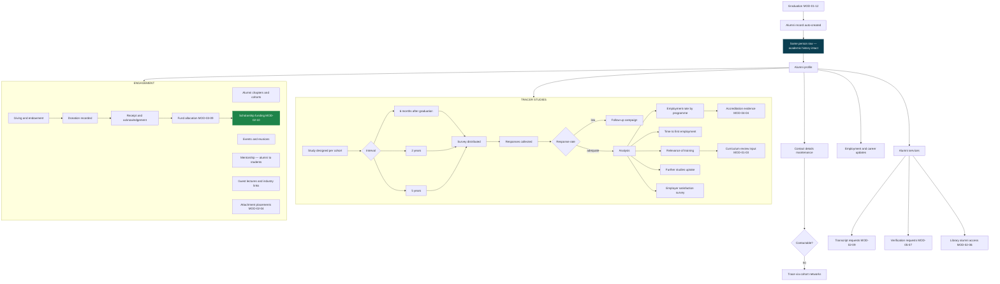

The person spine closes the loop: an alumnus who donates to a scholarship that funds a student who later
graduates and donates is **one continuous chain of records** in the same database, not four disconnected
systems.
