# PHASE 05 — INTELLIGENCE, INTEGRATION & ADVANCED PLATFORM SERVICES

9 modules. Everything here depends on four years of clean data produced by Phases 01–04. Built earlier, these
modules would analyse and expose nothing of value.

| Module | Name | Spec |
|---|---|---|
| MOD-05-01 | Universal Integration & API Gateway | [spec](../docs/UNIVERSITY-ERP-SRSD/PHASE-05/05-01-Universal-Integration-and-API-Gateway.md) |
| MOD-05-02 | Enterprise Data Warehouse & ETL | [spec](../docs/UNIVERSITY-ERP-SRSD/PHASE-05/05-02-Enterprise-Data-Warehouse-and-ETL.md) |
| MOD-05-03 | Institutional Analytics & Executive BI | [spec](../docs/UNIVERSITY-ERP-SRSD/PHASE-05/05-03-Institutional-Analytics-and-Executive-BI.md) |
| MOD-05-04 | Student Retention & Early Warning | [spec](../docs/UNIVERSITY-ERP-SRSD/PHASE-05/05-04-Student-Retention-and-Early-Warning-System.md) |
| MOD-05-05 | AI Student Assistant & Predictive Intelligence | [spec](../docs/UNIVERSITY-ERP-SRSD/PHASE-05/05-05-AI-Student-Assistant-and-Predictive-Intelligence.md) |
| MOD-05-06 | Universal Notification Engine | [spec](../docs/UNIVERSITY-ERP-SRSD/PHASE-05/05-06-Universal-Notification-Engine.md) |
| MOD-05-07 | Public Digital Verification Portal | [spec](../docs/UNIVERSITY-ERP-SRSD/PHASE-05/05-07-Public-Digital-Verification-Portal.md) |
| MOD-05-08 | University Mobile Application | [spec](../docs/UNIVERSITY-ERP-SRSD/PHASE-05/05-08-University-Mobile-Application.md) |
| MOD-05-09 | Business Continuity & Disaster Recovery | [spec](../docs/UNIVERSITY-ERP-SRSD/PHASE-05/05-09-Business-Continuity-and-Disaster-Recovery.md) |

> **Sequencing note.** MOD-05-06 (notifications) is built as a shared service in **Phase 0**, not Phase 5 —
> every module from Sprint 5 onward needs to send email and SMS. What Phase 5 adds is the full multi-channel
> engine: preferences, templates at scale, push, WhatsApp and campaign management. The same is true in part of
> MOD-05-09: backup and restore exist from Phase 0 (Gate 0 requires a timed restore); Phase 5 adds the tested
> full-institution DR capability.

## Phase dependency graph

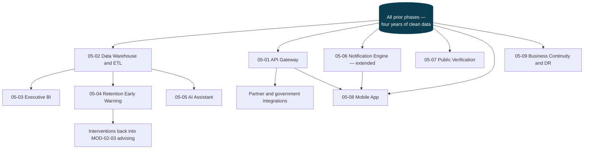

---

## MOD-05-01 — Universal Integration & API Gateway

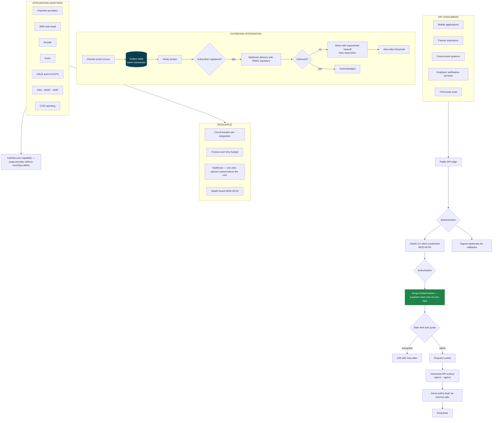

The outbox pattern is what makes outbound events trustworthy: the event row is written in the **same
transaction** as the business change, so an event can never describe something that did not happen, and a
committed change can never fail to produce its event.

---

## MOD-05-02 — Enterprise Data Warehouse & ETL

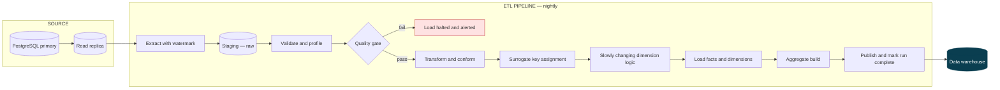

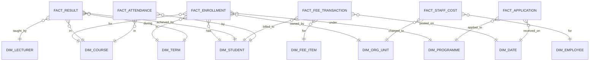

Dimensions are Type-2 slowly changing: when a student transfers faculty, historical enrolments still report
under the faculty they were in at the time. Otherwise last year's faculty statistics silently rewrite
themselves every time someone transfers.

---

## MOD-05-03 — Institutional Analytics & Executive BI

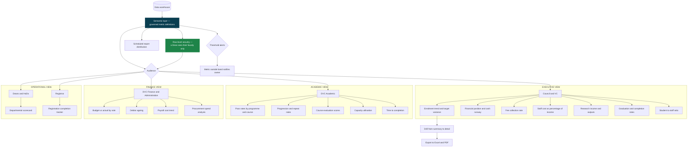

A governed semantic layer exists so "enrolment" means exactly one thing. Without it, Finance and Registry
bring different enrolment numbers to the same Council meeting — the most common failure of university BI.

---

## MOD-05-04 — Student Retention & Early Warning

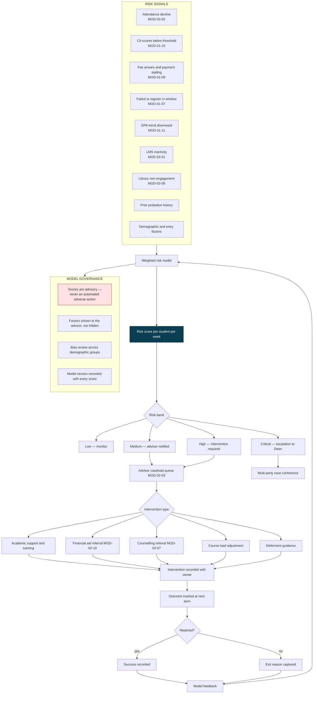

**No student is ever disadvantaged by a model output.** A risk score opens a conversation with an advisor; it
never blocks registration, alters a grade, or reduces support. The intervention log is what proves the
institution acted, and it is what makes the model improvable.

---

## MOD-05-05 — AI Student Assistant & Predictive Intelligence

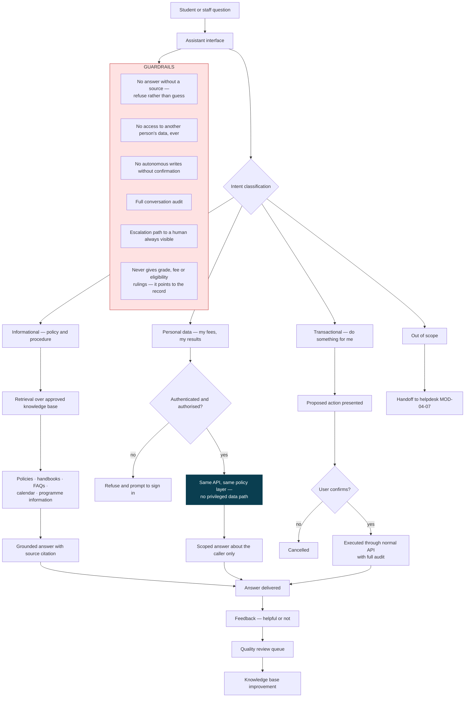

The assistant is a **front door to existing endpoints**, not a new privileged reader of the database. If a
student cannot see something in the portal, the assistant cannot see it either — the same policy gate runs.

---

## MOD-05-06 — Universal Notification Engine

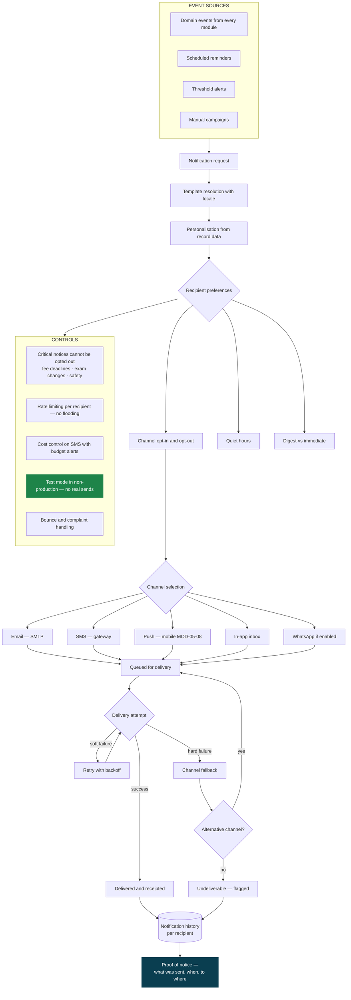

"Proof of notice" matters more than it sounds. When a student disputes a deregistration for non-payment, the
institution must show exactly what was sent, to which number, and when.

---

## MOD-05-07 — Public Digital Verification Portal

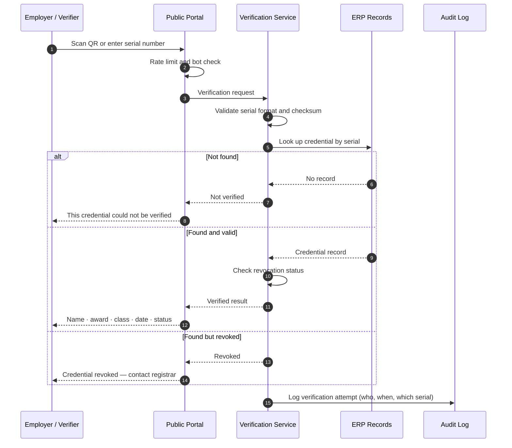

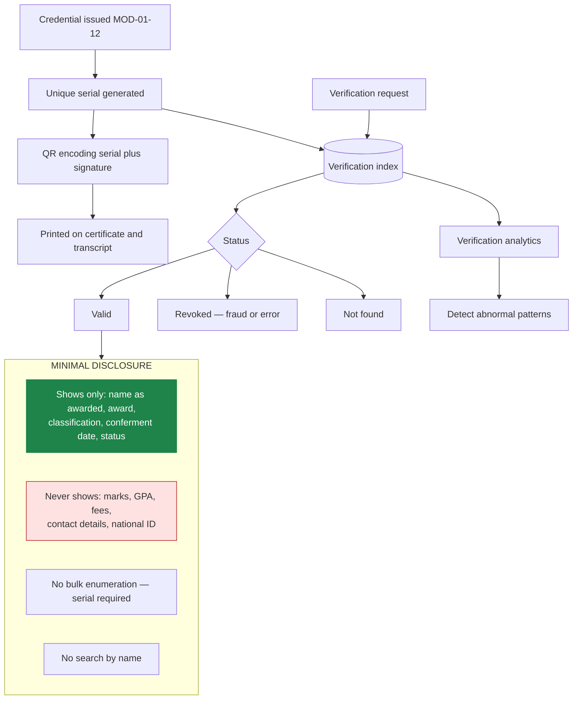

A verification portal that lets anyone search by name is a data-protection incident waiting to happen. The
holder must supply the serial from their own document — verification confirms a claim, it does not disclose a
record.

---

## MOD-05-08 — University Mobile Application

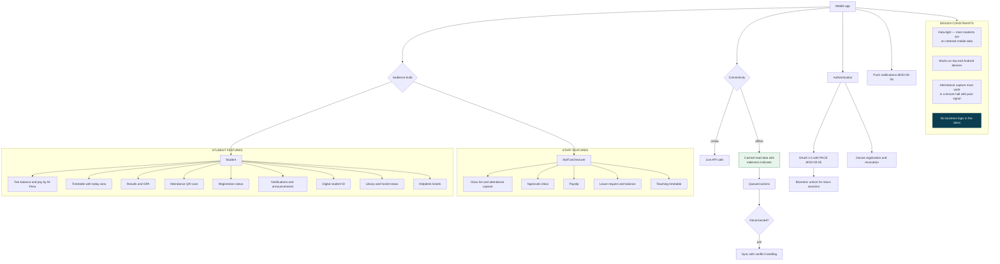

---

## MOD-05-09 — Business Continuity & Disaster Recovery

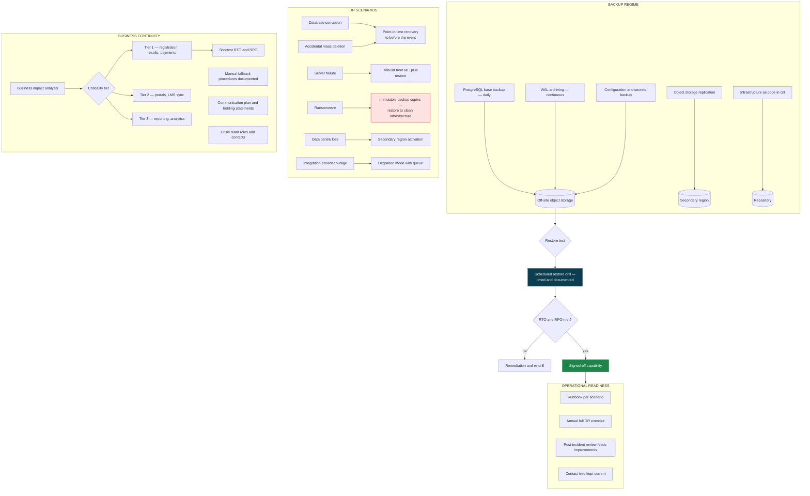

**A backup that has never been restored is not a backup.** Gate 0 requires a timed restore before any student
data enters the system, and this module makes that a scheduled, evidenced, repeating exercise rather than a
one-off.
