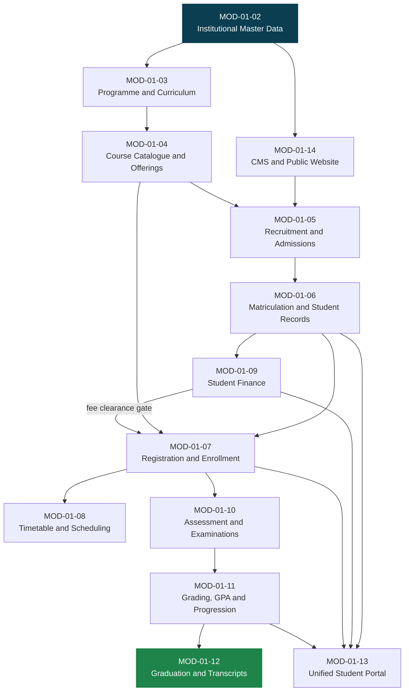
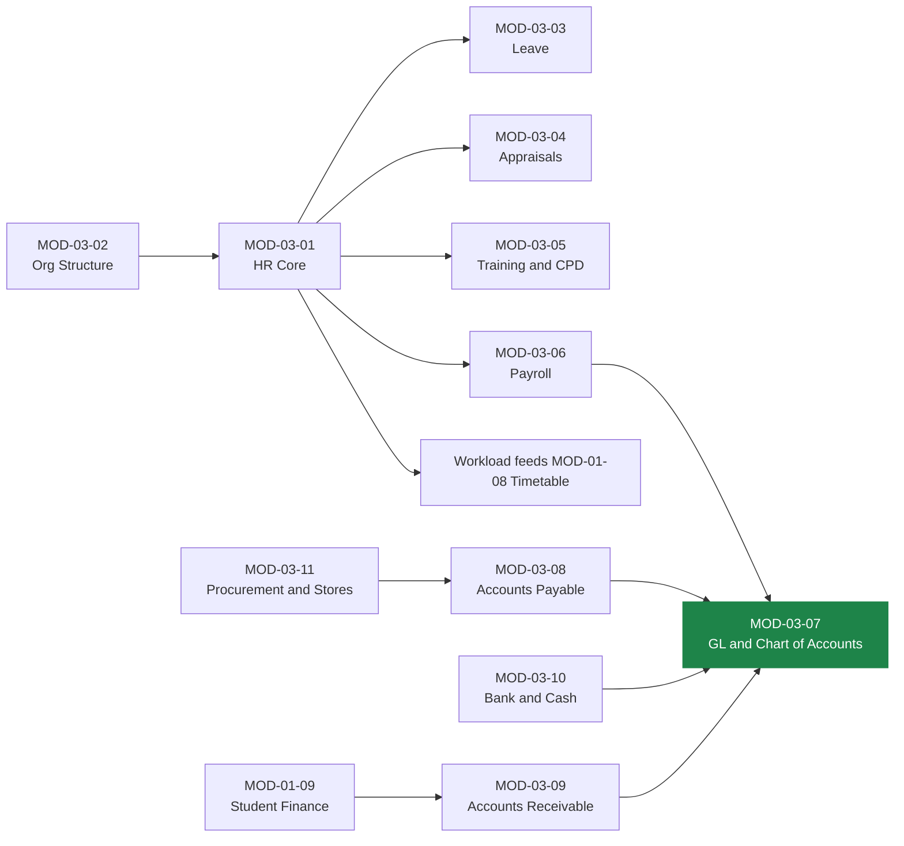

# MEMA ERP — PHASED EXECUTION PLAN

**Document:** `PLAN/00-EXECUTION-PLAN.md` · **Version:** 1.0.0-PLAN · **Date:** 22 August 2026
**Owner:** Engineering Lead · **Approvers:** Mema University Project Board

---

## 1. How this plan is structured

Six phases. Each phase has a **goal**, an **ordered module set**, **sprint-level work**, an explicit
**exit gate**, and named **dependencies**. A phase does not start until the previous phase's gate passes.
Within a phase, modules are sequenced by hard data dependency — you cannot register a student who has not
matriculated, and you cannot matriculate an applicant who has no programme to be admitted to.

Sprints are two weeks. Team assumptions are in [`10-DELIVERY-GOVERNANCE.md`](10-DELIVERY-GOVERNANCE.md).

### The rule that governs sequencing

> **A module may only be scheduled once every module it reads from is in production.**

This is why Admissions cannot precede Curriculum, why Payroll cannot precede HR Core, and why the Data
Warehouse is last — it reads from everything.

---

## 2. Phase 0 — Platform Foundation & Engineering Enablement

**Months 1–2 · Sprints 1–4 · Modules: MOD-00-01 … MOD-00-05**

**Goal:** produce a running, deployable, observable, secured skeleton with zero business features — so that
every subsequent module is additive rather than architectural.

This phase is the single highest-leverage investment in the programme. Every shortcut taken here is repaid
55 times over.

### Sprint 1 — Repository, toolchain, environments

| # | Work item | Done when |
|---|---|---|
| 0.1.1 | Monorepo scaffold (Turborepo + pnpm workspaces), 7 Next.js apps, 8 shared packages | `pnpm build` green across all apps |
| 0.1.2 | Laravel 12 / PHP 8.4 skeleton with `nwidart/laravel-modules`, strict types, Pint, PHPStan level 8 | `composer analyse` clean |
| 0.1.3 | `docker-compose.yml` — nginx, php-fpm, node, postgres 17, redis 7, minio, mailpit, horizon | `make up` yields working stack from clean clone in under 10 minutes |
| 0.1.4 | Dev, staging, production environment definitions; secrets in a managed store, never in the repo | Staging reachable over TLS |
| 0.1.5 | GitHub Actions: lint → static analysis → unit → integration → build → SAST → container scan | Pipeline blocks merge on failure |
| 0.1.6 | Branching model, PR template, CODEOWNERS, conventional commits, semantic release | First PR merged through the full gate |

### Sprint 2 — Identity, authentication, session security (MOD-00-01)

| # | Work item | Done when |
|---|---|---|
| 0.2.1 | `persons` / `users` canonical identity schema with `institution_id` on every table | Migration applied, seeded |
| 0.2.2 | Multi-identifier auth (student number, staff number, email, username) | All four resolve to one user |
| 0.2.3 | Argon2id password engine, 12-char minimum, history of 5, breach-list check | Policy enforced server-side |
| 0.2.4 | Sanctum SPA cookie session, `__Host-` prefix, rotation on privilege change, device registry | Session fixation test passes |
| 0.2.5 | TOTP MFA (RFC 6238) + 10 hashed single-use backup codes + audited recovery | MFA mandatory for privileged roles |
| 0.2.6 | OWASP-generic password reset (15-minute single-use token, no user enumeration) | Enumeration test returns identical responses/timing |
| 0.2.7 | Account lockout, throttling, suspicious-login detection | Brute-force test blocked |

### Sprint 3 — Authorization, workflow, audit (MOD-00-02, MOD-00-04)

| # | Work item | Done when |
|---|---|---|
| 0.3.1 | Permission catalogue (`module.resource.action`), roles, role families, scoped assignment | Catalogue seeded from SRSD §5 |
| 0.3.2 | Laravel Policies + Gates; deny-by-default; scope filters (campus, faculty, department) | A HOD sees only their department |
| 0.3.3 | Generic workflow engine — sequential, parallel, conditional, rejection, delegation, SLA, escalation | Two distinct workflows configured from data alone |
| 0.3.4 | Configurable multi-tier approval matrix | Approval chain changed without deployment |
| 0.3.5 | Append-only audit subsystem: actor, timestamp, IP, user agent, reason code, before/after JSON diff | Enforced by base trait + DB trigger; tamper test fails closed |
| 0.3.6 | Structured JSON logging, correlation IDs propagated request → job → integration | One ID traces a full request chain in Loki |

### Sprint 4 — Configuration, platform services, observability (MOD-00-03, MOD-00-05)

| # | Work item | Done when |
|---|---|---|
| 0.4.1 | Institution setup, org structure, academic calendar configuration | Mema University's real structure loaded |
| 0.4.2 | Dynamic branding engine — logo, seal, palette, dynamic footer year | Rebrand with zero code change |
| 0.4.3 | Feature flags, encrypted secrets, maintenance mode, emergency exam lockdown | Lockdown blocks writes, permits reads |
| 0.4.4 | Notification abstraction (channel-agnostic interface, drivers stubbed) | `notify($person, $event)` works; drivers land in Phase 5 |
| 0.4.5 | Document/file service: S3 adapter, virus scan on upload, MIME allow-list, metadata table | Malicious upload rejected |
| 0.4.6 | Horizon, 6 named queues, retry/backoff policy, dead-letter handling | Failed job visible and replayable |
| 0.4.7 | Prometheus exporters, Grafana dashboards, Sentry, Loki, uptime checks, alert routing | On-call alert fires end to end |
| 0.4.8 | Backup automation: nightly full, 5-minute WAL, 35-day PITR, offsite, **restore rehearsed** | A restore to a scratch host is timed and documented |

### Gate 0 — exit criteria (all blocking)

1. Clean clone → running full stack in **under 10 minutes** on a new machine.
2. CI pipeline green; merge is impossible with a failing gate.
3. Penetration test of auth surface passed — no High or Critical findings open.
4. Audit trail proven immutable under an adversarial test.
5. **A database restore from backup has been performed and timed**, not merely configured.
6. Staging environment is a faithful production replica.

> Gate 0 has failed if a restore has never been executed. A backup that has not been restored is a hypothesis.

---

## 3. Phase 1 — Core Student Lifecycle

**Months 2–7 · Sprints 5–14 · 14 modules · Ends in first production go-live**

**Goal:** an applicant can be recruited, admitted, matriculated, registered, timetabled, billed, examined,
graded, progressed and graduated — end to end, in production, with real students.

### Dependency-ordered build sequence

### Sprint plan

| Sprint | Month | Modules | Key deliverables |
|---|---|---|---|
| **5** | 2 | MOD-01-02 | Campuses, faculties, schools, departments, academic years, semesters, intakes, calendar, cost centres, master reference data |
| **6** | 3 | MOD-01-03 | Programmes, programme versions, curricula, curriculum nodes, credit rules, graduation rules — all versioned; a curriculum change never retroactively alters a graduated cohort |
| **7** | 3 | MOD-01-04 | Course master, prerequisites/co-requisites, semester offerings, class sections, capacity, lecturer allocation |
| **8** | 4 | MOD-01-14 | CMS (pages, menus, news, events, announcements, programmes, staff directory, documents, media, forms, SEO) + public website consuming it via ISR |
| **9** | 4 | MOD-01-05 | Prospect CRM, online application, document upload, application fee, eligibility scoring, review workflow, offer generation, acceptance, KUCCPS intake |
| **10** | 5 | MOD-01-06 | Matriculation, student number generation, student master file, statuses, document repository, ID card data |
| **11** | 5 | MOD-01-09 | Fee structures by programme/level/cohort, fee items, invoicing, student ledger, M-Pesa + bank payment, auto-reconciliation, receipts, statements |
| **12** | 6 | MOD-01-07 | Semester registration, prerequisite validation, credit-load rules, fee-clearance gate, add/drop window, capacity locking under concurrency, registration audit |
| **13** | 6 | MOD-01-08 | Rooms and venues, teaching timetable generation, clash detection, exam scheduling, invigilation rosters, exam cards |
| **14** | 7 | MOD-01-10, MOD-01-11, MOD-01-12 | CATs and coursework, marks entry, moderation, multi-tier approval and publication, grading schemes, GPA/CGPA, progression and probation decisions, degree audit, clearance, graduation lists, transcripts, certificates with QR hashes |
| **14b** | 7 | MOD-01-13 | Unified student portal assembling everything above; UAT; data migration; cutover |

### The three highest-risk items in Phase 1

| Risk | Why it is dangerous | Mitigation |
|---|---|---|
| **Registration concurrency** | 5,000 students hitting course capacity simultaneously; naive code oversubscribes sections or deadlocks | Redis distributed lock per section + `SELECT … FOR UPDATE` on the capacity row + queue-based checkout. Load-tested at 2× peak before go-live, not after. |
| **Payment reconciliation** | An unreconciled payment is a student blocked from registering and a finance office losing trust in the system on day one | Idempotent webhook handling keyed on M-Pesa transaction ID, signature verification, replay protection, automatic retry, exception queue with a human review UI. Target ≥ 99.8% auto-match. |
| **Grade integrity** | Undetectable grade tampering is an institutional catastrophe, not a bug | Hash-chained marks submissions, multi-tier approval locks, field-level permissions, immutable DB-trigger audit, published results frozen and only amendable through a recorded, approved amendment workflow. |

### Gate 1 — exit criteria (all blocking, this is the go-live gate)

1. A synthetic cohort runs **prospect → applicant → student → registered → examined → graded → graduated**
   with zero data anomalies and a complete audit trail.
2. Payment auto-reconciliation **≥ 99.8%** over a two-week parallel run against real transactions.
3. Registration p95 response **< 1 s** under simulated load of **5,000 concurrent students**; zero
   oversubscribed sections.
4. Legacy data migrated with automated checksum validation; **student count, fee balances and historical
   GPAs reconcile exactly** against the legacy system.
5. Transcript and certificate output signed off by the Registrar against known-correct historical records.
6. WCAG 2.2 AA verified on the student portal and public website.
7. Registry, Finance and Examinations staff trained and signed off.
8. Rollback plan documented and rehearsed.

---

## 4. Phase 2 — Academic Services & Student Affairs

**Months 8–11 · Sprints 15–22 · 11 modules**

**Goal:** connect the lifecycle spine to teaching delivery, residential life, welfare and staff workflows.

| Sprint | Modules | Deliverables |
|---|---|---|
| 15–16 | MOD-02-01, MOD-02-02 | Two-way Moodle sync (courses, rosters, grades) via Web Services; ERP remains the source of truth. Class attendance, QR clock-in, biometric integration, attendance flags |
| 17 | MOD-02-11 | Lecturer portal (teaching roster, marks entry, gradebook, class lists) and staff self-service portal |
| 18 | MOD-02-03 | Academic advising, advisor allocation, advising sessions and notes, degree-progress visualiser |
| 19 | MOD-02-04, MOD-02-05 | Industrial attachment and practicum — host organisations, supervisors, digital logbooks, assessment. Work-study positions, placements, timesheets, stipends |
| 20 | MOD-02-08 | Hostel blocks, rooms, beds, online booking, allocation rules, check-in/out, maintenance tickets |
| 21 | MOD-02-07 | Clubs and societies, counselling case management (restricted access), disciplinary hearings, secure student elections with verifiable ballots |
| 22 | MOD-02-06, MOD-02-09, MOD-02-10 | Koha library integration and patron sync; student request hub and automated paperless clearance; HELB integration, sponsors, bursaries, disbursements, sponsor invoicing |

**Gate 2:** Moodle sync reconciles 100% of enrollments daily with automated drift detection; attendance
captured for a full teaching term; clearance completes end-to-end with no paper step; counselling and
disciplinary records pass a data-protection access review.

---

## 5. Phase 3 — Enterprise Operations

**Months 12–16 · Sprints 23–32 · 11 modules**

**Goal:** the institutional administrative and financial backbone, unified with the student ledger.

| Sprint | Modules | Deliverables |
|---|---|---|
| 23 | MOD-03-02, MOD-03-01 | Organisation chart, departments, designations, cost centres. Employee master files, contracts, qualifications, transfers, academic vs administrative staff distinction |
| 24 | MOD-03-03 | Leave types, entitlement accrual, balances, applications, approval chains, leave calendar, biometric attendance |
| 25 | MOD-03-04, MOD-03-05 | KPIs, performance contracts, appraisal cycles, ratings, development plans. Training needs analysis, calendar, CPD points |
| 26–27 | MOD-03-06 | Salary scales, allowances, deductions, PAYE/NHIF/NSSF/housing-levy statutory engine, payroll run, approval, payslips, bank disbursement files, statutory returns. **Parallel-run against the existing payroll for two cycles before cutover.** |
| 28–29 | MOD-03-07 | Chart of accounts (multi-campus, multi-cost-centre), fiscal periods, journals, double-entry posting from every subsidiary ledger, period close, trial balance, financial statements |
| 30 | MOD-03-08, MOD-03-09 | Supplier invoicing, three-way match (PO/GRN/invoice), payment vouchers, approval limits. Revenue invoicing, receipting, debtor ageing |
| 31 | MOD-03-10 | Bank accounts, statement import, automated reconciliation, cash-flow position, petty cash |
| 32 | MOD-03-11 | Requisitions, RFQ and tendering, evaluation, purchase orders, GRN, stores ledger, stock take, barcode/QR asset register, depreciation, disposal |

**Gate 3:** two consecutive payroll cycles reconcile to the cent against the legacy system; the general ledger
balances with every subsidiary ledger (student finance, AP, AR, payroll, stores); statutory returns accepted
by KRA/NSSF/NHIF; an external audit trail walkthrough is passed.

> **Sequencing note:** the General Ledger must go live at a **financial-year or clean period boundary**.
> Confirm Mema University's financial year end — this may move Sprint 28–29 by up to a quarter, and that
> constraint outranks the sprint calendar.

---

## 6. Phase 4 — Research, Postgraduate & Governance

**Months 17–20 · Sprints 33–40 · 11 modules**

| Sprint | Modules | Deliverables |
|---|---|---|
| 33–34 | MOD-04-01, MOD-04-03 | Researcher profiles, proposals, grant awards, budgets and expenditure against grants, milestones, publication directory. Ethics review board, protocols, reviewer assignment, committee decisions, certificates |
| 35–36 | MOD-04-02 | Postgraduate lifecycle — concept notes, supervisor allocation and load, proposal defence, progress reporting, thesis submission, plagiarism check, examiner appointment, viva scheduling, corrections, final award |
| 37 | MOD-04-04, MOD-04-05 | Course evaluation instruments, student feedback (anonymised), academic audits, accreditation records against CUE requirements. Senate/Council/committee management, agendas, papers, minutes, resolutions, action tracking |
| 38 | MOD-04-06 | Enterprise DMS — repository, versioning, OCR indexing, digital signatures, retention and disposal policies |
| 39 | MOD-04-07, MOD-04-09 | ITIL helpdesk, ticket SLAs, knowledge base, IT asset register. Campus security incidents, visitor passes, gate passes, emergency alerts |
| 40 | MOD-04-08, MOD-04-10, MOD-04-11 | Buildings, spaces, maintenance work orders, fleet and trip logs. Clinic EHR with strict access isolation, prescriptions, medical clearance. Alumni profiles, cohorts, giving, tracer studies, mentorship |

**Gate 4:** postgraduate cohort tracked end to end through a real viva; Senate resolutions traced from agenda
to action closure; **clinic EHR access isolation independently verified** — no ERP administrator role can read
patient records without an explicit, audited, break-glass grant.

---

## 7. Phase 5 — Intelligence, Integration & Advanced Platform

**Months 21–24 · Sprints 41–48 · 9 modules**

| Sprint | Modules | Deliverables |
|---|---|---|
| 41 | MOD-05-06 | Multi-channel notification engine — email, SMS, push, WhatsApp; templates, channel preferences, delivery tracking, quiet hours, opt-out. Replaces the Phase 0 stub |
| 42 | MOD-05-01 | Public API gateway, API keys, scopes, rate-limit policies, outbound webhooks with signature and retry, partner onboarding, developer portal |
| 43–44 | MOD-05-02 | Enterprise data warehouse — star schema, conformed dimensions, nightly ETL from the operational replica, slowly-changing dimensions, data quality assertions |
| 45 | MOD-05-03 | Executive/VC dashboards, institutional KPIs, enrolment and revenue trends, CUE statutory returns, ECharts visualisations |
| 46 | MOD-05-04 | Multi-factor at-risk scoring (attendance, assessment, financial, engagement, advising), intervention case management, outcome tracking |
| 47 | MOD-05-05, MOD-05-07 | Conversational student assistant grounded in institutional knowledge with RBAC-aware retrieval and strict refusal on unauthorised data. Public credential verification portal with QR, hash lookup and revocation registry |
| 48 | MOD-05-08, MOD-05-09 | Native iOS/Android apps (student and staff), push, biometric auth, offline cache. DR orchestration, failover runbooks, **live failover drill**, final cutover and institutional handover |

**Gate 5 — final handover:** a live DR failover drill meets the agreed RTO/RPO; the AI assistant passes an
adversarial data-leakage review; mobile apps published to both stores; complete operational runbooks,
architecture documentation and admin training delivered; source, infrastructure and secrets formally handed over.

---

## 8. Cross-phase continuous workstreams

These run for the full 24 months and are not phase-scoped:

| Workstream | Cadence | Owner |
|---|---|---|
| Security — dependency scanning, SAST/DAST, annual penetration test, patching | Continuous + quarterly pen test | Security lead |
| Performance — load testing before every gate, query plan review, index tuning | Per gate | Backend lead |
| Accessibility — WCAG 2.2 AA audit per released surface | Per module release | Frontend lead |
| Documentation — OpenAPI spec, admin manuals, role-based user guides, runbooks | Per sprint | Whole team |
| Training — role-tailored bootcamps ahead of each go-live | Per gate | Change manager |
| Data quality — reconciliation reports, orphan detection, integrity assertions | Nightly automated | Data lead |
| Backup restore rehearsal | Monthly | DevOps |

---

## 9. Delivery risk register

| Risk | P | Impact | Mitigation | Owner |
|---|---|---|---|---|
| Legacy data migration corruption | High | Critical | Dual-run staging, immutable staging tables, automated checksums, pre-migration sanitisation, reversible cutover | Data lead |
| Peak registration degradation | Medium | Critical | Redis lock manager, read replicas, queue-based checkout, load test at 2× peak before gate | Backend lead |
| Grade tampering | Low | Catastrophic | Hash chaining, multi-tier locks, immutable triggers, field-level permissions, published-result freeze | Security lead |
| Scope creep beyond the 57 modules | High | High | Change control board; any new requirement enters a phase backlog, never the current sprint | Project board |
| Key-person dependency | Medium | High | Pair on every module, mandatory documentation-as-done, no single owner of a domain | Eng lead |
| Client decision latency blocking sprints | High | High | [`12-OPEN-DECISIONS.md`](12-OPEN-DECISIONS.md) with named owners and dates; escalate at 5 working days | Project manager |
| M-Pesa/bank API changes | Medium | High | Provider abstraction; contract tests against sandbox run nightly | Integrations lead |
| User adoption resistance | Medium | High | Phase-specific bootcamps, role-tailored manuals, in-product tours, champions in each department | Change manager |
| GL cutover missing the financial year boundary | Medium | High | Confirm FY end now; schedule Phase 3 finance work to land on the boundary | Finance lead |

---

## 10. What "done" means for a module

A module is not done when it works. It is done when **all eleven** of the following are true:

1. Every functional requirement in its SRSD section is implemented and traceable by requirement ID.
2. Database migrations are reversible and have been rolled back at least once in CI.
3. Feature tests cover every documented workflow, including the rejection and exception paths.
4. Authorization is tested negatively — each role is asserted to be **denied** what it must not access.
5. The OpenAPI specification is updated and the generated TypeScript client compiles.
6. Audit logging is verified for every state mutation.
7. Frontend screens meet WCAG 2.2 AA and the design system.
8. Performance SLOs from SRSD §29 are met under load.
9. Admin and end-user documentation is written.
10. The relevant university department has accepted it in UAT.
11. Observability exists — dashboards, alerts and runbook entries for the module's failure modes.
