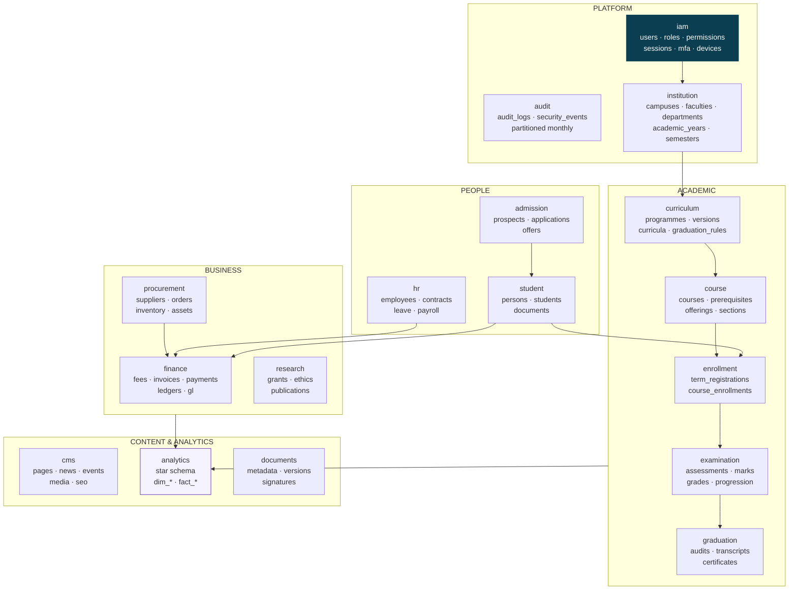
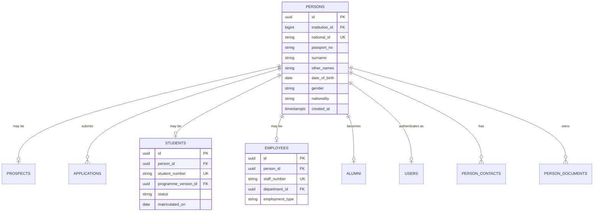
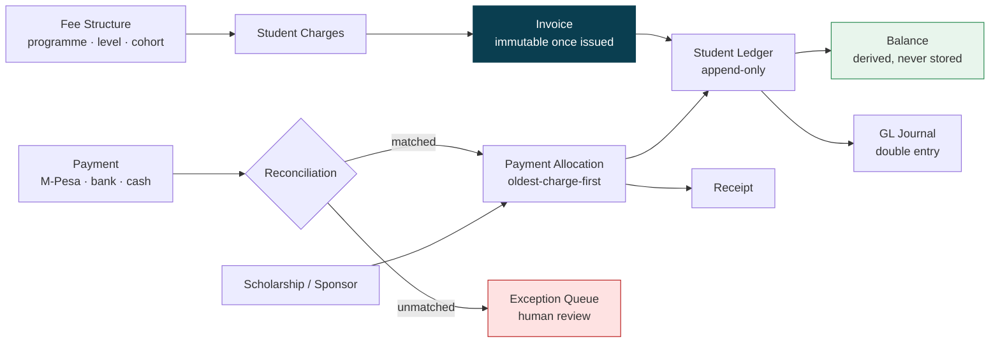

# MEMA ERP — DATA ARCHITECTURE

**Document:** `PLAN/03-DATA-ARCHITECTURE.md` · **Version:** 1.0.0-PLAN

---

## 1. Schema organisation

One PostgreSQL 17 database, 16 domain/application schemas plus the cross-cutting `documents` schema. Each domain schema maps to a bounded context and is owned by exactly one module group; `documents` is a governed platform service used through its contract.



---

## 2. The canonical person spine — the single most important design decision



### Why this matters more than it looks

A university genuinely contains people who occupy several roles at once and over time:

- A tutorial fellow who is also a PhD student in the same institution
- An alumnus who returns as a lecturer
- A staff member enrolled in a part-time master's programme
- An applicant who is rejected, reapplies two years later, and is admitted

The naive design gives each of these a separate profile per role. The consequences appear later and are
expensive: duplicate national IDs that block deduplication, a staff member unable to see their own student
fees, alumni tracer studies that miss anyone who became staff, and a KRA PIN attached to two identities.

**Rule.** `persons` is written once and never duplicated. Role tables reference it. Deduplication runs on
`national_id` / `passport_no` at every entry point — application, matriculation, hiring. Merging two persons
is a first-class, audited operation, not a manual `UPDATE`.

---

## 3. Universal column conventions

Every domain table:

```sql
id              uuid PRIMARY KEY DEFAULT gen_random_uuid()
institution_id  bigint NOT NULL REFERENCES institution.institutions(id)   -- ADR-012
created_at      timestamptz NOT NULL DEFAULT now()
updated_at      timestamptz NOT NULL DEFAULT now()
created_by      uuid REFERENCES iam.users(id)
updated_by      uuid REFERENCES iam.users(id)
deleted_at      timestamptz                     -- soft delete where retention requires
```

| Convention | Rule | Why |
|---|---|---|
| Primary keys | UUID v7 | Safe to expose in URLs; no enumeration of student counts; merge-friendly across environments |
| Money | `numeric(15,2)` + explicit `currency` | Never floating point. A rounding error in a fee ledger is a reconciliation failure and an audit finding. |
| Timestamps | `timestamptz`, stored UTC, rendered in `Africa/Nairobi` | Ambiguity is a bug, especially around registration and exam deadlines |
| Enums | Lookup tables, not PG `ENUM` types | Statuses change; altering a PG enum needs a migration and locks |
| Soft deletes | Only where retention policy requires | Otherwise every query needs a filter and one omission leaks deleted rows |
| Naming | `snake_case`, plural tables, `{singular}_id` FKs | Consistency across 57 modules |
| Indexes | Composite indexes lead with `institution_id` | Multi-tenant-shaped (ADR-012) |

---

## 4. Integrity enforced in the database, not only in code

Application-layer validation is necessary but insufficient — bulk imports, migrations, background jobs and
future services all bypass it. Anything that must never be true gets a database constraint.

```sql
-- A student cannot enrol in the same course offering twice in a term
ALTER TABLE enrollment.course_enrollments
  ADD CONSTRAINT uniq_enrollment
  UNIQUE (student_id, course_offering_id, term_registration_id);

-- A room cannot host two classes at overlapping times (PostgreSQL exclusion constraint)
ALTER TABLE course.teaching_slots
  ADD CONSTRAINT no_room_double_booking
  EXCLUDE USING gist (
    room_id WITH =,
    tstzrange(starts_at, ends_at) WITH &&
  ) WHERE (status = 'active');

-- Marks must fall within the assessment's configured maximum
ALTER TABLE examination.marks
  ADD CONSTRAINT marks_within_range
  CHECK (score >= 0 AND score <= max_score);

-- Money never negative where it must not be
ALTER TABLE finance.student_invoices
  ADD CONSTRAINT invoice_amount_positive CHECK (total_amount >= 0);
```

The room double-booking exclusion constraint is worth singling out: timetable clash prevention implemented
only in application code fails under concurrency the first time two schedulers save simultaneously. The
database-level constraint cannot be raced.

---

## 5. The financial ledger model

Student finance and the general ledger are both **double-entry and append-only**. A posted transaction is
never updated or deleted; corrections are reversing entries.



**Rules that are not negotiable:**

1. **A balance is always derived from the ledger, never stored as a mutable column.** A stored balance and a
   ledger will diverge — under concurrency, after a failed job, after a manual correction — and once they
   diverge nobody can tell which is right. Derive it, and cache it with explicit invalidation if performance
   requires.
2. **Every payment is idempotent on the provider's transaction ID.** M-Pesa will deliver the same callback
   more than once. A non-idempotent handler credits a student twice.
3. **An unmatched payment goes to an exception queue with a review UI** — never silently dropped, never
   auto-guessed.
4. **Allocation order is a configured rule**, not implicit code behaviour, because the university's policy on
   which charge a payment settles first is a finance decision.

---

## 6. Audit architecture

```sql
CREATE TABLE audit.audit_logs (
    id              uuid PRIMARY KEY,
    institution_id  bigint NOT NULL,
    occurred_at     timestamptz NOT NULL DEFAULT now(),
    actor_user_id   uuid,
    actor_role      text,
    impersonated_by uuid,
    ip_address      inet,
    user_agent      text,
    correlation_id  uuid,
    auditable_type  text NOT NULL,
    auditable_id    uuid NOT NULL,
    event           text NOT NULL,          -- created · updated · deleted · viewed · approved
    reason_code     text,
    old_values      jsonb,
    new_values      jsonb,
    changed_columns text[]
) PARTITION BY RANGE (occurred_at);
```

- **Append-only, enforced at the database.** A `BEFORE UPDATE OR DELETE` trigger raises an exception. The
  application role holds `INSERT` and `SELECT` only. If an administrator can quietly edit the audit trail,
  there is no audit trail.
- **Monthly partitions**, so the largest table in the system stays queryable for years.
- **GIN index on `old_values`/`new_values`** for field-level investigation.
- **Correlation IDs** propagate request → job → integration, so one identifier reconstructs a full chain.
- **Read events are audited too** for grades, health records, counselling notes and payroll — for these,
  who *looked* is as important as who changed.
- **Retention:** 7 years online for financial and academic records, then archived to cold object storage
  with hashes retained.

---

## 7. Performance design

| Technique | Applied to | Why |
|---|---|---|
| Table partitioning | `audit_logs`, `notifications`, `enrollment_history` | Unbounded-growth tables; keeps indexes small |
| Partial indexes | `WHERE status = 'active'`, `WHERE deleted_at IS NULL` | ERP predicates are sparse; full indexes waste space |
| Covering indexes | Registration, fee-balance, results lookups | Index-only scans on the hottest read paths |
| Materialised views | Dashboard aggregates, degree audit | Refreshed on schedule; heavy aggregates off the request path |
| Read replica | Reports, BI, exports, ETL | A Registrar's 40,000-row export must not slow registration |
| `SELECT … FOR UPDATE` + Redis lock | Course capacity, invoice numbering, student number generation | Two students must never take the last seat |
| PgBouncer transaction pooling | All application connections | PHP-FPM opens many short connections |
| `pg_stat_statements` | Always on | Slow queries found before users report them |

### The registration concurrency pattern

The single highest-risk operation in the system. 5,000 students, one enrollment window, finite section capacity.

```
1. Acquire Redis lock on course_offering:{id}    (short TTL, auto-release)
2. BEGIN
3. SELECT seats_taken, capacity
     FROM course.course_offerings
    WHERE id = ? FOR UPDATE            -- row lock, serialises contenders
4. Assert seats_taken < capacity       -- else fail cleanly to waitlist
5. INSERT enrollment
6. UPDATE seats_taken = seats_taken + 1
7. COMMIT
8. Release lock
9. Queue side effects: LMS sync, confirmation email
```

The Redis lock sheds contention before it reaches PostgreSQL; the `FOR UPDATE` row lock is the actual
correctness guarantee. Redis alone is not sufficient — a lock service is not a transaction. Load-tested at
2× expected peak before Gate 1, not after.

---

## 8. Data warehouse (Phase 5, MOD-05-02)

Star schema in the `analytics` schema, populated by nightly ETL **from the read replica** so analytical load
never touches the primary.

- **Conformed dimensions:** `dim_student`, `dim_programme`, `dim_course`, `dim_employee`, `dim_time`,
  `dim_department`
- **Facts:** `fact_enrollment`, `fact_grade`, `fact_payment`, `fact_attendance`, `fact_application`,
  `fact_payroll`
- **Type-2 slowly changing dimensions** on student and programme, so "how many students were in Nursing in
  2024" answers correctly after a student transfers programme. Type-1 overwrite would silently rewrite history —
  a common and damaging mistake in institutional reporting.
- **Data quality assertions run before publication;** a failed assertion blocks the load and alerts, rather
  than publishing wrong numbers to the Vice-Chancellor's dashboard.

---

## 9. Backup, retention and recovery

| Aspect | Specification |
|---|---|
| Full backup | Nightly, encrypted, offsite |
| WAL archiving | Continuous, 5-minute granularity |
| PITR window | 35 days |
| **Restore rehearsal** | **Monthly, timed, documented — a Gate 0 blocking criterion** |
| RPO target | ≤ 5 minutes |
| RTO target | ≤ 4 hours (Phase 5 DR drill validates) |
| Object storage | Versioned, cross-region replicated, SSE-KMS |
| Academic records | Permanent retention — transcripts and certificates are lifetime obligations |
| Financial records | 7 years online, then archived |
| Health records | Per Kenyan health data regulation, isolated access |

> A backup that has never been restored is a hypothesis. The restore rehearsal is the deliverable, not the
> backup configuration.
