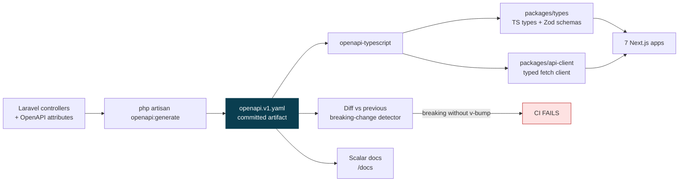

# MEMA ERP — API DESIGN STANDARDS

**Document:** `PLAN/04-API-STANDARDS.md` · **Version:** 1.0.0-PLAN

The API is the contract between one backend and seven frontends, a mobile app and future partners.
These conventions are enforced in CI, not left to per-developer judgement — inconsistency across 57 modules
is what makes an ERP API unusable.

---

## 1. Versioning

```
/api/v1/…      Current
/api/v2/…      Introduced only for breaking changes
/api/public/…  Phase 5 partner API — separate auth, quotas, contract
```

`v1` ships from Sprint 1. Versioning retrofitted after external consumers exist is a breaking change in itself.

**Breaking** (needs `v2`): removing or renaming a field, narrowing a type, adding a required request field,
changing status-code semantics, changing pagination shape.
**Non-breaking** (stays in `v1`): adding an optional request field, adding a response field, adding an endpoint,
adding an enum value **that clients are documented to tolerate**.

Deprecation: announce → `Deprecation` and `Sunset` headers → minimum 6 months → remove. Never silently.

---

## 2. Resource naming

```
GET    /api/v1/students                      List
POST   /api/v1/students                      Create
GET    /api/v1/students/{id}                 Read
PATCH  /api/v1/students/{id}                 Partial update
DELETE /api/v1/students/{id}                 Delete
GET    /api/v1/students/{id}/enrollments     Nested collection
POST   /api/v1/course-registrations/{id}/submit    State transition
```

- Plural, kebab-case nouns. Never verbs in paths — except a **state transition** as a sub-resource
  (`/submit`, `/approve`, `/publish`, `/reverse`), which is more honest than pretending a workflow step is a
  `PATCH`, and gives approvals their own auditable endpoint and permission.
- Nesting maximum two levels. Deeper means the child deserves a top-level resource.
- `PATCH` for updates; `PUT` only for genuine full replacement.

---

## 3. Response envelope

Every response, without exception.

```jsonc
// Single
{ "data": { "id": "...", "type": "student", "attributes": { } },
  "meta": { "request_id": "01J...", "timestamp": "2026-08-22T10:00:00Z" } }

// Collection
{ "data": [ ],
  "meta": { "request_id": "01J...", "pagination": {
      "cursor": "eyJpZCI6…", "next_cursor": "eyJpZCI6…", "per_page": 50, "has_more": true } } }

// Error
{ "error": {
    "code": "REGISTRATION_PREREQUISITE_NOT_MET",
    "message": "You have not passed the prerequisite for this course.",
    "detail": "CSC 201 requires CSC 101, which is not recorded as passed.",
    "fields": { "course_offering_id": ["Prerequisite CSC 101 not satisfied"] },
    "trace_id": "01J..." },
  "meta": { "request_id": "01J...", "timestamp": "2026-08-22T10:00:00Z" } }
```

**`request_id` on every response** — including errors — is what makes support tractable. A student screenshots
an error, support pastes the ID, and the full server-side chain including queued jobs and integration calls is
retrievable from Loki. Without it, ERP support degenerates into guesswork.

**Error `code` is a stable machine-readable string.** Frontends switch on `code`, never on `message`. Messages
are for humans and may be translated or reworded; codes are contract.

---

## 4. Pagination

**Cursor pagination is the default.** Offset pagination on a 50,000-row student list degrades badly at high
offsets, and — more importantly — silently skips or duplicates rows when the underlying data changes between
pages, which it constantly does during registration and marks entry.

Offset pagination is permitted only where a caller genuinely needs to jump to page N of a stable, small
dataset, and must be explicitly justified.

```
GET /api/v1/students?cursor=eyJpZCI6…&per_page=50
```

`per_page` default 25, maximum 100. Exports do not paginate — they queue a job and return a download link
(§8), because a Registrar exporting 40,000 students over HTTP will time out and hold a PHP-FPM worker.

---

## 5. Filtering, sorting, sparse fields

```
GET /api/v1/students
      ?filter[status]=active
      &filter[programme_id]=uuid
      &filter[admitted_after]=2024-01-01
      &filter[search]=mwangi
      &sort=-admitted_on,surname
      &include=programme,currentRegistration
      &fields[student]=id,student_number,surname,other_names
```

- Every filter is **whitelisted per endpoint**. An unknown filter is a `422`, never ignored — silently
  ignoring a filter returns unfiltered data to a caller that believes it is filtered, which is a data-leak
  shape.
- `filter[search]` maps to PostgreSQL full-text search.
- `include` is whitelisted and eager-loaded to prevent N+1.
- Filters apply **at the query level**, after the authorization scope filter (ADR-008), never in the response layer.

---

## 6. Status codes

| Code | Used for |
|---|---|
| 200 / 201 / 202 / 204 | OK · Created · Accepted (queued) · No content |
| 400 | Malformed request |
| 401 | Unauthenticated |
| 403 | Authenticated but not permitted — **and not used to hide existence** |
| 404 | Not found, **or exists but outside the caller's scope** |
| 409 | Conflict — capacity exhausted, duplicate, concurrent modification |
| 422 | Validation failed |
| 423 | Locked — exam lockdown, closed financial period, frozen results |
| 429 | Rate limited (with `Retry-After`) |
| 500 / 503 | Server error (no internals leaked) · Maintenance |

**403 vs 404 is a deliberate rule.** If a lecturer requests a student outside their department, return `404`.
Returning `403` confirms the record exists and leaks enumerable information about students the caller must not
know about. `403` is reserved for resources whose existence the caller may legitimately know.

---

## 7. Idempotency

Required on every non-idempotent mutation involving money, enrollment or grades.

```
POST /api/v1/payments
Idempotency-Key: 01J8XY...
```

The key is stored with the response; a replay within 24 hours returns the original response without
re-executing. This covers the real failure modes: a student double-clicking "Pay", a mobile client retrying on
flaky network, and — most importantly — M-Pesa delivering the same callback twice, which it does.

For inbound webhooks the provider's transaction ID **is** the idempotency key.

---

## 8. Long-running operations

Anything that may exceed ~5 seconds returns `202 Accepted` with a job resource.

```
POST /api/v1/reports/transcripts   →  202  { "data": { "job_id": "...", "status": "queued" } }
GET  /api/v1/jobs/{job_id}         →  200  { "status": "completed", "download_url": "...", "expires_at": "..." }
```

Applies to: bulk transcript generation, payroll runs, Excel exports, mass notifications, LMS bulk sync,
data imports, end-of-semester GPA computation. Download URLs are short-lived pre-signed S3 links scoped to
the requester.

---

## 9. Rate limiting

| Surface | Limit |
|---|---|
| Unauthenticated (login, reset, public site) | 10 / min / IP |
| Authenticated general | 120 / min / user |
| Admin bulk operations | 30 / min / user |
| Public verification portal | 20 / min / IP + CAPTCHA after 5 |
| Partner API (Phase 5) | Per-key quota |
| Webhooks inbound | Signature-verified, unlimited, deduplicated |

Cloudflare enforces the coarse layer, Laravel the per-user layer. Registration windows get a temporarily
raised authenticated limit — a student legitimately makes many rapid calls while building a course basket,
and rate-limiting them mid-registration produces a flood of support tickets.

---

## 10. OpenAPI contract and generated clients



1. The spec is **generated from code**, so it cannot drift from the implementation.
2. It is **committed**, so every change is reviewable in a diff.
3. A **breaking-change detector** compares against the previous spec and fails CI if a breaking change ships
   without a version bump.
4. Clients and Zod schemas are **generated**, so a response-shape change breaks the frontend build
   immediately rather than at runtime in front of a student.
5. An endpoint without OpenAPI annotations fails the build.

This is the compensating control for not sharing a language across the stack (ADR-006).

---

## 11. Webhooks (inbound and outbound)

**Inbound** (M-Pesa, banks, HELB): verify signature or source IP **before parsing the body**; respond `200`
immediately and process asynchronously; deduplicate on the provider's transaction ID; log the raw payload
verbatim for dispute resolution; never trust an amount in a callback without a confirmation query back to the
provider.

**Outbound** (Phase 5, MOD-05-01): HMAC-SHA256 signature with a per-subscriber secret, timestamp to prevent
replay, exponential backoff over 24 hours, automatic disable after sustained failure with notification, and a
delivery log with manual replay.

---

## 12. API security checklist

- [ ] TLS 1.3 only; HSTS with preload
- [ ] CORS origin allow-list — never `*` on authenticated routes
- [ ] CSRF on all cookie-authenticated state changes
- [ ] Authorization checked in a Policy on **every** endpoint, including nested and list
- [ ] Scope filter applied at query level, before serialization
- [ ] Mass-assignment protection — explicit allow-lists on every Form Request
- [ ] Response fields filtered by permission (a lecturer must not receive a student's fee balance in a payload)
- [ ] No internal identifiers, stack traces or SQL in error responses
- [ ] Security headers: CSP, X-Content-Type-Options, Referrer-Policy, Permissions-Policy
- [ ] Request size limits; upload MIME allow-list + magic-byte check + virus scan
- [ ] Every mutation audited with actor, IP and correlation ID
