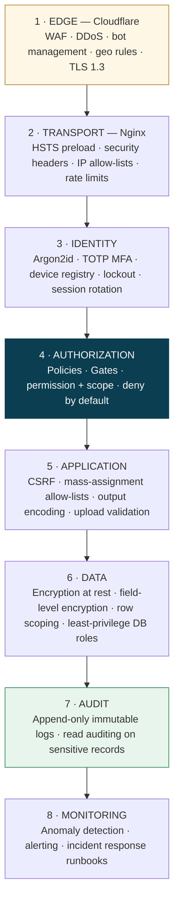
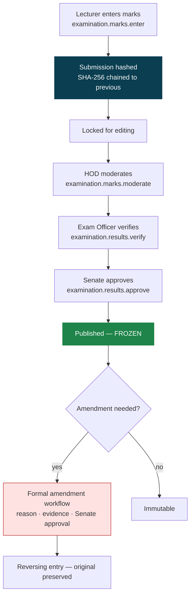

# MEMA ERP — SECURITY & ACCESS CONTROL

**Document:** `PLAN/05-SECURITY-AND-RBAC.md` · **Version:** 1.0.0-PLAN

This system holds grades, fee ledgers, payroll, disciplinary records, counselling notes and clinic records.
The consequences of a breach are regulatory, reputational and personal. Security is Phase 0 work, not
Phase 5 hardening.

---

## 1. Defence in depth

No single layer is trusted. Cloudflare can be bypassed by a direct-to-origin request, so Nginx enforces its
own IP rules; the frontend can be bypassed entirely, so the API validates independently; the application can
have a bug, so the database enforces constraints and least privilege.

---

## 2. Authentication

| Control | Specification |
|---|---|
| Password hashing | Argon2id — memory 64 MB, iterations 4, parallelism 2 |
| Password policy | ≥ 12 characters, breach-list check (k-anonymity HIBP), history of 5, no forced rotation |
| Identifiers | Student number · staff number · email · username — all resolving to one user |
| MFA | TOTP (RFC 6238) + 10 hashed single-use backup codes. **Mandatory** for every privileged role |
| Session | Sanctum SPA cookie, `__Host-` prefix, `HttpOnly`, `Secure`, `SameSite=Lax` |
| Session lifetime | 8 h absolute / 30 min idle for admin; 24 h / 2 h for students |
| Rotation | On login, privilege elevation and MFA completion |
| Lockout | Progressive delay then 15-minute lock after 5 failures; per-account and per-IP |
| Reset | 15-minute single-use token; **identical response and timing** whether the account exists or not |
| Device registry | Named devices, last-seen, remote revocation, new-device notification |
| Impersonation | Break-glass only — reason required, time-limited, banner shown to the impersonator, separately audited, never available for clinic or counselling records |

**No forced password rotation.** Current NIST guidance is explicit that periodic forced rotation degrades
security in practice — users increment a digit. Breach-list checking and MFA deliver far more.

---

## 3. Authorization model

Three orthogonal dimensions. Conflating any two of them is the standard failure.

```mermaid
flowchart LR
    subgraph P["PERMISSION — what"]
        P1["examination.marks.enter"]
        P2["examination.marks.moderate"]
        P3["examination.results.publish"]
        P4["finance.payment.reverse"]
    end
    subgraph R["ROLE — bundle"]
        R1[Lecturer]
        R2[Head of Department]
        R3[Exam Officer]
        R4[Finance Officer]
    end
    subgraph S["SCOPE — bounded to what"]
        S1[Institution]
        S2[Campus]
        S3[Faculty]
        S4[Department]
        S5[Own records only]
    end
    P --> R --> S --> D{"Decision"}
    style D fill:#0A3E50,stroke:#0A3E50,color:#FFFFFF
```

**Why scope must be separate from role.** Every Head of Department holds identical permissions bounded to a
different department. Encoding scope into role names (`hod_computing`, `hod_nursing`, `hod_nursing_kisumu`)
produces a role explosion that becomes unmanageable within a year and makes "who can see this student"
unanswerable. Assignment is therefore `(user, role, scope_type, scope_id)`.

### Permission naming

`{module}.{resource}.{action}` — e.g. `registration.enrollment.approve`, `hr.payroll.run`,
`student.record.view`. Standard actions: `view`, `view_any`, `create`, `update`, `delete`, `restore`,
`approve`, `reject`, `publish`, `export`, `import`, `reverse`.

### Enforcement rules

1. **Deny by default.** No permission means no access. There is no implicit inheritance.
2. **Every endpoint has a Policy.** Including list endpoints — an unprotected index is the most commonly
   missed leak.
3. **Scope filters at the query level.** `Student::query()->withinScope($user)` — never fetch-then-filter.
   Filtering in the response layer leaks row counts and is one refactor away from leaking rows.
4. **Field-level permissions.** A lecturer receives a student's academic record without the fee balance;
   the payload is filtered server-side, not hidden in the UI.
5. **Negative tests are mandatory** (ADR-009). Every endpoint asserts that unauthorised roles are denied.

### Role families

| Family | Examples | Default scope |
|---|---|---|
| Student | Student, Postgraduate, Alumnus | Self |
| Academic | Lecturer, Supervisor, Advisor | Own courses / advisees |
| Academic leadership | HOD, Dean, Director | Department / faculty |
| Registry | Registrar, Admissions Officer, Records Officer | Institution |
| Examinations | Exam Officer, Moderator, Senate Secretary | Faculty / institution |
| Finance | Finance Officer, Bursar, Accountant, Auditor | Institution |
| HR | HR Officer, Payroll Officer | Institution |
| Operations | Librarian, Warden, Security, Clinician, ICT | Functional domain |
| Executive | Vice-Chancellor, DVC, Council | Institution, read-mostly |
| Platform | System Administrator, Security Officer | Institution |

**Segregation of duties, enforced by the system:** the role that enters marks cannot moderate them; the role
that moderates cannot publish; the role that raises a payment voucher cannot approve it; the role that
creates a supplier cannot approve its invoice. These conflicts are configured as mutually exclusive role
pairs and rejected at assignment time — this is standard audit expectation for a public institution.

---

## 4. Data protection

| Class | Examples | Controls |
|---|---|---|
| **Restricted** | Clinic records, counselling notes, disciplinary files | Isolated schema, field-level encryption, dedicated roles, **read events audited**, no admin bypass, no impersonation, break-glass only with committee approval |
| **Confidential** | Grades, fee ledgers, payroll, national IDs, bank details | Encrypted at rest, scoped access, read auditing on grades and payroll, export requires permission and is logged |
| **Internal** | Enrollment, timetables, staff directory | Standard RBAC |
| **Public** | Website content, programme catalogue, verification lookups | No authentication; rate-limited |

**Encryption.** At rest: full-disk plus PostgreSQL-level for restricted schemas; S3 with SSE-KMS.
In transit: TLS 1.3 everywhere including internal service hops. Field-level: Laravel encrypted casts for
national IDs, bank accounts, medical notes — with a documented key rotation procedure, because a rotation
procedure invented during an incident is a second incident.

**Data protection compliance (Kenya Data Protection Act 2019):** lawful basis recorded per processing
activity; data subject access requests supported by an export endpoint; retention schedules enforced by
automated jobs, not by intention; breach notification runbook with named responsibilities and the statutory
72-hour clock; DPIA completed before Phase 4 clinic and counselling modules, not after.

---

## 5. Grade integrity — the catastrophic-risk control

Undetected grade tampering is the single worst outcome available to this system: it invalidates every
qualification the university has issued.

- Each marks submission is hashed and chained to its predecessor, so retrospective alteration of any single
  submission invalidates every subsequent hash and is detectable.
- Segregation of duties across enter → moderate → verify → approve → publish, enforced by role exclusion.
- Published results are frozen. Amendments never overwrite; they create a reversing entry with reason,
  evidence and Senate approval, and the original remains readable.
- Every read of a grade record is audited.
- A nightly integrity job re-verifies the hash chain and alerts on any break.

---

## 6. Application security controls

| Threat | Control |
|---|---|
| SQL injection | Eloquent / parameterised queries only; raw SQL requires review and bound parameters |
| XSS | React escaping by default; `dangerouslySetInnerHTML` banned outside CMS, where content is sanitised server-side with an allow-list |
| CSRF | Laravel CSRF on all cookie-authenticated mutations |
| Mass assignment | Explicit allow-lists on every Form Request; `$guarded = []` is a review rejection |
| IDOR | Every fetch by ID passes through a Policy with scope; UUIDs remove enumeration but are not the control |
| File upload | MIME allow-list + magic-byte verification + size limit + ClamAV scan + stored outside the web root with generated names |
| SSRF | Outbound HTTP only to an allow-list of integration hosts |
| Dependency risk | Dependabot, `composer audit`, `pnpm audit` in CI; Critical/High blocks merge |
| Secrets | Managed store, injected at runtime; `git-secrets` pre-commit; automatic rotation on staff departure |
| DoS | Cloudflare + per-user limits + queue isolation + query timeouts |

---

## 7. Security operations

**Monitoring and alerting on:** repeated failed logins across accounts, logins from unusual geographies,
privilege escalation, bulk exports, out-of-hours admin activity, mass record access, audit-trail write
failures, and grade-hash-chain breaks.

**Testing cadence:** SAST and dependency scanning on every commit; DAST against staging weekly; external
penetration test before each go-live gate and annually thereafter; annual access recertification in which
every role assignment is re-approved by its owner or automatically revoked.

**Incident response:** documented runbook with named roles, severity definitions, the 72-hour statutory
notification clock, forensic preservation steps, and a communication plan. Rehearsed once per year — an
untested incident plan fails at exactly the moment it is needed.
