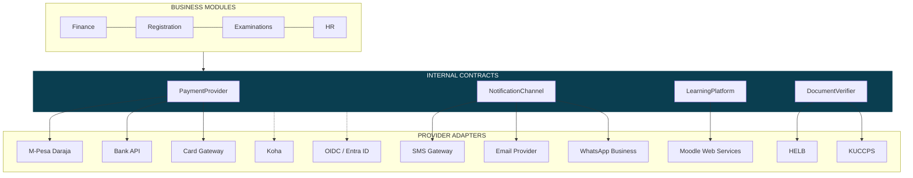
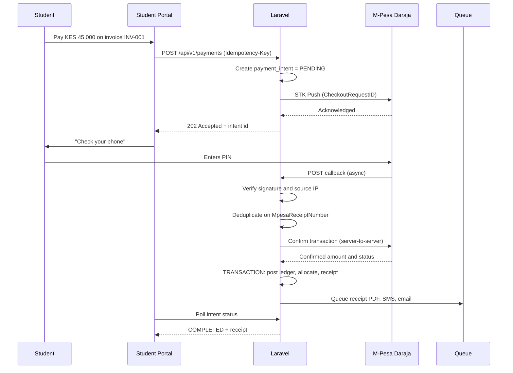
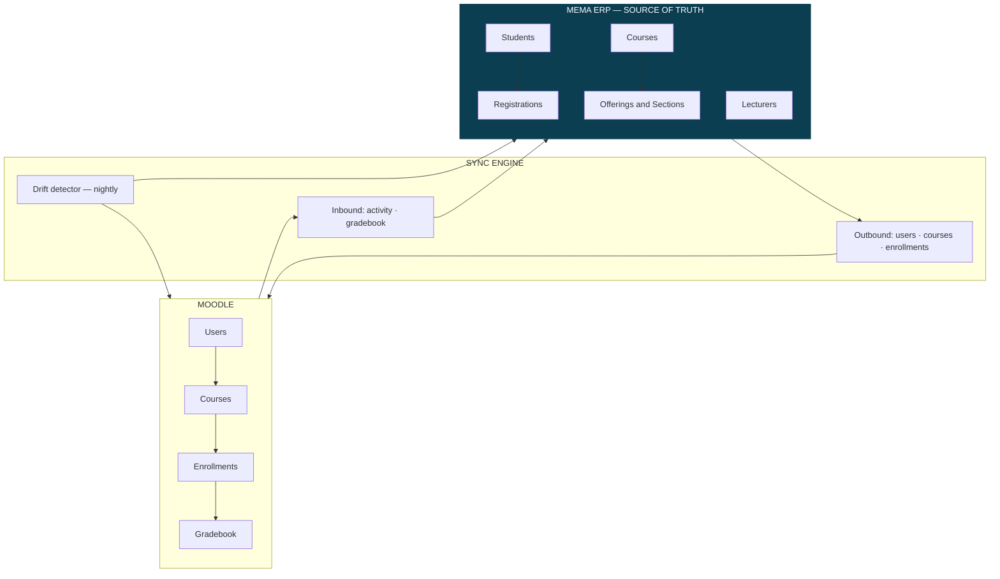

# MEMA ERP — INTEGRATION ARCHITECTURE

**Document:** `PLAN/06-INTEGRATIONS.md` · **Version:** 1.0.0-PLAN

---

## 1. The rule that governs every integration

> **No business module ever talks to an external system directly.** Modules depend on an internal contract;
> a provider adapter implements it.

Scattering M-Pesa calls through Finance, Moodle calls through Registration and SMS calls through twelve
modules is the failure mode that makes ERPs unmaintainable. When the provider changes — and M-Pesa, HELB
and bank APIs all do — the change touches one adapter instead of forty call sites. It also makes every module
testable without network access.



```php
// Finance does not know M-Pesa exists.
interface PaymentProvider {
    public function initiate(PaymentRequest $r): PaymentIntent;
    public function verify(string $providerTransactionId): PaymentVerification;
    public function reverse(string $providerTransactionId, string $reason): ReversalResult;
    public function supports(PaymentMethod $m): bool;
}
```

---

## 2. Integration inventory

| System | Direction | Phase | Criticality | Failure mode if unavailable |
|---|---|---|---|---|
| **M-Pesa Daraja** | Bi-directional | 1 | **Critical** | Students cannot pay fees → cannot register |
| **Bank APIs / statements** | Inbound | 1 | High | Manual reconciliation; degraded not blocked |
| **SMS gateway** | Outbound | 1 | High | Queued and retried; no data loss |
| **Email (SMTP/API)** | Outbound | 1 | High | Queued and retried |
| **KUCCPS** | Inbound | 1 | High (seasonal) | Government placements imported manually |
| **Moodle** | Bi-directional | 2 | High | Sync queue backs up, replays on recovery |
| **HELB** | Bi-directional | 2 | Medium | Loan status stale; manual override available |
| **Koha library** | Bi-directional | 2 | Medium | Clearance falls back to manual confirmation |
| **Biometric devices** | Inbound | 2/3 | Medium | Attendance buffered on device |
| **KRA / NSSF / NHIF** | Outbound | 3 | High (monthly) | Statutory returns filed manually |
| **CUE reporting** | Outbound | 5 | Medium (annual) | Manual compilation |
| **WhatsApp Business** | Outbound | 5 | Low | Falls back to SMS |
| **OIDC / Entra ID** | Bi-directional | 5 | Medium | Local authentication remains available |

---

## 3. M-Pesa — the highest-stakes integration

Fee payment gates registration. If M-Pesa handling is wrong, students cannot register, and the finance office
loses confidence in the system permanently in its first week.



### Non-negotiable rules

1. **Never trust the callback payload's amount.** Always confirm server-to-server before crediting. Callbacks
   can be forged and can be replayed.
2. **Deduplicate on `MpesaReceiptNumber`.** Duplicate callbacks are normal operation, not an edge case.
3. **Verify signature and source IP before parsing the body.**
4. **Respond `200` immediately, process asynchronously.** A slow response causes M-Pesa to retry, multiplying
   the problem.
5. **Log the raw payload verbatim, forever.** Payment disputes are resolved from raw payloads.
6. **The ledger write is synchronous and transactional** (ADR-010). Receipt PDF, SMS and email are queued.
7. **A reconciliation job runs every 15 minutes**, querying M-Pesa for transactions the system has not seen —
   because callbacks *do* get lost, and a student whose payment vanished is a support crisis.
8. **Unmatched payments go to an exception queue with a human review UI.** Never auto-guessed, never dropped.
9. **Paybill account-number parsing is defensive.** Students mistype student numbers constantly; fuzzy
   suggestion in the review UI, never automatic allocation.

**Testing:** nightly contract tests against the Daraja sandbox; a recorded-fixture suite for CI; explicit
tests for duplicate callback, forged callback, lost callback recovered by reconciliation, partial payment,
overpayment, and payment against a settled invoice.

---

## 4. Moodle — the ERP is the source of truth



- **Direction of authority:** identity, course structure and enrollment flow **ERP → Moodle** only. Learning
  activity and formative gradebook data flow **Moodle → ERP** as reference data.
- **Summative grades of record are entered in the ERP.** Importing final grades from Moodle would place the
  transcript's source of truth in a system with weaker audit and approval controls, which defeats the grade
  integrity model in [`05-SECURITY-AND-RBAC.md`](05-SECURITY-AND-RBAC.md) §5.
- **Moodle Web Services only** — never direct database writes. Direct DB manipulation breaks on Moodle
  upgrades and bypasses its own integrity logic.
- **Nightly drift detection** reconciles enrollment counts both ways and alerts on mismatch. Sync systems
  drift silently; without detection, the first symptom is a student unable to access their course in week six.
- **Idempotent, replayable sync jobs** on the dedicated `lms-sync` queue, so a Moodle outage cannot delay
  payment processing.

---

## 5. Notification abstraction

```php
interface NotificationChannel {
    public function send(Recipient $to, RenderedMessage $m): DeliveryResult;
    public function supports(ChannelType $t): bool;
}
```

Modules call `notify($person, new FeeBalanceReminder($invoice))`. They never know whether that becomes SMS,
email, push or WhatsApp. Channel selection follows recipient preference, message urgency and cost policy —
SMS costs money, so bulk non-urgent notices default to email with SMS reserved for deadlines and alerts.

Rules: templates versioned in the database with variable substitution; quiet hours honoured except for
emergencies; opt-out honoured except for statutory and academic notices; delivery status tracked per message;
failures retried with backoff then surfaced for manual action; **all bulk sends require approval above a
configured recipient threshold**, because a mistaken 40,000-recipient SMS is expensive and irreversible.

The interface ships in Phase 0 with stub drivers so modules can integrate against it from day one; the full
engine (MOD-05-06) lands in Phase 5 without any module changing.

---

## 6. Government and regulatory integrations

| System | Notes |
|---|---|
| **KUCCPS** | Seasonal, high-volume placement import. Must handle re-runs, corrections and withdrawals idempotently. Placement data creates prospects, never students directly — admission remains an institutional decision. |
| **HELB** | Loan application status, disbursement notification, sponsor invoicing. Disbursements post to the student ledger through the same allocation path as any other payment — no parallel money path. |
| **KRA / NSSF / NHIF / Housing Levy** | Monthly statutory returns from payroll. Rates are **configuration**, not code — Kenyan statutory rates change and a rate change must never require a deployment. |
| **CUE** | Annual accreditation and statistical returns, generated from the data warehouse. |

---

## 7. Resilience patterns applied to every adapter

| Pattern | Applied |
|---|---|
| **Circuit breaker** | Open after N consecutive failures; fail fast; half-open probe. Prevents a dead provider from exhausting workers |
| **Exponential backoff with jitter** | All retries. Jitter prevents synchronised retry storms |
| **Timeouts** | Connect 5 s, read 30 s. An adapter without a timeout will eventually hang a worker pool |
| **Bulkhead** | Dedicated queue per integration. A Moodle outage cannot delay payments |
| **Idempotency** | Every outbound call carries a key; every inbound event deduplicates |
| **Outbox** | Critical outbound events written in the same transaction as the state change, dispatched separately — no lost events on crash |
| **Dead letter** | Exhausted retries go to a reviewable queue with manual replay |
| **Health checks** | Per-integration status on the ops dashboard with alerting |
| **Contract tests** | Nightly against each provider sandbox — API drift is detected by CI, not by users |
