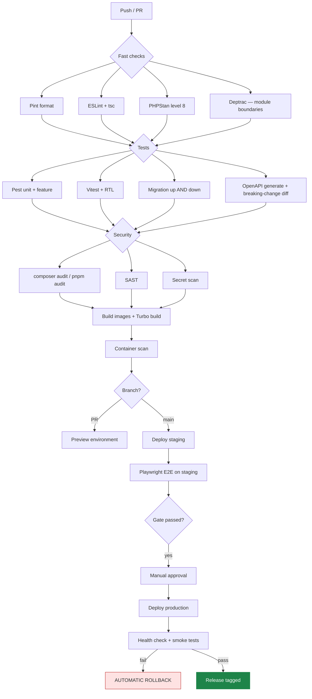
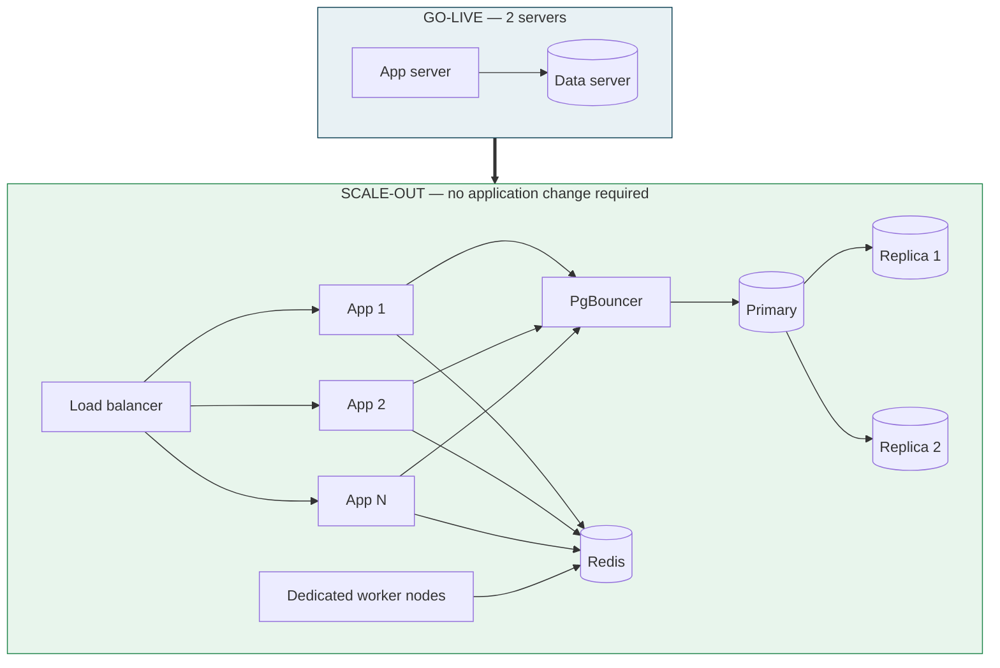

# MEMA ERP — DEVOPS, ENVIRONMENTS & OPERATIONS

**Document:** `PLAN/07-DEVOPS-AND-ENVIRONMENTS.md` · **Version:** 1.0.0-PLAN

---

## 1. Environments

| Environment | Purpose | Data | Access |
|---|---|---|---|
| **Local** | Development | Seeded synthetic | Developers |
| **CI** | Automated verification | Ephemeral per run | Pipeline |
| **Staging** | UAT, training, integration sandboxes | **Anonymised** production copy | Team + client testers |
| **Production** | Live | Real | Restricted, MFA, audited |

Staging is a faithful production replica — same OS, same versions, same Nginx configuration, same TLS. A
staging environment that differs from production tests something other than production.

**Staging data is anonymised.** Names, national IDs, phone numbers, emails, bank details and medical notes are
replaced by a deterministic, referentially-consistent anonymiser. Real student data in a training environment
that dozens of staff access is a data protection breach in waiting — and the anonymiser must be deterministic
so that referential integrity and reproducible bug reports survive.

---

## 2. CI/CD pipeline



**Blocking rules:** any red stage blocks merge; a Critical or High vulnerability blocks; a breaking API change
without a version bump blocks; an irreversible migration blocks; production deployment requires human approval;
a failed post-deploy health check rolls back automatically without waiting for a human.

Production deploys are **not** scheduled during registration windows, examination periods or payroll runs.
This is enforced by a deployment calendar, not by good intentions.

---

## 3. Zero-downtime deployment

```
1. Build and push images (tagged with commit SHA)
2. Run migrations         ← expand only: additive, backwards-compatible
3. Start new app containers alongside old
4. Health check new containers
5. Nginx shifts traffic to new
6. Drain old containers (finish in-flight requests)
7. Restart queue workers gracefully (finish current job, then exit)
8. Smoke tests
9. Stop old containers
```

**Expand/contract migrations.** During a deploy both versions run briefly, so every migration must be
backwards-compatible with the previous code. Renaming a column is: add new → dual-write → backfill → switch
reads → stop writing old → drop old, across several releases. Renaming in one step drops requests on the floor
mid-deploy.

**Queue workers are restarted gracefully** — `horizon:terminate` lets the current job finish. Killing workers
mid-job on a payment queue is how duplicate charges happen.

---

## 4. Production topology and scale-out path

**At go-live: two servers.** Sized for the institution's actual population, not a hypothetical one.

| Server | Role | Indicative spec |
|---|---|---|
| App | Nginx, PHP-FPM, Next.js, Horizon, scheduler | 8 vCPU / 16 GB / 100 GB SSD |
| Data | PostgreSQL 17 primary + replica, Redis, PgBouncer | 8 vCPU / 32 GB / 500 GB NVMe |



Scale-out requires **no application change**, because the app tier is already stateless: sessions in Redis,
files in S3, cache in Redis, queues in Redis. This is the payoff for those Phase 0 choices, and it is why
Kubernetes is unnecessary now (ADR-011) — the horizontal path exists without it.

**Capacity triggers:** app CPU > 70% sustained → add a node. DB CPU > 70% → move reports to replica, then
scale up. Redis memory > 75% → increase or shard. Queue wait > 60 s → add worker capacity.

---

## 5. Observability

| Layer | Tool | Watching |
|---|---|---|
| Metrics | Prometheus + Grafana | CPU, memory, disk, connections, queue depth, request rate, p50/p95/p99 |
| Errors | Sentry | Backend exceptions, all seven frontends, release tracking |
| Logs | Loki + Promtail | Structured JSON, correlation IDs |
| Uptime | External synthetic checks | Every public surface, from outside the network |
| Queues | Horizon | Throughput, wait time, failures |
| Database | pg_stat_statements + exporter | Slow queries, bloat, replication lag, locks |
| Business | Custom Grafana dashboards | Registrations/hour, payment success rate, reconciliation rate, marks submissions |

**Business metrics belong on the same dashboard as infrastructure metrics.** A payment success rate falling
from 99.8% to 94% is an incident even when every server is green — and it is invisible to purely technical
monitoring. This is the difference between monitoring servers and monitoring a university.

### Alert policy

| Severity | Examples | Response |
|---|---|---|
| **P1 — page immediately** | Site down, database down, payment callbacks failing, data loss, security breach | Immediate, 24/7 |
| **P2 — notify on-call** | Queue backlog > 15 min, error rate > 1%, replication lag > 60 s, disk > 85%, integration circuit open | Within 1 hour, business hours+ |
| **P3 — ticket** | Slow queries, disk > 70%, certificate expiring in 21 days, dependency vulnerability | Next working day |

Every alert links to a runbook entry. **An alert without a runbook is deleted or given one** — an alert nobody
knows how to action trains the team to ignore alerts, which is worse than having no alert.

---

## 6. Backup and disaster recovery

| Aspect | Specification |
|---|---|
| Database full backup | Nightly, encrypted (AES-256), offsite |
| WAL archiving | Continuous, 5-minute granularity |
| PITR window | 35 days |
| Object storage | Versioned + cross-region replication |
| Configuration | In Git; secrets in a managed store with its own backup |
| **Restore rehearsal** | **Monthly, timed, documented** |
| RPO | ≤ 5 minutes |
| RTO | ≤ 4 hours |
| DR drill | Full failover exercise in Phase 5 (MOD-05-09), annually thereafter |

Backup verification is automated: nightly, the most recent backup is restored to a scratch instance, row
counts and checksums are compared against production, and the result is reported. **A backup that has never
been restored is a hypothesis, not a backup** — and Gate 0 does not pass on configuration alone.

---

## 7. Operational runbooks (written in Phase 0, not after the first incident)

Registration peak preparation · payment reconciliation failure · Moodle sync backlog · database failover ·
queue worker exhaustion · disk pressure · certificate renewal · emergency exam lockdown · suspected breach ·
rollback procedure · restoring a single deleted record without a full restore · month-end financial close ·
payroll run.

Each runbook: symptoms, diagnosis steps, resolution, escalation path, and post-incident actions.

---

## 8. Handover to Mema University

The engagement ends with the client able to operate the system independently:

- Full source, infrastructure-as-code and documentation transferred
- Secrets rotated and handed over under the client's own control
- Administrator and operator training completed and recorded
- Runbooks validated by client staff **performing them**, not reading them
- A support and maintenance agreement with defined SLAs
- Escrow arrangement if required by the client's procurement policy
