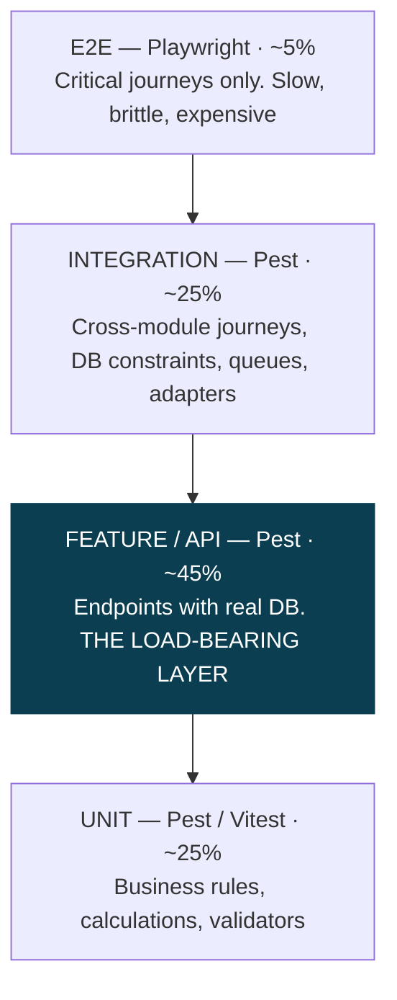

# MEMA ERP — TESTING STRATEGY & QUALITY GATES

**Document:** `PLAN/08-TESTING-AND-QUALITY-GATES.md` · **Version:** 1.0.0-PLAN

---

## 1. Test pyramid, weighted for an ERP



The feature/API layer is deliberately the heaviest. In an ERP, most defects that reach users are not broken
functions — they are wrong authorization, wrong validation, wrong state transitions and wrong queries. Those
live at the endpoint boundary with a real database, which is exactly what this layer exercises. Heavy unit
mocking would pass while the system is broken.

---

## 2. What must be tested, by risk class

| Risk class | Coverage requirement | Rationale |
|---|---|---|
| **Money** — fees, payments, ledger, payroll, GL | **100%**, including reversal, partial, over- and duplicate payment | A financial error is an audit finding and a trust failure |
| **Grades** — marks, moderation, GPA, progression, transcripts | **100%**, including amendment, hash-chain integrity, approval sequence | Grade errors invalidate qualifications |
| **Authorization** — every endpoint | **100% negative**: each role asserted denied | Untested authorization is the most common catastrophic ERP breach |
| **Registration** — capacity, prerequisites, clearance | **100%**, including concurrency | Peak-load failure is highly visible and time-boxed |
| Business rule services | ≥ 85% | |
| Everything else | ≥ 70% | |

### Negative authorization testing (ADR-009)

```php
it('denies access across the role matrix', function (string $role, int $expected) {
    actingAs(userWithRole($role))
        ->getJson("/api/v1/students/{$otherDepartmentStudent->id}")
        ->assertStatus($expected);
})->with([
    ['student',          404],  // 404 not 403 — must not confirm existence
    ['lecturer',         404],  // outside their department
    ['hod_other_dept',   404],
    ['hod_own_dept',     200],
    ['registrar',        200],
    ['finance_officer',  200],
    ['clinician',        404],
]);
```

Positive tests prove a feature works. Negative tests prove the system is safe. Only the second class carries
institutional risk, and only the second class is routinely omitted.

---

## 3. Critical end-to-end journeys (Playwright)

Few, but each one covers a full revenue- or qualification-bearing path:

1. **Applicant → graduate.** Apply, upload documents, pay application fee, receive offer, accept, matriculate,
   register, be timetabled, sit assessments, receive grades, progress, graduate, download transcript.
2. **Fee payment.** Invoice → M-Pesa (sandbox) → callback → ledger → receipt → registration unblocked.
3. **Marks lifecycle.** Enter → moderate → verify → approve → publish → student sees result → amendment
   workflow.
4. **Registration under contention.** Concurrent enrollment into a section with one remaining seat; exactly
   one succeeds.
5. **Payroll run.** Compute → approve → payslips → bank file → GL posting.
6. **Clearance.** Student request → multi-department approval → final clearance → transcript release.

Run on every merge to `main` against staging; a failure blocks production deployment.

---

## 4. Performance testing

Load tests are written **before** the gate, run against staging with production-shaped data volumes.

| Scenario | Target | Gate |
|---|---|---|
| Course registration | 5,000 concurrent, p95 < 1 s, **zero oversubscription** | 1 |
| Student portal dashboard | 2,000 concurrent, p95 < 500 ms | 1 |
| Results publication | 20,000 results published in < 5 min | 1 |
| Payment callbacks | 100/s sustained, zero loss | 1 |
| Admin student list + filters | p95 < 800 ms on 50,000 rows | 1 |
| Transcript generation | 1,000 PDFs in < 10 min | 1 |
| Moodle full sync | 40,000 enrollments in < 30 min | 2 |
| Payroll run | 2,000 employees in < 5 min | 3 |
| BI dashboard | p95 < 2 s on 5 years of data | 5 |

Tested at **2× expected peak**. A system that only just handles expected peak fails on the day enrollment is
extended by 24 hours and everyone registers at once.

---

## 5. Data integrity testing

Continuous automated assertions in production, not just in CI:

- Every student ledger's derived balance equals the sum of its ledger entries
- Every GL account balances; subsidiary ledgers reconcile to control accounts
- No enrollment exists without a valid registration
- No grade exists without an enrollment
- No student exists without a person
- No orphaned records across any foreign key
- Marks hash chain verifies end to end
- Moodle enrollment counts match ERP counts
- No duplicate `national_id` across persons

Failures alert immediately. **Integrity drift found by a nightly assertion is a bug; found by a student, it is
an incident; found by an auditor, it is a finding.**

---

## 6. Accessibility and browser support

WCAG 2.2 AA on every user-facing surface — a hard acceptance criterion in SRSD §28 of every module, and a
legal expectation for a public institution.

Automated axe-core in CI blocks on violations; manual keyboard-only and screen-reader passes per module
(NVDA and VoiceOver); contrast verified against the brand palette; forms tested with labels, error
association and focus management.

Support: latest two versions of Chrome, Firefox, Safari and Edge; Android Chrome and iOS Safari. **The student
portal is tested on low-end Android over throttled 3G** — that is what a large share of students actually use,
and a portal that only performs on a developer's laptop excludes them.

---

## 7. UAT

Per module, with the department that owns it — Registry for admissions and records, Finance for fees, Deans
and HODs for examinations, HR for payroll.

Conducted on staging with anonymised realistic data, against scripted scenarios drawn from SRSD §31 plus free
exploration. Defects triaged: **Critical/High block the gate**; Medium is scheduled; Low goes to backlog.
Sign-off is written and by name.

---

## 8. Gate summary

| Gate | Blocking criteria |
|---|---|
| **0** | 10-minute clean-clone setup · CI enforced · auth pen test clean · audit immutability proven · **restore rehearsed and timed** · staging faithful |
| **1** | Full lifecycle run with zero anomalies · reconciliation ≥ 99.8% · 5,000-concurrent registration p95 < 1 s with zero oversubscription · migration reconciles exactly · Registrar signs off transcripts · WCAG 2.2 AA · staff trained · rollback rehearsed |
| **2** | Moodle 100% daily reconciliation with drift detection · full-term attendance captured · paperless clearance end to end · counselling/disciplinary access review passed |
| **3** | Two payroll cycles reconcile to the cent · GL balances to every subsidiary ledger · statutory returns accepted · external audit walkthrough passed |
| **4** | PG cohort tracked through a real viva · Senate resolutions traced to closure · **clinic EHR isolation independently verified** |
| **5** | DR failover drill meets RTO/RPO · AI assistant passes adversarial leakage review · mobile apps published · runbooks validated by client staff performing them · handover complete |
