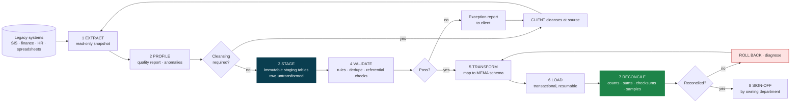
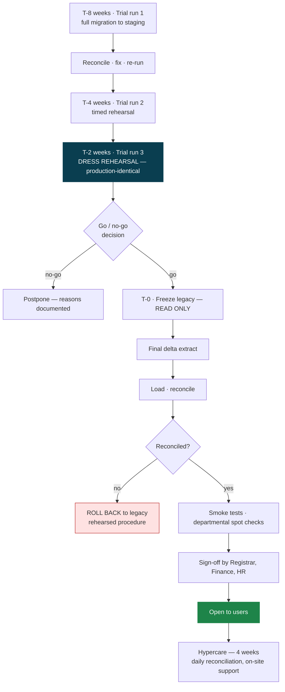

# MEMA ERP — DATA MIGRATION & CUTOVER

**Document:** `PLAN/09-DATA-MIGRATION-AND-CUTOVER.md` · **Version:** 1.0.0-PLAN

> Data migration is the highest-probability cause of a failed ERP programme. The software usually works.
> What fails is arriving at go-live with student records that do not reconcile, fee balances nobody trusts,
> and historical transcripts that cannot be reproduced.

---

## 1. Principles

1. **Migration starts in Phase 0, not Phase 1.** Profiling legacy data early determines how much cleansing
   the institution must do — and cleansing is *their* work, on *their* timeline, and it is always slower than
   expected. Discovering in month five that 8,000 student records lack a national ID is a schedule failure.
2. **The legacy system is not authoritative about its own quality.** Assume duplicates, orphans, inconsistent
   formats, free-text where enums belong, and balances that do not sum.
3. **Migration is reversible until cutover is signed off.** Every run is repeatable from scratch.
4. **Every record carries provenance.** `legacy_system`, `legacy_id`, `migrated_at` on every migrated row —
   so any disputed record can be traced to its source three years later.
5. **Reconciliation is the deliverable.** Not "the data loaded" — "the data loaded and provably matches."

---

## 2. Pipeline

**Staging tables are immutable and hold raw extracted data.** Transformation reads from staging and writes to
the target. This means a transformation bug is fixed and re-run without re-extracting — and without a second
outage window on the legacy system. Transforming during extract is the mistake that turns a three-hour cutover
into a three-day one.

---

## 3. Migration scope by wave

| Wave | Data | Volume (est.) | Difficulty | Notes |
|---|---|---|---|---|
| **1** | Institutional structure, programmes, curricula, courses | Hundreds | Low | Often partly re-keyed; curricula are frequently only in documents |
| **2** | Persons and students (active) | Thousands | **High** | Deduplication is the hard part |
| **3** | Historical students and alumni | Tens of thousands | **High** | Needed for transcript reissue — a lifetime obligation |
| **4** | Academic history — enrollments, marks, grades, GPAs | Hundreds of thousands | **Critical** | Must reproduce historical transcripts exactly |
| **5** | Financial — balances, invoices, payments | Tens of thousands | **Critical** | Must reconcile to the cent |
| **6** | Staff and HR | Thousands | Medium | Payroll history needed for statutory continuity |
| **7** | Documents and scans | Large volume | Medium | Bulk transfer to object storage with metadata mapping |

### The two hardest problems

**Deduplication.** The same human exists multiple times in legacy systems — a student who deferred and
re-registered, a staff member also enrolled in a programme, name spelling variants. Strategy: deterministic
match on national ID/passport first; probabilistic match on name + DOB + programme for the remainder; every
probabilistic match reviewed by a human through a purpose-built merge UI; all merges audited and reversible.
Never auto-merge on a fuzzy match — a wrongly merged pair of students is far more damaging than a duplicate.

**Historical transcript fidelity.** Grading scales, credit definitions and progression rules change over time.
A 2015 graduate's transcript must reproduce with 2015's rules. Therefore: grading schemes are versioned with
effective dates, historical results store the scheme version that produced them, and migration attaches the
correct historical version rather than applying today's rules retroactively. Validation is direct comparison
against a sample of known-correct issued transcripts.

---

## 4. Reconciliation requirements

Automated, repeatable, reported. Not a spreadsheet exercise.

| Check | Requirement |
|---|---|
| Record counts | Exact match per entity, per status |
| Financial totals | **To the cent** — total receivables, total received, per-student balances |
| GPA recomputation | Recomputed GPAs match legacy values for a statistically significant sample |
| Transcript reproduction | Byte-comparable content against a sample of issued transcripts |
| Referential integrity | Zero orphans across every foreign key |
| Duplicate detection | Zero duplicate national IDs, student numbers or staff numbers |
| Sample audit | 100 records per entity manually verified by the owning department |
| Provenance | 100% of migrated rows carry `legacy_system` and `legacy_id` |

**Any unexplained variance blocks cutover.** Not "investigate later" — an unexplained variance at go-live is a
variance that will be discovered by a student or an auditor instead.

---

## 5. Cutover

**Three trial runs minimum.** The third is a full dress rehearsal against a production-identical environment,
executed by the people who will execute the real one, and timed — so the cutover window is a measurement
rather than an estimate.

**Timing.** Cutover lands in a **semester break**, never during registration, examinations or a payroll cycle.
The general ledger cuts over at a **financial-year boundary** — this constraint outranks the sprint calendar
(see [`00-EXECUTION-PLAN.md`](00-EXECUTION-PLAN.md) §5).

**Rollback is a rehearsed procedure with a named decision-maker and a hard decision deadline** inside the
cutover window. A rollback plan that has never been executed is not a plan.

**Legacy stays read-only-available for 12 months** post-cutover for dispute resolution and audit.

**Hypercare:** four weeks of daily reconciliation reports, on-site support in Registry and Finance, a
dedicated triage channel, and daily standups with the client. Most migration defects surface in the first two
weeks of real use, not in testing.

---

## 6. Client responsibilities (state these early and in writing)

| Responsibility | Why it must be the client's | When |
|---|---|---|
| Data cleansing at source | Only the institution knows which of two conflicting records is correct | Phase 0 → Phase 1 |
| Providing legacy access, schemas and documentation | | Phase 0, week 1 |
| Defining historical grading scales and progression rules | Institutional policy, not a technical fact | Phase 1, before Sprint 14 |
| Confirming fee structures and historical balances | | Phase 1, before Sprint 11 |
| Departmental sign-off on reconciliation | Accountability must sit with the record owner | Per wave |
| Go/no-go decision | | Cutover |

> Data cleansing is chronically underestimated by clients. Surface the profiling report in Phase 0 with a
> concrete count of affected records and a named owner per data domain. A cleansing effort that starts in
> month five will not finish before go-live.
