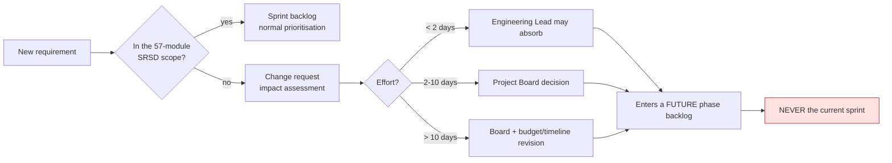

# MEMA ERP — DELIVERY GOVERNANCE

**Document:** `PLAN/10-DELIVERY-GOVERNANCE.md` · **Version:** 1.0.0-PLAN

---

## 1. Team shape

Sized for 57 modules over 24 months. Understaffing this programme does not make it cheaper — it makes it
longer and worse.

| Role | FTE | Phases | Responsibility |
|---|---|---|---|
| Engineering Lead / Architect | 1.0 | All | Architecture, ADRs, review standards, technical escalation |
| Backend Engineers (Laravel) | 3–4 | All | Modules, API, business logic, integrations |
| Frontend Engineers (Next.js) | 2–3 | All | Seven apps, design system, accessibility |
| Full-stack Engineer | 1 | 2+ | Flex capacity, integrations |
| DevOps / SRE | 1 | All | Pipeline, environments, monitoring, backups, security ops |
| QA Engineer | 1–2 | 1+ | Test automation, E2E, performance, UAT coordination |
| Data Engineer | 1 | 0–1, 5 | Migration, reconciliation, warehouse and ETL |
| UI/UX Designer | 1 | 0–2, then part-time | Design system, flows, usability, accessibility |
| Business Analyst | 1 | All | Requirements clarification, UAT scripts, client liaison |
| Project Manager | 1 | All | Schedule, risk, decisions, reporting |
| Change Manager / Trainer | 0.5–1 | 1+ | Training, adoption, documentation |
| Security Specialist | 0.3 | 0, then per gate | Reviews, pen tests, compliance |

**Peak ≈ 13 FTE** across Phases 1–3.

### Client-side, and this is not optional

| Role | Commitment | Why it fails without them |
|---|---|---|
| Executive Sponsor (DVC or Registrar) | 4 h/week | Unblocks cross-departmental deadlock; nobody else can |
| Project Board | Monthly | Phase gates, budget, scope changes |
| Module Owners (Registry, Finance, HR, Exams, ICT…) | 8 h/week during their phase | Requirements, decisions, UAT, sign-off |
| ICT Team | 50% from Phase 3 | Knowledge transfer for post-handover operation |
| Data Owners | Heavy in Phase 0–1 | Data cleansing — cannot be delegated to the vendor |

> ERP programmes fail on client-side availability far more often than on engineering. A module owner who
> cannot give eight hours a week during their phase will not have a working module, regardless of the
> engineering effort spent.

---

## 2. Cadence

| Ceremony | Frequency | Participants | Output |
|---|---|---|---|
| Daily standup | Daily, 15 min | Delivery team | Blockers surfaced same day |
| Sprint planning | Fortnightly, 2 h | Team + BA + module owner | Committed sprint scope |
| Sprint review / demo | Fortnightly, 1 h | Team + client stakeholders | Working software demonstrated, feedback captured |
| Retrospective | Fortnightly, 1 h | Delivery team | Two committed improvements |
| Backlog refinement | Weekly, 1 h | Lead + BA + module owner | Next sprint ready |
| Architecture review | Weekly, 1 h | Lead + engineers | ADRs, design decisions |
| Client steering | Monthly, 1.5 h | PM + sponsor + board | Status, risk, decisions |
| Phase gate review | Per phase | Everyone | Formal go/no-go |
| Security review | Per gate | Security + lead | Sign-off |

**Every sprint review demonstrates working software in staging.** Never slides. A demo of slides is a report;
a demo of software is evidence.

---

## 3. Decision-making

| Decision type | Owner | Escalation |
|---|---|---|
| Technical implementation | Engineering Lead | — |
| Architecture / ADR | Engineering Lead | Project Board if cost-bearing |
| Business rule interpretation | Module Owner | Executive Sponsor |
| Cross-departmental conflict | Executive Sponsor | Project Board |
| Scope change | Project Board | — |
| Budget or timeline change | Project Board | University Council |
| Go/no-go at a gate | Project Board | — |

**Decision SLA: 5 working days.** Open decisions are tracked in [`12-OPEN-DECISIONS.md`](12-OPEN-DECISIONS.md)
with a named owner and a due date, and are reported at every steering meeting. Beyond 5 days, the PM escalates
to the sponsor automatically — not as a complaint, as process.

Unmade decisions are the most common silent cause of schedule slip: work does not stop visibly, it proceeds on
an assumption that is later found wrong and rebuilt.

---

## 4. Change control

**Nothing enters a sprint that is already committed.** Mid-sprint insertion is the mechanism by which a
24-month programme becomes a 36-month one, one small favour at a time. Every accepted change carries an
explicit impact statement covering cost, schedule and what it displaces.

---

## 5. Reporting

**Weekly** (PM → sponsor, one page): sprint progress, completed, in progress, blockers, decisions awaited,
risks changed.

**Monthly** (steering pack): phase progress against plan, budget burn vs earned value, risk register changes,
gate readiness, decision log, next-month plan.

**Per gate** (formal): criteria met with evidence, test and performance results, security sign-off, UAT
sign-off, defects by severity, go/no-go recommendation.

### Metrics that are actually tracked

| Metric | Why it matters |
|---|---|
| Modules complete vs planned | Schedule truth |
| Requirements traceability coverage | Are we building what was specified |
| Defect escape rate to UAT | Quality of internal testing |
| Critical/High defects open | Gate readiness |
| Test coverage on money/grade/auth paths | Risk exposure |
| Decision latency (days open) | The most common hidden cause of slip |
| Client-side availability vs commitment | The most common hidden cause of failure |
| Build and deploy frequency and failure rate | Engineering health |

---

## 6. Definition of Ready / Done

**Ready** (a story may enter a sprint when): the SRSD section is reviewed and understood; acceptance criteria
are written and testable; dependencies are in production; the module owner is available for questions; API
contract implications are identified; UI design exists where needed; open decisions affecting it are closed.

**Done** — the eleven-point definition in [`00-EXECUTION-PLAN.md`](00-EXECUTION-PLAN.md) §10. A story is not
done because it works.

---

## 7. Quality culture

| Practice | Standard |
|---|---|
| Code review | Every PR; two approvals for money, grades or permissions |
| Pairing | Mandatory on complex domain logic — no single owner of a domain |
| Documentation | Written as part of the story, never "after" |
| Tech debt | 10% of every sprint reserved; a named debt register |
| Refactoring | Continuous and in-sprint; never a separate deferred project |
| Post-incident review | Blameless, within 48 hours, with committed actions |
| Knowledge sharing | Fortnightly internal tech talk; rotate module ownership |

**10% of every sprint on technical debt is a floor, not an aspiration.** Over 24 months, a team that defers
debt entirely arrives at Phase 4 unable to move — and Phase 4 and 5 are precisely where the accumulated
coupling of 40 prior modules is felt.
