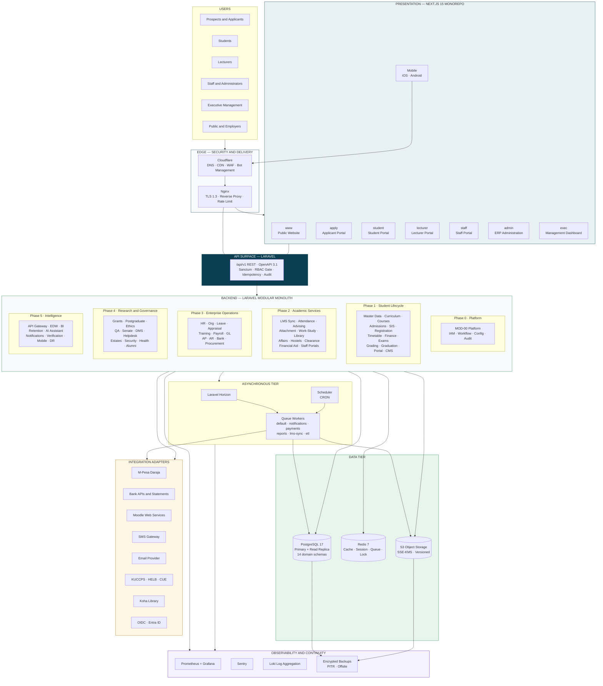
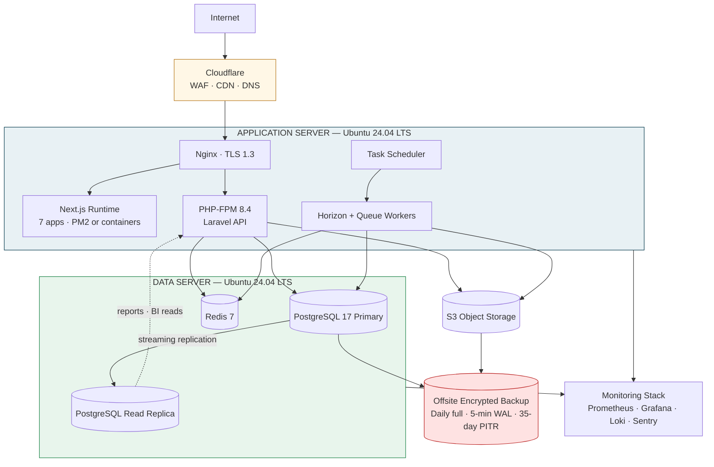
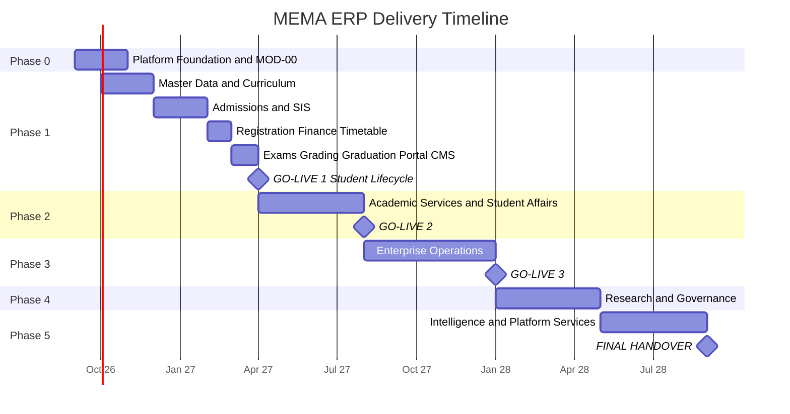

# MEMA ERP — Integrated University ERP & Student Information Management System

**Client:** Mema University
**System:** MEMA ERP / UMIS
**Deployment model:** Single-university production platform, architected for later multi-tenant SaaS extraction
**Baseline:** `1.0.0-PROD-SPEC` (requirements) · `1.0.0-PLAN` (delivery plan)
**Plan date:** 22 August 2026

---

## 1. What this repository contains

| Path | Purpose |
|---|---|
| [`README.md`](README.md) | This file — system overview, master architecture diagram, navigation |
| [`PLAN/`](PLAN/) | The delivery plan: phases, architecture decisions, standards, governance |
| [`DIAGRAMS/`](DIAGRAMS/) | Mermaid diagram set — system landscape plus one diagram per module |
| [`docs/UNIVERSITY-ERP-SRSD/`](docs/UNIVERSITY-ERP-SRSD/) | The 57-module Software Requirements & Specification Document set |

**Start here:**

1. [`PLAN/00-EXECUTION-PLAN.md`](PLAN/00-EXECUTION-PLAN.md) — the phased build plan
2. [`PLAN/01-ARCHITECTURE-DECISIONS.md`](PLAN/01-ARCHITECTURE-DECISIONS.md) — the ADRs that fix the stack
3. [`PLAN/12-OPEN-DECISIONS.md`](PLAN/12-OPEN-DECISIONS.md) — **decisions required from Mema University before Sprint 1**
4. [`PLAN/13-SRSD-GAP-AUDIT.md`](PLAN/13-SRSD-GAP-AUDIT.md) — defects found in the existing SRSD and how they are being closed

---

## 2. Scope in one page

MEMA ERP is a **modular monolith** Laravel backend exposing a single versioned REST API, consumed by
**seven independently deployed Next.js applications**, backed by **one PostgreSQL database** organised
into domain schemas.

- **57 specified modules** across **6 delivery phases** (Phase 0 platform foundation + Phases 1–5 business modules)
- **~24 months** to full institutional coverage; **first production go-live at Month 6** (student lifecycle spine)
- **One deployment, one database, one API** — with domain boundaries strict enough that Finance, Examinations
  or HR can be extracted into services later without a rewrite

### The canonical student lifecycle spine

Everything else in the system hangs off this backbone. If this spine is correct, the rest is additive.

```mermaid
flowchart LR
    P[Prospect] --> A[Applicant]
    A --> O[Offer Holder]
    O --> S[Matriculated Student]
    S --> R[Registered / Enrolled]
    R --> AS[Assessed]
    AS --> G[Graded and Progressed]
    G --> GR[Graduand]
    GR --> AL[Alumnus]

    style P fill:#E8F1F4,stroke:#0A3E50,color:#0A3E50
    style S fill:#0A3E50,stroke:#0A3E50,color:#FFFFFF
    style GR fill:#1E8449,stroke:#1E8449,color:#FFFFFF
    style AL fill:#E8F5EC,stroke:#1E8449,color:#1E8449
```

> **Architectural rule:** one immutable `Person` record carries an individual across every stage above.
> A prospect who becomes a student who becomes a staff member who becomes an alumnus is **one person row**,
> never four profiles. See [`PLAN/03-DATA-ARCHITECTURE.md`](PLAN/03-DATA-ARCHITECTURE.md).

---

## 3. Full system architecture

---

## 4. Technology stack (authoritative)

Fixed by ADR-001 through ADR-012 in [`PLAN/01-ARCHITECTURE-DECISIONS.md`](PLAN/01-ARCHITECTURE-DECISIONS.md).

| Layer | Technology | Notes |
|---|---|---|
| Frontend framework | Next.js 15 (App Router), React 19, TypeScript strict | 7 apps in one Turborepo |
| Styling / UI | Tailwind CSS 4 + shadcn/ui + Radix primitives | Shared `packages/ui` design system |
| Server state | TanStack Query v5 | No global client store for server data |
| Tables | TanStack Table v8 | Server-driven pagination, sort, filter |
| Forms | React Hook Form + Zod | Zod schemas generated from OpenAPI |
| Charts | Apache ECharts | MIS/BI dashboards |
| Backend | Laravel 12, PHP 8.4 | Modular monolith, `nwidart/laravel-modules` layout |
| API | REST/JSON, `/api/v1`, OpenAPI 3.1 | Contract-first, spec generated from code |
| Auth | Laravel Sanctum (SPA cookie mode) + TOTP MFA | OIDC/SAML added in Phase 5 |
| Authorization | Policies + Gates over granular permission catalogue | `module.resource.action` |
| Database | PostgreSQL 17 | 14 domain schemas, one database |
| Cache / session / lock | Redis 7 | Separate logical DBs per concern |
| Queue | Laravel Queue + Horizon on Redis | 6 named queues with isolated workers |
| Object storage | S3-compatible (MinIO dev, provider prod) | SSE-KMS, versioning, lifecycle rules |
| Search | PostgreSQL full-text search | OpenSearch deferred to Phase 5 |
| PDF | Dompdf (simple) · Browsershot (fidelity) | Transcripts, certificates, invoices |
| Spreadsheets | Laravel Excel | Bulk import/export |
| Payments | M-Pesa Daraja behind a provider abstraction | Bank and card providers pluggable |
| LMS | Moodle Web Services | ERP is the academic source of truth |
| Containers | Docker + Docker Compose | Same images dev → prod |
| Web server | Nginx | TLS termination, static, proxy |
| OS | Ubuntu Server 24.04 LTS | |
| Edge | Cloudflare | DNS, CDN, WAF, rate limiting |
| CI/CD | GitHub Actions | Lint → test → scan → build → deploy → health check |
| Monitoring | Prometheus + Grafana | Infra and app metrics |
| Errors | Sentry | Backend and all frontends |
| Logs | Loki + Promtail | Centralised, structured JSON |

**Deliberately excluded at this stage:** Kubernetes, Kafka, MongoDB, GraphQL, microservices, per-module frontend
frameworks. Each adds operational cost without proportional benefit for a single institution. Rationale and the
trigger conditions that would reverse each exclusion are recorded in ADR-011.

---

## 5. Deployment topology

Two servers at go-live. The horizontal scale-out path (load balancer, N stateless app nodes, Patroni-managed
PostgreSQL cluster) is documented in [`PLAN/07-DEVOPS-AND-ENVIRONMENTS.md`](PLAN/07-DEVOPS-AND-ENVIRONMENTS.md)
and requires no application change, because the app tier is already stateless.

---

## 6. Domain map — how the modules relate

```mermaid
flowchart TB
    M00["MOD-00<br/>Platform · IAM · Workflow · Audit"]

    subgraph FOUND["FOUNDATION"]
        MD["MOD-01-02 Master Data"]
        CUR["MOD-01-03 Curriculum"]
        CRS["MOD-01-04 Courses"]
    end

    subgraph LIFECYCLE["STUDENT LIFECYCLE"]
        ADM["MOD-01-05 Admissions"]
        SIS["MOD-01-06 Student Records"]
        REG["MOD-01-07 Registration"]
        TT["MOD-01-08 Timetable"]
        FIN["MOD-01-09 Student Finance"]
        EXM["MOD-01-10 Assessment and Exams"]
        GPA["MOD-01-11 Grading and Progression"]
        GRD["MOD-01-12 Graduation and Transcripts"]
    end

    subgraph EXPERIENCE["EXPERIENCE LAYER"]
        SPT["MOD-01-13 Student Portal"]
        CMS["MOD-01-14 CMS and Public Website"]
        LSP["MOD-02-11 Lecturer and Staff Portals"]
        MOB["MOD-05-08 Mobile App"]
    end

    subgraph SERVICES["ACADEMIC SERVICES"]
        LMS["MOD-02-01 LMS Sync"]
        ATT["MOD-02-02 Attendance"]
        ADV["MOD-02-03 Advising"]
        IAT["MOD-02-04 Attachment"]
        WST["MOD-02-05 Work-Study"]
        LIB["MOD-02-06 Library"]
        SAF["MOD-02-07 Student Affairs"]
        HOS["MOD-02-08 Accommodation"]
        CLR["MOD-02-09 Requests and Clearance"]
        AID["MOD-02-10 Financial Aid"]
    end

    subgraph ENTERPRISE["ENTERPRISE OPERATIONS"]
        HR["MOD-03-01 to 03-05 HR"]
        PAY["MOD-03-06 Payroll"]
        GL["MOD-03-07 General Ledger"]
        APR["MOD-03-08 to 03-10 AP · AR · Bank"]
        PRC["MOD-03-11 Procurement and Stores"]
    end

    subgraph RESEARCH["RESEARCH AND GOVERNANCE"]
        GRT["MOD-04-01 to 04-03 Research"]
        QA["MOD-04-04 to 04-05 QA and Senate"]
        DMS["MOD-04-06 to 04-10 DMS · ICT · Estates · Security · Health"]
        ALU["MOD-04-11 Alumni"]
    end

    subgraph BI["INTELLIGENCE"]
        GWY["MOD-05-01 API Gateway"]
        EDW["MOD-05-02 Data Warehouse"]
        DASH["MOD-05-03 Executive BI"]
        RISK["MOD-05-04 Retention Engine"]
        AI["MOD-05-05 AI Assistant"]
        NOT["MOD-05-06 Notifications"]
        VER["MOD-05-07 Public Verification"]
        DR["MOD-05-09 Continuity and DR"]
    end

    M00 --> FOUND
    M00 --> LIFECYCLE
    M00 --> ENTERPRISE
    MD --> CUR --> CRS --> ADM --> SIS --> REG
    REG --> TT
    REG --> FIN
    REG --> EXM --> GPA --> GRD --> ALU
    SIS --> SPT
    CMS --> ADM
    REG --> LMS
    REG --> ATT
    SIS --> ADV
    SIS --> HOS
    FIN --> AID
    FIN --> GL
    HR --> PAY --> GL
    PRC --> GL
    HR --> TT
    LIFECYCLE --> EDW
    ENTERPRISE --> EDW
    EDW --> DASH
    EDW --> RISK
    ATT --> RISK
    GRD --> VER
    NOT --> SPT
    NOT --> LSP
    GWY --> INTEGX[External Partners]

    style M00 fill:#0A3E50,stroke:#0A3E50,color:#FFFFFF
    style LIFECYCLE fill:#E8F1F4,stroke:#0A3E50
    style ENTERPRISE fill:#E8F5EC,stroke:#1E8449
    style BI fill:#F5F3FF,stroke:#5B21B6
```

### Per-module diagrams

One mermaid diagram for every module, showing that module's actual inputs, internal flow, outputs and
downstream consumers:

| File | Contents |
|---|---|
| [`DIAGRAMS/00-SYSTEM-LANDSCAPE.md`](DIAGRAMS/00-SYSTEM-LANDSCAPE.md) | Context, container, request lifecycle, security layers, money and academic data flows |
| [`DIAGRAMS/PHASE-00-PLATFORM.md`](DIAGRAMS/PHASE-00-PLATFORM.md) | MOD-00 platform umbrella — 5 sub-modules |
| [`DIAGRAMS/PHASE-01-MODULES.md`](DIAGRAMS/PHASE-01-MODULES.md) | 14 modules — student lifecycle spine |
| [`DIAGRAMS/PHASE-02-MODULES.md`](DIAGRAMS/PHASE-02-MODULES.md) | 11 modules — academic services & student affairs |
| [`DIAGRAMS/PHASE-03-MODULES.md`](DIAGRAMS/PHASE-03-MODULES.md) | 11 modules + 3 proposed — enterprise operations |
| [`DIAGRAMS/PHASE-04-MODULES.md`](DIAGRAMS/PHASE-04-MODULES.md) | 11 modules — research & governance |
| [`DIAGRAMS/PHASE-05-MODULES.md`](DIAGRAMS/PHASE-05-MODULES.md) | 9 modules — intelligence & platform services |

All 109 mermaid diagrams in this repository are parse-validated against the mermaid engine.

---

## 7. Phase summary

| Phase | Window | Modules | Outcome |
|---|---|---|---|
| **Phase 0 — Platform Foundation** | Months 1–2 | MOD-00 (5 sub-modules) | Repo, CI/CD, environments, IAM, RBAC, workflow engine, audit, notifications skeleton. Nothing business-facing ships without this. |
| **Phase 1 — Student Lifecycle** | Months 2–7 | 14 | **First go-live.** Master data → curriculum → admissions → SIS → registration → timetable → fees → exams → grading → graduation → student portal → website/CMS. |
| **Phase 2 — Academic Services** | Months 8–11 | 11 | LMS sync, attendance, advising, attachment, library, hostels, welfare, clearance, financial aid, staff portals. |
| **Phase 3 — Enterprise Operations** | Months 12–16 | 11 | HR, payroll, general ledger, AP/AR, bank reconciliation, procurement, stores, assets. |
| **Phase 4 — Research & Governance** | Months 17–20 | 11 | Grants, postgraduate, ethics, QA, Senate, DMS, helpdesk, estates, security, health, alumni. |
| **Phase 5 — Intelligence & Platform** | Months 21–24 | 9 | API gateway, data warehouse, executive BI, retention engine, AI assistant, notifications, verification, mobile, DR. |

Sprint-level detail, gate criteria and dependency ordering: [`PLAN/00-EXECUTION-PLAN.md`](PLAN/00-EXECUTION-PLAN.md).

---

## 8. Non-negotiable engineering principles

1. **Transactional truth over asynchronous convenience.** Money, grades, registrations and academic records
   commit inside a single PostgreSQL transaction. Queues carry side effects (email, SMS, PDF, LMS sync), never
   the record of truth.
2. **One person, one identity.** A `persons` row is created once and referenced by applicant, student, employee
   and alumnus records. Duplicate-profile architectures are rejected at review.
3. **Configuration over code.** Grading scales, fee structures, graduation rules, approval matrices and workflow
   definitions live in versioned database tables. A policy change is a data change, not a deployment.
4. **Every mutation is audited.** Append-only audit rows capturing actor, timestamp, IP, reason code and a
   before/after JSON diff. Enforced by a base model trait, not by developer discipline.
5. **The API is the contract.** Next.js implements no business rule. If a rule is not in Laravel, it does not exist.
6. **Nothing is deployed that is not tested.** Phase gates are quantitative and blocking — see
   [`PLAN/08-TESTING-AND-QUALITY-GATES.md`](PLAN/08-TESTING-AND-QUALITY-GATES.md).
7. **Single-tenant now, multi-tenant-shaped.** Every domain table carries `institution_id` from day one, even
   though only one institution exists. This is the cheapest possible option on future SaaS.

---

## 9. Status and immediate next step

The requirements baseline is complete and detailed. The delivery plan in [`PLAN/`](PLAN/) is complete.
**No application code has been written yet** — `memaerp/` currently contains documentation only.

**Blocking before Sprint 1:** the decisions listed in [`PLAN/12-OPEN-DECISIONS.md`](PLAN/12-OPEN-DECISIONS.md),
most importantly the confirmation of the Laravel backend baseline (ADR-001), which supersedes the NestJS
baseline recorded in the existing SRSD architecture document.
