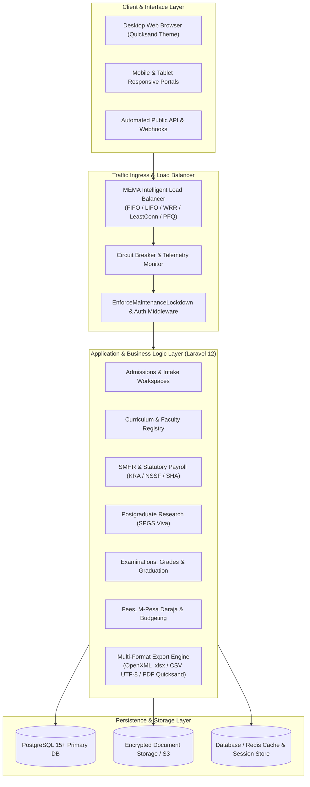
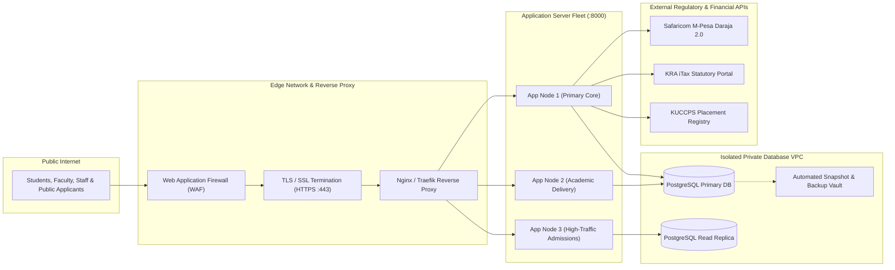
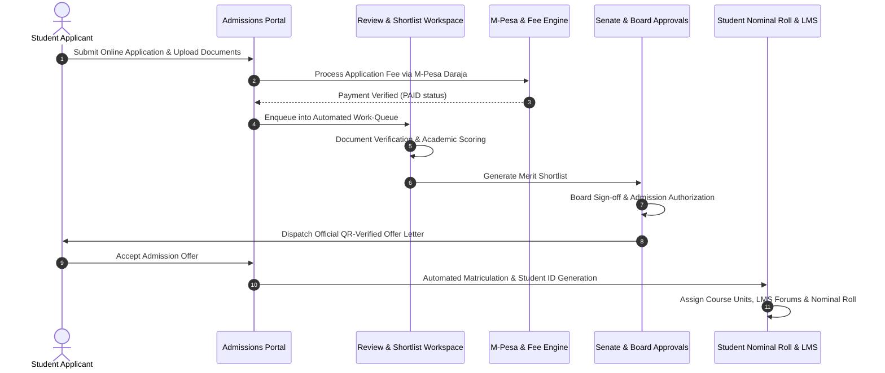
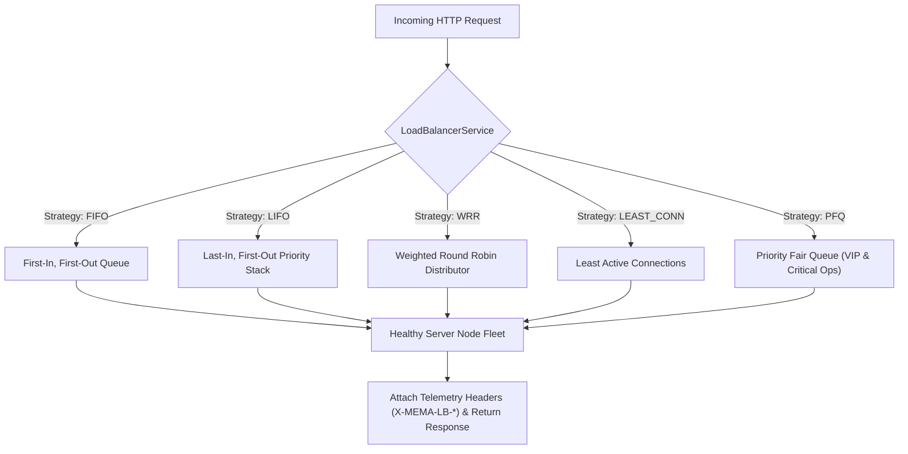

# 🎓 MEMA ERP — Enterprise Higher Education ERP Platform

[](https://laravel.com)
[](https://php.net)
[](https://postgresql.org)
[](https://tailwindcss.com)
[-success?style=for-the-badge&logo=checkmarx)](tests)
[](LICENSE)

> **MEMA ERP** is a full-stack, enterprise-grade Higher Education Management & Operations Platform designed specifically for multi-faculty universities, constituent colleges, and Open, Distance & e-Learning (ODeL) institutions. It powers the complete academic, administrative, human capital, financial, and digital governance lifecycle.

---

## 📑 Table of Contents

1. [System Overview & Key Features](#-system-overview--key-features)
2. [High-Level System Architecture](#-high-level-system-architecture)
3. [Network & Infrastructure Topology](#-network--infrastructure-topology)
4. [Lifecycle Data Flow & Workspaces](#-lifecycle-data-flow--workspaces)
5. [Load Balancer & Traffic Routing Design](#-load-balancer--traffic-routing-design)
6. [Multi-Format Export Engine (Excel, CSV, PDF)](#-multi-format-export-engine)
7. [Installation & Setup Guide](#-installation--setup-guide)
8. [Environment Configuration & Security](#-environment-configuration--security)
9. [Module Catalogue & Routes](#-module-catalogue--routes)
10. [Automated Testing Suite](#-automated-testing-suite)

---

## 🌟 System Overview & Key Features

* **Admissions & Intake Workflows**: 12 dedicated role-based administrative workspaces (Intake Setup, Application Processing, Auto-Assignment, Document Verification, Level 2 Review, Merit Shortlists, Senate Approvals, Letter Generation, Waitlist Auto-Promotion, Nominal Rolls, Fee Waivers, and M-Pesa Reconciliation).
* **Curriculum & Academic Structure**: Hierarchical setup of University Schools/Faculties, Constituent Departments, Degree Programmes, Syllabi, Course Unit Templates, and Progression Criteria.
* **Human Capital & SMHR**: Kenyan statutory salary advice engine with KRA Income Tax Act Cap 470 PAYE tax brackets, personal relief, health insurance relief, housing levy relief, NSSF Act 2013 (Tier 1 & 2), SHA (2.75%), Affordable Housing Levy (1.5%), P9A tax deduction cards, and staff directory.
* **Postgraduate Research (SPGS)**: Thesis defense management, proposal reader allocation, viva voce panel scoring, plagiarism gating, examiner dashboards, and progress milestones.
* **Examination & Certification**: Mark entry, grade scale matrices, transcript compilation, degree pass list validation, graduation clearance checklists, and alumni database.
* **Financial Management & Budgeting**: Fee tracking, M-Pesa Daraja 2.0 integration, receipt generation, departmental vote-head budgeting proposals, and expenditure governance.
* **System-Wide Load Balancer**: Dynamic LIFO, FIFO, Weighted Round Robin (WRR), Least Connections, and Priority Fair Queuing algorithms with cluster health monitoring and simulation playground.
* **Platform Governance**: Database recycle bin with soft-delete retention policies, system maintenance lockdown, audit trail verification, and multi-format reporting engine.

---

## 🏛 High-Level System Architecture



---

## 🌐 Network & Infrastructure Topology



---

## 🔄 Lifecycle Data Flow & Workspaces



---

## ⚡ Load Balancer & Traffic Routing Design

The system includes a fully functional load balancing core located at [`app/Services/LoadBalancerService.php`](file:///Users/wabwire/Dev/mema_erp/laravel_erp/app/Services/LoadBalancerService.php) and management interface at [`/admin-setups/load-balancer`](http://127.0.0.1:8000/admin-setups/load-balancer).



---

## 📊 Multi-Format Export Engine

MEMA ERP incorporates a high-performance export architecture allowing instant extraction of all live database records into **Excel**, **CSV**, and **Printable PDF**:

1. **Excel Export (`.xlsx`)**:
   - Genuine Microsoft OpenXML Spreadsheet document (`.xlsx`), generated with cell formatting, auto-fit columns, frozen header row, and brand-styled header banners.
2. **CSV Export (`.csv`)**:
   - RFC 4180 standard comma-delimited export with UTF-8 BOM (`\xEF\xBB\xBF`) for instant native rendering in Excel without character encoding issues.
3. **Printable PDF Export (`.pdf`)**:
   - Formatted publication report utilizing the system typography **Quicksand** throughout.
   - Styled with the official institutional color palette:
     - **Primary Dark Teal**: `#0A3E50` (Header row background with bold white text `#FFFFFF`)
     - **Secondary Teal**: `#007A8C`
     - **Accent Orange**: `#E67E22` (Callout tags & KPI summaries)
     - **Borders & Dividers**: `#CBD5E1` & alternating row backgrounds `#F8FAFC`
   - Complete with institutional letterhead, report metadata, and digital audit seal.

---

## 🚀 Installation & Setup Guide

### 1. Prerequisites

Ensure your development or production server has the following installed:
* **PHP 8.3 or higher** (with extensions: `pdo_pgsql`, `pgsql`, `zip`, `mbstring`, `xml`, `curl`, `bcmath`, `fileinfo`)
* **PostgreSQL 15+**
* **Composer 2.7+**
* **Node.js 20+ & npm**
* **Git**

### 2. Clone the Repository

```bash
git clone https://github.com/Dev-Ouma/memaerp.git
cd memaerp/laravel_erp
```

### 3. Configure Environment File

Create your local `.env` configuration from `.env.example`:

```bash
cp .env.example .env
```

Open `.env` and set your PostgreSQL database credentials:

```ini
APP_NAME="MEMA ERP"
APP_ENV=local
APP_KEY=
APP_DEBUG=true
APP_URL=http://127.0.0.1:8000

DB_CONNECTION=pgsql
DB_HOST=127.0.0.1
DB_PORT=5432
DB_DATABASE=mema_erp
DB_USERNAME=postgres
DB_PASSWORD=your_secure_password

SESSION_DRIVER=database
CACHE_STORE=database
QUEUE_CONNECTION=database
```

### 4. Install Dependencies

```bash
# Install PHP Composer dependencies
composer install

# Install Node modules
npm install
```

### 5. Generate Application Key & Symlink Storage

```bash
php artisan key:generate
php artisan storage:link
```

### 6. Run Database Migrations & Seeders

```bash
php artisan migrate --seed
```

### 7. Compile Frontend Assets

```bash
# Production bundle build
npm run build

# Or development live reload server
npm run dev
```

### 8. Start Local Development Server

```bash
php artisan serve --port=8000
```

Access the system at **`http://127.0.0.1:8000`** in your browser.

---

## 🔐 Default Access & User Credentials

When seeded with default test fixtures, the system provides pre-configured role accounts:

| Role Account | Email Address | Default Password | Workspace Permissions |
| :--- | :--- | :--- | :--- |
| **System Administrator** | `admin@mema.ac.ke` | `password` | Complete university-wide administrative access |
| **Registrar / Dean** | `dean.science@mema.ac.ke` | `password` | Faculty, curriculum & academic admissions |
| **Academic Staff / Lecturer**| `lecturer@mema.ac.ke` | `password` | Course units, LMS, exams & payslip portal |
| **Student** | `student@mema.ac.ke` | `password` | Coursework, registration & exam results |
| **Applicant** | `applicant@mema.ac.ke` | `password` | Admission application & letter download |

---

## 📁 Repository Structure & Directory Map

```text
memaerp/
├── laravel_erp/                       # Primary Laravel 12 ERP Application
│   ├── app/
│   │   ├── Http/
│   │   │   ├── Controllers/           # Module Controllers (Admissions, SMHR, Curriculum, etc.)
│   │   │   └── Middleware/            # Security, Maintenance Lockdown, Load Balancer Middleware
│   │   ├── Models/                    # Eloquent Database Models (UUID & BigInt compatible)
│   │   ├── Modules/Admission/         # Modular Admission Pipeline & Workspaces
│   │   └── Services/                  # Business Logic (DataExportService, LoadBalancer, RecycleBin)
│   ├── config/                        # Framework & Module Configuration
│   ├── database/
│   │   ├── migrations/                # Schema DDL (Institutions, Students, Staff, PGR, LoadBalancer)
│   │   └── seeders/                   # Initial Database Seeders & Demo Fixtures
│   ├── public/                        # Compiled Assets, CSS, Fonts, and Favicons
│   ├── resources/
│   │   ├── css/ & js/                 # Design System & Interactive Processing Scripts
│   │   └── views/                     # Blade Templates (Dashboards, SMHR, Curriculum, Reports)
│   ├── routes/                        # Web & Console Routes (routes/web.php)
│   └── tests/                         # Feature & Unit Automated Test Suite (126 Tests)
├── .gitignore                         # Strict Root Privacy & Secrets Protection Rules
└── README.md                          # Platform Architectural & Setup Documentation
```

---

## 🔒 Environment Security & Data Privacy

* **Zero Hardcoded Secrets**: All keys, passwords, API tokens, and database credentials are fully parameterized in `.env`.
* **Repository Sanitation**: The `.gitignore` prevents tracking of `.env`, `auth.json`, encryption keys (`storage/*.key`), database backups (`*.dump`, `*.sql.gz`), session data, and framework caches.
* **Auditability**: All state-mutating actions, fee waivers, admissions approvals, and staff updates are logged with audit timestamps and user IDs.
* **Recycle Bin Protection**: Critical records (schools, programmes, applications) utilize soft-deletes with configurable retention governance and administrative restoration.

---

## 🧪 Automated Testing Suite

The ERP is backed by an automated test suite verifying all critical workflows:

```bash
# Run the entire test suite
php artisan test

# Run specific feature tests
php artisan test tests/Feature/DashboardMetricsAndExportTest.php
php artisan test tests/Feature/SmhrModuleTest.php
php artisan test tests/Feature/CurriculumSchoolCrudTest.php
php artisan test tests/Feature/LoadBalancerTest.php
```

---

## 📄 License & Attribution

Copyright © 2026 MEMA University College. All rights reserved.  
Proprietary software for authorized institutional deployment.
