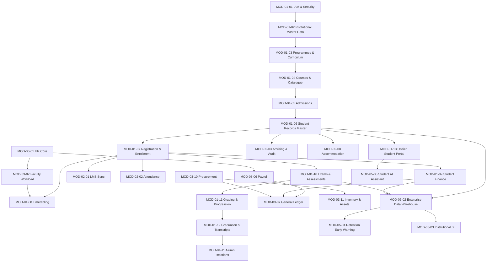

# UNIVERSITY ERP / UMIS — MASTER MODULE INDEX & SPECIFICATION CATALOGUE

- **System Name:** Integrated University Enterprise Resource Planning & Student Information Management System (MEMA ERP / UMIS)
- **Version:** 1.0.0-PROD-SPEC
- **Date:** 21 August 2026
- **Architecture Style:** Modular Monolith with Domain-Driven Design (DDD), PostgreSQL 17 ACID Storage, **Laravel 12 / PHP 8.4** Backend, Next.js 15 App Router Frontend, Redis Job Queue & Cache. See ADR-001.
- **Brand Palette:** Primary `#0A3E50` (Deep Teal), Secondary `#1E8449` (Forest Green), Accent `#0A3E50`, Surface `#FFFFFF`, Canvas `#F8FAFC`.

---

## 1. Executive Summary & Architecture Hierarchy

The MEMA ERP ecosystem is organized into **5 Sequential Implementation Phases** comprising **55 Fully Specified Modules**. The architecture is structured around the **Canonical Student Lifecycle Spine**, seamlessly integrating with Institutional Governance, Academic Delivery, Enterprise Operations (HR, Finance, Procurement), Research, and Advanced Intelligence.

```text
                                 UNIVERSITY ERP / UMIS
                                          │
    ┌──────────────────┬──────────────────┼──────────────────┬──────────────────┐
    ▼                  ▼                  ▼                  ▼                  ▼
 PHASE 01           PHASE 02           PHASE 03           PHASE 04           PHASE 05
 Foundation &       Academic           Enterprise         Research &         Intelligence &
 Student Core       Services           Operations         Governance         Platform
 (13 Modules)       (11 Modules)       (11 Modules)       (11 Modules)       (9 Modules)
```

---

## 2. Master Module Catalogue by Implementation Phase

### Phase 01: Foundation & Core Student Lifecycle (Priority: CRITICAL)
*Foundational identity, academic structure, applicant funnel, student registration, fees, timetable, examination, and graduation.*

| Module ID | File Name | Module Name | Primary Domain | Core Entities |
|---|---|---|---|---|
| **MOD-01-01** | [`PHASE-01/01-01-Identity-and-Access-Management.md`](./PHASE-01/01-01-Identity-and-Access-Management.md) | Identity, Authentication & Access Control (IAM) | Security & Platform | `users`, `roles`, `permissions`, `sessions`, `mfa_tokens`, `audit_logs` |
| **MOD-01-02** | [`PHASE-01/02-Institutional-Administration-and-Master-Data.md`](./PHASE-01/02-Institutional-Administration-and-Master-Data.md) | Institutional Setup & Master Data Management | Administration | `institutions`, `campuses`, `faculties`, `departments`, `academic_years`, `semesters` |
| **MOD-01-03** | [`PHASE-01/03-Programme-and-Curriculum-Management.md`](./PHASE-01/03-Programme-and-Curriculum-Management.md) | Programme Structure & Curriculum Engine | Academic Affairs | `programmes`, `programme_versions`, `curricula`, `curriculum_nodes`, `graduation_rules` |
| **MOD-01-04** | [`PHASE-01/04-Course-Catalogue-and-Offering.md`](./PHASE-01/04-Course-Catalogue-and-Offering.md) | Course Master Catalogue & Semester Offerings | Academic Affairs | `courses`, `course_prerequisites`, `course_offerings`, `class_sections`, `lecturer_allocations` |
| **MOD-01-05** | [`PHASE-01/05-Recruitment-and-Admissions.md`](./PHASE-01/05-Recruitment-and-Admissions.md) | Student Recruitment, Applications & Admissions | Admissions | `prospects`, `applications`, `application_documents`, `evaluations`, `admission_offers` |
| **MOD-01-06** | [`PHASE-01/06-Student-Onboarding-and-Records.md`](./PHASE-01/06-Student-Onboarding-and-Records.md) | Student Matriculation & Master Records (SIS) | Student Records | `persons`, `students`, `matriculation_logs`, `student_identifications`, `document_repository` |
| **MOD-01-07** | [`PHASE-01/07-Student-Registration-and-Enrollment.md`](./PHASE-01/07-Student-Registration-and-Enrollment.md) | Semester Registration & Course Enrollment Engine | Academic / Registrar | `term_registrations`, `course_enrollments`, `enrollment_audit`, `capacity_locks` |
| **MOD-01-08** | [`PHASE-01/08-Timetable-and-Scheduling.md`](./PHASE-01/08-Timetable-and-Scheduling.md) | Teaching & Examination Scheduling Engine | Academic Scheduling | `rooms`, `venues`, `teaching_slots`, `timetable_clashes`, `exam_sessions`, `invigilations` |
| **MOD-01-09** | [`PHASE-01/09-Student-Finance-Billing-and-Payments.md`](./PHASE-01/09-Student-Finance-Billing-and-Payments.md) | Student Fee Structures, Invoicing & Receipts | Student Finance | `fee_structures`, `fee_items`, `student_invoices`, `student_payments`, `reconciliations` |
| **MOD-01-10** | [`PHASE-01/10-Continuous-Assessment-and-Examinations.md`](./PHASE-01/10-Continuous-Assessment-and-Examinations.md) | Coursework Assessment & Examination Management | Examinations | `assessments`, `cat_marks`, `exam_cards`, `exam_scores`, `marks_submissions`, `moderations` |
| **MOD-01-11** | [`PHASE-01/11-Grading-GPA-and-Academic-Progression.md`](./PHASE-01/11-Grading-GPA-and-Academic-Progression.md) | Grading Scales, GPA Calculation & Progression Engine | Examinations / Senate | `grading_schemes`, `term_gpas`, `cumulative_gpas`, `progression_decisions`, `probations` |
| **MOD-01-12** | [`PHASE-01/12-Graduation-Transcripts-and-Certification.md`](./PHASE-01/12-Graduation-Transcripts-and-Certification.md) | Degree Audit, Clearance, Transcripts & Certification | Registrar / Examinations | `graduation_audits`, `graduation_lists`, `transcripts`, `degree_certificates`, `qr_hashes` |
| **MOD-01-13** | [`PHASE-01/13-Unified-Student-Portal.md`](./PHASE-01/13-Unified-Student-Portal.md) | Unified Responsive Student Self-Service Portal | Student Self-Service | `portal_sessions`, `student_dashboard_widgets`, `quick_actions`, `student_alerts` |

---

### Phase 02: Academic Services & Student Affairs (Priority: HIGH)
*E-learning integrations, attendance, academic advising, accommodation, student welfare, attachments, and staff self-service.*

| Module ID | File Name | Module Name | Primary Domain | Core Entities |
|---|---|---|---|---|
| **MOD-02-01** | [`PHASE-02/02-01-LMS-Integration-and-E-Learning.md`](./PHASE-02/02-01-LMS-Integration-and-E-Learning.md) | LMS Two-Way Synchronization Hub (Moodle) | Academic Technology | `lms_courses`, `lms_enrollments`, `lms_grades_sync`, `sync_logs`, `activity_streams` |
| **MOD-02-02** | [`PHASE-02/02-02-Class-and-Lecturer-Attendance.md`](./PHASE-02/02-02-Class-and-Lecturer-Attendance.md) | Class Attendance, QR Clock-In & Biometrics | Academic Delivery | `attendance_sessions`, `student_attendance_logs`, `lecturer_clockins`, `attendance_flags` |
| **MOD-02-03** | [`PHASE-02/03-Academic-Advising-and-Degree-Audit.md`](./PHASE-02/03-Academic-Advising-and-Degree-Audit.md) | Academic Advising & Degree Progress Tracking | Academic Support | `advisor_allocations`, `advising_sessions`, `advisory_notes`, `curriculum_audits` |
| **MOD-02-04** | [`PHASE-02/04-Industrial-Attachment-and-Practicum.md`](./PHASE-02/04-Industrial-Attachment-and-Practicum.md) | Industrial Attachment, Internships & Fieldwork | Experiential Learning | `attachment_applications`, `host_organizations`, `supervisors`, `digital_logbooks`, `assessments` |
| **MOD-02-05** | [`PHASE-02/05-Work-Study-Programme.md`](./PHASE-02/05-Work-Study-Programme.md) | Student Work-Study Applications & Timesheets | Student Support | `work_study_positions`, `student_applications`, `placements`, `timesheets`, `work_stipends` |
| **MOD-02-06** | [`PHASE-02/06-Library-Management-Integration.md`](./PHASE-02/06-Library-Management-Integration.md) | Library Patron Management & Koha Integration | Library Services | `library_patrons`, `book_loans`, `overdue_fines`, `digital_resources`, `library_clearances` |
| **MOD-02-07** | [`PHASE-02/07-Student-Affairs-Welfare-and-Elections.md`](./PHASE-02/07-Student-Affairs-Welfare-and-Elections.md) | Student Affairs, Welfare, Clubs & Secure Elections | Student Affairs | `clubs_societies`, `counseling_cases`, `disciplinary_hearings`, `elections`, `ballots`, `votes` |
| **MOD-02-08** | [`PHASE-02/08-Accommodation-and-Hostel-Management.md`](./PHASE-02/08-Accommodation-and-Hostel-Management.md) | Hostel Inventory, Room Booking & Maintenance | Accommodation | `hostel_blocks`, `rooms`, `beds`, `room_bookings`, `checkins_checkouts`, `maintenance_tickets` |
| **MOD-02-09** | [`PHASE-02/09-Student-Request-and-Paperless-Clearance.md`](./PHASE-02/09-Student-Request-and-Paperless-Clearance.md) | Student Request Hub & Automated Clearance Engine | Student Services | `service_requests`, `request_approvals`, `clearance_checkpoints`, `final_clearances` |
| **MOD-02-10** | [`PHASE-02/10-Scholarships-and-Financial-Aid.md`](./PHASE-02/10-Scholarships-and-Financial-Aid.md) | Financial Aid, HELB Integration & Sponsorships | Student Finance | `sponsors`, `scholarship_schemes`, `bursary_applications`, `disbursements`, `sponsor_invoices` |
| **MOD-02-11** | [`PHASE-02/11-Lecturer-and-Staff-Portals.md`](./PHASE-02/11-Lecturer-and-Staff-Portals.md) | Faculty & Staff Self-Service Portals | Staff Experience | `lecturer_dashboards`, `teaching_rosters`, `marks_entry_sheets`, `staff_requests` |

---

### Phase 03: Enterprise Operations (HR, Finance, Procurement) (Priority: HIGH)
*Institutional ERP core covering human capital, payroll, general ledger, budgets, procurement, inventory, and fixed assets.*

| Module ID | File Name | Module Name | Primary Domain | Core Entities |
|---|---|---|---|---|
| **MOD-03-01** | [`PHASE-03/03-01-Human-Resource-Management.md`](./PHASE-03/03-01-Human-Resource-Management.md) | Human Capital Management & Staff Master Files | Human Resources | `employees`, `job_positions`, `contracts`, `designations`, `staff_qualifications`, `transfers` |
| **MOD-03-02** | [`PHASE-03/02-Academic-Staff-Workload-Management.md`](./PHASE-03/02-Academic-Staff-Workload-Management.md) | Faculty Workload, Teaching Allocations & Supervision | Academic HR | `workload_norms`, `teaching_allocations`, `supervision_loads`, `overload_claims` |
| **MOD-03-03** | [`PHASE-03/03-Leave-and-Staff-Attendance.md`](./PHASE-03/03-Leave-and-Staff-Attendance.md) | Staff Leave Workflows & Attendance Biometrics | Human Resources | `leave_types`, `leave_balances`, `leave_applications`, `approvals`, `biometric_logs` |
| **MOD-03-04** | [`PHASE-03/04-Staff-Performance-and-Appraisal.md`](./PHASE-03/04-Staff-Performance-and-Appraisal.md) | Performance Contracting & Annual Staff Appraisals | Human Resources | `kpis`, `performance_contracts`, `appraisal_cycles`, `ratings`, `development_plans` |
| **MOD-03-05** | [`PHASE-03/05-Staff-Promotions-Management.md`](./PHASE-03/05-Staff-Promotions-Management.md) | Academic & Administrative Promotions Pipeline | Human Resources | `promotion_criteria`, `staff_applications`, `publications_points`, `promotions_committee_reviews` |
| **MOD-03-06** | [`PHASE-03/06-Payroll-and-Statutory-Compliance.md`](./PHASE-03/06-Payroll-and-Statutory-Compliance.md) | Salary Structures, Statutory Returns & Payroll Engine | Finance & HR | `salary_scales`, `allowance_types`, `deductions`, `payrolls`, `payslips`, `bank_disbursement_files` |
| **MOD-03-07** | [`PHASE-03/07-University-General-Ledger-and-Financial-Accounting.md`](./PHASE-03/07-University-General-Ledger-and-Financial-Accounting.md) | General Ledger, Chart of Accounts & Financial Statements | Institutional Finance | `chart_of_accounts`, `fiscal_periods`, `journal_entries`, `general_ledgers`, `trial_balances` |
| **MOD-03-08** | [`PHASE-03/08-Budgeting-and-Commitment-Control.md`](./PHASE-03/08-Budgeting-and-Commitment-Control.md) | Annual Budget Formulation & Expenditure Vote-Book | Institutional Finance | `budget_heads`, `departmental_budgets`, `commitments`, `vote_book_entries`, `budget_variances` |
| **MOD-03-09** | [`PHASE-03/09-Accounts-Payable-and-Receivable.md`](./PHASE-03/09-Accounts-Payable-and-Receivable.md) | Accounts Payable, Receivable & Cash Management | Institutional Finance | `vendor_invoices`, `payment_vouchers`, `receivables_ledger`, `bank_accounts`, `reconciliations` |
| **MOD-03-10** | [`PHASE-03/10-Procurement-and-Supply-Chain-Management.md`](./PHASE-03/10-Procurement-and-Supply-Chain-Management.md) | Procurement Requisitions, Tendering & Purchase Orders | Supply Chain | `suppliers`, `requisitions`, `rfqs_tenders`, `tender_evaluations`, `purchase_orders`, `grns` |
| **MOD-03-11** | [`PHASE-03/11-Stores-Inventory-and-Fixed-Asset-Management.md`](./PHASE-03/11-Stores-Inventory-and-Fixed-Asset-Management.md) | Stores Inventory, Barcode Asset Tagging & Depreciation | Operations & Logistics | `inventory_items`, `store_ledgers`, `asset_register`, `asset_tags`, `depreciations`, `disposals` |

---

### Phase 04: Research, Postgraduate & Governance (Priority: MEDIUM-HIGH)
*Research grants, postgraduate tracking, ethics review, quality assurance, council/senate governance, DMS, and facilities.*

| Module ID | File Name | Module Name | Primary Domain | Core Entities |
|---|---|---|---|---|
| **MOD-04-01** | [`PHASE-04/04-01-Research-Grants-and-Projects-Management.md`](./PHASE-04/04-01-Research-Grants-and-Projects-Management.md) | Research Grants, Proposals & Publication Tracking | Research Division | `researchers`, `proposals`, `grants`, `research_projects`, `milestones`, `publications` |
| **MOD-04-02** | [`PHASE-04/04-02-Postgraduate-Lifecycle-and-Thesis-Tracking.md`](./PHASE-04/04-02-Postgraduate-Lifecycle-and-Thesis-Tracking.md) | Masters/PhD Lifecycle, Supervisor Allocation & Viva | Postgraduate School | `pg_students`, `supervisors`, `concept_notes`, `thesis_submissions`, `viva_schedules`, `examiners` |
| **MOD-04-03** | [`PHASE-04/04-03-Research-Ethics-Review-and-Compliance.md`](./PHASE-04/04-03-Research-Ethics-Review-and-Compliance.md) | Ethics Review Board & Protocol Approvals | Research & Ethics | `ethics_applications`, `protocols`, `reviewers`, `committee_decisions`, `ethics_certificates` |
| **MOD-04-04** | [`PHASE-04/04-04-Quality-Assurance-and-Course-Evaluation.md`](./PHASE-04/04-Quality-Assurance-and-Course-Evaluation.md) | Quality Assurance, Evaluations & Accreditation | Quality Assurance | `evaluations`, `rubrics`, `student_feedback`, `academic_audits`, `accreditation_records` |
| **MOD-04-05** | [`PHASE-04/05-Senate-Council-and-Committee-Governance.md`](./PHASE-04/05-Senate-Council-and-Committee-Governance.md) | Senate, Council & Board Governance Management | Governance | `committees`, `meeting_agendas`, `minutes`, `senate_resolutions`, `action_items` |
| **MOD-04-06** | [`PHASE-04/06-Enterprise-Document-Management-System.md`](./PHASE-04/06-Enterprise-Document-Management-System.md) | Document Repository, OCR & Digital Signatures | Enterprise Content | `documents`, `document_versions`, `ocr_indexes`, `digital_signatures`, `retention_policies` |
| **MOD-04-07** | [`PHASE-04/07-Helpdesk-and-ICT-Service-Management.md`](./PHASE-04/07-Helpdesk-and-ICT-Service-Management.md) | Enterprise Helpdesk, ITIL Ticketing & IT Assets | ICT Directorate | `support_tickets`, `ticket_sla`, `knowledge_base`, `it_assets`, `incident_reports` |
| **MOD-04-08** | [`PHASE-04/08-Facilities-Estates-and-Fleet-Management.md`](./PHASE-04/08-Facilities-Estates-and-Fleet-Management.md) | Campus Facilities, Maintenance & Fleet Bookings | Estates & Logistics | `buildings`, `spaces`, `maintenance_work_orders`, `vehicles`, `drivers`, `trip_logs` |
| **MOD-04-09** | [`PHASE-04/09-Campus-Security-and-Incident-Management.md`](./PHASE-04/09-Campus-Security-and-Incident-Management.md) | Campus Security, Visitor Passes & Incident Logs | Security | `security_incidents`, `visitor_logs`, `gate_passes`, `lost_found_items`, `emergency_alerts` |
| **MOD-04-10** | [`PHASE-04/10-University-Health-and-Clinic-Services.md`](./PHASE-04/10-University-Health-and-Clinic-Services.md) | Electronic Health Records & Campus Medical Center | Health Services | `patient_records`, `clinic_visits`, `prescriptions`, `medical_clearances`, `health_insurance` |
| **MOD-04-11** | [`PHASE-04/11-Alumni-Relations-and-Tracer-Studies.md`](./PHASE-04/11-Alumni-Relations-and-Tracer-Studies.md) | Alumni Network, Giving & Graduate Tracer Studies | External Relations | `alumni_profiles`, `grad_cohorts`, `donations`, `tracer_surveys`, `mentorship_matches` |

---

### Phase 05: Intelligence, Integration & Advanced Platform Services (Priority: STRATEGIC)
*Data warehousing, executive BI, early warning retention engine, student AI assistant, native mobile apps, and public verification.*

| Module ID | File Name | Module Name | Primary Domain | Core Entities |
|---|---|---|---|---|
| **MOD-05-01** | [`PHASE-05/05-01-Universal-Integration-and-API-Gateway.md`](./PHASE-05/05-01-Universal-Integration-and-API-Gateway.md) | Universal API Gateway, Webhooks & Partner Connect | Platform Integration | `api_keys`, `rate_limit_policies`, `webhook_subscriptions`, `integration_logs` |
| **MOD-05-02** | [`PHASE-05/05-02-Enterprise-Data-Warehouse-and-ETL.md`](./PHASE-05/05-02-Enterprise-Data-Warehouse-and-ETL.md) | Enterprise Data Warehouse & Analytical Pipelines | Data Engineering | `dim_students`, `dim_courses`, `dim_time`, `fact_enrollments`, `fact_financials`, `fact_grades` |
| **MOD-05-03** | [`PHASE-05/05-03-Institutional-Analytics-and-Executive-BI.md`](./PHASE-05/05-03-Institutional-Analytics-and-Executive-BI.md) | Executive BI Dashboards & Institutional Reporting | Business Intelligence | `kpi_metrics`, `dashboard_snapshots`, `analytical_reports`, `trend_models` |
| **MOD-05-04** | [`PHASE-05/05-04-Student-Retention-and-Early-Warning-System.md`](./PHASE-05/05-04-Student-Retention-and-Early-Warning-System.md) | Multi-Factor At-Risk Engine & Early Intervention | Student Success | `risk_scores`, `risk_factors`, `intervention_cases`, `advisory_outcomes` |
| **MOD-05-05** | [`PHASE-05/05-05-AI-Student-Assistant-and-Predictive-Intelligence.md`](./PHASE-05/05-05-AI-Student-Assistant-and-Predictive-Intelligence.md) | Conversational Student AI & Predictive Models | Artificial Intelligence | `chat_sessions`, `intent_logs`, `knowledge_embeddings`, `predictive_forecasts` |
| **MOD-05-06** | [`PHASE-05/05-06-Universal-Notification-Engine.md`](./PHASE-05/05-06-Universal-Notification-Engine.md) | Multi-Channel Dispatcher (Email/SMS/Push/WhatsApp) | Communication Hub | `notification_templates`, `dispatch_logs`, `sms_gateways`, `channel_preferences` |
| **MOD-05-07** | [`PHASE-05/05-07-Public-Digital-Verification-Portal.md`](./PHASE-05/07-Public-Digital-Verification-Portal.md) | Public Online Verification for Credentials & QR | Public Trust Services | `verification_tokens`, `document_hashes`, `public_lookup_logs`, `revocation_registry` |
| **MOD-05-08** | [`PHASE-05/05-08-University-Mobile-Application.md`](./PHASE-05/08-University-Mobile-Application.md) | Native iOS/Android Mobile Application Layer | Mobile Client | `mobile_devices`, `push_tokens`, `offline_caches`, `biometric_auth_keys` |
| **MOD-05-09** | [`PHASE-05/05-09-Business-Continuity-and-Disaster-Recovery.md`](./PHASE-05/09-Business-Continuity-and-Disaster-Recovery.md) | Backup Orchestration, Failover & DR Playbooks | Operations & Resilience | `backup_jobs`, `snapshot_registries`, `dr_test_logs`, `failover_configurations` |

---

## 3. Cross-Module System Matrix


