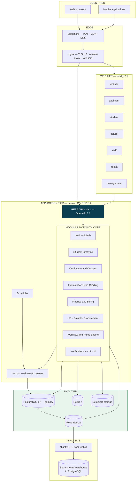

# UNIVERSITY ERP / UMIS — SYSTEM ARCHITECTURE & ENGINEERING BASELINE

- **System:** Integrated University Enterprise Resource Planning & Student Information Management System (MEMA ERP)
- **Version:** 1.0.0-PROD-SPEC
- **Document Type:** System Architecture & Technical Baseline Specification

---

## 1. Architectural Style & Design Principles

The MEMA ERP architecture is designed as a **Modular Monolith with Domain-Driven Design (DDD)** bounded contexts. This architecture provides maximum transactional integrity and domain coherence while allowing seamless evolutionary extraction of high-scale sub-domains into microservices when required.

### Core Principles:
1. **Transactional Truth over Asynchronous Convenience:** All financial ledgers, grades, registrations, and academic records execute under strict ACID relational guarantees in PostgreSQL 17.
2. **Canonical Single Source of Truth:** A single immutable `Person` record links `Applicant`, `Student`, `Staff`, and `Alumni` identities without duplicate profiles.
3. **Configuration & Versioned Rules over Hardcoded Logic:** Degree requirements, grading scales, fee structures, and approval workflows are versioned in database tables, never hardcoded.
4. **Zero-Trust Security & Tamper-Proof Auditing:** All state modifications generate append-only audit records recording actor, timestamp, IP, reason code, and before/after JSON diffs.

---

## 2. Technology Stack Baseline

> **Superseded baseline.** This section previously specified NestJS + Fastify on Node.js 22, Kubernetes,
> Kafka, GraphQL and CSS Modules. That baseline is **withdrawn**. The stack below is authoritative, per
> **ADR-001** (accepted 23 August 2026) and ADR-005, ADR-006, ADR-011 in
> [`../../PLAN/01-ARCHITECTURE-DECISIONS.md`](../../PLAN/01-ARCHITECTURE-DECISIONS.md).

| Tier | Component | Version | Notes |
|---|---|---|---|
| **Frontend** | Next.js (React, App Router) | 15 / React 19 | 7 applications in one Turborepo + pnpm monorepo |
| | TypeScript | 5.x strict | |
| | Tailwind CSS + shadcn/ui (Radix) | 4.x | Design tokens: Primary `#0A3E50`, Secondary `#1E8449`, Canvas `#F8FAFC` |
| | TanStack Query · TanStack Table | latest | Server state and data grids |
| | React Hook Form + Zod | latest | Forms and runtime validation, generated from the OpenAPI contract |
| | Apache ECharts | latest | Dashboards and BI visualisation |
| **Backend** | **PHP** | **8.4** | Docker images pin 8.4; CI builds against 8.4 |
| | **Laravel** | **12.x** | Modular monolith — `app/Modules/`, boundaries enforced by Deptrac in CI |
| | Laravel Sanctum | latest | SPA cookie session auth; OIDC/OAuth 2.0 server for partners and Moodle |
| | Laravel Horizon | latest | Queue supervision across 6 named queues |
| | Dompdf / Browsershot · Laravel Excel | latest | Document and spreadsheet generation |
| **API** | REST/JSON with OpenAPI 3.1 | — | Contract-first; generated TypeScript client + Zod schemas. **No GraphQL** (ADR-006) |
| **Data** | **PostgreSQL** | **17.x** | Single database, 16 schema domains, partitioned, PgBouncer transaction pooling |
| | Redis | 7.x | Cache, sessions, locks, queue backend |
| | S3-compatible object storage | MinIO / AWS S3 | Server-side encryption |
| **Async** | Laravel Queues on Redis | — | **No Kafka** (ADR-011). Outbox pattern for reliable event publication |
| **Infrastructure** | Docker + Docker Compose | — | **No Kubernetes** at this stage (ADR-011) |
| | Nginx | stable | TLS 1.3 termination, reverse proxy, rate limiting |
| | Ubuntu Server LTS | 24.04 | |
| | Cloudflare | — | WAF, DDoS protection, CDN, DNS |
| **Observability** | Prometheus + Grafana · Sentry · Loki | — | Metrics, error tracking, log aggregation |
| **CI/CD** | GitHub Actions | — | Test, static analysis, contract check, build, deploy |

### Deliberate exclusions

Microservices, Kubernetes, Kafka, MongoDB, GraphQL, ClickHouse, OpenSearch and a separate frontend framework
per module are **excluded at this stage**. Each exclusion carries a documented reversal trigger in ADR-011 —
they are deferred decisions with stated re-evaluation conditions, not permanent bans.

---

## 3. Logical Reference Architecture

There is no separate API gateway product (Kong/Traefik) in the topology. Nginx terminates TLS and proxies;
authentication, authorisation, rate limiting and CORS are handled inside the Laravel application, where the
policy layer already lives. See ADR-011 for the reversal trigger.

---

## 4. PostgreSQL 17 Database Architecture

The relational database is architected into explicit schema domains:

1. **`iam`**: Authentication, users, roles, permissions, MFA tokens, session logs.
2. **`institution`**: Universities, campuses, faculties, departments, academic years, semesters, calendars.
3. **`curriculum`**: Programmes, versions, curricula, course structures, prerequisites, graduation rules.
4. **`course`**: Master courses, semester course offerings, class sections, lecturer allocations.
5. **`admission`**: Prospects, applications, qualifications, evaluations, admission letters.
6. **`student`**: Persons, student master files, cohorts, student statuses, document repository.
7. **`enrollment`**: Term registrations, course enrollments, add/drops, capacity locks.
8. **`finance`**: Fee structures, student bills/invoices, payments, receipts, GL journals, accounts payable/receivable.
9. **`examination`**: Assessments, CATs, exam sessions, marks submissions, moderation, results, GPAs, progression.
10. **`graduation`**: Degree audits, clearance records, graduation rolls, transcripts, certificates.
11. **`hr`**: Staff records, workload, leave, appraisals, promotions, payroll, statutory deductions.
12. **`procurement`**: Suppliers, requisitions, tenders, purchase orders, stores inventory, fixed assets.
13. **`research`**: Proposals, grants, ethics reviews, publications, postgraduate thesis milestones.
14. **`audit`**: Immutable audit logs, change data capture, security event records.
