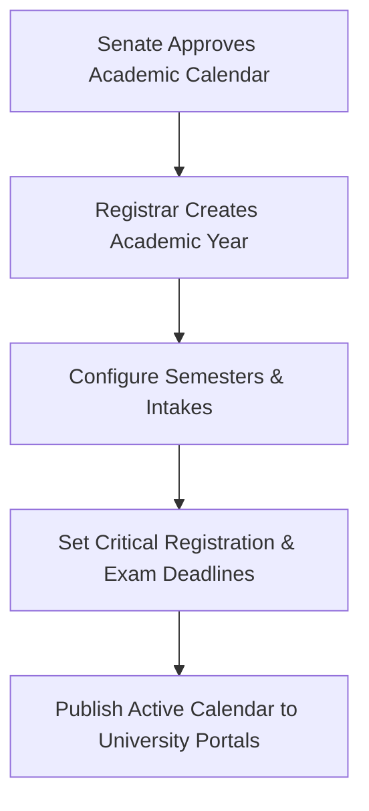
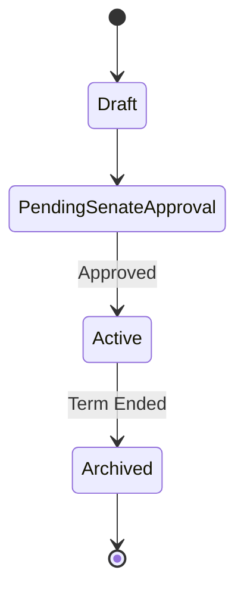

# MOD-01-02: Institutional Administration & Master Data Management — SOFTWARE REQUIREMENTS SPECIFICATION

- **Module Identifier:** `MOD-01-02`
- **Implementation Phase:** `PHASE 01 - Foundation & Core Student Lifecycle`
- **System:** Integrated University Enterprise Resource Planning & Student Information Management System (MEMA ERP)
- **Document Version:** 1.0.0-PROD-SPEC
- **Status:** Approved Baseline / Ready for Implementation

---

## 1. Module Number and Name
- **Module ID:** `MOD-01-02`
- **Official Name:** Institutional Administration & Master Data Management
- **Domain:** Foundation & Core Student Lifecycle

## 2. Phase & Implementation Order
- **Phase:** PHASE 01 - Foundation & Core Student Lifecycle
- **Implementation Sequence:** Foundational / Critical Path

## 3. Purpose and Objectives
Defines institutional organizational hierarchy (campuses, faculties, schools, departments, centres), academic calendars, academic years, semester terms, study modes, student categories, and system-wide lookup master data.

## 4. Scope
### 4.1 In-Scope
- Multi-campus profile, satellite centers, and faculty/department hierarchy
- Academic years (e.g. 2026/2027), semesters, trimesters, terms, and session cycles
- Intake periods (e.g., January, May, September)
- Universal master lookup tables (nationalities, counties, banks, grading scales, payment methods)
- Institutional holiday calendar and critical deadline enforcement

### 4.2 Out-of-Scope
- Course-level syllabi (managed in MOD-01-04)
- Employee job descriptions (managed in MOD-03-01)

## 5. Actors / Users and Roles
| Role Name | Description | Access Level |
|---|---|---|
| **Registrar (Academic)** | Defines academic terms, calendar dates, and intake windows. | Academic Executive |
| **University Council / VC** | Approves establishment of new faculties, campuses, and schools. | Institutional Executive |
| **System Administrator** | Manages technical master data lookup configurations. | System Admin |

## 6. Role-Based Permissions (CRUD Matrix)
| Role | Create | Read | Update | Delete | Approve / Execute |
|---|---|---|---|---|---|
| Super Admin | YES | YES | YES | YES | YES |
| Registrar | YES | YES | YES | NO | YES |
| Dean | NO | YES | NO | NO | NO |
| Lecturer / Student | NO | YES | NO | NO | NO |

## 7. End-to-End Workflows

### Workflow Step-by-Step Execution:
1. **Institutional Hierarchy Setup:** Establish University Profile, Campuses, Schools/Faculties, and Departments.
2. **Academic Calendar Creation:** Input Academic Year (e.g., 2026/2027) with start/end dates and Senate resolution number.
3. **Semester & Intake Definition:** Configure Semester 1/2 dates, Add/Drop deadlines, Fee payment deadlines, and Exam weeks.
4. **Activation & Broadcast:** Mark academic year as 'Active' to drive registration and admissions pipelines.

## 8. User Actions
| User Role | Interface / View | Action Description | Precondition | Postcondition |
|---|---|---|---|---|
| Registrar | `/admin/institution/academic-years` | Create and activate new academic year and semesters | Senate approval granted | New academic year becomes selectable across ERP |
| System Admin | `/admin/master-data/lookups` | Add or update country, county, bank, and sponsor codes | Admin privileges | Updated lookups reflected across dropdowns |

## 9. Functional Requirements
### FR-INS-001: Organizational Hierarchy Structure
- **Description:** System shall maintain multi-tier relationships: University -> Campuses -> Schools/Faculties -> Departments -> Units.
- **Inputs:** Entity name, code, parent ID, head of unit ID
- **Outputs:** Validated hierarchy node
- **Validation:** Unique code per level, no circular hierarchy
### FR-INS-002: Academic Calendar & Term Engine
- **Description:** System shall manage academic years, terms, and date gates for admissions, registration, lecturing, and exams.
- **Inputs:** Year name, Term code, Start date, End date, Deadlines
- **Outputs:** Active calendar entity
- **Validation:** Date range non-overlapping for same study mode

## 10. Sub-Modules
| Sub-Module ID | Sub-Module Name | Core Responsibility |
|---|---|---|
| **SUB-INS-01** | Campus & Organizational Structure | Manages campuses, faculties, schools, departments, and centers. |
| **SUB-INS-02** | Academic Calendar & Terms | Controls academic years, semester terms, intakes, and key academic dates. |
| **SUB-INS-03** | Master Data & Global Lookups | Universal lookup tables for countries, counties, currencies, payment methods, and statuses. |

## 11. Features
- **Multi-Campus Configuration:** Assign faculties and programmes across main campus and regional satellite centers.
- **Flexible Study Mode Engine:** Configure Full-Time, Part-Time, Evening, Weekend, and ODeL calendar rules.

## 12. Business Rules & Logic
- **BR-MOD-01-02-001 (Single Active Academic Term):** Only one standard semester per study mode may have the 'Current Active' flag simultaneously.
- **BR-MOD-01-02-002 (Historical Immortality):** Campuses or departments with historical student records cannot be deleted; they may only be archived/deactivated.

## 13. Data Requirements & Entities
### Core PostgreSQL Relational Tables:
#### Table: `institution.campuses`
*Description: University campus physical and virtual entities.*
```sql
CREATE TABLE institution.campuses (
    id UUID PRIMARY KEY DEFAULT gen_random_uuid(),
    code VARCHAR(20) UNIQUE NOT NULL,
    name VARCHAR(150) NOT NULL,
    location VARCHAR(255),
    is_main_campus BOOLEAN DEFAULT FALSE,
    is_active BOOLEAN DEFAULT TRUE,
    created_at TIMESTAMPTZ DEFAULT CURRENT_TIMESTAMP
);
```

#### Table: `institution.academic_years`
*Description: Institutional academic year definitions.*
```sql
CREATE TABLE institution.academic_years (
    id UUID PRIMARY KEY DEFAULT gen_random_uuid(),
    code VARCHAR(20) UNIQUE NOT NULL,
    name VARCHAR(50) NOT NULL,
    start_date DATE NOT NULL,
    end_date DATE NOT NULL,
    is_active BOOLEAN DEFAULT FALSE,
    created_at TIMESTAMPTZ DEFAULT CURRENT_TIMESTAMP
);
```


## 14. Required Fields & Schema Specification
| Field Name | Data Type | Nullable | Constraints / Foreign Keys | Description |
|---|---|---|---|---|
| `code` | `VARCHAR(20)` | `NO` | UNIQUE | Short unique identifier (e.g., MAIN, 2026/2027) |
| `name` | `VARCHAR(150)` | `NO` | NOT NULL | Full descriptive title |

## 15. Validation Rules
- **VR-MOD-01-02-001 [start_date / end_date]:** start_date must strictly precede end_date.

## 16. Approval Workflows & Multi-Tier Sign-Off
Creation of new Faculties/Departments requires Senate and Council resolution reference upload before status becomes 'Active'.

## 17. Notifications, Alerts & Triggers
| Event Trigger | Recipient Channel | Message Template Summary |
|---|---|---|
| **New Semester Activated** | `In-App + Email` (All Students & Staff) | The {{semester_name}} of Academic Year {{year_name}} is now officially open. |

## 18. Dashboards & Analytics Widgets
- **Institutional Structure Overview (Registrar & VC):** Summary of active campuses, schools, student enrollment density per department, and calendar timeline.

## 19. Reports
| Report ID | Title | Frequency | Output Formats | Permitted Roles |
|---|---|---|---|---|
| `REP-INS-01` | University Academic Calendar Booklet | Annual | PDF | All Users |
| `REP-INS-02` | Organizational Master Directory | On-Demand | PDF, CSV | Management |

## 20. Search, Filtering and Export Requirements
- **Search Capabilities:** Search by campus name, faculty code, department name.
- **Filters:** Campus, Active status, Academic Year.
- **Export Options:** PDF, CSV, JSON.

## 21. Audit Trails and Logging
- **Audit Level:** Comprehensive append-only logging in `audit.audit_logs`.
- **Monitored Attributes:** Creation/modification of academic years, semester date shifts, department name changes.
- **Tamper-Proofing:** Append-only database triggers with mandatory Senate minute citation.

## 22. Security Requirements
- **Authentication:** Restricted to Registrar and System Admin.
- **Data Protection:** Standard database encryption.
- **Session Security:** Staff RBAC session.

## 23. Integrations / APIs
### Exposed REST Endpoints:
```text
GET /api/v1/institution/campuses
GET /api/v1/institution/schools
GET /api/v1/institution/departments
GET /api/v1/institution/academic-years/current
POST /api/v1/institution/academic-years
GET /api/v1/institution/lookups/{type}
```
### External Inbound / Outbound Feeds:
CUE (Commission for University Education) master code mapping.

## 24. Dependencies on Other Modules
- **Inbound Dependencies (Prerequisites):** MOD-01-01 (IAM)
- **Outbound Dependencies (Consuming Modules):** All student, curriculum, admission, and finance modules depend on institutional master data.

## 25. System-Generated Documents
- **University Master Almanac & Calendar:** Format `PDF`. Official published university almanac of term dates and events.

## 26. Statuses and Workflow States

- **State Descriptions:** Draft, PendingSenateApproval, Active, Archived.

## 27. Exception / Error Handling
| Error Code | HTTP Status | Trigger Condition | System Recovery Action |
|---|---|---|---|
| `ERR-CAL-001` | `400 Bad Request` | Overlapping semester dates for identical study mode | Display conflict date range and require adjustment. |

## 28. Accessibility and Usability Requirements
- **Compliance:** WCAG 2.2 AA compliant typography, contrast ratio >= 4.5:1, keyboard navigability, screen reader aria-labels.
- **Responsive Layout:** Adaptive desktop, tablet, and mobile viewport breakpoints (320px to 2560px).

## 29. Performance Requirements & SLOs
- **Response Time:** 95% of API requests respond in < 250ms.
- **Concurrency:** Supports 5,000 concurrent active users without degradation.
- **Availability:** 99.95% uptime target.

## 30. Compliance Requirements
Universities Act and statutory accreditation standards.

## 31. Acceptance Criteria, Test Scenarios & Future Extensibility
### 31.1 Acceptance Criteria
- [ ] **AC-1:** Able to configure multi-campus hierarchy with departments linked to faculties.
- [ ] **AC-2:** System prevents activation of two overlapping standard academic terms.
- [ ] **AC-3:** Master lookups are cached in Redis with sub-50ms API retrieval times.

### 31.2 Test Scenarios
| Scenario ID | Test Case Title | Test Steps | Expected Outcome |
|---|---|---|---|
| `TC-INS-01` | Create and Activate Academic Year | 1. Post new academic year. 2. Set active = true. 3. Query current term API. | API returns newly activated academic year with 200 OK. |

### 31.3 Future & Extensibility Considerations
- Multi-institution federation for university colleges and affiliated research institutes.
