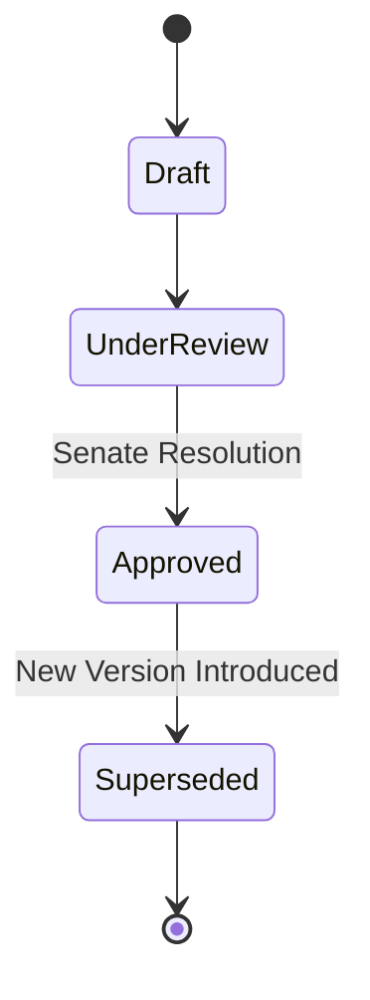

# MOD-01-03: Programme Structure & Curriculum Engine — SOFTWARE REQUIREMENTS SPECIFICATION

- **Module Identifier:** `MOD-01-03`
- **Implementation Phase:** `PHASE 01 - Foundation & Core Student Lifecycle`
- **System:** Integrated University Enterprise Resource Planning & Student Information Management System (MEMA ERP)
- **Document Version:** 1.0.0-PROD-SPEC
- **Status:** Approved Baseline / Ready for Implementation

---

## 1. Module Number and Name
- **Module ID:** `MOD-01-03`
- **Official Name:** Programme Structure & Curriculum Engine
- **Domain:** Foundation & Core Student Lifecycle

## 2. Phase & Implementation Order
- **Phase:** PHASE 01 - Foundation & Core Student Lifecycle
- **Implementation Sequence:** Foundational / Critical Path

## 3. Purpose and Objectives
Manages degree programmes, academic award levels (Certificate, Diploma, Bachelors, Masters, PhD), versioned curricula, credit requirement thresholds, prerequisite trees, elective clusters, and automated graduation rule definitions.

## 4. Scope
### 4.1 In-Scope
- Academic programme lifecycle and Senate approval states
- Curriculum structure mapping by Year and Semester
- Core vs. Elective course cluster definitions
- Prerequisite, co-requisite, and anti-requisite logic graphs
- Total credit requirements and minimum residency rules

### 4.2 Out-of-Scope
- Course offering scheduling (managed in MOD-01-04)
- Real-time student degree audit execution (managed in MOD-02-03 and MOD-01-12)

## 5. Actors / Users and Roles
| Role Name | Description | Access Level |
|---|---|---|
| **Dean / Head of Department** | Designs curriculum structure and proposes revisions. | Academic Leader |
| **Senate Secretariat** | Records Senate approval and locks curriculum versions. | Governance |
| **Curriculum Quality Officer** | Checks compliance against statutory accreditation guidelines. | QA |

## 6. Role-Based Permissions (CRUD Matrix)
| Role | Create | Read | Update | Delete | Approve / Execute |
|---|---|---|---|---|---|
| Senate Admin | YES | YES | YES | NO | YES |
| HOD / Dean | YES | YES | YES | NO | NO |
| Lecturer | NO | YES | NO | NO | NO |
| Student | NO | YES | NO | NO | NO |

## 7. End-to-End Workflows
```mermaid
graph TD
    A[Department Drafts Curriculum] --> B[School Board Verification]
    B --> C[Senate Approval & Resolution No.]
    C --> D[Curriculum Locked & Versioned (e.g. 2026.1)]
    D --> E[Assigned to New Student Cohorts]
```
### Workflow Step-by-Step Execution:
1. **Programme Definition:** Define Programme Code (e.g., BSC-CS), Award Level, Department, and Normal Duration.
2. **Curriculum Grid Assembly:** Map required core courses, electives, and credit weighting per year/semester.
3. **Dependency Mapping:** Assign prerequisite rules (e.g., CSC101 required before CSC201).
4. **Senate Approval & Locking:** Attach Senate approval minute; version becomes immutable and ready for admissions.

## 8. User Actions
| User Role | Interface / View | Action Description | Precondition | Postcondition |
|---|---|---|---|---|
| HOD | `/academics/curriculum/builder` | Construct curriculum course tree for new programme version | Departmental committee review | Curriculum version saved in Draft status |
| Senate Officer | `/academics/curriculum/approvals` | Approve and lock curriculum version with Senate minute reference | Draft curriculum submitted | Status set to Active; version becomes immutable |

## 9. Functional Requirements
### FR-CUR-001: Programme Master Registry
- **Description:** System shall maintain all university programmes with award levels, awarding school, duration, and credit rules.
- **Inputs:** Code, Name, Award Level, Department ID, Duration
- **Outputs:** Programme record
- **Validation:** Unique programme code
### FR-CUR-002: Immutable Curriculum Versioning
- **Description:** System shall version curricula. Once approved and assigned to students, historical curricula cannot be modified in place.
- **Inputs:** Curriculum structure, Version tag (e.g., 2026-V1)
- **Outputs:** Locked version entity
- **Validation:** Strict immutability upon approval

## 10. Sub-Modules
| Sub-Module ID | Sub-Module Name | Core Responsibility |
|---|---|---|
| **SUB-CUR-01** | Programme Management | Master programme catalogue, award levels, and statutory accreditation records. |
| **SUB-CUR-02** | Curriculum Builder & Course Mapper | Semester-by-semester course grids, core units, and elective groups. |
| **SUB-CUR-03** | Prerequisite Rule Engine | Graph-based dependency validator for prerequisite and co-requisite requirements. |

## 11. Features
- **Visual Curriculum Graph:** Interactive dependency graph showing prerequisite chains and credit flow.
- **Accreditation Expiry Tracker:** Automated warning 6 months prior to statutory programme accreditation expiration.

## 12. Business Rules & Logic
- **BR-MOD-01-03-001 (Strict Immutability):** No approved curriculum version with enrolled students can be altered; any revision requires a new version code.
- **BR-MOD-01-03-002 (Credit Sum Integrity):** The sum of core course credits and minimum required elective credits must equal total graduation credit threshold.

## 13. Data Requirements & Entities
### Core PostgreSQL Relational Tables:
#### Table: `curriculum.programmes`
*Description: Master academic programmes registry.*
```sql
CREATE TABLE curriculum.programmes (
    id UUID PRIMARY KEY DEFAULT gen_random_uuid(),
    code VARCHAR(30) UNIQUE NOT NULL,
    name VARCHAR(200) NOT NULL,
    award_level VARCHAR(50) NOT NULL,
    department_id UUID NOT NULL REFERENCES institution.departments(id),
    duration_years INT NOT NULL DEFAULT 4,
    total_credits_required INT NOT NULL,
    is_active BOOLEAN DEFAULT TRUE,
    created_at TIMESTAMPTZ DEFAULT CURRENT_TIMESTAMP
);
```

#### Table: `curriculum.curriculum_versions`
*Description: Versioned curriculum instances linked to student cohorts.*
```sql
CREATE TABLE curriculum.curriculum_versions (
    id UUID PRIMARY KEY DEFAULT gen_random_uuid(),
    programme_id UUID NOT NULL REFERENCES curriculum.programmes(id),
    version_code VARCHAR(50) NOT NULL,
    effective_year_id UUID NOT NULL REFERENCES institution.academic_years(id),
    senate_approval_ref VARCHAR(100),
    is_approved BOOLEAN DEFAULT FALSE,
    created_at TIMESTAMPTZ DEFAULT CURRENT_TIMESTAMP,
    UNIQUE(programme_id, version_code)
);
```


## 14. Required Fields & Schema Specification
| Field Name | Data Type | Nullable | Constraints / Foreign Keys | Description |
|---|---|---|---|---|
| `code` | `VARCHAR(30)` | `NO` | UNIQUE | Official programme code (e.g., BIT, BSC-NUR) |
| `total_credits_required` | `INT` | `NO` | > 0 | Total credits required to graduate |

## 15. Validation Rules
- **VR-MOD-01-03-001 [total_credits_required]:** Must be greater than or equal to sum of core credits.

## 16. Approval Workflows & Multi-Tier Sign-Off
Curriculum revisions require approval chain: HOD -> Dean -> Academic Board -> Senate.

## 17. Notifications, Alerts & Triggers
| Event Trigger | Recipient Channel | Message Template Summary |
|---|---|---|
| **Curriculum Approved** | `Email` (HOD & Dean) | Curriculum version {{version_code}} for {{programme_name}} has been approved by Senate. |

## 18. Dashboards & Analytics Widgets
- **Programme & Curriculum Analytics (Dean & Registrar):** Curriculum version coverage, active programmes, student cohort mapping, and accreditation calendar.

## 19. Reports
| Report ID | Title | Frequency | Output Formats | Permitted Roles |
|---|---|---|---|---|
| `REP-CUR-01` | Official Programme Specification Booklet | On-Demand | PDF | All Users |
| `REP-CUR-02` | Curriculum Structure & Course Matrix | Annual | PDF, Excel | Faculty |

## 20. Search, Filtering and Export Requirements
- **Search Capabilities:** Search by programme name, code, department, award level.
- **Filters:** School, Award Level, Active/Archived, Version.
- **Export Options:** PDF Handbook, CSV.

## 21. Audit Trails and Logging
- **Audit Level:** Comprehensive append-only logging in `audit.audit_logs`.
- **Monitored Attributes:** Curriculum creation, node changes, prerequisite link edits, approval stamps.
- **Tamper-Proofing:** Cryptographic ledger entry on version approval.

## 22. Security Requirements
- **Authentication:** Restricted to Academic Administration.
- **Data Protection:** Standard DB encryption.
- **Session Security:** Staff session.

## 23. Integrations / APIs
### Exposed REST Endpoints:
```text
GET /api/v1/curriculum/programmes
GET /api/v1/curriculum/programmes/{id}/curricula
POST /api/v1/curriculum/programmes
POST /api/v1/curriculum/versions
POST /api/v1/curriculum/versions/{id}/approve
```
### External Inbound / Outbound Feeds:
CUE/KNQA national qualification framework schema integration.

## 24. Dependencies on Other Modules
- **Inbound Dependencies (Prerequisites):** MOD-01-02 (Institutional Master Data)
- **Outbound Dependencies (Consuming Modules):** MOD-01-04 (Courses), MOD-01-05 (Admissions), MOD-01-07 (Registration), MOD-01-12 (Graduation).

## 25. System-Generated Documents
- **Programme Handbook / Syllabus Document:** Format `PDF`. Official generated programme curriculum handbook for students.

## 26. Statuses and Workflow States

- **State Descriptions:** Draft, UnderReview, Approved, Superseded.

## 27. Exception / Error Handling
| Error Code | HTTP Status | Trigger Condition | System Recovery Action |
|---|---|---|---|
| `ERR-CUR-002` | `409 Conflict` | Attempt to alter approved curriculum with active enrollments | Reject update with prompt to create a new curriculum version. |

## 28. Accessibility and Usability Requirements
- **Compliance:** WCAG 2.2 AA compliant typography, contrast ratio >= 4.5:1, keyboard navigability, screen reader aria-labels.
- **Responsive Layout:** Adaptive desktop, tablet, and mobile viewport breakpoints (320px to 2560px).

## 29. Performance Requirements & SLOs
- **Response Time:** 95% of API requests respond in < 250ms.
- **Concurrency:** Supports 2,000 concurrent active users without degradation.
- **Availability:** 99.95% uptime target.

## 30. Compliance Requirements
CUE curriculum standards and KNQA qualification descriptors.

## 31. Acceptance Criteria, Test Scenarios & Future Extensibility
### 31.1 Acceptance Criteria
- [ ] **AC-1:** Able to construct complete multi-year curriculum with core and elective course allocations.
- [ ] **AC-2:** System rejects cyclic prerequisite dependencies (e.g. A -> B -> A).
- [ ] **AC-3:** Approved curriculum versions become read-only.

### 31.2 Test Scenarios
| Scenario ID | Test Case Title | Test Steps | Expected Outcome |
|---|---|---|---|
| `TC-CUR-01` | Prevent Cyclic Prerequisites | 1. Set Course A prerequisite = Course B. 2. Set Course B prerequisite = Course A. | System returns 400 Bad Request with cyclic dependency error. |

### 31.3 Future & Extensibility Considerations
- Micro-credential mapping and automated credit transfer evaluation.
