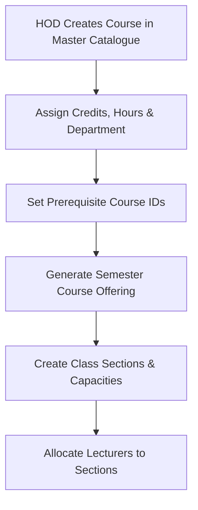
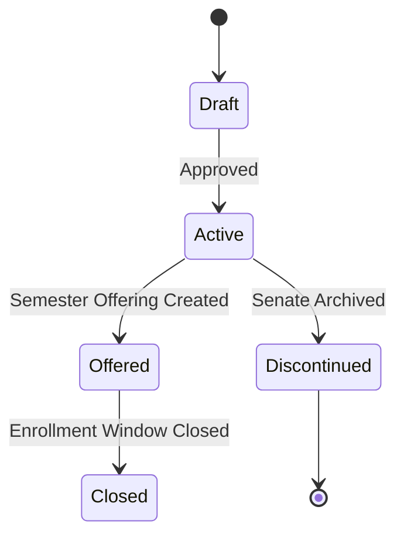

# MOD-01-04: Course Master Catalogue & Semester Offerings — SOFTWARE REQUIREMENTS SPECIFICATION

- **Module Identifier:** `MOD-01-04`
- **Implementation Phase:** `PHASE 01 - Foundation & Core Student Lifecycle`
- **System:** Integrated University Enterprise Resource Planning & Student Information Management System (MEMA ERP)
- **Document Version:** 1.0.0-PROD-SPEC
- **Status:** Approved Baseline / Ready for Implementation

---

## 1. Module Number and Name
- **Module ID:** `MOD-01-04`
- **Official Name:** Course Master Catalogue & Semester Offerings
- **Domain:** Foundation & Core Student Lifecycle

## 2. Phase & Implementation Order
- **Phase:** PHASE 01 - Foundation & Core Student Lifecycle
- **Implementation Sequence:** Foundational / Critical Path

## 3. Purpose and Objectives
Manages the master catalogue of academic courses, credit definitions, course syllabus outlines, contact hours, semester course offerings, class sections, and lecturer workload allocations.

## 4. Scope
### 4.1 In-Scope
- Master course catalogue with code, title, credits, contact hours, and department owner
- Prerequisite and co-requisite course mapping
- Semester course offerings configuration per campus and delivery mode
- Class sections creation with student capacity thresholds and waitlists
- Lecturer assignment and workload credit tracking

### 4.2 Out-of-Scope
- Real-time classroom booking and spatial clash detection (managed in MOD-01-08)
- Course syllabus content repository (managed in MOD-02-01 LMS)

## 5. Actors / Users and Roles
| Role Name | Description | Access Level |
|---|---|---|
| **Head of Department (HOD)** | Creates courses, configures semester offerings, and allocates lecturers. | Departmental Leader |
| **Dean / School Administrator** | Reviews school-wide course offerings and monitors capacity. | School Admin |
| **Lecturer** | Views assigned course sections, student rosters, and schedules. | Academic Staff |
| **Student** | Browses course descriptions, prerequisites, and offered sections. | End User |

## 6. Role-Based Permissions (CRUD Matrix)
| Role | Create | Read | Update | Delete | Approve / Execute |
|---|---|---|---|---|---|
| HOD | YES | YES | YES | NO | YES |
| Dean | NO | YES | YES | NO | YES |
| Lecturer | NO | YES | NO | NO | NO |
| Student | NO | YES | NO | NO | NO |

## 7. End-to-End Workflows

### Workflow Step-by-Step Execution:
1. **Master Course Definition:** Define Course Code (e.g., CSC201), Title, Credits, Lecture/Lab hours, and Syllabus summary.
2. **Semester Offering Activation:** Mark course as 'Offered' for active academic year/semester across target campuses.
3. **Class Section Creation:** Define Class Sections (e.g., Section A, Section B), max capacity (e.g. 80 seats), and delivery mode.
4. **Lecturer Allocation:** Assign primary and assistant lecturers with designated teaching workload credits.

## 8. User Actions
| User Role | Interface / View | Action Description | Precondition | Postcondition |
|---|---|---|---|---|
| HOD | `/academics/courses/offerings` | Generate semester course offerings and assign teaching faculty | Academic calendar is active | Course sections open for student registration |
| Lecturer | `/lecturer/courses/roster` | View and export enrolled student class lists | Assigned as course instructor | Class roster downloaded/viewed |

## 9. Functional Requirements
### FR-CRS-001: Master Course Catalogue
- **Description:** System shall maintain master courses with credits, lecture/practical hours, and ownership.
- **Inputs:** Code, Title, Credits, Department ID, Lab Hours
- **Outputs:** Master course record
- **Validation:** Unique course code
### FR-CRS-002: Semester Course Offerings
- **Description:** System shall instantiate course offerings per semester with seat limits and lecturer allocations.
- **Inputs:** Course ID, Academic Year, Semester, Section Name, Max Capacity
- **Outputs:** Offering section entity
- **Validation:** Capacity > 0

## 10. Sub-Modules
| Sub-Module ID | Sub-Module Name | Core Responsibility |
|---|---|---|
| **SUB-CRS-01** | Course Catalogue Master | Course codes, descriptions, credit weights, and syllabus descriptors. |
| **SUB-CRS-02** | Semester Offering Engine | Term-specific course availability, campus assignment, and section management. |
| **SUB-CRS-03** | Lecturer Course Allocation | Assigns teaching faculty to sections and tallies instructional workload. |

## 11. Features
- **Course Section Capacity Gates:** Real-time enforcement of section student limits with automated waitlist queue.
- **Multi-Campus Course Synchronization:** Offer identical course curriculum across multiple physical campuses.

## 12. Business Rules & Logic
- **BR-MOD-01-04-001 (Course Code Uniqueness):** Course codes must be globally unique across the university.
- **BR-MOD-01-04-002 (Active Offering Prerequisite):** Students can only enroll in courses with an active offering record in the current semester.

## 13. Data Requirements & Entities
### Core PostgreSQL Relational Tables:
#### Table: `course.courses`
*Description: Master course catalogue entity.*
```sql
CREATE TABLE course.courses (
    id UUID PRIMARY KEY DEFAULT gen_random_uuid(),
    code VARCHAR(20) UNIQUE NOT NULL,
    title VARCHAR(200) NOT NULL,
    credits INT NOT NULL DEFAULT 3,
    lecture_hours INT DEFAULT 3,
    lab_hours INT DEFAULT 0,
    department_id UUID NOT NULL REFERENCES institution.departments(id),
    is_active BOOLEAN DEFAULT TRUE,
    created_at TIMESTAMPTZ DEFAULT CURRENT_TIMESTAMP
);
```

#### Table: `course.course_offerings`
*Description: Semester course offering sections.*
```sql
CREATE TABLE course.course_offerings (
    id UUID PRIMARY KEY DEFAULT gen_random_uuid(),
    course_id UUID NOT NULL REFERENCES course.courses(id),
    semester_id UUID NOT NULL REFERENCES institution.academic_years(id),
    campus_id UUID NOT NULL REFERENCES institution.campuses(id),
    section_code VARCHAR(10) NOT NULL DEFAULT 'A',
    max_capacity INT NOT NULL DEFAULT 60,
    enrolled_count INT NOT NULL DEFAULT 0,
    lecturer_id UUID REFERENCES iam.users(id),
    is_open_for_enrollment BOOLEAN DEFAULT TRUE,
    created_at TIMESTAMPTZ DEFAULT CURRENT_TIMESTAMP,
    UNIQUE(course_id, semester_id, campus_id, section_code)
);
```


## 14. Required Fields & Schema Specification
| Field Name | Data Type | Nullable | Constraints / Foreign Keys | Description |
|---|---|---|---|---|
| `code` | `VARCHAR(20)` | `NO` | UNIQUE | Unique course code (e.g. CSC 201) |
| `title` | `VARCHAR(200)` | `NO` | NOT NULL | Official course title |
| `credits` | `INT` | `NO` | > 0 | Academic credit units |

## 15. Validation Rules
- **VR-MOD-01-04-001 [credits]:** Must be positive integer between 1 and 12.

## 16. Approval Workflows & Multi-Tier Sign-Off
New course creation requires Department Board approval followed by School Board sign-off.

## 17. Notifications, Alerts & Triggers
| Event Trigger | Recipient Channel | Message Template Summary |
|---|---|---|
| **Lecturer Assigned** | `Email + In-App` (Lecturer) | You have been allocated to teach {{course_code}} - {{course_title}} (Section {{section}}) for Semester {{semester}}. |

## 18. Dashboards & Analytics Widgets
- **Departmental Course & Workload Dashboard (HOD):** Summary of active course sections, capacity saturation percentage, and lecturer teaching hours.

## 19. Reports
| Report ID | Title | Frequency | Output Formats | Permitted Roles |
|---|---|---|---|---|
| `REP-CRS-01` | Master Course Catalogue Directory | Annual | PDF, Excel | All Users |
| `REP-CRS-02` | Semester Class Section Allocation List | Per Semester | PDF, CSV | Faculty |

## 20. Search, Filtering and Export Requirements
- **Search Capabilities:** Search by course code, title, department, or lecturer name.
- **Filters:** Department, Credits, Campus, Offering Status.
- **Export Options:** PDF Syllabus, CSV.

## 21. Audit Trails and Logging
- **Audit Level:** Comprehensive append-only logging in `audit.audit_logs`.
- **Monitored Attributes:** Course creation, credit adjustments, lecturer assignment changes.
- **Tamper-Proofing:** Audited in audit.audit_logs with previous/new value capture.

## 22. Security Requirements
- **Authentication:** Staff session required for configuration.
- **Data Protection:** Standard DB encryption.
- **Session Security:** Staff session.

## 23. Integrations / APIs
### Exposed REST Endpoints:
```text
GET /api/v1/courses
GET /api/v1/courses/{id}
GET /api/v1/courses/offerings/active
POST /api/v1/courses
POST /api/v1/courses/offerings
POST /api/v1/courses/offerings/{id}/assign-lecturer
```
### External Inbound / Outbound Feeds:
LMS Course creation API sync.

## 24. Dependencies on Other Modules
- **Inbound Dependencies (Prerequisites):** MOD-01-02 (Institutional Master Data), MOD-01-03 (Curriculum)
- **Outbound Dependencies (Consuming Modules):** MOD-01-07 (Registration & Enrollment), MOD-01-08 (Timetable), MOD-02-01 (LMS).

## 25. System-Generated Documents
- **Official Course Syllabus Outline:** Format `PDF`. Standardized course outline document detailing objectives and learning outcomes.

## 26. Statuses and Workflow States

- **State Descriptions:** Draft, Active, Offered, Closed, Discontinued.

## 27. Exception / Error Handling
| Error Code | HTTP Status | Trigger Condition | System Recovery Action |
|---|---|---|---|
| `ERR-CRS-001` | `409 Conflict` | Duplicate course code within institution | Prompt user with existing course details. |

## 28. Accessibility and Usability Requirements
- **Compliance:** WCAG 2.2 AA compliant typography, contrast ratio >= 4.5:1, keyboard navigability, screen reader aria-labels.
- **Responsive Layout:** Adaptive desktop, tablet, and mobile viewport breakpoints (320px to 2560px).

## 29. Performance Requirements & SLOs
- **Response Time:** 95% of API requests respond in < 250ms.
- **Concurrency:** Supports 5,000 concurrent active users without degradation.
- **Availability:** 99.95% uptime target.

## 30. Compliance Requirements
CUE guidelines on instructional contact hours per credit unit.

## 31. Acceptance Criteria, Test Scenarios & Future Extensibility
### 31.1 Acceptance Criteria
- [ ] **AC-1:** Able to configure master courses and map prerequisite rules.
- [ ] **AC-2:** System creates semester offerings per campus and binds class sections to assigned lecturers.
- [ ] **AC-3:** Enrollment count automatically increments upon student enrollment.

### 31.2 Test Scenarios
| Scenario ID | Test Case Title | Test Steps | Expected Outcome |
|---|---|---|---|
| `TC-CRS-01` | Create Course and Semester Offering | 1. Post new course. 2. Post semester offering with capacity 50. 3. Query active offerings. | Course offering appears in active offerings list. |

### 31.3 Future & Extensibility Considerations
- Automated syllabus generation using generative AI based on curriculum learning outcomes.
