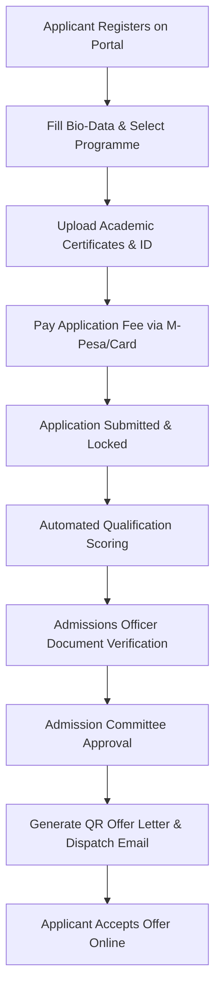
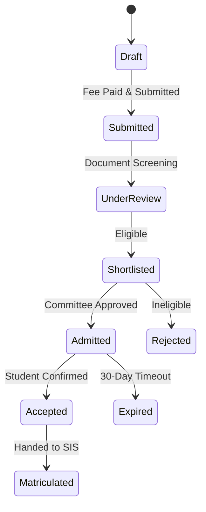

# MOD-01-05: Student Recruitment, Applications & Admissions — SOFTWARE REQUIREMENTS SPECIFICATION

- **Module Identifier:** `MOD-01-05`
- **Implementation Phase:** `PHASE 01 - Foundation & Core Student Lifecycle`
- **System:** Integrated University Enterprise Resource Planning & Student Information Management System (MEMA ERP)
- **Document Version:** 1.0.0-PROD-SPEC
- **Status:** Approved Baseline / Ready for Implementation

---

## 1. Module Number and Name
- **Module ID:** `MOD-01-05`
- **Official Name:** Student Recruitment, Applications & Admissions
- **Domain:** Foundation & Core Student Lifecycle

## 2. Phase & Implementation Order
- **Phase:** PHASE 01 - Foundation & Core Student Lifecycle
- **Implementation Sequence:** Foundational / Critical Path

## 3. Purpose and Objectives
Manages the prospective student pipeline, public applicant portal, multi-step application submission, document uploads, application fee payments, automated qualification screening, admission committee scoring, offer letter generation, and online acceptance capture.

## 4. Scope
### 4.1 In-Scope
- Prospect enquiry CRM and recruitment campaign tracking
- Online applicant registration and multi-stage application forms
- Document uploads (transcripts, certificates, national ID, passport photo)
- Application fee payment gateway integration and receipting
- Configurable automated entry qualification scoring (e.g. KCSE grade calculation)
- Admission committee review, offer letter issuance (with QR code), and acceptance workflow

### 4.2 Out-of-Scope
- Matriculated student record maintenance (managed in MOD-01-06 SIS)
- Semester registration (managed in MOD-01-07)

## 5. Actors / Users and Roles
| Role Name | Description | Access Level |
|---|---|---|
| **Applicant** | Registers, completes application, uploads documents, pays fees, and accepts offer. | External User |
| **Admissions Officer** | Verifies documents, screens eligibility, and processes admission batches. | Admissions Staff |
| **Admissions Committee / Dean** | Reviews borderline applications and approves final admission lists. | Academic Leader |
| **Finance Officer** | Reconciles application fee payments and clears applicants. | Finance Staff |

## 6. Role-Based Permissions (CRUD Matrix)
| Role | Create | Read | Update | Delete | Approve / Execute |
|---|---|---|---|---|---|
| Admissions Officer | YES | YES | YES | NO | YES |
| Admissions Committee | NO | YES | YES | NO | YES |
| Finance Officer | NO | YES | YES | NO | NO |
| Applicant | Self | Self | Self | NO | Self |

## 7. End-to-End Workflows

### Workflow Step-by-Step Execution:
1. **Applicant Registration:** Applicant creates profile with email/phone verification.
2. **Application Submission:** Selects Programme, Study Mode, Campus, inputs prior qualifications, and uploads certificates.
3. **Fee Payment:** Pays non-refundable application fee via M-Pesa / Bank / Card gateway with instant receipt.
4. **Verification & Scoring:** System evaluates minimum criteria; Admissions Officer verifies certificate validity.
5. **Offer Issuance & Acceptance:** Approved applicants receive digitally signed Admission Letter and accept online.

## 8. User Actions
| User Role | Interface / View | Action Description | Precondition | Postcondition |
|---|---|---|---|---|
| Applicant | `/apply/portal` | Submit application form and upload scanned certificates | Registered applicant account | Application status moves to Submitted |
| Admissions Officer | `/admin/admissions/screening` | Verify academic documents and approve/reject applicant | Application fee paid | Status moves to Shortlisted / Admitted |
| Applicant | `/apply/status` | Download official admission letter and confirm acceptance | Status is Admitted | Status moves to Accepted, triggers matriculation pipeline |

## 9. Functional Requirements
### FR-ADM-001: Online Applicant Portal
- **Description:** System shall provide a mobile-responsive public application portal supporting step-by-step application forms.
- **Inputs:** Applicant bio-data, academic history, documents
- **Outputs:** Application record with unique Reference Number
- **Validation:** Mandatory fields validated, files < 5MB PDF/JPG
### FR-ADM-002: Application Fee Gateway Integration
- **Description:** System shall calculate and collect application fees via payment gateways before allowing submission.
- **Inputs:** Application ID, Payment Channel, Transaction Ref
- **Outputs:** Payment receipt & Unlocked submission
- **Validation:** Gateway verified callback
### FR-ADM-003: Admission Offer Generator
- **Description:** System shall generate tamper-proof PDF admission offer letters with unique verification QR codes.
- **Inputs:** Approved Application ID
- **Outputs:** Cryptographically signed PDF Admission Letter
- **Validation:** Committee approval timestamp recorded

## 10. Sub-Modules
| Sub-Module ID | Sub-Module Name | Core Responsibility |
|---|---|---|
| **SUB-ADM-01** | Prospect & CRM Engine | Lead capture, open day campaigns, enquiries, and recruitment conversion funnel. |
| **SUB-ADM-02** | Applicant Portal | Public multi-step application interface, document uploaders, and status tracking. |
| **SUB-ADM-03** | Admissions Processing & Evaluation | Document verification desk, automated qualification scoring, and committee review. |
| **SUB-ADM-04** | Offer & Acceptance Hub | Digital admission letters, QR verification, joining instructions, and acceptance capture. |

## 11. Features
- **Automated KCSE / IGCSE Scoring:** Auto-computes aggregate cluster points and flags programme eligibility.
- **Bulk KUCCPS Placement Ingestion:** Parses and ingests national government placement lists directly into admissions database.

## 12. Business Rules & Logic
- **BR-MOD-01-05-001 (Payment Lockout):** An application cannot be submitted for officer review until the mandatory application fee is fully reconciled.
- **BR-MOD-01-05-002 (Offer Expiration):** Admission offers expire after 30 days if not formally accepted by the applicant online.

## 13. Data Requirements & Entities
### Core PostgreSQL Relational Tables:
#### Table: `admission.applications`
*Description: Primary applicant submission records.*
```sql
CREATE TABLE admission.applications (
    id UUID PRIMARY KEY DEFAULT gen_random_uuid(),
    application_number VARCHAR(50) UNIQUE NOT NULL,
    person_id UUID NOT NULL REFERENCES student.persons(id),
    programme_id UUID NOT NULL REFERENCES curriculum.programmes(id),
    campus_id UUID NOT NULL REFERENCES institution.campuses(id),
    intake_id UUID NOT NULL REFERENCES institution.academic_years(id),
    status VARCHAR(50) NOT NULL DEFAULT 'Draft',
    is_fee_paid BOOLEAN DEFAULT FALSE,
    qualification_score NUMERIC(5,2),
    offer_letter_url VARCHAR(500),
    offer_accepted_at TIMESTAMPTZ,
    created_at TIMESTAMPTZ DEFAULT CURRENT_TIMESTAMP
);
```


## 14. Required Fields & Schema Specification
| Field Name | Data Type | Nullable | Constraints / Foreign Keys | Description |
|---|---|---|---|---|
| `application_number` | `VARCHAR(50)` | `NO` | UNIQUE | Unique application reference (e.g., APP-2026-00123) |
| `programme_id` | `UUID` | `NO` | FK to curriculum.programmes | Target degree programme |

## 15. Validation Rules
- **VR-MOD-01-05-001 [qualification_score]:** Must satisfy minimum cut-off threshold defined for target programme.

## 16. Approval Workflows & Multi-Tier Sign-Off
Borderline admissions or special criteria applications require sign-off by Admissions Committee Chairperson / Dean.

## 17. Notifications, Alerts & Triggers
| Event Trigger | Recipient Channel | Message Template Summary |
|---|---|---|
| **Application Submitted** | `Email + SMS` (Applicant) | Application {{application_number}} received for {{programme_name}}. Track status online. |
| **Admission Offer Issued** | `Email + SMS` (Applicant) | Congratulations! You have been offered admission to {{programme_name}}. Log in to download your official letter. |

## 18. Dashboards & Analytics Widgets
- **Admissions Funnel Executive Dashboard (Admissions Director & VC):** Real-time funnel conversion metrics: Leads -> Applications -> Paid -> Admitted -> Accepted.

## 19. Reports
| Report ID | Title | Frequency | Output Formats | Permitted Roles |
|---|---|---|---|---|
| `REP-ADM-01` | Comprehensive Admissions & Intake Roll | Per Intake | PDF, Excel | Admissions, Registrar |
| `REP-ADM-02` | Application Fee Revenue Reconciled Report | Daily | CSV, PDF | Finance |

## 20. Search, Filtering and Export Requirements
- **Search Capabilities:** Search by application number, applicant name, national ID, or phone.
- **Filters:** Programme, Campus, Intake, Status, Payment State.
- **Export Options:** Excel, PDF Summary, CSV.

## 21. Audit Trails and Logging
- **Audit Level:** Comprehensive append-only logging in `audit.audit_logs`.
- **Monitored Attributes:** Application status transitions, score evaluations, document approval stamps.
- **Tamper-Proofing:** Audited with officer ID and immutable audit records.

## 22. Security Requirements
- **Authentication:** Public registration with email/SMS verification; HTTPS TLS 1.3.
- **Data Protection:** Encrypted storage of applicant identification documents.
- **Session Security:** Applicant session.

## 23. Integrations / APIs
### Exposed REST Endpoints:
```text
POST /api/v1/admissions/register
POST /api/v1/admissions/applications
POST /api/v1/admissions/applications/{id}/submit
POST /api/v1/admissions/applications/{id}/pay
GET  /api/v1/admissions/applications/{id}/status
POST /api/v1/admissions/applications/{id}/accept-offer
POST /api/v1/admissions/kuccps/import
```
### External Inbound / Outbound Feeds:
KUCCPS placement API, M-Pesa Daraja API, SMS Gateway.

## 24. Dependencies on Other Modules
- **Inbound Dependencies (Prerequisites):** MOD-01-01 (IAM), MOD-01-02 (Institution), MOD-01-03 (Curriculum)
- **Outbound Dependencies (Consuming Modules):** MOD-01-06 (Student Onboarding & SIS), MOD-01-09 (Finance).

## 25. System-Generated Documents
- **Official Admission Letter & Joining Instructions:** Format `PDF with QR Code`. Cryptographically signed official university admission offer letter with QR verification URL.
- **Medical Examination & Clearance Form:** Format `PDF`. Standard medical clearance form to be completed prior to physical reporting.

## 26. Statuses and Workflow States

- **State Descriptions:** Draft, Submitted, UnderReview, Shortlisted, Admitted, Rejected, Accepted, Expired, Matriculated.

## 27. Exception / Error Handling
| Error Code | HTTP Status | Trigger Condition | System Recovery Action |
|---|---|---|---|
| `ERR-ADM-004` | `402 Payment Required` | Attempt to submit application without verified fee receipt | Redirect to payment gateway screen. |

## 28. Accessibility and Usability Requirements
- **Compliance:** WCAG 2.2 AA compliant typography, contrast ratio >= 4.5:1, keyboard navigability, screen reader aria-labels.
- **Responsive Layout:** Adaptive desktop, tablet, and mobile viewport breakpoints (320px to 2560px).

## 29. Performance Requirements & SLOs
- **Response Time:** 95% of API requests respond in < 250ms.
- **Concurrency:** Supports 10,000 concurrent active users without degradation.
- **Availability:** 99.95% uptime target.

## 30. Compliance Requirements
Universities Act Admissions standards and Kenya Data Protection Act.

## 31. Acceptance Criteria, Test Scenarios & Future Extensibility
### 31.1 Acceptance Criteria
- [ ] **AC-1:** Applicant completes multi-step form, uploads certificates, and pays fee via M-Pesa/Card.
- [ ] **AC-2:** Admissions Officer reviews and approves eligible candidates.
- [ ] **AC-3:** System generates verifiable PDF admission letter with working QR code.
- [ ] **AC-4:** Applicant accepts offer online, transitioning record to Matriculation readiness.

### 31.2 Test Scenarios
| Scenario ID | Test Case Title | Test Steps | Expected Outcome |
|---|---|---|---|
| `TC-ADM-01` | End-to-End Application to Offer Acceptance | 1. Register applicant. 2. Submit BSc CS application. 3. Mock M-Pesa payment. 4. Officer approves admission. 5. Applicant accepts offer. | Application status = Accepted, ready for student number generation. |

### 31.3 Future & Extensibility Considerations
- AI automated document authenticity verification and OCR certificate reading.
