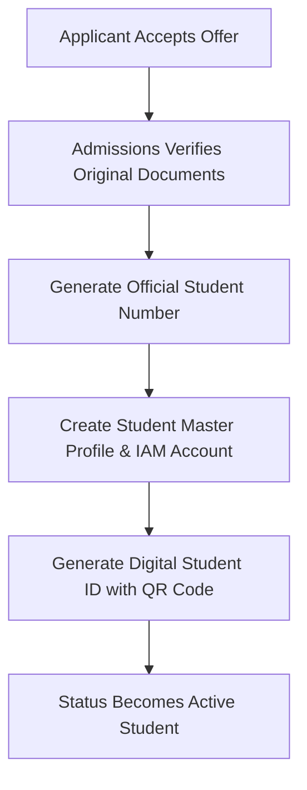
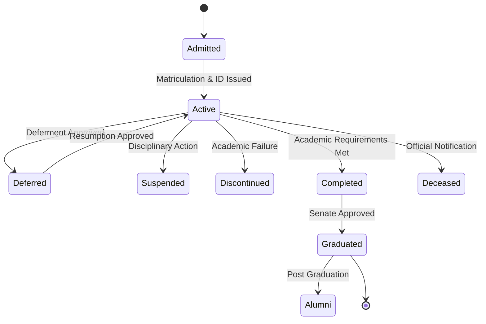

# MOD-01-06: Student Matriculation & Master Records (SIS) — SOFTWARE REQUIREMENTS SPECIFICATION

- **Module Identifier:** `MOD-01-06`
- **Implementation Phase:** `PHASE 01 - Foundation & Core Student Lifecycle`
- **System:** Integrated University Enterprise Resource Planning & Student Information Management System (MEMA ERP)
- **Document Version:** 1.0.0-PROD-SPEC
- **Status:** Approved Baseline / Ready for Implementation

---

## 1. Module Number and Name
- **Module ID:** `MOD-01-06`
- **Official Name:** Student Matriculation & Master Records (SIS)
- **Domain:** Foundation & Core Student Lifecycle

## 2. Phase & Implementation Order
- **Phase:** PHASE 01 - Foundation & Core Student Lifecycle
- **Implementation Sequence:** Foundational / Critical Path

## 3. Purpose and Objectives
Acts as the canonical master student information system (SIS). Generates permanent institutional Student Numbers, manages biometric profiles, national ID/passport data, next-of-kin, disability records, digital student IDs, and comprehensive academic status history.

## 4. Scope
### 4.1 In-Scope
- Automated unique Student Number generation (schema: PROG/YEAR/SEQ)
- Matriculation ceremony roll and student pledge tracking
- Complete bio-data master record (contacts, address, disability, next of kin)
- Digital Student ID Card generation with QR verification
- Academic status lifecycle machine (Active, Deferred, Suspended, Withdrawn, Graduated)
- Central student digital document repository

### 4.2 Out-of-Scope
- Semester course enrollment transactions (managed in MOD-01-07)
- Fee transaction ledger calculations (managed in MOD-01-09)

## 5. Actors / Users and Roles
| Role Name | Description | Access Level |
|---|---|---|
| **Registrar (Academic)** | Controls student number allocation schemas and official status changes. | Academic Executive |
| **Admissions / Matriculation Officer** | Verifies physical original certificates and executes matriculation. | Admissions Staff |
| **Student** | Views master profile, downloads digital student ID card, updates contact information. | End User |

## 6. Role-Based Permissions (CRUD Matrix)
| Role | Create | Read | Update | Delete | Approve / Execute |
|---|---|---|---|---|---|
| Registrar | YES | YES | YES | NO | YES |
| Admissions Officer | YES | YES | YES | NO | YES |
| Lecturer | NO | YES | NO | NO | NO |
| Student | NO | Self | Self(Contacts Only) | NO | NO |

## 7. End-to-End Workflows

### Workflow Step-by-Step Execution:
1. **Matriculation Verification:** Officer verifies original certificates against application uploads.
2. **Student Number Allocation:** System atomically issues unique Student Number (e.g. CS/2026/0045) from sequence generator.
3. **Profile Initialization:** Canonical Student Profile created and linked to Person master record.
4. **Digital ID Issuance:** Generates cryptographically signed mobile-friendly Digital Student ID Card with QR.

## 8. User Actions
| User Role | Interface / View | Action Description | Precondition | Postcondition |
|---|---|---|---|---|
| Admissions Officer | `/admin/matriculation` | Verify documents and trigger matriculation batch | Applicant accepted offer | Student number generated, IAM credentials dispatched |
| Student | `/student/profile` | View bio-data and download digital student ID card | Active student account | Digital ID displayed with active verification QR |

## 9. Functional Requirements
### FR-SIS-001: Unique Student Number Generator
- **Description:** System shall atomically generate structured unique student registration numbers based on programme code, entry year, and sequence.
- **Inputs:** Programme ID, Academic Year ID
- **Outputs:** Unique Student Number string
- **Validation:** Unique constraint enforced at DB level
### FR-SIS-002: Digital Student ID Card Generator
- **Description:** System shall render a printable and mobile-displayable digital student ID card with dynamic QR verification token.
- **Inputs:** Student ID
- **Outputs:** Signed Digital ID Card Asset
- **Validation:** Active student status required

## 10. Sub-Modules
| Sub-Module ID | Sub-Module Name | Core Responsibility |
|---|---|---|
| **SUB-SIS-01** | Matriculation & Numbering Engine | Controls student number sequences, intake cohorts, and matriculation rolls. |
| **SUB-SIS-02** | Student Bio-Data & Profile Master | Central store for personal, demographic, contact, and emergency details. |
| **SUB-SIS-03** | Digital ID & Smart Card Hub | Generates QR-coded digital IDs, card replacement requests, and card status flags. |
| **SUB-SIS-04** | Student Document Repository | Secure vault for birth certificates, national IDs, photos, and admission credentials. |

## 11. Features
- **One Student ID Architecture:** Single permanent institutional identifier connecting admissions, fees, LMS, exams, and alumni.
- **Dynamic Status Machine:** Audited lifecycle engine managing Active, Deferment, Suspension, and Graduation states.

## 12. Business Rules & Logic
- **BR-MOD-01-06-001 (Student Number Permanence):** A student number once issued can never be re-assigned or modified, even if the student changes programmes.
- **BR-MOD-01-06-002 (Critical Bio-Data Locking):** Legal names, date of birth, and nationality can only be modified by the Registrar upon receipt of official deed poll/gazette notice.

## 13. Data Requirements & Entities
### Core PostgreSQL Relational Tables:
#### Table: `student.persons`
*Description: Master personal entity linking applicants, students, staff, and alumni.*
```sql
CREATE TABLE student.persons (
    id UUID PRIMARY KEY DEFAULT gen_random_uuid(),
    first_name VARCHAR(100) NOT NULL,
    middle_name VARCHAR(100),
    last_name VARCHAR(100) NOT NULL,
    gender VARCHAR(10) NOT NULL,
    date_of_birth DATE NOT NULL,
    national_id_passport VARCHAR(50) UNIQUE NOT NULL,
    nationality VARCHAR(100) NOT NULL DEFAULT 'Kenyan',
    phone_number VARCHAR(30) NOT NULL,
    email VARCHAR(255) UNIQUE NOT NULL,
    created_at TIMESTAMPTZ DEFAULT CURRENT_TIMESTAMP
);
```

#### Table: `student.students`
*Description: Canonical student academic master record.*
```sql
CREATE TABLE student.students (
    id UUID PRIMARY KEY DEFAULT gen_random_uuid(),
    student_number VARCHAR(50) UNIQUE NOT NULL,
    person_id UUID NOT NULL REFERENCES student.persons(id),
    programme_id UUID NOT NULL REFERENCES curriculum.programmes(id),
    curriculum_version_id UUID NOT NULL REFERENCES curriculum.curriculum_versions(id),
    campus_id UUID NOT NULL REFERENCES institution.campuses(id),
    entry_academic_year_id UUID NOT NULL REFERENCES institution.academic_years(id),
    entry_intake_id UUID NOT NULL REFERENCES institution.academic_years(id),
    study_mode VARCHAR(50) NOT NULL DEFAULT 'Full-Time',
    current_academic_standing VARCHAR(50) DEFAULT 'Good Standing',
    status VARCHAR(50) NOT NULL DEFAULT 'Active',
    photo_url VARCHAR(500),
    created_at TIMESTAMPTZ DEFAULT CURRENT_TIMESTAMP
);
```


## 14. Required Fields & Schema Specification
| Field Name | Data Type | Nullable | Constraints / Foreign Keys | Description |
|---|---|---|---|---|
| `student_number` | `VARCHAR(50)` | `NO` | UNIQUE | Official institutional registration number |
| `national_id_passport` | `VARCHAR(50)` | `NO` | UNIQUE | Government issued ID or passport number |

## 15. Validation Rules
- **VR-MOD-01-06-001 [date_of_birth]:** Must be at least 15 years prior to matriculation date.

## 16. Approval Workflows & Multi-Tier Sign-Off
Student status transitions (e.g. Deferment, Resumption, Discontinuation) require Registrar sign-off.

## 17. Notifications, Alerts & Triggers
| Event Trigger | Recipient Channel | Message Template Summary |
|---|---|---|
| **Student Number Issued** | `Email + SMS` (Student) | Welcome to MEMA ERP! Your official Student Number is {{student_number}}. Log in to access your portal. |

## 18. Dashboards & Analytics Widgets
- **Student Body Demographics & Enrollment Dashboard (Registrar & VC):** Real-time student headcount by gender, programme, campus, nationality, and cohort.

## 19. Reports
| Report ID | Title | Frequency | Output Formats | Permitted Roles |
|---|---|---|---|---|
| `REP-SIS-01` | Official Matriculation Register Roll | Per Intake | PDF | Registrar |
| `REP-SIS-02` | Comprehensive Student Master Directory | On-Demand | CSV, Excel | Administration |

## 20. Search, Filtering and Export Requirements
- **Search Capabilities:** Instant search by student number, national ID, full name, or email.
- **Filters:** Programme, School, Campus, Year of Study, Status.
- **Export Options:** PDF Profile, CSV, Excel.

## 21. Audit Trails and Logging
- **Audit Level:** Comprehensive append-only logging in `audit.audit_logs`.
- **Monitored Attributes:** Student status updates, bio-data changes, student ID card re-issuances.
- **Tamper-Proofing:** Append-only change ledger with authorizing officer ID.

## 22. Security Requirements
- **Authentication:** Restricted to authorized Registrar and Student Affairs staff.
- **Data Protection:** AES-256 encrypted storage of identification and medical documents.
- **Session Security:** Staff session.

## 23. Integrations / APIs
### Exposed REST Endpoints:
```text
GET /api/v1/students
GET /api/v1/students/{id}
GET /api/v1/students/by-number/{studentNumber}
POST /api/v1/students/matriculate
PATCH /api/v1/students/{id}/status
GET /api/v1/students/{id}/digital-id
```
### External Inbound / Outbound Feeds:
National Identity verification API (IPRS), Smart card printing hardware integration.

## 24. Dependencies on Other Modules
- **Inbound Dependencies (Prerequisites):** MOD-01-05 (Admissions), MOD-01-03 (Curriculum)
- **Outbound Dependencies (Consuming Modules):** All student modules (Registration, Finance, Exams, Portals, Graduation).

## 25. System-Generated Documents
- **Digital Student ID Card:** Format `PDF / Mobile Pass`. Official digital student ID card featuring photo, student number, barcode, and QR verification token.

## 26. Statuses and Workflow States

- **State Descriptions:** Admitted, Active, Deferred, Suspended, Discontinued, Completed, Graduated, Alumni, Deceased.

## 27. Exception / Error Handling
| Error Code | HTTP Status | Trigger Condition | System Recovery Action |
|---|---|---|---|
| `ERR-SIS-001` | `409 Conflict` | Attempt to generate duplicate student number | Atomic sequence retry loop. |

## 28. Accessibility and Usability Requirements
- **Compliance:** WCAG 2.2 AA compliant typography, contrast ratio >= 4.5:1, keyboard navigability, screen reader aria-labels.
- **Responsive Layout:** Adaptive desktop, tablet, and mobile viewport breakpoints (320px to 2560px).

## 29. Performance Requirements & SLOs
- **Response Time:** 95% of API requests respond in < 250ms.
- **Concurrency:** Supports 10,000 concurrent active users without degradation.
- **Availability:** 99.95% uptime target.

## 30. Compliance Requirements
Kenya Data Protection Act 2019 and Universities Act Student Records retention regulations.

## 31. Acceptance Criteria, Test Scenarios & Future Extensibility
### 31.1 Acceptance Criteria
- [ ] **AC-1:** System generates unique student numbers following institutional formatting rules.
- [ ] **AC-2:** Canonical student profile links seamlessly to application history and IAM login.
- [ ] **AC-3:** Digital student ID card generates with verifiable dynamic QR code.
- [ ] **AC-4:** Status transitions are strictly audited and reflected immediately across all portal gates.

### 31.2 Test Scenarios
| Scenario ID | Test Case Title | Test Steps | Expected Outcome |
|---|---|---|---|
| `TC-SIS-01` | Matriculate Accepted Applicant | 1. Post matriculation request for accepted applicant. 2. Verify student number format. 3. Check student profile creation. | Student record created with status Active and unique student number. |

### 31.3 Future & Extensibility Considerations
- Integration with Apple Wallet / Google Wallet for contactless NFC campus access.
