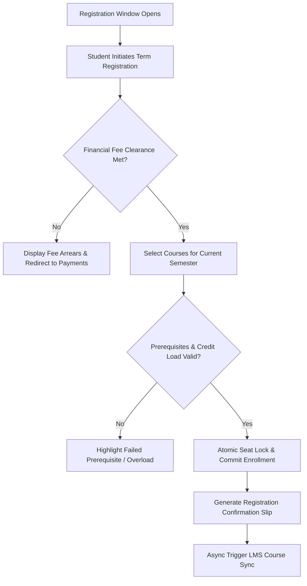
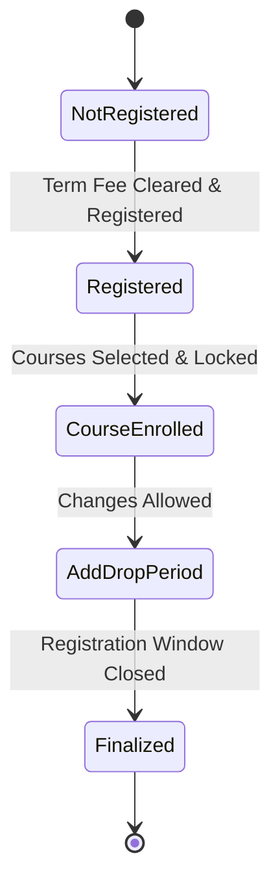

# MOD-01-07: Semester Registration & Course Enrollment Engine — SOFTWARE REQUIREMENTS SPECIFICATION

- **Module Identifier:** `MOD-01-07`
- **Implementation Phase:** `PHASE 01 - Foundation & Core Student Lifecycle`
- **System:** Integrated University Enterprise Resource Planning & Student Information Management System (MEMA ERP)
- **Document Version:** 1.0.0-PROD-SPEC
- **Status:** Approved Baseline / Ready for Implementation

---

## 1. Module Number and Name
- **Module ID:** `MOD-01-07`
- **Official Name:** Semester Registration & Course Enrollment Engine
- **Domain:** Foundation & Core Student Lifecycle

## 2. Phase & Implementation Order
- **Phase:** PHASE 01 - Foundation & Core Student Lifecycle
- **Implementation Sequence:** Foundational / Critical Path

## 3. Purpose and Objectives
Governs the high-concurrency semester registration and course enrollment process. Validates academic standing, financial fee clearance thresholds, prerequisite fulfillment, maximum credit loads, and executes atomic seat allocations.

## 4. Scope
### 4.1 In-Scope
- Semester / session registration self-service
- Real-time fee payment threshold validation (e.g. 50% fees paid to register)
- Course selection, add/drop workflows, and elective cluster picking
- Graph-based automated prerequisite validation engine
- Atomic seat reservation using Redis/PostgreSQL row locking
- Automated course roster generation and LMS sync triggers

### 4.2 Out-of-Scope
- Exam card printing eligibility (managed in MOD-01-10)
- Timetable clash resolution algorithms (managed in MOD-01-08)

## 5. Actors / Users and Roles
| Role Name | Description | Access Level |
|---|---|---|
| **Student** | Registers for the active semester, selects courses, and adds/drops units. | End User |
| **Academic Advisor / HOD** | Reviews and approves course overload or special substitution requests. | Departmental Staff |
| **Registrar** | Opens/closes registration windows and late registration penalty flags. | Academic Executive |

## 6. Role-Based Permissions (CRUD Matrix)
| Role | Create | Read | Update | Delete | Approve / Execute |
|---|---|---|---|---|---|
| Student | Self | Self | Self | Self | NO |
| HOD / Advisor | NO | YES | YES | NO | YES |
| Registrar | YES | YES | YES | NO | YES |

## 7. End-to-End Workflows

### Workflow Step-by-Step Execution:
1. **Registration Window Gate:** System verifies current date falls within active registration calendar window.
2. **Financial Clearance Verification:** Real-time check against student fee ledger; requires required minimum payment percentage.
3. **Course Selection & Validation:** Student selects course sections; engine validates prerequisites against passed transcript history.
4. **Atomic Enrollment:** Row-level lock on class section capacity; increments enrolled count and commits record.
5. **Confirmation & LMS Sync:** Generates digitally stamped Registration Slip and emits asynchronous event to LMS.

## 8. User Actions
| User Role | Interface / View | Action Description | Precondition | Postcondition |
|---|---|---|---|---|
| Student | `/student/registration` | Complete semester registration and select courses | Active student status and financial clearance | Courses registered, enrollment slip generated |
| HOD | `/admin/registration/overrides` | Approve prerequisite waiver or credit overload | Student submitted override request | Student unlocked to register requested course |

## 9. Functional Requirements
### FR-REG-001: Online Semester Registration
- **Description:** System shall provide self-service term registration gated by academic standing and financial clearance.
- **Inputs:** Student ID, Term ID
- **Outputs:** Term Registration record
- **Validation:** Active student, minimum fee balance threshold met
### FR-REG-002: Prerequisite & Credit Limit Validator
- **Description:** System shall enforce prerequisite course completion and prevent registration exceeding max credit limit (e.g. 24 credits/semester).
- **Inputs:** Selected Course Offering IDs
- **Outputs:** Validation status (Pass/Fail with error details)
- **Validation:** All prerequisite courses have passing grade on record
### FR-REG-003: Atomic Seat Capacity Lock
- **Description:** System shall prevent section over-enrollment under concurrent registration loads using atomic database transactions.
- **Inputs:** Section ID, Student ID
- **Outputs:** Enrolled confirmation or Section Full error
- **Validation:** enrolled_count < max_capacity

## 10. Sub-Modules
| Sub-Module ID | Sub-Module Name | Core Responsibility |
|---|---|---|
| **SUB-REG-01** | Semester Registration Gate | Validates term eligibility, financial clearance, and registration date windows. |
| **SUB-REG-02** | Course Enrollment Engine | Executes course selection, prerequisite checks, core/elective validation, and seat reservations. |
| **SUB-REG-03** | Add / Drop & Substitution Desk | Handles course changes within the approved add/drop window with audit tracking. |
| **SUB-REG-04** | Special Approval & Override Hub | Workflows for credit overloads, prerequisite waivers, and late registration approvals. |

## 11. Features
- **High-Concurrency Concurrency Manager:** Redis-backed distributed seat queue ensuring 0% oversold section capacity during peak registration rushes.
- **Instant Registration Slip Generator:** QR-stamped PDF registration slip certifying official semester enrollment.

## 12. Business Rules & Logic
- **BR-MOD-01-07-001 (Fee Threshold Enforcement):** Students with less than configured threshold (e.g. 50% semester tuition paid) are hard-blocked from course enrollment.
- **BR-MOD-01-07-002 (Add/Drop Window Strictness):** Course add/drop operations are strictly disabled after the official Senate deadline without Registrar authorization.

## 13. Data Requirements & Entities
### Core PostgreSQL Relational Tables:
#### Table: `enrollment.term_registrations`
*Description: Official student semester registration record.*
```sql
CREATE TABLE enrollment.term_registrations (
    id UUID PRIMARY KEY DEFAULT gen_random_uuid(),
    student_id UUID NOT NULL REFERENCES student.students(id),
    semester_id UUID NOT NULL REFERENCES institution.academic_years(id),
    registered_at TIMESTAMPTZ DEFAULT CURRENT_TIMESTAMP,
    financial_clearance_status BOOLEAN NOT NULL DEFAULT FALSE,
    academic_year_of_study INT NOT NULL DEFAULT 1,
    status VARCHAR(50) NOT NULL DEFAULT 'Registered',
    UNIQUE(student_id, semester_id)
);
```

#### Table: `enrollment.course_enrollments`
*Description: Individual course section enrollments per student.*
```sql
CREATE TABLE enrollment.course_enrollments (
    id UUID PRIMARY KEY DEFAULT gen_random_uuid(),
    term_registration_id UUID NOT NULL REFERENCES enrollment.term_registrations(id),
    student_id UUID NOT NULL REFERENCES student.students(id),
    course_offering_id UUID NOT NULL REFERENCES course.course_offerings(id),
    enrolled_at TIMESTAMPTZ DEFAULT CURRENT_TIMESTAMP,
    status VARCHAR(50) NOT NULL DEFAULT 'Enrolled',
    is_retake BOOLEAN DEFAULT FALSE,
    UNIQUE(student_id, course_offering_id)
);
```


## 14. Required Fields & Schema Specification
| Field Name | Data Type | Nullable | Constraints / Foreign Keys | Description |
|---|---|---|---|---|
| `student_id` | `UUID` | `NO` | FK to student.students | Enrolled student reference |
| `course_offering_id` | `UUID` | `NO` | FK to course.course_offerings | Course section offering reference |

## 15. Validation Rules
- **VR-MOD-01-07-001 [total_credits]:** Sum of registered course credits must not exceed max allowed credit load (e.g. 24 credits).

## 16. Approval Workflows & Multi-Tier Sign-Off
Credit overloads (>24 credits) require digital sign-off from Academic Advisor and Dean.

## 17. Notifications, Alerts & Triggers
| Event Trigger | Recipient Channel | Message Template Summary |
|---|---|---|
| **Registration Successful** | `Email + Portal Alert` (Student) | Registration confirmed for {{semester_name}}. You are enrolled in {{course_count}} courses. |

## 18. Dashboards & Analytics Widgets
- **Live Enrollment Velocity Dashboard (Registrar & HOD):** Real-time registration throughput, section capacity bottlenecks, and un-registered student counts.

## 19. Reports
| Report ID | Title | Frequency | Output Formats | Permitted Roles |
|---|---|---|---|---|
| `REP-REG-01` | Official Semester Class Roster | Per Semester | PDF, Excel | Lecturers, HODs |
| `REP-REG-02` | Unregistered Active Students Exception List | Weekly during registration | CSV | Advisors |

## 20. Search, Filtering and Export Requirements
- **Search Capabilities:** Search by student number, course code, section, or semester.
- **Filters:** School, Department, Programme, Year of Study, Registration Status.
- **Export Options:** PDF Roster, CSV.

## 21. Audit Trails and Logging
- **Audit Level:** Comprehensive append-only logging in `audit.audit_logs`.
- **Monitored Attributes:** Course add, drop, section swap, prerequisite override, credit limit override.
- **Tamper-Proofing:** Append-only registration audit trail.

## 22. Security Requirements
- **Authentication:** Student session with active financial clearance check.
- **Data Protection:** TLS 1.3.
- **Session Security:** Student session.

## 23. Integrations / APIs
### Exposed REST Endpoints:
```text
POST /api/v1/enrollment/register-term
GET  /api/v1/enrollment/available-courses
POST /api/v1/enrollment/courses/enroll
DELETE /api/v1/enrollment/courses/{id}/drop
GET  /api/v1/enrollment/my-courses
POST /api/v1/enrollment/overload-request
```
### External Inbound / Outbound Feeds:
Moodle LMS course enrollment webhook dispatch.

## 24. Dependencies on Other Modules
- **Inbound Dependencies (Prerequisites):** MOD-01-02, MOD-01-04, MOD-01-06, MOD-01-09
- **Outbound Dependencies (Consuming Modules):** MOD-01-08 (Timetable), MOD-01-10 (Exams), MOD-02-01 (LMS), MOD-02-02 (Attendance).

## 25. System-Generated Documents
- **Semester Course Registration Confirmation Slip:** Format `PDF with QR Code`. Official stamped proof of registered courses for the semester.

## 26. Statuses and Workflow States

- **State Descriptions:** NotRegistered, Registered, CourseEnrolled, AddDropPeriod, Finalized.

## 27. Exception / Error Handling
| Error Code | HTTP Status | Trigger Condition | System Recovery Action |
|---|---|---|---|
| `ERR-REG-005` | `422 Unprocessable Entity` | Attempt to enroll in course with unmet prerequisite | Return missing prerequisite course details to user. |

## 28. Accessibility and Usability Requirements
- **Compliance:** WCAG 2.2 AA compliant typography, contrast ratio >= 4.5:1, keyboard navigability, screen reader aria-labels.
- **Responsive Layout:** Adaptive desktop, tablet, and mobile viewport breakpoints (320px to 2560px).

## 29. Performance Requirements & SLOs
- **Response Time:** 95% of API requests respond in < 250ms.
- **Concurrency:** Supports 10,000 concurrent active users without degradation.
- **Availability:** 99.95% uptime target.

## 30. Compliance Requirements
CUE semester credit load limitations and statutory attendance requirements.

## 31. Acceptance Criteria, Test Scenarios & Future Extensibility
### 31.1 Acceptance Criteria
- [ ] **AC-1:** System blocks registration if student fee balance does not satisfy clearance threshold.
- [ ] **AC-2:** System prevents registration of courses where prerequisite is failed or missing.
- [ ] **AC-3:** Atomic seat capacity decrement ensures zero section overselling under load.
- [ ] **AC-4:** Generates digitally signed registration slip with working QR verification.

### 31.2 Test Scenarios
| Scenario ID | Test Case Title | Test Steps | Expected Outcome |
|---|---|---|---|
| `TC-REG-01` | Concurrent Seat Race Condition Test | 1. Set section capacity = 1. 2. Fire 10 simultaneous enrollment requests for 10 distinct cleared students. | Exactly 1 request succeeds with 200 OK; remaining 9 return 409 Section Full. |

### 31.3 Future & Extensibility Considerations
- Automated smart schedule generator recommending clash-free timetable combinations.
