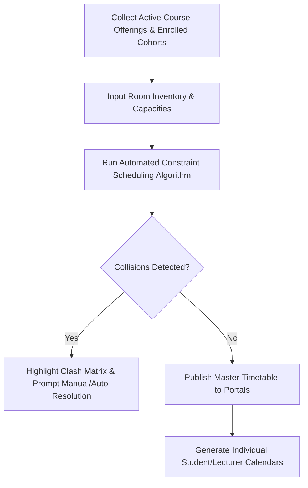
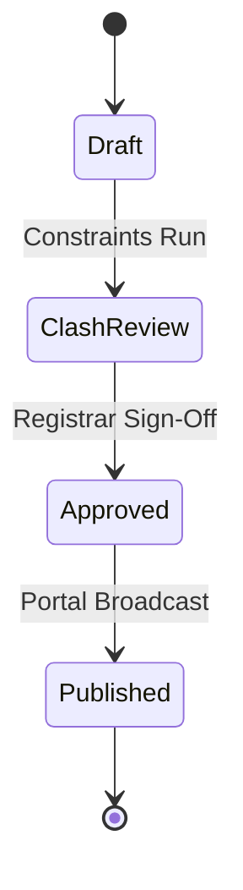

# MOD-01-08: Teaching & Examination Scheduling Engine — SOFTWARE REQUIREMENTS SPECIFICATION

- **Module Identifier:** `MOD-01-08`
- **Implementation Phase:** `PHASE 01 - Foundation & Core Student Lifecycle`
- **System:** Integrated University Enterprise Resource Planning & Student Information Management System (MEMA ERP)
- **Document Version:** 1.0.0-PROD-SPEC
- **Status:** Approved Baseline / Ready for Implementation

---

## 1. Module Number and Name
- **Module ID:** `MOD-01-08`
- **Official Name:** Teaching & Examination Scheduling Engine
- **Domain:** Foundation & Core Student Lifecycle

## 2. Phase & Implementation Order
- **Phase:** PHASE 01 - Foundation & Core Student Lifecycle
- **Implementation Sequence:** Foundational / Critical Path

## 3. Purpose and Objectives
Orchestrates lecture timetables, laboratory bookings, and examination schedules. Detects and prevents 4-way scheduling collisions: Lecturer conflicts, Room/Venue conflicts, Student Cohort conflicts, and Examination clashes.

## 4. Scope
### 4.1 In-Scope
- Campus room and lecture theatre inventory management (capacity, equipment, AC, projector)
- Weekly teaching timetable generation and clash detection algorithms
- Examination session scheduling and invigilator assignment matrix
- Personalized timetable publishing to Student and Lecturer portals
- Special exam and makeup session rescheduling workflows

### 4.2 Out-of-Scope
- Exam card printing eligibility gate (managed in MOD-01-10)
- Course offering creation (managed in MOD-01-04)

## 5. Actors / Users and Roles
| Role Name | Description | Access Level |
|---|---|---|
| **Timetabling Officer** | Builds and publishes university teaching and examination schedules. | Academic Admin |
| **Lecturer** | Views weekly teaching schedule, room allocations, and exam invigilation duties. | Academic Staff |
| **Student** | Views personalized class and examination timetable based on enrolled courses. | End User |

## 6. Role-Based Permissions (CRUD Matrix)
| Role | Create | Read | Update | Delete | Approve / Execute |
|---|---|---|---|---|---|
| Timetabling Officer | YES | YES | YES | YES | YES |
| Dean / HOD | NO | YES | YES | NO | YES |
| Lecturer | NO | Self | NO | NO | NO |
| Student | NO | Self | NO | NO | NO |

## 7. End-to-End Workflows

### Workflow Step-by-Step Execution:
1. **Resource Gathering:** Pulls registered class sections, enrolled student counts, assigned faculty, and room catalogue.
2. **Constraint Solving:** Executes scheduling solver optimizing for room capacity match, minimizing cohort travel, and eliminating lecturer overlaps.
3. **Clash Audit:** Verifies 0 lecturer overlaps, 0 room double-bookings, and 0 compulsory cohort overlaps.
4. **Publishing:** Locks schedule and publishes live iCal/JSON feeds to student and lecturer portal dashboards.

## 8. User Actions
| User Role | Interface / View | Action Description | Precondition | Postcondition |
|---|---|---|---|---|
| Timetabling Officer | `/admin/timetable/builder` | Generate and resolve clashes for teaching timetable | Course offerings and room data finalized | Timetable published |
| Student | `/student/timetable` | View personal weekly lecture timetable and export to Google Calendar/iCal | Registered in active courses | Personal schedule displayed |

## 9. Functional Requirements
### FR-TIM-001: Room & Venue Inventory Engine
- **Description:** System shall maintain physical classrooms, lecture halls, and labs with seat capacities and facilities.
- **Inputs:** Building, Room Code, Max Capacity, Is Lab, Has Projector
- **Outputs:** Room entity
- **Validation:** Unique room code per campus
### FR-TIM-002: Automated Clash Detection Engine
- **Description:** System shall detect and flag lecturer, room, and student cohort overlaps in real time.
- **Inputs:** Proposed Time Slot, Room ID, Section ID, Lecturer ID
- **Outputs:** Collision status (Pass / Conflict report)
- **Validation:** No overlapping time intervals for same resource
### FR-TIM-003: Personalized Calendar Generator
- **Description:** System shall generate a dynamic personal calendar for each student and lecturer based strictly on active enrollments.
- **Inputs:** User ID, Term ID
- **Outputs:** Personalized weekly schedule / iCal feed
- **Validation:** Active course enrollments only

## 10. Sub-Modules
| Sub-Module ID | Sub-Module Name | Core Responsibility |
|---|---|---|
| **SUB-TIM-01** | Venue & Space Catalogue | Manages classroom capacities, equipment tags, and availability grids. |
| **SUB-TIM-02** | Teaching Timetable Engine | Builds weekly lecture, tutorial, and lab schedules with collision resolution. |
| **SUB-TIM-03** | Examination Timetable & Invigilation | Schedules exam dates, venues, seating arrangements, and invigilator rosters. |
| **SUB-TIM-04** | Calendar Sync & Feed Service | Exports real-time iCalendar (.ics) and mobile push schedule updates. |

## 11. Features
- **Dynamic iCal Subscription:** Live calendar feed URL syncing class schedule automatically with Apple Calendar, Outlook, and Google Calendar.
- **Room Capacity Heatmap:** Visual analytics showing campus spatial utilization percentage across peak daytime hours.

## 12. Business Rules & Logic
- **BR-MOD-01-08-001 (Room Capacity Safety):** A class section cannot be scheduled into a venue whose capacity is lower than the section's enrolled student count.
- **BR-MOD-01-08-002 (Exam Spacing Rule):** No student cohort shall be scheduled for more than 2 major examinations within a single 24-hour window.

## 13. Data Requirements & Entities
### Core PostgreSQL Relational Tables:
#### Table: `timetable.rooms`
*Description: Classroom and laboratory spatial inventory.*
```sql
CREATE TABLE timetable.rooms (
    id UUID PRIMARY KEY DEFAULT gen_random_uuid(),
    campus_id UUID NOT NULL REFERENCES institution.campuses(id),
    code VARCHAR(30) NOT NULL,
    name VARCHAR(100) NOT NULL,
    capacity INT NOT NULL,
    room_type VARCHAR(50) DEFAULT 'Lecture Hall',
    has_projector BOOLEAN DEFAULT TRUE,
    is_active BOOLEAN DEFAULT TRUE,
    created_at TIMESTAMPTZ DEFAULT CURRENT_TIMESTAMP,
    UNIQUE(campus_id, code)
);
```

#### Table: `timetable.teaching_slots`
*Description: Scheduled weekly lecture and practical time slots.*
```sql
CREATE TABLE timetable.teaching_slots (
    id UUID PRIMARY KEY DEFAULT gen_random_uuid(),
    course_offering_id UUID NOT NULL REFERENCES course.course_offerings(id),
    room_id UUID NOT NULL REFERENCES timetable.rooms(id),
    day_of_week INT NOT NULL CHECK (day_of_week BETWEEN 1 AND 7),
    start_time TIME NOT NULL,
    end_time TIME NOT NULL,
    slot_type VARCHAR(50) DEFAULT 'Lecture',
    created_at TIMESTAMPTZ DEFAULT CURRENT_TIMESTAMP
);
```


## 14. Required Fields & Schema Specification
| Field Name | Data Type | Nullable | Constraints / Foreign Keys | Description |
|---|---|---|---|---|
| `day_of_week` | `INT` | `NO` | 1 (Mon) to 7 (Sun) | Day of teaching slot |
| `start_time / end_time` | `TIME` | `NO` | start < end | Scheduled slot time bounds |

## 15. Validation Rules
- **VR-MOD-01-08-001 [start_time / end_time]:** Duration must be between 1 hour and 4 hours.

## 16. Approval Workflows & Multi-Tier Sign-Off
Published timetables require final approval sign-off by Academic Registrar prior to public portal release.

## 17. Notifications, Alerts & Triggers
| Event Trigger | Recipient Channel | Message Template Summary |
|---|---|---|
| **Timetable Published** | `Push + Email` (Students & Lecturers) | The official teaching timetable for {{semester_name}} has been published. Check your dashboard. |
| **Room Rescheduled** | `Push + SMS` (Enrolled Students) | Room change: {{course_code}} on {{day}} will now take place in {{new_room}}. |

## 18. Dashboards & Analytics Widgets
- **Campus Space Utilization Dashboard (Timetabling Officer & Estates):** Room occupancy rates, peak hour bottlenecks, and unallocated time slots.

## 19. Reports
| Report ID | Title | Frequency | Output Formats | Permitted Roles |
|---|---|---|---|---|
| `REP-TIM-01` | Master Institutional Teaching Timetable Grid | Per Semester | PDF, Excel | All Users |
| `REP-TIM-02` | Master Examination Timetable & Invigilation Roll | Per Exam Period | PDF | Faculty |

## 20. Search, Filtering and Export Requirements
- **Search Capabilities:** Search by course code, lecturer, room name, day.
- **Filters:** Campus, School, Day of Week, Room Type.
- **Export Options:** PDF Grid, iCal (.ics), CSV.

## 21. Audit Trails and Logging
- **Audit Level:** Comprehensive append-only logging in `audit.audit_logs`.
- **Monitored Attributes:** Time slot changes, room re-allocations, manual clash overrides.
- **Tamper-Proofing:** Audited with timestamp and officer ID.

## 22. Security Requirements
- **Authentication:** Timetabling Officer RBAC privilege.
- **Data Protection:** Standard DB encryption.
- **Session Security:** Staff session.

## 23. Integrations / APIs
### Exposed REST Endpoints:
```text
GET  /api/v1/timetable/my-schedule
GET  /api/v1/timetable/rooms
POST /api/v1/timetable/slots
POST /api/v1/timetable/clash-check
GET  /api/v1/timetable/export.ics
```
### External Inbound / Outbound Feeds:
Google Calendar Sync API, Digital Signage display feeds.

## 24. Dependencies on Other Modules
- **Inbound Dependencies (Prerequisites):** MOD-01-04 (Courses), MOD-01-07 (Enrollment)
- **Outbound Dependencies (Consuming Modules):** MOD-01-10 (Exams), MOD-01-13 (Student Portal), MOD-02-11 (Staff Portal).

## 25. System-Generated Documents
- **Master Examination Schedule Matrix:** Format `PDF`. Comprehensive printable timetable grid of all exam sessions and allocated rooms.

## 26. Statuses and Workflow States

- **State Descriptions:** Draft, ClashReview, Approved, Published.

## 27. Exception / Error Handling
| Error Code | HTTP Status | Trigger Condition | System Recovery Action |
|---|---|---|---|
| `ERR-TIM-001` | `409 Conflict` | Attempt to book room with overlapping time slot | Return conflicting slot details and suggest nearest available room. |

## 28. Accessibility and Usability Requirements
- **Compliance:** WCAG 2.2 AA compliant typography, contrast ratio >= 4.5:1, keyboard navigability, screen reader aria-labels.
- **Responsive Layout:** Adaptive desktop, tablet, and mobile viewport breakpoints (320px to 2560px).

## 29. Performance Requirements & SLOs
- **Response Time:** 95% of API requests respond in < 250ms.
- **Concurrency:** Supports 8,000 concurrent active users without degradation.
- **Availability:** 99.95% uptime target.

## 30. Compliance Requirements
CUE guidelines on lecture room square footage and ventilation standards.

## 31. Acceptance Criteria, Test Scenarios & Future Extensibility
### 31.1 Acceptance Criteria
- [ ] **AC-1:** System detects and blocks lecturer and room double-bookings.
- [ ] **AC-2:** Generates personal timetable for each student matching registered courses with 100% accuracy.
- [ ] **AC-3:** Exports working iCal (.ics) feed compatible with standard calendar applications.

### 31.2 Test Scenarios
| Scenario ID | Test Case Title | Test Steps | Expected Outcome |
|---|---|---|---|
| `TC-TIM-01` | Room Collision Detection | 1. Schedule Course A in Room 101 on Mon 09:00-11:00. 2. Attempt to schedule Course B in Room 101 on Mon 10:00-12:00. | Second request returns 409 Conflict with room collision error. |

### 31.3 Future & Extensibility Considerations
- Genetic algorithm AI solver for optimal automated timetable generation.
