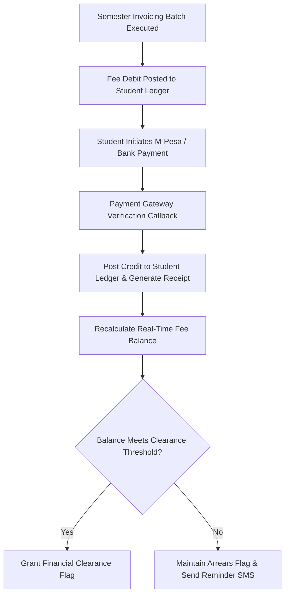
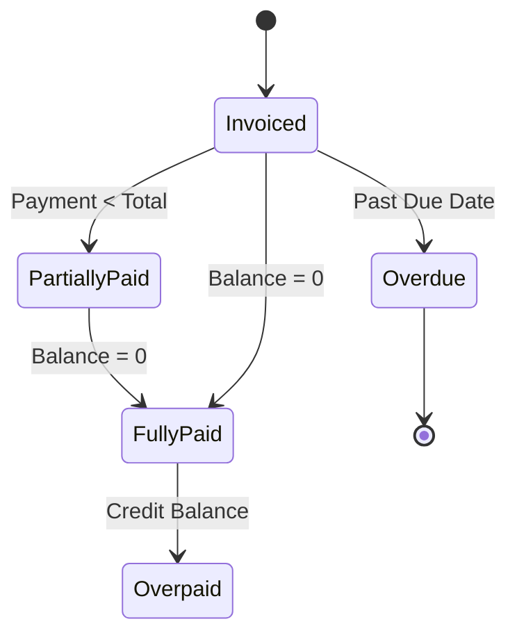

# MOD-01-09: Student Fee Structures, Invoicing & Receipts — SOFTWARE REQUIREMENTS SPECIFICATION

- **Module Identifier:** `MOD-01-09`
- **Implementation Phase:** `PHASE 01 - Foundation & Core Student Lifecycle`
- **System:** Integrated University Enterprise Resource Planning & Student Information Management System (MEMA ERP)
- **Document Version:** 1.0.0-PROD-SPEC
- **Status:** Approved Baseline / Ready for Implementation

---

## 1. Module Number and Name
- **Module ID:** `MOD-01-09`
- **Official Name:** Student Fee Structures, Invoicing & Receipts
- **Domain:** Foundation & Core Student Lifecycle

## 2. Phase & Implementation Order
- **Phase:** PHASE 01 - Foundation & Core Student Lifecycle
- **Implementation Sequence:** Foundational / Critical Path

## 3. Purpose and Objectives
Controls student financial fee structures, semester automated billing, invoicing, real-time payment gateway processing (M-Pesa, Bank APIs, Card), instant receipting, fee waivers, scholarship credits, and real-time financial clearance gating.

## 4. Scope
### 4.1 In-Scope
- Programme, campus, study mode, and nationality-specific fee structure templates
- Automated semester fee billing and debit note generation
- Real-time payment gateway integration (M-Pesa STK Push / C2B, Bank EFT, Card)
- Automated instant receipting and student fee ledger updating
- Student online fee statements with downloadable official receipts
- Financial clearance threshold calculations for registration, exams, and graduation

### 4.2 Out-of-Scope
- University enterprise General Ledger and corporate accounts payable (managed in MOD-03-07)
- External sponsor scholarship management workflows (managed in MOD-02-10)

## 5. Actors / Users and Roles
| Role Name | Description | Access Level |
|---|---|---|
| **Finance Director / Student Accountant** | Configures fee structures, reviews payment reconciliations, and issues debit/credit notes. | Finance Staff |
| **Student / Sponsor** | Views fee statements, initiates payments via M-Pesa/Card, and downloads official receipts. | End User |
| **Cashier / Bank API** | Ingests automated transaction notifications and settles accounts. | System / API |

## 6. Role-Based Permissions (CRUD Matrix)
| Role | Create | Read | Update | Delete | Approve / Execute |
|---|---|---|---|---|---|
| Finance Officer | YES | YES | YES | NO | YES |
| Student | Self(Payment) | Self | NO | NO | NO |
| Registrar | NO | YES | NO | NO | NO |

## 7. End-to-End Workflows

### Workflow Step-by-Step Execution:
1. **Fee Structure Configuration:** Finance sets Tuition, Exam fees, Activity, Medical, Technology, and Library charges per programme.
2. **Invoicing:** System invoices registered students automatically at term start, generating official Invoices.
3. **Payment Initiation:** Student pays via M-Pesa STK push, Bank Paybill, or Card gateway.
4. **Real-Time Reconciliation:** Gateway webhooks post payment directly into `student_payments` table with zero manual re-keying.
5. **Clearance Calculation:** Balance recalculated instantly; unlocks registration or exam card if threshold reached.

## 8. User Actions
| User Role | Interface / View | Action Description | Precondition | Postcondition |
|---|---|---|---|---|
| Student | `/student/finance/pay` | Trigger M-Pesa STK push or enter bank reference to pay tuition | Active student account with outstanding balance | Payment processed, receipt generated, statement updated |
| Finance Officer | `/admin/finance/reconciliation` | Review payment gateway reconciliation and unallocated bank suspense items | Finance officer login | Suspense items allocated to student ledgers |

## 9. Functional Requirements
### FR-FIN-001: Multi-Tier Fee Structure Engine
- **Description:** System shall maintain fee structures configurable by programme, campus, year of study, nationality, and sponsor category.
- **Inputs:** Programme ID, Academic Year, Fee Items, Amounts
- **Outputs:** Fee structure template
- **Validation:** Total fee > 0
### FR-FIN-002: Real-Time Payment Gateway Integration
- **Description:** System shall process payments via M-Pesa C2B/STK Push, Card, and Direct Bank APIs with automated reconciliation.
- **Inputs:** Student Number, Amount, Channel, Gateway Ref
- **Outputs:** Official Receipt entity + Updated Balance
- **Validation:** Unique transaction reference enforcement
### FR-FIN-003: Financial Clearance Gate
- **Description:** System shall evaluate whether student fee balance satisfies minimum clearance percentage (e.g. 100% for exams).
- **Inputs:** Student ID, Required Threshold %
- **Outputs:** Boolean Clearance Status
- **Validation:** Formula: (Paid / Invoiced) >= Threshold

## 10. Sub-Modules
| Sub-Module ID | Sub-Module Name | Core Responsibility |
|---|---|---|
| **SUB-FIN-01** | Fee Structure Master | Configures tuition, lab, library, caution, and statutory fees per cohort. |
| **SUB-FIN-02** | Invoicing & Billing Engine | Generates term invoices, debit notes, waivers, and credit notes. |
| **SUB-FIN-03** | Payment Gateway & Receipting Hub | Real-time M-Pesa/Bank integrations, webhook handlers, and instant PDF receipts. |
| **SUB-FIN-04** | Student Statement & Clearance Desk | Real-time fee ledger, balance statements, arrears tracking, and exam clearance gates. |

## 11. Features
- **Instant M-Pesa STK Push:** Prompt student mobile phone with payment request directly from the student portal.
- **Downloadable Stamped Fee Statement:** Official digitally signed and stamped PDF fee statement with QR verification.

## 12. Business Rules & Logic
- **BR-MOD-01-09-001 (Immutable Financial Ledger):** Financial entries cannot be edited or deleted; corrections require explicit reversing credit/debit notes.
- **BR-MOD-01-09-002 (Unique Transaction Reference):** No bank or M-Pesa transaction reference can be ingested more than once (strict idempotent handling).

## 13. Data Requirements & Entities
### Core PostgreSQL Relational Tables:
#### Table: `finance.student_invoices`
*Description: Semester student fee invoice master.*
```sql
CREATE TABLE finance.student_invoices (
    id UUID PRIMARY KEY DEFAULT gen_random_uuid(),
    invoice_number VARCHAR(50) UNIQUE NOT NULL,
    student_id UUID NOT NULL REFERENCES student.students(id),
    semester_id UUID NOT NULL REFERENCES institution.academic_years(id),
    total_amount NUMERIC(12,2) NOT NULL,
    issued_at TIMESTAMPTZ DEFAULT CURRENT_TIMESTAMP,
    due_date DATE NOT NULL,
    status VARCHAR(50) NOT NULL DEFAULT 'Unpaid'
);
```

#### Table: `finance.student_payments`
*Description: Reconciled student payment transactions.*
```sql
CREATE TABLE finance.student_payments (
    id UUID PRIMARY KEY DEFAULT gen_random_uuid(),
    receipt_number VARCHAR(50) UNIQUE NOT NULL,
    student_id UUID NOT NULL REFERENCES student.students(id),
    amount NUMERIC(12,2) NOT NULL CHECK (amount > 0),
    payment_channel VARCHAR(50) NOT NULL,
    transaction_reference VARCHAR(100) UNIQUE NOT NULL,
    paid_at TIMESTAMPTZ NOT NULL,
    reconciled_at TIMESTAMPTZ DEFAULT CURRENT_TIMESTAMP,
    created_at TIMESTAMPTZ DEFAULT CURRENT_TIMESTAMP
);
```


## 14. Required Fields & Schema Specification
| Field Name | Data Type | Nullable | Constraints / Foreign Keys | Description |
|---|---|---|---|---|
| `invoice_number` | `VARCHAR(50)` | `NO` | UNIQUE | Official invoice serial |
| `transaction_reference` | `VARCHAR(100)` | `NO` | UNIQUE | M-Pesa receipt or Bank transaction ref |

## 15. Validation Rules
- **VR-MOD-01-09-001 [amount]:** Must be strictly positive decimal value.

## 16. Approval Workflows & Multi-Tier Sign-Off
Fee waivers, discounts, or manual debit/credit note adjustments require Finance Director approval.

## 17. Notifications, Alerts & Triggers
| Event Trigger | Recipient Channel | Message Template Summary |
|---|---|---|
| **Payment Received** | `SMS + Email` (Student & Sponsor) | Payment of KES {{amount}} received for {{student_number}} (Receipt: {{receipt_number}}). Current balance: KES {{balance}}. |

## 18. Dashboards & Analytics Widgets
- **Student Finance Revenue & Collections Dashboard (Finance Director & VC):** Total invoiced fees, cash collected, outstanding arrears aging, and gateway settlement health.

## 19. Reports
| Report ID | Title | Frequency | Output Formats | Permitted Roles |
|---|---|---|---|---|
| `REP-FIN-01` | Comprehensive Student Fee Statement | On-Demand | PDF | Student, Finance |
| `REP-FIN-02` | Daily Payment Gateway Collections Reconciliation | Daily | CSV, PDF | Finance |

## 20. Search, Filtering and Export Requirements
- **Search Capabilities:** Search by student number, receipt number, invoice number, transaction reference.
- **Filters:** Programme, Campus, Balance Status (Cleared/Arrears), Date Range.
- **Export Options:** PDF Receipts, CSV, Excel Ledger.

## 21. Audit Trails and Logging
- **Audit Level:** Comprehensive append-only logging in `audit.audit_logs`.
- **Monitored Attributes:** Invoice generation, payment ingestion, credit note adjustments, waiver postings.
- **Tamper-Proofing:** Append-only financial ledger with cryptographic balance verification.

## 22. Security Requirements
- **Authentication:** Finance Staff RBAC / Student self-service.
- **Data Protection:** AES-256 for payment tokens and bank keys.
- **Session Security:** Secured session.

## 23. Integrations / APIs
### Exposed REST Endpoints:
```text
GET  /api/v1/finance/statement
POST /api/v1/finance/mpesa/stk-push
POST /api/v1/finance/mpesa/c2b-callback
POST /api/v1/finance/bank/callback
GET  /api/v1/finance/receipts/{id}
GET  /api/v1/finance/clearance-status
```
### External Inbound / Outbound Feeds:
Safaricom M-Pesa Daraja API, Commercial Banks Host-to-Host API, Visa/Mastercard Payment Gateway.

## 24. Dependencies on Other Modules
- **Inbound Dependencies (Prerequisites):** MOD-01-02, MOD-01-03, MOD-01-06
- **Outbound Dependencies (Consuming Modules):** MOD-01-07 (Registration Gate), MOD-01-10 (Exam Cards), MOD-01-12 (Graduation Clearance), MOD-03-07 (GL).

## 25. System-Generated Documents
- **Official Student Fee Statement:** Format `PDF with QR Code`. Official university statement listing all historical debits, credits, and running balance with QR verification.
- **Official Payment Receipt:** Format `PDF with QR Code`. Downloadable payment receipt stamped with transaction serial and signature.

## 26. Statuses and Workflow States

- **State Descriptions:** Invoiced, PartiallyPaid, FullyPaid, Overdue, Overpaid.

## 27. Exception / Error Handling
| Error Code | HTTP Status | Trigger Condition | System Recovery Action |
|---|---|---|---|
| `ERR-PAY-002` | `409 Conflict` | Duplicate transaction reference submitted | Reject duplicate and return existing receipt details. |

## 28. Accessibility and Usability Requirements
- **Compliance:** WCAG 2.2 AA compliant typography, contrast ratio >= 4.5:1, keyboard navigability, screen reader aria-labels.
- **Responsive Layout:** Adaptive desktop, tablet, and mobile viewport breakpoints (320px to 2560px).

## 29. Performance Requirements & SLOs
- **Response Time:** 95% of API requests respond in < 250ms.
- **Concurrency:** Supports 10,000 concurrent active users without degradation.
- **Availability:** 99.95% uptime target.

## 30. Compliance Requirements
International Financial Reporting Standards (IFRS) and Kenya Public Finance Management (PFM) Act.

## 31. Acceptance Criteria, Test Scenarios & Future Extensibility
### 31.1 Acceptance Criteria
- [ ] **AC-1:** System automatically calculates and invoices fees based on student cohort fee template.
- [ ] **AC-2:** M-Pesa payment callback updates student ledger and balance in $< 2	ext{ seconds}$.
- [ ] **AC-3:** Generates official stamped PDF fee statements and receipts with working verification QR.
- [ ] **AC-4:** Blocks exam card generation if fee balance threshold is not cleared.

### 31.2 Test Scenarios
| Scenario ID | Test Case Title | Test Steps | Expected Outcome |
|---|---|---|---|
| `TC-FIN-01` | M-Pesa Callback Ingestion | 1. Post valid M-Pesa C2B callback payload. 2. Verify payment record inserted. 3. Check student balance. | Payment committed, student balance reduced by exact amount, receipt generated. |

### 31.3 Future & Extensibility Considerations
- Direct integration with government student loan funds (HELB) for automated batch crediting.
