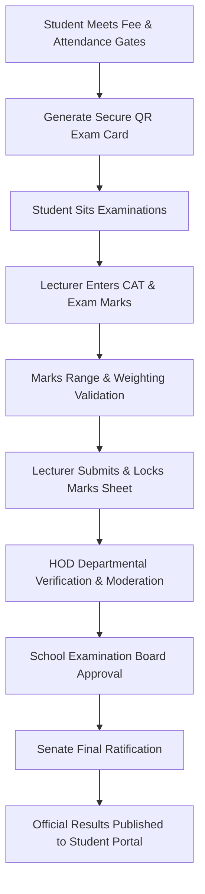
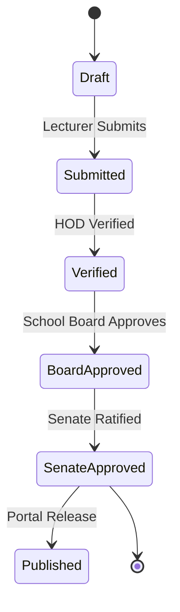

# MOD-01-10: Coursework Assessment & Examination Management — SOFTWARE REQUIREMENTS SPECIFICATION

- **Module Identifier:** `MOD-01-10`
- **Implementation Phase:** `PHASE 01 - Foundation & Core Student Lifecycle`
- **System:** Integrated University Enterprise Resource Planning & Student Information Management System (MEMA ERP)
- **Document Version:** 1.0.0-PROD-SPEC
- **Status:** Approved Baseline / Ready for Implementation

---

## 1. Module Number and Name
- **Module ID:** `MOD-01-10`
- **Official Name:** Coursework Assessment & Examination Management
- **Domain:** Foundation & Core Student Lifecycle

## 2. Phase & Implementation Order
- **Phase:** PHASE 01 - Foundation & Core Student Lifecycle
- **Implementation Sequence:** Foundational / Critical Path

## 3. Purpose and Objectives
Controls the complete assessment and examination operations lifecycle. Enforces financial and attendance exam card eligibility gates, secure QR exam attendance cards, multi-component coursework marks entry (CATs, Labs, Assignments), final exam marks capture, multi-stage approval workflows (Lecturer -> HOD -> Dean -> Board -> Senate), and immutable grade ledger locking.

## 4. Scope
### 4.1 In-Scope
- Automated Exam Card generation with dynamic QR verification token
- Eligibility validation (100% fees cleared, attendance >= 75%, registered student)
- Continuous Assessment (CAT 1, CAT 2, Assignments, Labs, Practicals) entry
- Final exam marks capture with strict range validation (0-100%)
- Multi-stage marks moderation and departmental approval pipeline
- Special examinations, supplementary exam rosters, and exam irregularity incident logs

### 4.2 Out-of-Scope
- GPA and academic standing calculations (managed in MOD-01-11)
- Official academic transcript generation (managed in MOD-01-12)

## 5. Actors / Users and Roles
| Role Name | Description | Access Level |
|---|---|---|
| **Lecturer / Instructor** | Enters coursework and final exam marks for assigned course sections. | Academic Staff |
| **Head of Department (HOD)** | Verifies marks sheets, reviews moderation reports, and approves departmental marks. | Departmental Leader |
| **Dean / School Exam Board** | Reviews school marks distributions, approves grade adjustments, and submits to Senate. | School Executive |
| **Student** | Downloads Exam Card, views continuous assessment feedback, and checks published results. | End User |

## 6. Role-Based Permissions (CRUD Matrix)
| Role | Create | Read | Update | Delete | Approve / Execute |
|---|---|---|---|---|---|
| Lecturer | YES(Assigned Courses) | YES | YES(Before Submit) | NO | NO |
| HOD | NO | YES | YES(Moderation) | NO | YES |
| Dean / Board | NO | YES | NO | NO | YES |
| Student | NO | Self(Published Only) | NO | NO | NO |

## 7. End-to-End Workflows

### Workflow Step-by-Step Execution:
1. **Exam Card Gate:** System evaluates 100% fee clearance and minimum 75% attendance; generates QR Exam Card.
2. **Marks Entry:** Lecturer enters CAT (e.g. 30%) and Final Exam (e.g. 70%) marks into secure online mark-sheet.
3. **Validation & Submission:** System validates marks between 0-100; upon submission, marks become locked against editing.
4. **Moderation & Approvals:** Moves through HOD Verification -> School Board Review -> Senate Ratification.
5. **Publishing:** Senate approves marks; system publishes results directly to student portals and SMS alerts.

## 8. User Actions
| User Role | Interface / View | Action Description | Precondition | Postcondition |
|---|---|---|---|---|
| Student | `/student/exams/card` | Download and print official QR Examination Attendance Card | Financially cleared and registered | Exam card rendered with verification QR |
| Lecturer | `/lecturer/marks-entry` | Enter, validate, and submit semester coursework and exam marks | Assigned course instructor | Marks locked and forwarded to HOD |

## 9. Functional Requirements
### FR-EXM-001: Secure QR Exam Card Generator
- **Description:** System shall generate a tamper-proof PDF Exam Card listing student photo, registered courses, exam timetable, and dynamic verification QR code.
- **Inputs:** Student ID, Term ID
- **Outputs:** Signed Exam Card PDF
- **Validation:** Student is financially and academically cleared
### FR-EXM-002: Marks Capture & Validation Engine
- **Description:** System shall capture coursework (CATs) and exam marks with automatic weighting and range validation.
- **Inputs:** Course Offering ID, Student Mark List
- **Outputs:** Validated Mark Sheet
- **Validation:** Marks between 0 and 100, weighting sum = 100%
### FR-EXM-003: Immutable Marks Workflow Locking
- **Description:** Once submitted by lecturer, marks cannot be altered without formal rejection by HOD or audited Senate amendment.
- **Inputs:** Submission Token, Approver ID
- **Outputs:** Locked Marks Ledger Entry
- **Validation:** Full audit log with previous/new value capture

## 10. Sub-Modules
| Sub-Module ID | Sub-Module Name | Core Responsibility |
|---|---|---|
| **SUB-EXM-01** | Exam Eligibility & Card Generator | Validates clearance rules and generates dynamic QR-coded exam cards. |
| **SUB-EXM-02** | Coursework & CAT Manager | Tracks continuous assessment weights, assignments, labs, and published CAT scores. |
| **SUB-EXM-03** | Marks Entry & Moderation Desk | Online marks spreadsheets, internal/external moderation variance analysis, and approvals. |
| **SUB-EXM-04** | Special & Supplementary Exams Hub | Manages special exam petitions, supplementary exam rosters, and retake marks. |

## 11. Features
- **Dynamic Invigilator QR Scanner:** Mobile-friendly QR verification allowing exam invigilators to scan student exam cards and verify authenticity instantly.
- **Grade Variance Analysis:** Automated statistical analysis (bell curve, standard deviation, pass rate) for examination moderation boards.

## 12. Business Rules & Logic
- **BR-MOD-01-10-001 (Zero Silent Alterations):** No administrator or faculty member can alter a submitted mark without recording a formal reason code, approving officer, and audit snapshot.
- **BR-MOD-01-10-002 (Missing Marks Prevention):** Marks sheet cannot be submitted to School Board if any registered student has an empty mark field (must be marked as Absent, Incomplete, or Given Score).

## 13. Data Requirements & Entities
### Core PostgreSQL Relational Tables:
#### Table: `examination.student_marks`
*Description: Official student assessment and exam scores master.*
```sql
CREATE TABLE examination.student_marks (
    id UUID PRIMARY KEY DEFAULT gen_random_uuid(),
    course_enrollment_id UUID NOT NULL REFERENCES enrollment.course_enrollments(id),
    cat_score NUMERIC(5,2) DEFAULT 0,
    exam_score NUMERIC(5,2) DEFAULT 0,
    total_score NUMERIC(5,2) GENERATED ALWAYS AS (cat_score + exam_score) STORED,
    is_submitted BOOLEAN DEFAULT FALSE,
    submitted_by UUID REFERENCES iam.users(id),
    submitted_at TIMESTAMPTZ,
    approval_status VARCHAR(50) NOT NULL DEFAULT 'Draft',
    created_at TIMESTAMPTZ DEFAULT CURRENT_TIMESTAMP,
    UNIQUE(course_enrollment_id)
);
```


## 14. Required Fields & Schema Specification
| Field Name | Data Type | Nullable | Constraints / Foreign Keys | Description |
|---|---|---|---|---|
| `course_enrollment_id` | `UUID` | `NO` | UNIQUE | Enrolled student course record |
| `total_score` | `NUMERIC(5,2)` | `NO` | 0.00 to 100.00 | Computed total mark |

## 15. Validation Rules
- **VR-MOD-01-10-001 [cat_score / exam_score]:** Must be non-negative and total must not exceed 100.00.

## 16. Approval Workflows & Multi-Tier Sign-Off
Marks approval chain: Lecturer Submission -> HOD Verification -> School Exam Board Approval -> Senate Ratification.

## 17. Notifications, Alerts & Triggers
| Event Trigger | Recipient Channel | Message Template Summary |
|---|---|---|
| **Exam Card Available** | `Portal + SMS` (Student) | Your official Exam Card for {{semester_name}} is now ready for download on your portal. |
| **Marks Submitted for Approval** | `Email` (HOD) | Lecturer {{lecturer_name}} has submitted marks for {{course_code}} for departmental verification. |

## 18. Dashboards & Analytics Widgets
- **Examination Operations & Marks Submission Tracker (Dean & Exam Officer):** Submission progress across all courses, unsubmitted mark-sheet alerts, and grade distribution charts.

## 19. Reports
| Report ID | Title | Frequency | Output Formats | Permitted Roles |
|---|---|---|---|---|
| `REP-EXM-01` | Official Course Mark Sheet & Broad-sheet | Per Semester | PDF, Excel | Faculty, Board |
| `REP-EXM-02` | Examination Card Verification Roster | Per Exam Session | PDF | Invigilators |

## 20. Search, Filtering and Export Requirements
- **Search Capabilities:** Search by student number, course code, section, or lecturer.
- **Filters:** School, Department, Approval Status, Academic Year.
- **Export Options:** Broadsheets (Excel), PDF Mark Sheets.

## 21. Audit Trails and Logging
- **Audit Level:** Comprehensive append-only logging in `audit.audit_logs`.
- **Monitored Attributes:** Marks entry, submission locks, moderation adjustments, remarking edits.
- **Tamper-Proofing:** Cryptographically hashed audit log with before/after score values.

## 22. Security Requirements
- **Authentication:** Restricted to assigned course lecturer and designated exam boards.
- **Data Protection:** Encrypted marks storage.
- **Session Security:** Staff session with re-authentication on submit.

## 23. Integrations / APIs
### Exposed REST Endpoints:
```text
GET  /api/v1/exams/my-card
GET  /api/v1/exams/verify-card/{qrToken}
GET  /api/v1/exams/marks-sheet/{offeringId}
POST /api/v1/exams/marks-sheet/{offeringId}/save
POST /api/v1/exams/marks-sheet/{offeringId}/submit
POST /api/v1/exams/marks-sheet/{offeringId}/approve
```
### External Inbound / Outbound Feeds:
Moodle LMS Gradebook sync API.

## 24. Dependencies on Other Modules
- **Inbound Dependencies (Prerequisites):** MOD-01-04, MOD-01-07, MOD-01-08, MOD-01-09
- **Outbound Dependencies (Consuming Modules):** MOD-01-11 (Grading & GPA), MOD-01-12 (Transcripts), MOD-01-13 (Student Portal).

## 25. System-Generated Documents
- **Official Examination Card:** Format `PDF with QR Code`. Tamper-proof official examination attendance card with student photo, course list, and QR verification token.
- **Official Consolidated Marks Broad-sheet:** Format `Excel / PDF`. Departmental broadsheet displaying all student scores for Senate board review.

## 26. Statuses and Workflow States

- **State Descriptions:** Draft, Submitted, Verified, BoardApproved, SenateApproved, Published.

## 27. Exception / Error Handling
| Error Code | HTTP Status | Trigger Condition | System Recovery Action |
|---|---|---|---|
| `ERR-EXM-003` | `403 Forbidden` | Attempt to generate exam card with outstanding fee balance | Display fee balance details and payment redirect. |

## 28. Accessibility and Usability Requirements
- **Compliance:** WCAG 2.2 AA compliant typography, contrast ratio >= 4.5:1, keyboard navigability, screen reader aria-labels.
- **Responsive Layout:** Adaptive desktop, tablet, and mobile viewport breakpoints (320px to 2560px).

## 29. Performance Requirements & SLOs
- **Response Time:** 95% of API requests respond in < 250ms.
- **Concurrency:** Supports 10,000 concurrent active users without degradation.
- **Availability:** 99.95% uptime target.

## 30. Compliance Requirements
Universities Act Examination Regulations and statutory grading integrity standards.

## 31. Acceptance Criteria, Test Scenarios & Future Extensibility
### 31.1 Acceptance Criteria
- [ ] **AC-1:** System blocks exam card generation if student is not 100% financially cleared.
- [ ] **AC-2:** Lecturer enters and submits marks; system locks record and routes through multi-tier approval chain.
- [ ] **AC-3:** Zero silent edits: every post-submission adjustment requires authorized reason code and is fully logged.

### 31.2 Test Scenarios
| Scenario ID | Test Case Title | Test Steps | Expected Outcome |
|---|---|---|---|
| `TC-EXM-01` | Exam Card Eligibility Gate | 1. Test student with 80% fee balance. 2. Request exam card. 3. Pay remaining 20%. 4. Request exam card. | Step 2 fails with 403 Fee Arrears; Step 4 succeeds with 200 OK and PDF card generated. |

### 31.3 Future & Extensibility Considerations
- AI proctoring anomaly integration for computer-based testing.
