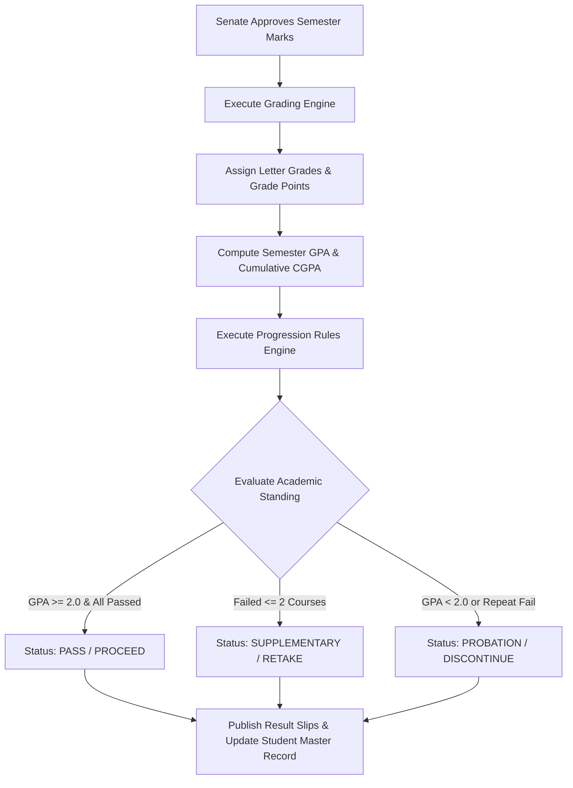
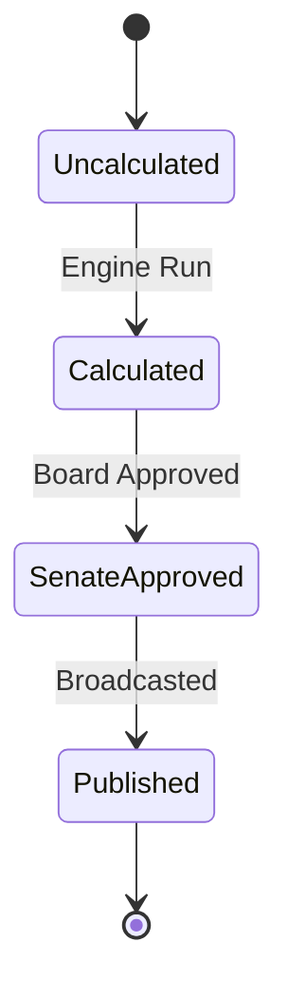

# MOD-01-11: Grading Scales, GPA Calculation & Progression Engine — SOFTWARE REQUIREMENTS SPECIFICATION

- **Module Identifier:** `MOD-01-11`
- **Implementation Phase:** `PHASE 01 - Foundation & Core Student Lifecycle`
- **System:** Integrated University Enterprise Resource Planning & Student Information Management System (MEMA ERP)
- **Document Version:** 1.0.0-PROD-SPEC
- **Status:** Approved Baseline / Ready for Implementation

---

## 1. Module Number and Name
- **Module ID:** `MOD-01-11`
- **Official Name:** Grading Scales, GPA Calculation & Progression Engine
- **Domain:** Foundation & Core Student Lifecycle

## 2. Phase & Implementation Order
- **Phase:** PHASE 01 - Foundation & Core Student Lifecycle
- **Implementation Sequence:** Foundational / Critical Path

## 3. Purpose and Objectives
Translates raw examination marks into letter grades and grade points, computes Semester GPA, Annual GPA, and Cumulative GPA (CGPA), and executes the automated Academic Progression Engine (Pass, Proceed on Probation, Supplementary Exam, Retake, Repeat Year, Discontinue).

## 4. Scope
### 4.1 In-Scope
- Configurable institutional and programme-specific grading scales (e.g. 70-100 A, 60-69 B...)
- Weighted Grade Point Average (GPA) and Cumulative GPA (CGPA) computation
- Semester result slips generation with academic standing designations
- Automated Senate progression criteria evaluator based on passed credits and minimum GPA
- Supplementary exam qualification and course retake tracking

### 4.2 Out-of-Scope
- Final graduation degree classification and honors award (managed in MOD-01-12)
- Classroom marks capture (managed in MOD-01-10)

## 5. Actors / Users and Roles
| Role Name | Description | Access Level |
|---|---|---|
| **Examinations Officer** | Runs semester GPA computation and automated progression batch. | Academic Admin |
| **Senate / Academic Board** | Reviews and approves progression results and academic probations/discontinuations. | Governance |
| **Student** | Views semester grades, GPA/CGPA summary, and official published result slips. | End User |

## 6. Role-Based Permissions (CRUD Matrix)
| Role | Create | Read | Update | Delete | Approve / Execute |
|---|---|---|---|---|---|
| Examinations Officer | YES | YES | YES | NO | YES |
| Senate Admin | NO | YES | NO | NO | YES |
| Student | NO | Self | NO | NO | NO |

## 7. End-to-End Workflows

### Workflow Step-by-Step Execution:
1. **Grade Conversion:** Raw scores mapped to letter grades (A, B, C, D, E/F) and grade points (4.0, 3.0...) per programme scheme.
2. **GPA / CGPA Computation:** Computes GPA = Sum(Course Credits * Grade Points) / Total Attempted Credits.
3. **Progression Audit:** Engine checks: Total Passed Credits, Minimum Required GPA, and Number of Failed Units.
4. **Standing Assignment:** Assigns official Senate academic standing (Pass, Probation, Supplementary, Retake, Discontinue).

## 8. User Actions
| User Role | Interface / View | Action Description | Precondition | Postcondition |
|---|---|---|---|---|
| Examinations Officer | `/admin/exams/progression-engine` | Trigger batch GPA calculation and progression decision run | Semester marks approved by Senate | Student progression states updated |
| Student | `/student/academics/results` | View published semester grades, GPA, and download result slip | Results officially published | Result slip rendered with QR code |

## 9. Functional Requirements
### FR-PROG-001: Automated Grading Scale Translator
- **Description:** System shall convert raw percentage marks into letter grades and grade points based on versioned programme grading schemes.
- **Inputs:** Total Mark, Programme Scheme ID
- **Outputs:** Letter Grade (e.g. A), Grade Points (e.g. 4.0)
- **Validation:** Scheme covers 0-100 without gaps
### FR-PROG-002: Weighted GPA & CGPA Engine
- **Description:** System shall calculate semester GPA and cumulative CGPA across all attempted credits.
- **Inputs:** Student Grade History, Course Credits
- **Outputs:** Semester GPA, Cumulative CGPA, Credits Earned
- **Validation:** GPA scaled 0.00 to 4.00 (or 5.00)
### FR-PROG-003: Automated Progression Rule Evaluator
- **Description:** System shall evaluate progression rules and assign official academic standing.
- **Inputs:** Student Term Results, Programme Progression Rules
- **Outputs:** Academic Standing (PASS, PROBATION, RETAKE, DISCONTINUE)
- **Validation:** Deterministic rule execution

## 10. Sub-Modules
| Sub-Module ID | Sub-Module Name | Core Responsibility |
|---|---|---|
| **SUB-PROG-01** | Grading Scheme Configurator | Defines percentage ranges, letter grades, and point weights per degree tier. |
| **SUB-PROG-02** | GPA & Cumulative CGPA Engine | Calculates term GPA, annual GPA, CGPA, and completed credit totals. |
| **SUB-PROG-03** | Progression Decision Engine | Automates Pass, Probation, Supplementary, Retake, and Discontinuation decisions. |
| **SUB-PROG-04** | Result Slips & Publishing Desk | Generates downloadable semester result slips and publishes to student portals. |

## 11. Features
- **Configurable Academic Standing Matrix:** Rules engine allowing Senate policy adjustments without code modifications.
- **Downloadable QR Result Slip:** Digitally signed semester result slip with instant online verification token.

## 12. Business Rules & Logic
- **BR-MOD-01-11-001 (Retake Grade Weighting):** When a student retakes a failed course, the new grade replaces the failure in CGPA computation, but the historical attempt remains on transcript record.
- **BR-MOD-01-11-002 (Automated Discontinuation):** A student on academic probation for two consecutive semesters whose CGPA remains below 2.00 is flagged for Senate discontinuation.

## 13. Data Requirements & Entities
### Core PostgreSQL Relational Tables:
#### Table: `examination.student_term_gpas`
*Description: Computed semester GPA and academic standing master.*
```sql
CREATE TABLE examination.student_term_gpas (
    id UUID PRIMARY KEY DEFAULT gen_random_uuid(),
    student_id UUID NOT NULL REFERENCES student.students(id),
    semester_id UUID NOT NULL REFERENCES institution.academic_years(id),
    credits_attempted INT NOT NULL,
    credits_earned INT NOT NULL,
    term_gpa NUMERIC(4,2) NOT NULL,
    cumulative_cgpa NUMERIC(4,2) NOT NULL,
    academic_standing VARCHAR(50) NOT NULL DEFAULT 'Good Standing',
    progression_decision VARCHAR(50) NOT NULL DEFAULT 'Pass',
    is_published BOOLEAN DEFAULT FALSE,
    calculated_at TIMESTAMPTZ DEFAULT CURRENT_TIMESTAMP,
    UNIQUE(student_id, semester_id)
);
```


## 14. Required Fields & Schema Specification
| Field Name | Data Type | Nullable | Constraints / Foreign Keys | Description |
|---|---|---|---|---|
| `term_gpa` | `NUMERIC(4,2)` | `NO` | 0.00 to 4.00 | Semester Grade Point Average |
| `academic_standing` | `VARCHAR(50)` | `NO` | Valid standing enum | Senate academic standing |

## 15. Validation Rules
- **VR-MOD-01-11-001 [credits_earned]:** Must be less than or equal to credits_attempted.

## 16. Approval Workflows & Multi-Tier Sign-Off
Progression batches require Senate approval before results are marked 'Published'.

## 17. Notifications, Alerts & Triggers
| Event Trigger | Recipient Channel | Message Template Summary |
|---|---|---|
| **Results Published** | `Portal + SMS` (Student) | Official results for {{semester_name}} are now published. Your Semester GPA is {{gpa}}, Standing: {{standing}}. |

## 18. Dashboards & Analytics Widgets
- **Academic Performance & Progression Analytics (Registrar & Deans):** Pass/failure rates, probation rates, GPA distribution curves per department, and progression bottlenecks.

## 19. Reports
| Report ID | Title | Frequency | Output Formats | Permitted Roles |
|---|---|---|---|---|
| `REP-PROG-01` | Official Semester Result Slip | Per Semester | PDF | Student, Registrar |
| `REP-PROG-02` | Senate Consolidated Progression & Pass List | Per Semester | PDF, Excel | Senate |

## 20. Search, Filtering and Export Requirements
- **Search Capabilities:** Search by student number, programme, academic standing.
- **Filters:** Standing (Probation/Retake/Pass), School, Cohort.
- **Export Options:** PDF Result Slips, Excel Broadsheet.

## 21. Audit Trails and Logging
- **Audit Level:** Comprehensive append-only logging in `audit.audit_logs`.
- **Monitored Attributes:** GPA computation run, standing overrides, grade scheme versioning.
- **Tamper-Proofing:** Audited in append-only logs.

## 22. Security Requirements
- **Authentication:** Restricted to Exam Administration.
- **Data Protection:** Standard DB encryption.
- **Session Security:** Staff session.

## 23. Integrations / APIs
### Exposed REST Endpoints:
```text
GET /api/v1/progression/my-results
GET /api/v1/progression/result-slip/{termId}
POST /api/v1/progression/calculate-batch
POST /api/v1/progression/publish-results
```
### External Inbound / Outbound Feeds:
SMS Gateway for automated bulk results broadcasting.

## 24. Dependencies on Other Modules
- **Inbound Dependencies (Prerequisites):** MOD-01-03, MOD-01-07, MOD-01-10
- **Outbound Dependencies (Consuming Modules):** MOD-01-12 (Graduation), MOD-01-13 (Student Portal), MOD-05-04 (Retention).

## 25. System-Generated Documents
- **Official Semester Result Slip:** Format `PDF with QR Code`. Official document displaying all courses taken in the semester, credit weights, grades, GPA, CGPA, and standing.

## 26. Statuses and Workflow States

- **State Descriptions:** Uncalculated, Calculated, SenateApproved, Published.

## 27. Exception / Error Handling
| Error Code | HTTP Status | Trigger Condition | System Recovery Action |
|---|---|---|---|
| `ERR-PROG-001` | `422 Unprocessable Entity` | Attempt to compute GPA with unapproved course marks | List unapproved course sections requiring moderation. |

## 28. Accessibility and Usability Requirements
- **Compliance:** WCAG 2.2 AA compliant typography, contrast ratio >= 4.5:1, keyboard navigability, screen reader aria-labels.
- **Responsive Layout:** Adaptive desktop, tablet, and mobile viewport breakpoints (320px to 2560px).

## 29. Performance Requirements & SLOs
- **Response Time:** 95% of API requests respond in < 250ms.
- **Concurrency:** Supports 10,000 concurrent active users without degradation.
- **Availability:** 99.95% uptime target.

## 30. Compliance Requirements
CUE academic progression standards and University Examination statutes.

## 31. Acceptance Criteria, Test Scenarios & Future Extensibility
### 31.1 Acceptance Criteria
- [ ] **AC-1:** System calculates term GPA and cumulative CGPA with 100% mathematical precision.
- [ ] **AC-2:** Automated progression engine assigns correct academic standing according to Senate rules.
- [ ] **AC-3:** Generates official verifiable PDF result slips with working QR codes.

### 31.2 Test Scenarios
| Scenario ID | Test Case Title | Test Steps | Expected Outcome |
|---|---|---|---|
| `TC-PROG-01` | GPA Calculation Accuracy | 1. Grade 3 courses (3 credits each): A (4.0), B (3.0), C (2.0). 2. Run GPA engine. | GPA = (12 + 9 + 6) / 9 = 3.00 with academic standing = Pass / Good Standing. |

### 31.3 Future & Extensibility Considerations
- Predictive GPA modeling projecting final degree classification early in year 2/3.
