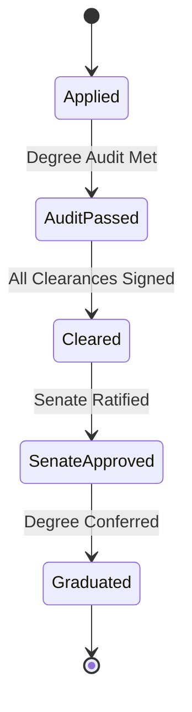

# MOD-01-12: Degree Audit, Clearance, Transcripts & Certification — SOFTWARE REQUIREMENTS SPECIFICATION

- **Module Identifier:** `MOD-01-12`
- **Implementation Phase:** `PHASE 01 - Foundation & Core Student Lifecycle`
- **System:** Integrated University Enterprise Resource Planning & Student Information Management System (MEMA ERP)
- **Document Version:** 1.0.0-PROD-SPEC
- **Status:** Approved Baseline / Ready for Implementation

---

## 1. Module Number and Name
- **Module ID:** `MOD-01-12`
- **Official Name:** Degree Audit, Clearance, Transcripts & Certification
- **Domain:** Foundation & Core Student Lifecycle

## 2. Phase & Implementation Order
- **Phase:** PHASE 01 - Foundation & Core Student Lifecycle
- **Implementation Sequence:** Foundational / Critical Path

## 3. Purpose and Objectives
Governs the graduation lifecycle: automated degree audit evaluation (checking completed credits, core courses, GPA, attachment, fee clearance), graduation roll preparation, Senate graduation approvals, digital certificate generation, provisional/official transcripts, and public online credential verification.

## 4. Scope
### 4.1 In-Scope
- Automated multi-checkpoint degree audit engine
- Multi-departmental online graduation clearance (Finance, Library, Hostels, Department, Exams)
- Senate graduation roll preparation and award classification (First Class, Second Upper...)
- Official and Provisional Academic Transcript generation with QR verification
- Digital Degree Certificate generation with unique serial numbering and cryptographic signatures
- Public certificate verification registry and revocation ledger

### 4.2 Out-of-Scope
- Alumni directory networking (managed in MOD-04-11)
- Physical regalia stock inventory (managed in MOD-03-11)

## 5. Actors / Users and Roles
| Role Name | Description | Access Level |
|---|---|---|
| **Registrar (Academic)** | Approves degree audits, prepares Senate graduation rolls, and issues certificates. | Academic Executive |
| **Clearance Officers (Finance/Library/HOD)** | Clears graduating students across respective departmental checkpoints. | Administrative Staff |
| **Graduating Student** | Applies for graduation, tracks clearance status, orders official transcripts. | End User |
| **Employer / External Verifier** | Verifies authenticity of certificates and transcripts via public QR portal. | Public User |

## 6. Role-Based Permissions (CRUD Matrix)
| Role | Create | Read | Update | Delete | Approve / Execute |
|---|---|---|---|---|---|
| Registrar | YES | YES | YES | NO | YES |
| Clearance Officer | NO | YES | YES | NO | YES |
| Student | Self(Application) | Self | NO | NO | NO |
| Public Verifier | NO | Public Fields | NO | NO | NO |

## 7. End-to-End Workflows
```mermaid
graph TD
    A[Final Year Student Applies for Graduation] --> B[Automated Degree Audit Engine Runs]
    B --> C{Curriculum & Credits Complete?}
    C -->|No| D[Flag Outstanding Courses / Credits]
    C -->|Yes| E[Multi-Department Clearance (Finance, Library, Hostels)]
    E --> F[Preliminary Graduation List Compiled]
    F --> G[School Board & Senate Approval]
    G --> H[Official Graduation Roll Published]
    H --> I[Generate Digitally Signed Transcripts & Certificates with QR]
    I --> J[Transition Student Status to Graduated / Alumni]
```
### Workflow Step-by-Step Execution:
1. **Degree Audit Check:** System evaluates: Total credits earned >= required threshold, all core courses passed, CGPA >= 2.0, attachment completed.
2. **Graduation Application & Clearance:** Student applies online; automated clearance verifies zero fee arrears and zero unreturned library books.
3. **Senate Approval:** Senate reviews graduation list and confers degrees with official honors classification.
4. **Credential Generation:** Generates cryptographically signed official PDF Transcripts and Certificates with QR verification hashes.

## 8. User Actions
| User Role | Interface / View | Action Description | Precondition | Postcondition |
|---|---|---|---|---|
| Student | `/student/graduation/apply` | Submit graduation application and view real-time clearance status | Finalist academic standing | Application submitted, clearance checkpoints initialized |
| Registrar | `/admin/graduation/roll` | Approve final Senate graduation roll and trigger certificate batch generation | Senate approval minute uploaded | Certificates and transcripts generated |

## 9. Functional Requirements
### FR-GRAD-001: Automated Degree Audit Engine
- **Description:** System shall evaluate student transcript history against assigned curriculum version to verify graduation eligibility.
- **Inputs:** Student ID
- **Outputs:** Degree Audit Report (Eligible / Missing Requirements)
- **Validation:** All core courses passed, credits complete, CGPA >= minimum
### FR-GRAD-002: Official Transcript Generator
- **Description:** System shall generate comprehensive academic transcripts with complete semester history, grades, CGPA, degree classification, and security QR code.
- **Inputs:** Student ID, Transcript Type (Provisional/Official)
- **Outputs:** Cryptographically signed PDF Transcript
- **Validation:** Includes verification URL and unique document serial
### FR-GRAD-003: Digital Certificate Engine
- **Description:** System shall generate tamper-proof degree certificates with unique certificate numbers and verifiable SHA-256 hashes.
- **Inputs:** Graduating Student ID, Award Classification
- **Outputs:** Digital Certificate Artifact
- **Validation:** Unique certificate serial registered in public registry

## 10. Sub-Modules
| Sub-Module ID | Sub-Module Name | Core Responsibility |
|---|---|---|
| **SUB-GRAD-01** | Degree Audit Engine | Automated validator for curriculum completion, credit counts, and residency requirements. |
| **SUB-GRAD-02** | Graduation Clearance Desk | Multi-departmental paperless clearance workflow for finance, library, hostels, and academic departments. |
| **SUB-GRAD-03** | Transcripts Production Hub | Generates provisional, official, and final academic transcripts with security watermarking. |
| **SUB-GRAD-04** | Certificate & Verification Authority | Issues numbered degree certificates and maintains the public verification registry. |

## 11. Features
- **Public QR Credential Verification:** Instant verification of certificates and transcripts via secure public portal URL.
- **Automated Degree Classification:** Computes First Class, Second Upper, Second Lower, or Pass based on statutory CGPA cutoffs.

## 12. Business Rules & Logic
- **BR-MOD-01-12-001 (Zero Debt Graduation Rule):** No student with an outstanding financial balance > 0 can be included on the Senate graduation list or issued certificates.
- **BR-MOD-01-12-002 (Certificate Serial Immutability):** Certificate numbers are globally unique and permanently tied to the recipient; re-issuances are marked as 'Duplicate Replacement'.

## 13. Data Requirements & Entities
### Core PostgreSQL Relational Tables:
#### Table: `graduation.graduation_lists`
*Description: Official Senate-approved graduation rolls.*
```sql
CREATE TABLE graduation.graduation_lists (
    id UUID PRIMARY KEY DEFAULT gen_random_uuid(),
    student_id UUID NOT NULL REFERENCES student.students(id),
    programme_id UUID NOT NULL REFERENCES curriculum.programmes(id),
    graduation_ceremony_date DATE NOT NULL,
    degree_classification VARCHAR(100) NOT NULL,
    senate_approval_ref VARCHAR(100) NOT NULL,
    is_cleared BOOLEAN DEFAULT FALSE,
    created_at TIMESTAMPTZ DEFAULT CURRENT_TIMESTAMP,
    UNIQUE(student_id)
);
```

#### Table: `graduation.certificates`
*Description: Issued degree certificate master records.*
```sql
CREATE TABLE graduation.certificates (
    id UUID PRIMARY KEY DEFAULT gen_random_uuid(),
    certificate_number VARCHAR(100) UNIQUE NOT NULL,
    student_id UUID NOT NULL REFERENCES student.students(id),
    document_hash VARCHAR(256) NOT NULL,
    issued_date DATE NOT NULL,
    status VARCHAR(50) NOT NULL DEFAULT 'Valid',
    qr_verification_token VARCHAR(255) UNIQUE NOT NULL,
    created_at TIMESTAMPTZ DEFAULT CURRENT_TIMESTAMP
);
```


## 14. Required Fields & Schema Specification
| Field Name | Data Type | Nullable | Constraints / Foreign Keys | Description |
|---|---|---|---|---|
| `certificate_number` | `VARCHAR(100)` | `NO` | UNIQUE | Official certificate serial number |
| `degree_classification` | `VARCHAR(100)` | `NO` | Valid honors string | Conferred honors award |

## 15. Validation Rules
- **VR-MOD-01-12-001 [is_cleared]:** Must be TRUE across all departmental clearance checkpoints.

## 16. Approval Workflows & Multi-Tier Sign-Off
Graduation approval chain: Department Board -> School Board -> Graduation Board -> Senate Ratification.

## 17. Notifications, Alerts & Triggers
| Event Trigger | Recipient Channel | Message Template Summary |
|---|---|---|
| **Graduation Approved** | `Email + SMS` (Student) | Congratulations! Senate has approved your graduation for {{programme_name}} with {{classification}}. |
| **Certificate Ready** | `Email` (Student) | Your official degree certificate (No: {{certificate_number}}) is ready for collection/download. |

## 18. Dashboards & Analytics Widgets
- **Graduation & Clearance Command Center (Registrar & Deans):** Graduation applicant counts, clearance completion velocity by department, and honors classification distribution.

## 19. Reports
| Report ID | Title | Frequency | Output Formats | Permitted Roles |
|---|---|---|---|---|
| `REP-GRAD-01` | Official Senate Graduation Booklet Roll | Per Graduation Ceremony | PDF | Registrar, Senate |
| `REP-GRAD-02` | Official Academic Transcript | On-Demand | PDF (Secured) | Student, Registrar |

## 20. Search, Filtering and Export Requirements
- **Search Capabilities:** Search by student number, certificate number, name, national ID.
- **Filters:** Graduation Year, School, Degree Classification, Clearance State.
- **Export Options:** Official PDF Transcripts, Excel Graduation Rolls.

## 21. Audit Trails and Logging
- **Audit Level:** Comprehensive append-only logging in `audit.audit_logs`.
- **Monitored Attributes:** Graduation clearances, certificate issuance, classification edits, certificate revocation.
- **Tamper-Proofing:** Cryptographic hash tracking and append-only ledger.

## 22. Security Requirements
- **Authentication:** Restricted to Registrar and authorized clearance officers.
- **Data Protection:** AES-256 for certificate assets.
- **Session Security:** Staff session.

## 23. Integrations / APIs
### Exposed REST Endpoints:
```text
GET  /api/v1/graduation/audit
POST /api/v1/graduation/apply
GET  /api/v1/graduation/clearance-status
GET  /api/v1/graduation/transcript
GET  /api/v1/graduation/verify-certificate/{token}
POST /api/v1/graduation/certificates/issue
```
### External Inbound / Outbound Feeds:
KNQA National Learners Registry, Public Online Verification Portal.

## 24. Dependencies on Other Modules
- **Inbound Dependencies (Prerequisites):** MOD-01-03, MOD-01-06, MOD-01-07, MOD-01-09, MOD-01-11
- **Outbound Dependencies (Consuming Modules):** MOD-04-11 (Alumni), MOD-05-07 (Public Verification Portal).

## 25. System-Generated Documents
- **Official Academic Transcript:** Format `PDF with QR Code & Watermark`. Official complete historical academic transcript displaying all completed units, marks, GPA, and degree classification.
- **Degree Certificate:** Format `PDF with QR Code & Security Seals`. Official degree certificate featuring institutional crest, serial number, and verification hash.

## 26. Statuses and Workflow States

- **State Descriptions:** Applied, AuditPassed, Cleared, SenateApproved, Graduated.

## 27. Exception / Error Handling
| Error Code | HTTP Status | Trigger Condition | System Recovery Action |
|---|---|---|---|
| `ERR-GRAD-002` | `422 Unprocessable Entity` | Attempt to graduate student with missing core courses | Output list of incomplete curriculum requirements. |

## 28. Accessibility and Usability Requirements
- **Compliance:** WCAG 2.2 AA compliant typography, contrast ratio >= 4.5:1, keyboard navigability, screen reader aria-labels.
- **Responsive Layout:** Adaptive desktop, tablet, and mobile viewport breakpoints (320px to 2560px).

## 29. Performance Requirements & SLOs
- **Response Time:** 95% of API requests respond in < 250ms.
- **Concurrency:** Supports 5,000 concurrent active users without degradation.
- **Availability:** 99.95% uptime target.

## 30. Compliance Requirements
KNQA National Qualifications Framework and University Senate Statutes.

## 31. Acceptance Criteria, Test Scenarios & Future Extensibility
### 31.1 Acceptance Criteria
- [ ] **AC-1:** Degree audit automatically flags any missing core courses or credit deficits.
- [ ] **AC-2:** Paperless clearance workflow requires 100% sign-off across all required departments.
- [ ] **AC-3:** Generates tamper-proof PDF transcripts and certificates with working QR verification URL.

### 31.2 Test Scenarios
| Scenario ID | Test Case Title | Test Steps | Expected Outcome |
|---|---|---|---|
| `TC-GRAD-01` | Degree Audit Complete Verification | 1. Create student with 120/120 credits passed and CGPA = 3.5. 2. Run degree audit. | Degree audit returns Eligible = TRUE, honors classification = Second Class Honours (Upper Division). |

### 31.3 Future & Extensibility Considerations
- Blockchain verification hash anchoring on public digital credential networks.
