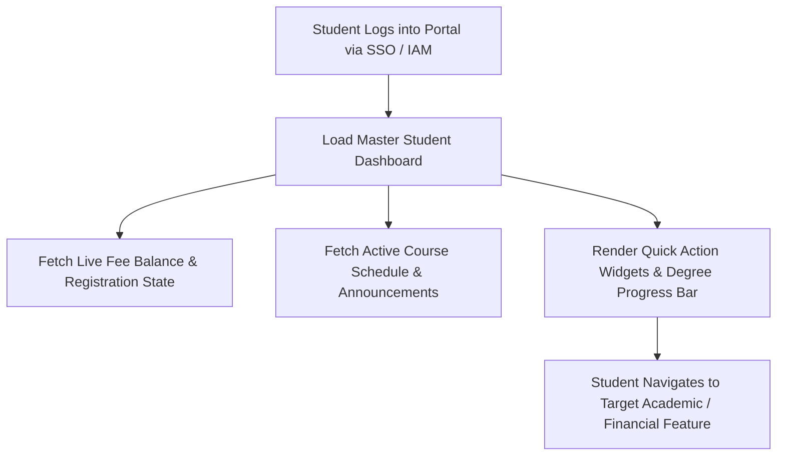
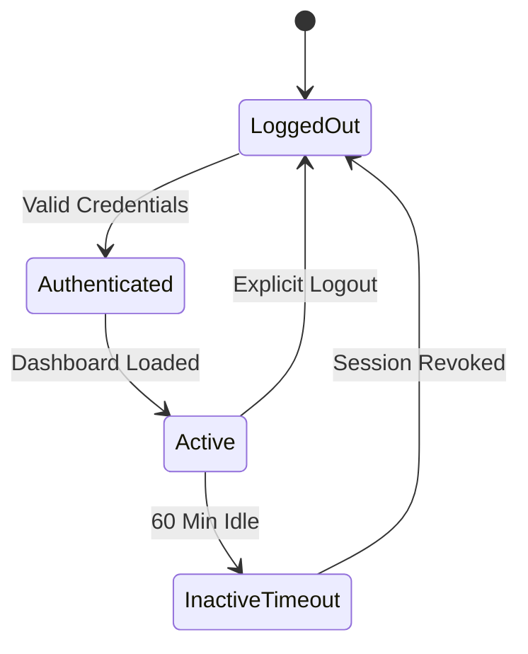

# MOD-01-13: Unified Responsive Student Self-Service Portal — SOFTWARE REQUIREMENTS SPECIFICATION

- **Module Identifier:** `MOD-01-13`
- **Implementation Phase:** `PHASE 01 - Foundation & Core Student Lifecycle`
- **System:** Integrated University Enterprise Resource Planning & Student Information Management System (MEMA ERP)
- **Document Version:** 1.0.0-PROD-SPEC
- **Status:** Approved Baseline / Ready for Implementation

---

## 1. Module Number and Name
- **Module ID:** `MOD-01-13`
- **Official Name:** Unified Responsive Student Self-Service Portal
- **Domain:** Foundation & Core Student Lifecycle

## 2. Phase & Implementation Order
- **Phase:** PHASE 01 - Foundation & Core Student Lifecycle
- **Implementation Sequence:** Foundational / Critical Path

## 3. Purpose and Objectives
Serves as the primary responsive web interface for university students. Unifies authentication, profile, registration, course enrollment, fee statements, online payments, timetables, exam cards, results slips, degree progress widgets, notifications, requests, and documents into a modern UI using the university design system.

## 4. Scope
### 4.1 In-Scope
- Unified student dashboard with real-time summary cards (GPA, Fee Balance, Registered Units, Alerts)
- Profile header (photo, student number, programme, year of study, campus, study mode)
- Quick actions panel (Register, Pay Fees, Download Exam Card, View Results, View Timetable)
- Responsive sidebar navigation across all student lifecycle modules
- Dynamic notification drawer (Email/SMS/In-app) and active security session manager
- Mobile-optimized layout complying with university brand palette (`#0A3E50`, `#1E8449`, `#FFFFFF`, `#F8FAFC`)

### 4.2 Out-of-Scope
- Administrative back-office processing screens (managed in respective domain modules)
- Native mobile app codebase (managed in MOD-05-08)

## 5. Actors / Users and Roles
| Role Name | Description | Access Level |
|---|---|---|
| **Enrolled Student** | Primary user accessing all academic, financial, and personal self-service functions. | End User |
| **Prospective / Admitted Student** | Accesses onboarding checklist, admission letter, and initial fee payment. | End User |

## 6. Role-Based Permissions (CRUD Matrix)
| Role | Create | Read | Update | Delete | Approve / Execute |
|---|---|---|---|---|---|
| Student | Self | Self | Self | NO | NO |
| Super Admin | YES | YES | YES | NO | YES |

## 7. End-to-End Workflows

### Workflow Step-by-Step Execution:
1. **Authentication & Session:** Student signs in via email/student number; system loads role session and theme tokens.
2. **Dashboard Aggregation:** Single aggregated API call retrieves fee balance, registered courses, active alerts, and timetable slots.
3. **Feature Execution:** Student performs self-service actions (course add/drop, M-Pesa payment, exam card download).
4. **Live Updates:** Websocket/Polling triggers real-time updates for fee receipts, grade publications, and schedule alerts.

## 8. User Actions
| User Role | Interface / View | Action Description | Precondition | Postcondition |
|---|---|---|---|---|
| Student | `/student/dashboard` | View consolidated academic summary, alerts, and quick actions | Authenticated session | Dashboard widgets rendered |
| Student | `/student/documents` | Download signed official letters, registration slips, and receipts | Active student account | PDF documents downloaded |

## 9. Functional Requirements
### FR-POR-001: Responsive Student Dashboard Hub
- **Description:** System shall render a comprehensive dashboard containing profile card, fee balance widget, registered units count, current CGPA, upcoming lectures, and unread notifications.
- **Inputs:** Student Session Token
- **Outputs:** Aggregated JSON Dashboard Payload + Rendered UI
- **Validation:** Sub-250ms API response
### FR-POR-002: Brand Design System Implementation
- **Description:** Portal shall strictly implement approved university design tokens: Primary (#0A3E50), Secondary (#1E8449), Accent (#0A3E50), Surface (#FFFFFF), Canvas (#F8FAFC) with zero Tailwind overhead.
- **Inputs:** CSS Token Variables
- **Outputs:** Pixel-perfect WCAG 2.2 AA compliant interface
- **Validation:** Contrast ratio >= 4.5:1
### FR-POR-003: Universal Quick Actions & Navigation Drawer
- **Description:** System shall provide 1-click access to critical student functions: Register Units, Pay Tuition, Download Exam Card, View Results, View Timetable.
- **Inputs:** User Click Event
- **Outputs:** Immediate route transition without page reload
- **Validation:** Next.js App Router client routing

## 10. Sub-Modules
| Sub-Module ID | Sub-Module Name | Core Responsibility |
|---|---|---|
| **SUB-POR-01** | Student Dashboard & Widgets | Aggregated summary cards, degree progress visualizer, and academic status indicators. |
| **SUB-POR-02** | Navigation & Theme Engine | Responsive sidebar, breadcrumbs, brand color tokens, dark mode toggle, and mobile drawer. |
| **SUB-POR-03** | Quick Actions & Tasks Center | Actionable shortcuts, pending tasks, registration reminders, and urgent payment alerts. |
| **SUB-POR-04** | Document & Notification Center | In-app notification drawer, document downloads vault, and active session manager. |

## 11. Features
- **Live Degree Progress Gauge:** Visual radial/progress bar indicating total completed credits vs. required graduation credits.
- **Dynamic Exam Eligibility Badge:** Real-time green/red indicator showing whether student is currently eligible to print exam cards.

## 12. Business Rules & Logic
- **BR-MOD-01-13-001 (Role Isolation):** Students can strictly only access data belonging to their own student master record.
- **BR-MOD-01-13-002 (Instant Session Termination):** Logging out immediately invalidates both local JWT storage and backend Redis session tokens.

## 13. Data Requirements & Entities
### Core PostgreSQL Relational Tables:
#### Table: `portal.student_preferences`
*Description: Student UI preferences and notification settings.*
```sql
CREATE TABLE portal.student_preferences (
    id UUID PRIMARY KEY DEFAULT gen_random_uuid(),
    student_id UUID NOT NULL REFERENCES student.students(id),
    theme_mode VARCHAR(20) DEFAULT 'light',
    email_notifications BOOLEAN DEFAULT TRUE,
    sms_notifications BOOLEAN DEFAULT TRUE,
    updated_at TIMESTAMPTZ DEFAULT CURRENT_TIMESTAMP,
    UNIQUE(student_id)
);
```


## 14. Required Fields & Schema Specification
| Field Name | Data Type | Nullable | Constraints / Foreign Keys | Description |
|---|---|---|---|---|
| `student_id` | `UUID` | `NO` | UNIQUE | Student master reference |
| `theme_mode` | `VARCHAR(20)` | `NO` | light/dark | UI theme selection |

## 15. Validation Rules
- **VR-MOD-01-13-001 [theme_mode]:** Must be either 'light' or 'dark'.

## 16. Approval Workflows & Multi-Tier Sign-Off
Profile photo update requests require Admissions / Registrar verification before updating official ID card asset.

## 17. Notifications, Alerts & Triggers
| Event Trigger | Recipient Channel | Message Template Summary |
|---|---|---|
| **Portal Login Alert** | `In-App` (Student) | Welcome back, {{first_name}}! You have {{unread_count}} new notifications. |

## 18. Dashboards & Analytics Widgets
- **Student Unified Self-Service Dashboard (Student):** Centralized home screen displaying financial balance, enrolled courses, today's schedule, GPA, and alerts.

## 19. Reports
| Report ID | Title | Frequency | Output Formats | Permitted Roles |
|---|---|---|---|---|
| `REP-POR-01` | Student Self-Service Activity Summary | On-Demand | PDF | Student |

## 20. Search, Filtering and Export Requirements
- **Search Capabilities:** Global search across registered courses, downloaded documents, payment receipts, and announcements.
- **Filters:** Document Type, Academic Term.
- **Export Options:** PDF Documents, CSV Statements.

## 21. Audit Trails and Logging
- **Audit Level:** Comprehensive append-only logging in `audit.audit_logs`.
- **Monitored Attributes:** Portal logins, password changes, notification reads, profile updates.
- **Tamper-Proofing:** Audited in append-only logs.

## 22. Security Requirements
- **Authentication:** JWT + HTTP-only refresh cookie; CSRF token validation.
- **Data Protection:** TLS 1.3 in transit.
- **Session Security:** 15-minute access token rotation.

## 23. Integrations / APIs
### Exposed REST Endpoints:
```text
GET /api/v1/portal/student/dashboard
GET /api/v1/portal/student/alerts
GET /api/v1/portal/student/documents
PATCH /api/v1/portal/student/preferences
```
### External Inbound / Outbound Feeds:
Sentry error telemetry, WebSocket notification service.

## 24. Dependencies on Other Modules
- **Inbound Dependencies (Prerequisites):** MOD-01-01 through MOD-01-12
- **Outbound Dependencies (Consuming Modules):** Consumes all student-facing services across the ERP.

## 25. System-Generated Documents
- **Student Portal User Guide:** Format `PDF`. Official illustrated manual explaining portal navigation and self-service features.

## 26. Statuses and Workflow States

- **State Descriptions:** LoggedOut, Authenticated, Active, InactiveTimeout.

## 27. Exception / Error Handling
| Error Code | HTTP Status | Trigger Condition | System Recovery Action |
|---|---|---|---|
| `ERR-POR-001` | `401 Unauthorized` | Expired session token | Attempt silent refresh; redirect to login if refresh fails. |

## 28. Accessibility and Usability Requirements
- **Compliance:** WCAG 2.2 AA compliant typography, contrast ratio >= 4.5:1, keyboard navigability, screen reader aria-labels.
- **Responsive Layout:** Adaptive desktop, tablet, and mobile viewport breakpoints (320px to 2560px).

## 29. Performance Requirements & SLOs
- **Response Time:** 95% of API requests respond in < 250ms.
- **Concurrency:** Supports 10,000 concurrent active users without degradation.
- **Availability:** 99.95% uptime target.

## 30. Compliance Requirements
Kenya Data Protection Act 2019 and Web Content Accessibility Guidelines (WCAG 2.2 AA).

## 31. Acceptance Criteria, Test Scenarios & Future Extensibility
### 31.1 Acceptance Criteria
- [ ] **AC-1:** Portal loads dashboard with sub-second initial render time.
- [ ] **AC-2:** Implements full university color palette (#0A3E50 primary, #1E8449 secondary, #F8FAFC canvas).
- [ ] **AC-3:** All quick actions (Registration, Payments, Exam Card, Results) operate seamlessly.
- [ ] **AC-4:** Fully responsive across mobile (320px), tablet (768px), and desktop (1440px+).

### 31.2 Test Scenarios
| Scenario ID | Test Case Title | Test Steps | Expected Outcome |
|---|---|---|---|
| `TC-POR-01` | Dashboard Aggregated Render Test | 1. Log in as student. 2. Fetch /portal/student/dashboard. 3. Verify all widget data. | Dashboard displays correct fee balance, enrolled units, timetable, and degree progress. |

### 31.3 Future & Extensibility Considerations
- PWA (Progressive Web App) offline caching for class schedules and student ID card.
