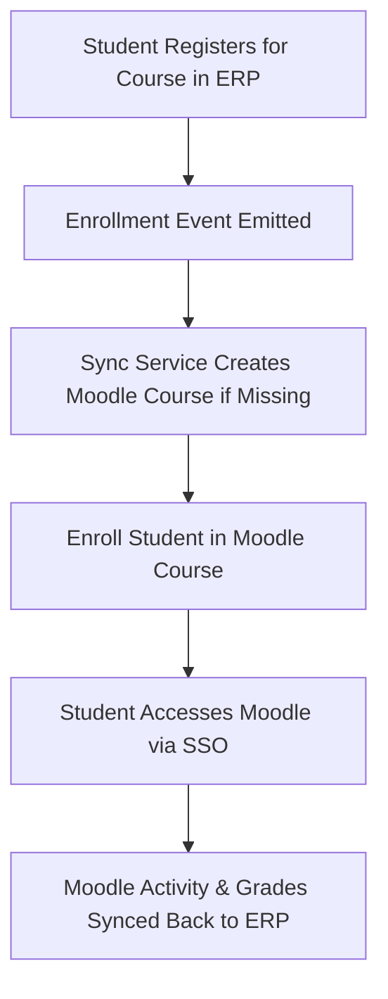
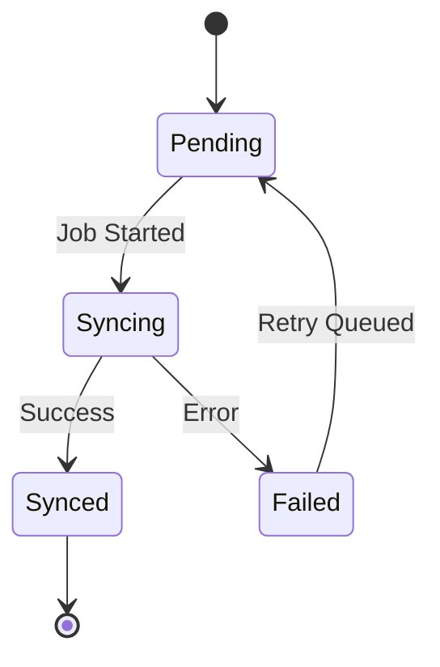

# MOD-02-01: LMS Two-Way Synchronization Hub (Moodle) — SOFTWARE REQUIREMENTS SPECIFICATION

- **Module Identifier:** `MOD-02-01`
- **Implementation Phase:** `PHASE 02 - Academic Services & Student Affairs`
- **System:** Integrated University Enterprise Resource Planning & Student Information Management System (MEMA ERP)
- **Document Version:** 1.0.0-PROD-SPEC
- **Status:** Approved Baseline / Ready for Implementation

---

## 1. Module Number and Name
- **Module ID:** `MOD-02-01`
- **Official Name:** LMS Two-Way Synchronization Hub (Moodle)
- **Domain:** Academic Services & Student Affairs

## 2. Phase & Implementation Order
- **Phase:** PHASE 02 - Academic Services & Student Affairs
- **Implementation Sequence:** Foundational / Critical Path

## 3. Purpose and Objectives
Provides bidirectional real-time synchronization between the university ERP and Moodle LMS. Students, lecturers, courses, enrollments, and grades sync automatically without manual re-entry.

## 4. Scope
### 4.1 In-Scope
- Student roster sync (ERP -> Moodle)
- Course and section sync (ERP -> Moodle)
- Grade and activity sync (Moodle -> ERP)
- LMS engagement analytics (login frequency, assignment completion, forum participation)
- Single Sign-On passthrough from ERP to Moodle

### 4.2 Out-of-Scope
- Full LMS course content authoring (stays in Moodle)
- Online proctoring engine (third-party integration)

## 5. Actors / Users and Roles
| Role Name | Description | Access Level |
|---|---|---|
| **ICT/LMS Administrator** | Configures sync schedules, monitors sync health, resolves failures. | System Admin |
| **Lecturer** | Views synchronized class rosters and pushes gradebook marks. | Academic Staff |
| **Student** | Accesses Moodle courses via SSO link from student portal. | End User |

## 6. Role-Based Permissions (CRUD Matrix)
| Role | Create | Read | Update | Delete | Approve / Execute |
|---|---|---|---|---|---|
| LMS Admin | YES | YES | YES | NO | YES |
| Lecturer | NO | YES | NO | NO | NO |
| Student | NO | Self | NO | NO | NO |

## 7. End-to-End Workflows

### Workflow Step-by-Step Execution:
1. **Course Sync:** When a new course offering is created in ERP, a corresponding Moodle course shell is auto-provisioned.
2. **Enrollment Sync:** Course enrollment events trigger Moodle user enrollment via REST API.
3. **Grade Pull:** Scheduled job pulls Moodle gradebook scores back into ERP assessment tables.
4. **Activity Analytics:** Moodle login counts, completion rates, and forum posts are ingested into ERP analytics.

## 8. User Actions
| User Role | Interface / View | Action Description | Precondition | Postcondition |
|---|---|---|---|---|
| Student | `/student/lms` | Launch Moodle course via SSO redirect | Enrolled in course | Moodle session established |
| LMS Admin | `/admin/lms/sync-dashboard` | Monitor sync health and trigger manual resync | LMS Admin role | Sync status refreshed |

## 9. Functional Requirements
### FR-LMS-001: Bidirectional Course & Enrollment Sync
- **Description:** System shall sync courses and rosters between ERP and Moodle via Moodle Web Services REST API.
- **Inputs:** Course Offering ID, Student IDs
- **Outputs:** Moodle course enrollment confirmations
- **Validation:** Idempotent sync with conflict resolution
### FR-LMS-002: Grade Ingest Pipeline
- **Description:** System shall pull Moodle gradebook final scores into ERP assessment records on configurable schedule.
- **Inputs:** Moodle course ID, Grade items
- **Outputs:** Updated CAT/assessment scores in ERP
- **Validation:** Score range validation 0-100

## 10. Sub-Modules
| Sub-Module ID | Sub-Module Name | Core Responsibility |
|---|---|---|
| **SUB-LMS-01** | Course Provisioning Sync | Creates and updates Moodle course shells from ERP course offerings. |
| **SUB-LMS-02** | Enrollment Roster Sync | Enrolls and un-enrolls students in Moodle matching ERP add/drop events. |
| **SUB-LMS-03** | Gradebook & Activity Ingest | Pulls grades and engagement metrics from Moodle into ERP data warehouse. |

## 11. Features
- **SSO Passthrough:** One-click launch from student portal to Moodle without re-authentication.
- **Sync Health Dashboard:** Real-time monitoring of sync queue depth, failure rate, and last successful sync timestamp.

## 12. Business Rules & Logic
- **BR-MOD-02-01-001 (Idempotent Sync):** Repeated sync operations must not create duplicate enrollments or courses in Moodle.
- **BR-MOD-02-01-002 (Grade Source of Truth):** Official marks remain in ERP examination module; Moodle grades are advisory until lecturer confirms.

## 13. Data Requirements & Entities
### Core PostgreSQL Relational Tables:
#### Table: `lms.sync_logs`
*Description: LMS synchronization event audit log.*
```sql
CREATE TABLE lms.sync_logs (
    id UUID PRIMARY KEY DEFAULT gen_random_uuid(),
    sync_type VARCHAR(50) NOT NULL,
    entity_id UUID NOT NULL,
    direction VARCHAR(20) NOT NULL,
    status VARCHAR(20) NOT NULL,
    error_message TEXT,
    synced_at TIMESTAMPTZ DEFAULT CURRENT_TIMESTAMP
);
```


## 14. Required Fields & Schema Specification
| Field Name | Data Type | Nullable | Constraints / Foreign Keys | Description |
|---|---|---|---|---|
| `sync_type` | `VARCHAR(50)` | `NO` | course|enrollment|grade | Type of sync operation |
| `direction` | `VARCHAR(20)` | `NO` | erp_to_lms|lms_to_erp | Sync direction |

## 15. Validation Rules
- **VR-MOD-02-01-001 [entity_id]:** Must reference a valid ERP course offering or student enrollment record.

## 16. Approval Workflows & Multi-Tier Sign-Off
Sync configuration changes require ICT Director approval.

## 17. Notifications, Alerts & Triggers
| Event Trigger | Recipient Channel | Message Template Summary |
|---|---|---|
| **Sync Failure Alert** | `Email` (LMS Admin) | LMS sync failure for {{entity_type}} ID {{entity_id}}: {{error_message}}. Manual intervention required. |

## 18. Dashboards & Analytics Widgets
- **LMS Sync Health Monitor (LMS Admin):** Sync queue depth, success/failure rates, last sync timestamps per entity type.

## 19. Reports
| Report ID | Title | Frequency | Output Formats | Permitted Roles |
|---|---|---|---|---|
| `REP-LMS-01` | LMS Engagement & Activity Report | Weekly | PDF, CSV | Dean, HOD |
| `REP-LMS-02` | Sync Failure & Resolution Log | Daily | CSV | LMS Admin |

## 20. Search, Filtering and Export Requirements
- **Search Capabilities:** Search by course code, student number, sync status.
- **Filters:** Sync type, Status, Date range.
- **Export Options:** CSV, JSON.

## 21. Audit Trails and Logging
- **Audit Level:** Comprehensive append-only logging in `audit.audit_logs`.
- **Monitored Attributes:** All sync operations, configuration changes, manual overrides.
- **Tamper-Proofing:** Append-only sync event log.

## 22. Security Requirements
- **Authentication:** LMS Admin RBAC.
- **Data Protection:** TLS 1.3 for Moodle API calls.
- **Session Security:** Service account tokens.

## 23. Integrations / APIs
### Exposed REST Endpoints:
```text
POST /api/v1/lms/sync/courses
POST /api/v1/lms/sync/enrollments
GET  /api/v1/lms/sync/status
POST /api/v1/lms/sync/grades/pull
```
### External Inbound / Outbound Feeds:
Moodle Web Services REST API, Moodle External Database Enrollment Plugin.

## 24. Dependencies on Other Modules
- **Inbound Dependencies (Prerequisites):** MOD-01-04 (Courses), MOD-01-07 (Enrollment)
- **Outbound Dependencies (Consuming Modules):** MOD-01-10 (Assessment grades), MOD-05-04 (Retention analytics).

## 25. System-Generated Documents
- **LMS Sync Status Report:** Format `CSV`. Detailed log of all sync operations with success/failure status.

## 26. Statuses and Workflow States

- **State Descriptions:** Pending, Syncing, Synced, Failed.

## 27. Exception / Error Handling
| Error Code | HTTP Status | Trigger Condition | System Recovery Action |
|---|---|---|---|
| `ERR-LMS-001` | `502 Bad Gateway` | Moodle API unreachable | Queue for retry with exponential backoff (max 5 retries). |

## 28. Accessibility and Usability Requirements
- **Compliance:** WCAG 2.2 AA compliant typography, contrast ratio >= 4.5:1, keyboard navigability, screen reader aria-labels.
- **Responsive Layout:** Adaptive desktop, tablet, and mobile viewport breakpoints (320px to 2560px).

## 29. Performance Requirements & SLOs
- **Response Time:** 95% of API requests respond in < 250ms.
- **Concurrency:** Supports 5,000 concurrent active users without degradation.
- **Availability:** 99.95% uptime target.

## 30. Compliance Requirements
University LMS integration policy and data sharing agreements.

## 31. Acceptance Criteria, Test Scenarios & Future Extensibility
### 31.1 Acceptance Criteria
- [ ] **AC-1:** Courses sync from ERP to Moodle without duplicate creation.
- [ ] **AC-2:** Student enrollments appear in Moodle within 60 seconds of ERP registration.
- [ ] **AC-3:** Moodle grades pull back into ERP assessment records accurately.

### 31.2 Test Scenarios
| Scenario ID | Test Case Title | Test Steps | Expected Outcome |
|---|---|---|---|
| `TC-LMS-01` | End-to-End Course Sync | 1. Create course offering in ERP. 2. Trigger sync. 3. Verify Moodle course exists. | Moodle course created with matching code and enrolled students. |

### 31.3 Future & Extensibility Considerations
- Canvas and Blackboard LMS adapter plugins.
- xAPI Learning Record Store (LRS) integration.
