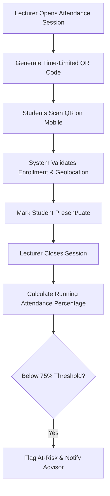
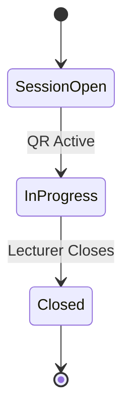

# MOD-02-02: Class Attendance, QR Clock-In & Biometrics — SOFTWARE REQUIREMENTS SPECIFICATION

- **Module Identifier:** `MOD-02-02`
- **Implementation Phase:** `PHASE 02 - Academic Services & Student Affairs`
- **System:** Integrated University Enterprise Resource Planning & Student Information Management System (MEMA ERP)
- **Document Version:** 1.0.0-PROD-SPEC
- **Status:** Approved Baseline / Ready for Implementation

---

## 1. Module Number and Name
- **Module ID:** `MOD-02-02`
- **Official Name:** Class Attendance, QR Clock-In & Biometrics
- **Domain:** Academic Services & Student Affairs

## 2. Phase & Implementation Order
- **Phase:** PHASE 02 - Academic Services & Student Affairs
- **Implementation Sequence:** Foundational / Critical Path

## 3. Purpose and Objectives
Tracks student class attendance and lecturer session delivery using mobile QR code clock-in, biometric terminal integration, and manual registers. Flags at-risk students with attendance below threshold for advisor intervention.

## 4. Scope
### 4.1 In-Scope
- Student session-level attendance marking (Present, Absent, Late, Excused)
- Mobile QR code clock-in per class session
- Biometric terminal integration for physical lab and lecture access
- Attendance threshold monitoring with automated alerts (e.g., < 75% triggers warning)
- Lecturer session delivery confirmation and teaching log

### 4.2 Out-of-Scope
- Academic performance grading based on attendance alone (attendance informs eligibility only)
- Physical door access hardware procurement

## 5. Actors / Users and Roles
| Role Name | Description | Access Level |
|---|---|---|
| **Lecturer** | Opens attendance session, generates QR code, and closes register. | Academic Staff |
| **Student** | Scans QR code or checks in via biometric to mark attendance. | End User |
| **HOD / Academic Advisor** | Reviews departmental attendance reports and at-risk student alerts. | Departmental Staff |

## 6. Role-Based Permissions (CRUD Matrix)
| Role | Create | Read | Update | Delete | Approve / Execute |
|---|---|---|---|---|---|
| Lecturer | YES | YES | YES | NO | YES |
| Student | Self(Check-in) | Self | NO | NO | NO |
| HOD | NO | YES | YES | NO | YES |

## 7. End-to-End Workflows

### Workflow Step-by-Step Execution:
1. **Session Opening:** Lecturer taps 'Start Attendance' generating a unique time-limited (5 min) QR code.
2. **Student Check-In:** Students scan QR on mobile device; system validates enrollment in that specific course section.
3. **Threshold Monitoring:** After each session, system recalculates running attendance percentage per student per course.
4. **Risk Alerting:** Students dropping below 75% attendance receive warning notification and advisor is alerted.

## 8. User Actions
| User Role | Interface / View | Action Description | Precondition | Postcondition |
|---|---|---|---|---|
| Lecturer | `/lecturer/attendance/session` | Generate QR and take class attendance | Scheduled teaching slot | Attendance recorded for all scanned students |
| Student | `/student/attendance/scan` | Scan session QR code to mark attendance | Enrolled in course | Attendance marked as Present with timestamp |

## 9. Functional Requirements
### FR-ATT-001: Dynamic QR Attendance Session
- **Description:** System shall generate unique, time-limited QR codes per class session that expire after configurable window.
- **Inputs:** Course Offering ID, Session Date/Time
- **Outputs:** Unique QR token (5-min TTL)
- **Validation:** One-time use per student per session
### FR-ATT-002: Attendance Threshold Engine
- **Description:** System shall continuously calculate attendance percentage and trigger alerts when below institutional threshold.
- **Inputs:** Student attendance records per course
- **Outputs:** Percentage and risk flag
- **Validation:** Threshold configurable per programme

## 10. Sub-Modules
| Sub-Module ID | Sub-Module Name | Core Responsibility |
|---|---|---|
| **SUB-ATT-01** | Session QR Generator | Creates and validates time-limited attendance QR tokens per teaching slot. |
| **SUB-ATT-02** | Biometric Integration Hub | Ingests attendance events from physical biometric terminals. |
| **SUB-ATT-03** | Attendance Analytics & Risk Engine | Calculates running percentages and flags at-risk students. |

## 11. Features
- **Geo-Fenced Attendance:** Optional GPS validation ensuring student is physically within campus radius when scanning QR.
- **Attendance Heatmap:** Visual analytics showing attendance patterns by day, time, course, and department.

## 12. Business Rules & Logic
- **BR-MOD-02-02-001 (Single Scan Rule):** A student can only scan the session QR once; duplicate scans are rejected silently.
- **BR-MOD-02-02-002 (Exam Eligibility Impact):** Students with attendance below 75% may be flagged as ineligible for final examinations.

## 13. Data Requirements & Entities
### Core PostgreSQL Relational Tables:
#### Table: `attendance.session_logs`
*Description: Individual student attendance event records.*
```sql
CREATE TABLE attendance.session_logs (
    id UUID PRIMARY KEY DEFAULT gen_random_uuid(),
    course_offering_id UUID NOT NULL REFERENCES course.course_offerings(id),
    student_id UUID NOT NULL REFERENCES student.students(id),
    session_date DATE NOT NULL,
    check_in_time TIMESTAMPTZ,
    status VARCHAR(20) NOT NULL DEFAULT 'Present',
    method VARCHAR(20) NOT NULL DEFAULT 'QR',
    created_at TIMESTAMPTZ DEFAULT CURRENT_TIMESTAMP,
    UNIQUE(course_offering_id, student_id, session_date)
);
```


## 14. Required Fields & Schema Specification
| Field Name | Data Type | Nullable | Constraints / Foreign Keys | Description |
|---|---|---|---|---|
| `status` | `VARCHAR(20)` | `NO` | Present|Absent|Late|Excused | Attendance status |

## 15. Validation Rules
- **VR-MOD-02-02-001 [check_in_time]:** Must fall within the scheduled teaching slot time window (start_time - 5min to end_time).

## 16. Approval Workflows & Multi-Tier Sign-Off
Manual attendance overrides require HOD approval with documented reason.

## 17. Notifications, Alerts & Triggers
| Event Trigger | Recipient Channel | Message Template Summary |
|---|---|---|
| **Attendance Below Threshold** | `Email + SMS` (Student & Advisor) | Warning: Your attendance in {{course_code}} is {{percentage}}%, below the required 75% minimum. |

## 18. Dashboards & Analytics Widgets
- **Departmental Attendance Dashboard (HOD & Dean):** Course-level attendance rates, at-risk student counts, and lecturer session delivery compliance.

## 19. Reports
| Report ID | Title | Frequency | Output Formats | Permitted Roles |
|---|---|---|---|---|
| `REP-ATT-01` | Course Attendance Register | Per Session / On-Demand | PDF, Excel | Lecturer, HOD |

## 20. Search, Filtering and Export Requirements
- **Search Capabilities:** Search by student number, course, date.
- **Filters:** Course, Status, Date Range, Threshold Flag.
- **Export Options:** PDF Register, CSV.

## 21. Audit Trails and Logging
- **Audit Level:** Comprehensive append-only logging in `audit.audit_logs`.
- **Monitored Attributes:** Session creation, student check-ins, manual overrides.
- **Tamper-Proofing:** Append-only attendance log.

## 22. Security Requirements
- **Authentication:** Lecturer/Student session.
- **Data Protection:** TLS 1.3.
- **Session Security:** User session.

## 23. Integrations / APIs
### Exposed REST Endpoints:
```text
POST /api/v1/attendance/sessions/open
GET  /api/v1/attendance/sessions/{id}/qr
POST /api/v1/attendance/check-in
GET  /api/v1/attendance/my-record
GET  /api/v1/attendance/course/{id}/report
```
### External Inbound / Outbound Feeds:
Biometric terminal REST API, Mobile device camera/QR scanner.

## 24. Dependencies on Other Modules
- **Inbound Dependencies (Prerequisites):** MOD-01-04, MOD-01-07, MOD-01-08
- **Outbound Dependencies (Consuming Modules):** MOD-01-10 (Exam eligibility), MOD-05-04 (Retention risk).

## 25. System-Generated Documents
- **Class Attendance Register:** Format `PDF`. Official class attendance sheet per session with student signatures.

## 26. Statuses and Workflow States

- **State Descriptions:** SessionOpen, InProgress, Closed.

## 27. Exception / Error Handling
| Error Code | HTTP Status | Trigger Condition | System Recovery Action |
|---|---|---|---|
| `ERR-ATT-001` | `409 Conflict` | Student attempts duplicate check-in for same session | Return existing check-in timestamp. |

## 28. Accessibility and Usability Requirements
- **Compliance:** WCAG 2.2 AA compliant typography, contrast ratio >= 4.5:1, keyboard navigability, screen reader aria-labels.
- **Responsive Layout:** Adaptive desktop, tablet, and mobile viewport breakpoints (320px to 2560px).

## 29. Performance Requirements & SLOs
- **Response Time:** 95% of API requests respond in < 250ms.
- **Concurrency:** Supports 8,000 concurrent active users without degradation.
- **Availability:** 99.95% uptime target.

## 30. Compliance Requirements
University academic regulations on minimum attendance for examination eligibility.

## 31. Acceptance Criteria, Test Scenarios & Future Extensibility
### 31.1 Acceptance Criteria
- [ ] **AC-1:** QR code generates and is scannable on student mobile devices.
- [ ] **AC-2:** Duplicate check-in attempts are rejected.
- [ ] **AC-3:** Students below 75% attendance are automatically flagged.

### 31.2 Test Scenarios
| Scenario ID | Test Case Title | Test Steps | Expected Outcome |
|---|---|---|---|
| `TC-ATT-01` | QR Attendance Check-In | 1. Lecturer opens session. 2. Student scans QR. 3. Verify attendance logged. | Student marked Present with timestamp. |

### 31.3 Future & Extensibility Considerations
- Facial recognition attendance verification.
- Bluetooth beacon proximity-based auto-attendance.
