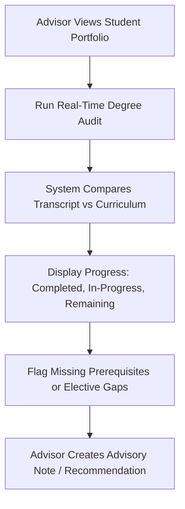
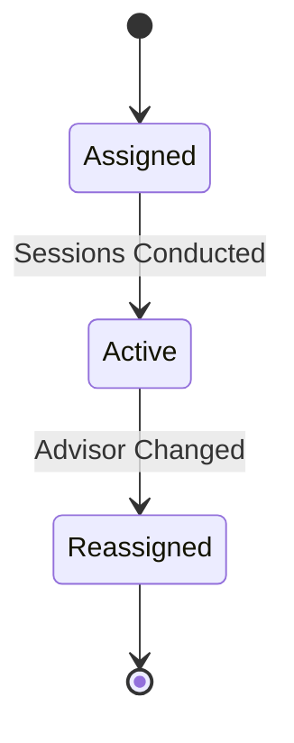

# MOD-02-03: Academic Advising & Degree Progress Tracking — SOFTWARE REQUIREMENTS SPECIFICATION

- **Module Identifier:** `MOD-02-03`
- **Implementation Phase:** `PHASE 02 - Academic Services & Student Affairs`
- **System:** Integrated University Enterprise Resource Planning & Student Information Management System (MEMA ERP)
- **Document Version:** 1.0.0-PROD-SPEC
- **Status:** Approved Baseline / Ready for Implementation

---

## 1. Module Number and Name
- **Module ID:** `MOD-02-03`
- **Official Name:** Academic Advising & Degree Progress Tracking
- **Domain:** Academic Services & Student Affairs

## 2. Phase & Implementation Order
- **Phase:** PHASE 02 - Academic Services & Student Affairs
- **Implementation Sequence:** Foundational / Critical Path

## 3. Purpose and Objectives
Enables faculty academic advisors to monitor assigned student academic performance, conduct real-time degree audit visualizations showing curriculum completion progress, and intervene early when students are off-track academically.

## 4. Scope
### 4.1 In-Scope
- Advisor-student assignment and advisory session scheduling
- Real-time automated degree audit comparing student transcript vs curriculum requirements
- Visual degree progress tracker (credits completed vs required, core vs elective status)
- Course recommendation engine based on remaining requirements and prerequisites
- Advisory notes and intervention action tracking

### 4.2 Out-of-Scope
- Formal examination marks entry (managed in MOD-01-10)
- Financial advising (managed in MOD-01-09)

## 5. Actors / Users and Roles
| Role Name | Description | Access Level |
|---|---|---|
| **Academic Advisor / Lecturer** | Reviews advisee portfolios, conducts degree audits, and logs advisory notes. | Academic Staff |
| **Student** | Views degree progress, receives course recommendations, and requests advisory sessions. | End User |
| **HOD / Programme Coordinator** | Monitors advising activity and degree audit exception reports. | Departmental Leader |

## 6. Role-Based Permissions (CRUD Matrix)
| Role | Create | Read | Update | Delete | Approve / Execute |
|---|---|---|---|---|---|
| Advisor | YES | YES | YES | NO | YES |
| Student | NO | Self | NO | NO | NO |
| HOD | NO | YES | NO | NO | NO |

## 7. End-to-End Workflows

### Workflow Step-by-Step Execution:
1. **Portfolio Review:** Advisor views assigned students dashboard with CGPA, at-risk flags, and completion percentage.
2. **Degree Audit Execution:** Engine compares student's completed courses against assigned curriculum version requirements.
3. **Intervention:** Advisor logs advisory notes, course recommendations, or escalates to Programme Coordinator.

## 8. User Actions
| User Role | Interface / View | Action Description | Precondition | Postcondition |
|---|---|---|---|---|
| Advisor | `/advisor/students/{id}/audit` | Run degree audit and review completion gaps | Assigned as advisor | Audit results displayed with actionable recommendations |
| Student | `/student/academics/progress` | View degree progress bar and remaining requirements | Active student | Curriculum completion visualized |

## 9. Functional Requirements
### FR-ADV-001: Automated Degree Audit Engine
- **Description:** System shall evaluate student transcript against curriculum version to produce real-time completion status.
- **Inputs:** Student ID, Curriculum Version ID
- **Outputs:** Audit report: completed, in-progress, and outstanding requirements
- **Validation:** Matches student grades against curriculum course nodes
### FR-ADV-002: Advisor Portfolio Dashboard
- **Description:** System shall provide advisors with a dashboard of all assigned advisees with CGPA, risk flags, and progress.
- **Inputs:** Advisor User ID
- **Outputs:** Advisee list with academic indicators
- **Validation:** Only assigned students visible

## 10. Sub-Modules
| Sub-Module ID | Sub-Module Name | Core Responsibility |
|---|---|---|
| **SUB-ADV-01** | Advisor Assignment Manager | Maps faculty advisors to student cohorts. |
| **SUB-ADV-02** | Real-Time Degree Audit Engine | Evaluates transcript completion against curriculum requirements. |
| **SUB-ADV-03** | Advisory Notes & Intervention Tracker | Records advising sessions, notes, and follow-up actions. |

## 11. Features
- **Visual Curriculum Progress Tree:** Interactive tree showing checked-off completed courses and highlighted remaining requirements.
- **What-If Course Planner:** Students can simulate future course selections to see impact on graduation timeline.

## 12. Business Rules & Logic
- **BR-MOD-02-03-001 (Advisor Confidentiality):** Advisory notes are confidential between advisor and student; not visible to other lecturers.
- **BR-MOD-02-03-002 (Audit Source Data):** Degree audit uses only Senate-approved published grades, not draft or unapproved marks.

## 13. Data Requirements & Entities
### Core PostgreSQL Relational Tables:
#### Table: `advising.advisor_assignments`
*Description: Faculty advisor to student mappings.*
```sql
CREATE TABLE advising.advisor_assignments (
    id UUID PRIMARY KEY DEFAULT gen_random_uuid(),
    advisor_user_id UUID NOT NULL REFERENCES iam.users(id),
    student_id UUID NOT NULL REFERENCES student.students(id),
    assigned_at TIMESTAMPTZ DEFAULT CURRENT_TIMESTAMP,
    is_active BOOLEAN DEFAULT TRUE,
    UNIQUE(student_id)
);
```

#### Table: `advising.advisory_notes`
*Description: Advisor session notes and recommendations.*
```sql
CREATE TABLE advising.advisory_notes (
    id UUID PRIMARY KEY DEFAULT gen_random_uuid(),
    student_id UUID NOT NULL REFERENCES student.students(id),
    advisor_id UUID NOT NULL REFERENCES iam.users(id),
    note_text TEXT NOT NULL,
    is_confidential BOOLEAN DEFAULT TRUE,
    created_at TIMESTAMPTZ DEFAULT CURRENT_TIMESTAMP
);
```


## 14. Required Fields & Schema Specification
| Field Name | Data Type | Nullable | Constraints / Foreign Keys | Description |
|---|---|---|---|---|
| `advisor_user_id` | `UUID` | `NO` | FK to iam.users | Assigned faculty advisor |
| `note_text` | `TEXT` | `NO` | NOT NULL | Advisory session notes |

## 15. Validation Rules
- **VR-MOD-02-03-001 [student_id]:** Student must be assigned to exactly one active advisor.

## 16. Approval Workflows & Multi-Tier Sign-Off
Advisor reassignment requires HOD approval.

## 17. Notifications, Alerts & Triggers
| Event Trigger | Recipient Channel | Message Template Summary |
|---|---|---|
| **Student At-Risk Flag** | `Email` (Advisor) | Student {{student_number}} has been flagged at-risk: CGPA {{cgpa}}, Attendance {{attendance}}%. |

## 18. Dashboards & Analytics Widgets
- **Advisor Portfolio Dashboard (Academic Advisor):** All assigned students with CGPA, risk level, completion percentage, and last advisory session date.

## 19. Reports
| Report ID | Title | Frequency | Output Formats | Permitted Roles |
|---|---|---|---|---|
| `REP-ADV-01` | Advisee Academic Progress Report | Per Semester | PDF | Advisor, HOD |

## 20. Search, Filtering and Export Requirements
- **Search Capabilities:** Search by student number, advisor name, risk level.
- **Filters:** Programme, Year, Risk Level, Completion %.
- **Export Options:** PDF, CSV.

## 21. Audit Trails and Logging
- **Audit Level:** Comprehensive append-only logging in `audit.audit_logs`.
- **Monitored Attributes:** Audit runs, advisory notes creation, advisor reassignment.
- **Tamper-Proofing:** Append-only advisory logs.

## 22. Security Requirements
- **Authentication:** Advisor RBAC.
- **Data Protection:** Encrypted advisory notes.
- **Session Security:** Staff session.

## 23. Integrations / APIs
### Exposed REST Endpoints:
```text
GET /api/v1/advising/my-advisees
GET /api/v1/advising/student/{id}/degree-audit
POST /api/v1/advising/notes
GET /api/v1/advising/student/{id}/progress
```
### External Inbound / Outbound Feeds:
None (internal module).

## 24. Dependencies on Other Modules
- **Inbound Dependencies (Prerequisites):** MOD-01-03, MOD-01-06, MOD-01-07, MOD-01-11
- **Outbound Dependencies (Consuming Modules):** MOD-05-04 (Retention Engine).

## 25. System-Generated Documents
- **Degree Audit Summary Report:** Format `PDF`. Visual curriculum completion audit showing met and unmet requirements.

## 26. Statuses and Workflow States

- **State Descriptions:** Assigned, Active, Reassigned.

## 27. Exception / Error Handling
| Error Code | HTTP Status | Trigger Condition | System Recovery Action |
|---|---|---|---|
| `ERR-ADV-001` | `404 Not Found` | No advisor assigned to student | Prompt Programme Coordinator to assign advisor. |

## 28. Accessibility and Usability Requirements
- **Compliance:** WCAG 2.2 AA compliant typography, contrast ratio >= 4.5:1, keyboard navigability, screen reader aria-labels.
- **Responsive Layout:** Adaptive desktop, tablet, and mobile viewport breakpoints (320px to 2560px).

## 29. Performance Requirements & SLOs
- **Response Time:** 95% of API requests respond in < 250ms.
- **Concurrency:** Supports 3,000 concurrent active users without degradation.
- **Availability:** 99.95% uptime target.

## 30. Compliance Requirements
University academic advising policy and student support charter.

## 31. Acceptance Criteria, Test Scenarios & Future Extensibility
### 31.1 Acceptance Criteria
- [ ] **AC-1:** Degree audit correctly identifies all completed, in-progress, and remaining curriculum requirements.
- [ ] **AC-2:** Advisor can log confidential advisory notes visible only to themselves and the student.

### 31.2 Test Scenarios
| Scenario ID | Test Case Title | Test Steps | Expected Outcome |
|---|---|---|---|
| `TC-ADV-01` | Degree Audit Accuracy | 1. Student has completed 90/120 credits. 2. Run degree audit. | Audit shows 30 remaining credits with specific course list. |

### 31.3 Future & Extensibility Considerations
- AI-powered course recommendation engine based on student strengths and career goals.
