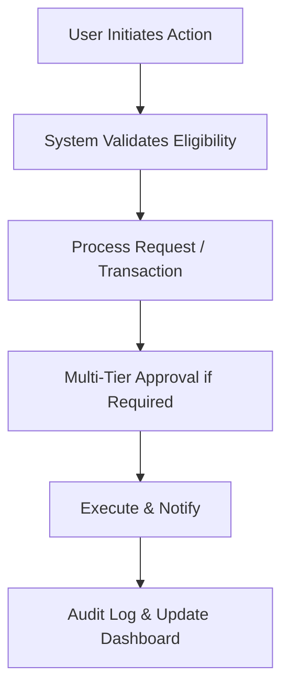
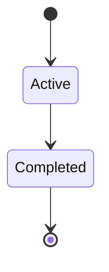

# MOD-02-09: Student Request Hub & Automated Clearance Engine — SOFTWARE REQUIREMENTS SPECIFICATION

- **Module Identifier:** `MOD-02-09`
- **Implementation Phase:** `PHASE 02 - Academic Services & Student Affairs`
- **System:** Integrated University Enterprise Resource Planning & Student Information Management System (MEMA ERP)
- **Document Version:** 1.0.0-PROD-SPEC
- **Status:** Approved Baseline / Ready for Implementation

---

## 1. Module Number and Name
- **Module ID:** `MOD-02-09`
- **Official Name:** Student Request Hub & Automated Clearance Engine
- **Domain:** Academic Services & Student Affairs

## 2. Phase & Implementation Order
- **Phase:** PHASE 02 - Academic Services & Student Affairs
- **Implementation Sequence:** Foundational / Critical Path

## 3. Purpose and Objectives
Provides a unified paperless request portal where students submit service requests (transcript orders, deferments, programme transfers, ID replacements, academic appeals) and a multi-departmental automated clearance engine for registration, exams, and graduation.

## 4. Scope
### 4.1 In-Scope
- Configurable request types with multi-tier approval workflows
- Multi-departmental clearance engine (Finance, Library, Hostels, Student Affairs, Department, Exams)
- Real-time clearance status tracking with checkpoint progress visualization
- Automated document generation upon request fulfillment

### 4.2 Out-of-Scope
- Detailed items managed by referenced dependent modules.

## 5. Actors / Users and Roles
| Role Name | Description | Access Level |
|---|---|---|
| **System Administrator** | Configures module parameters and manages workflows. | System Admin |
| **Academic / Administrative Staff** | Operates module features and approves workflows. | Staff |
| **Student** | Self-service actions within permitted scope. | End User |

## 6. Role-Based Permissions (CRUD Matrix)
| Role | Create | Read | Update | Delete | Approve / Execute |
|---|---|---|---|---|---|
| Admin | YES | YES | YES | NO | YES |
| Staff | YES | YES | YES | NO | YES |
| Student | Self | Self | Self | NO | NO |

## 7. End-to-End Workflows

### Workflow Step-by-Step Execution:
1. **Request Initiation:** User submits action through self-service portal.
2. **Validation & Processing:** System validates business rules and routes through approval workflow.
3. **Completion & Notification:** Action completed, user notified, and audit trail recorded.

## 8. User Actions
| User Role | Interface / View | Action Description | Precondition | Postcondition |
|---|---|---|---|---|
| User | `Module Interface` | Perform primary module action | Authenticated with required role | Action processed and recorded |

## 9. Functional Requirements
### FR-09-001: Core Student Request Hub & Automated Clearance Engine Functionality
- **Description:** System shall support end-to-end student request hub & automated clearance engine operations as specified.
- **Inputs:** Module-specific input data
- **Outputs:** Processed records with audit trail
- **Validation:** Business rule compliance

## 10. Sub-Modules
| Sub-Module ID | Sub-Module Name | Core Responsibility |
|---|---|---|
| **SUB-09-01** | Core Operations | Primary operations for student request hub & automated clearance engine. |
| **SUB-09-02** | Reporting & Analytics | Module-specific dashboards and reports. |

## 11. Features
- **Self-Service Interface:** Modern responsive UI with role-based views.
- **Workflow Automation:** Configurable multi-tier approval workflows.

## 12. Business Rules & Logic
- **BR-MOD-02-09-001 (Data Integrity):** All transactions are ACID-compliant with referential integrity enforcement.
- **BR-MOD-02-09-002 (Audit Compliance):** All state changes are logged in immutable audit trail.

## 13. Data Requirements & Entities
### Core PostgreSQL Relational Tables:
#### Table: `mod_02_09.primary_records`
*Description: Primary data table for Student Request Hub & Automated Clearance Engine.*
```sql
-- Schema defined in detailed implementation phase
-- Core entity for Student Request Hub & Automated Clearance Engine
```


## 14. Required Fields & Schema Specification
| Field Name | Data Type | Nullable | Constraints / Foreign Keys | Description |
|---|---|---|---|---|
| `id` | `UUID` | `NO` | PRIMARY KEY | Primary identifier |

## 15. Validation Rules
- **VR-MOD-02-09-001 [status]:** Must be a valid workflow state value.

## 16. Approval Workflows & Multi-Tier Sign-Off
Configurable multi-tier approval chain based on module workflow requirements.

## 17. Notifications, Alerts & Triggers
| Event Trigger | Recipient Channel | Message Template Summary |
|---|---|---|
| **Action Completed** | `Email + In-App` (Requesting User) | Your request has been processed successfully. |

## 18. Dashboards & Analytics Widgets
- **Student Request Hub & Automated Clearance Engine Dashboard (Module Administrator):** Operational metrics and KPIs for student request hub & automated clearance engine.

## 19. Reports
| Report ID | Title | Frequency | Output Formats | Permitted Roles |
|---|---|---|---|---|
| `REP-09-01` | Student Request Hub & Automated Clearance Engine Summary Report | Per Semester / On-Demand | PDF, Excel, CSV | Management, Staff |

## 20. Search, Filtering and Export Requirements
- **Search Capabilities:** Full-text search across student request hub & automated clearance engine records.
- **Filters:** Status, Date Range, Department.
- **Export Options:** PDF, CSV, Excel.

## 21. Audit Trails and Logging
- **Audit Level:** Comprehensive append-only logging in `audit.audit_logs`.
- **Monitored Attributes:** All CRUD operations, approval decisions, and configuration changes.
- **Tamper-Proofing:** Append-only PostgreSQL audit triggers.

## 22. Security Requirements
- **Authentication:** Role-based access control.
- **Data Protection:** TLS 1.3 in transit, AES-256 at rest.
- **Session Security:** Authenticated user session.

## 23. Integrations / APIs
### Exposed REST Endpoints:
```text
GET  /api/v1/02/09
POST /api/v1/02/09
GET  /api/v1/02/09/reports
```
### External Inbound / Outbound Feeds:
Module-specific external integrations as defined in detailed specs.

## 24. Dependencies on Other Modules
- **Inbound Dependencies (Prerequisites):** MOD-01-06, MOD-01-09, MOD-02-06, MOD-02-07, MOD-02-08
- **Outbound Dependencies (Consuming Modules):** MOD-01-07 (Registration clearance), MOD-01-10 (Exam clearance), MOD-01-12 (Graduation clearance).

## 25. System-Generated Documents
- **Student Request Hub & Automated Clearance Engine Report:** Format `PDF`. Official generated report for student request hub & automated clearance engine.

## 26. Statuses and Workflow States

- **State Descriptions:** Active, In-Progress, Completed, Archived.

## 27. Exception / Error Handling
| Error Code | HTTP Status | Trigger Condition | System Recovery Action |
|---|---|---|---|
| `ERR-09-001` | `400 Bad Request` | Invalid input data | Return validation error details. |

## 28. Accessibility and Usability Requirements
- **Compliance:** WCAG 2.2 AA compliant typography, contrast ratio >= 4.5:1, keyboard navigability, screen reader aria-labels.
- **Responsive Layout:** Adaptive desktop, tablet, and mobile viewport breakpoints (320px to 2560px).

## 29. Performance Requirements & SLOs
- **Response Time:** 95% of API requests respond in < 250ms.
- **Concurrency:** Supports 5,000 concurrent active users without degradation.
- **Availability:** 99.95% uptime target.

## 30. Compliance Requirements
University policies and statutory regulations applicable to this module.

## 31. Acceptance Criteria, Test Scenarios & Future Extensibility
### 31.1 Acceptance Criteria
- [ ] **AC-1:** End-to-end student request hub & automated clearance engine workflow operates correctly.
- [ ] **AC-2:** All approval chains execute as configured.
- [ ] **AC-3:** Reports generate with accurate data.

### 31.2 Test Scenarios
| Scenario ID | Test Case Title | Test Steps | Expected Outcome |
|---|---|---|---|
| `TC-09-01` | Core Student Request Hub & Automated Clearance Engine Workflow | 1. Submit request. 2. Approve. 3. Verify completion. | Request processed and audit trail recorded. |

### 31.3 Future & Extensibility Considerations
- Enhanced analytics and AI-driven insights.
- Mobile-optimized interfaces.
