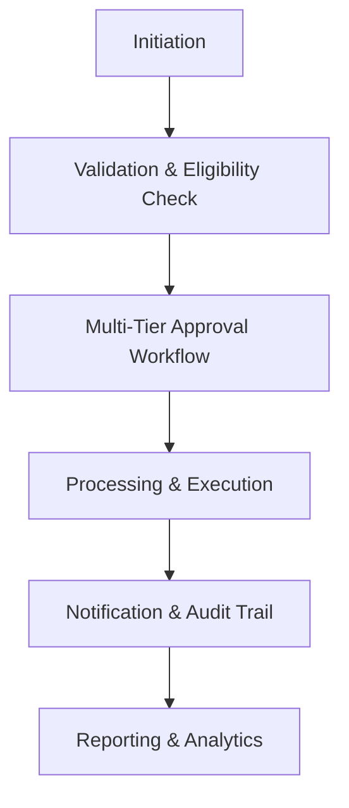
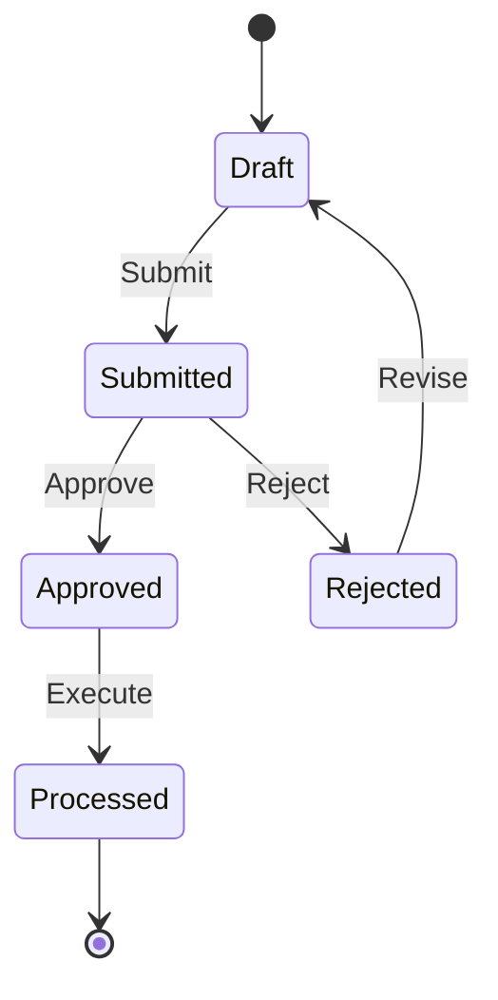

# MOD-03-06: Payroll Engine, Statutory Deductions & Bank Files — SOFTWARE REQUIREMENTS SPECIFICATION

- **Module Identifier:** `MOD-03-06`
- **Implementation Phase:** `PHASE 03 - Finance, HR & Procurement`
- **System:** Integrated University Enterprise Resource Planning & Student Information Management System (MEMA ERP)
- **Document Version:** 1.0.0-PROD-SPEC
- **Status:** Approved Baseline / Ready for Implementation

---

## 1. Module Number and Name
- **Module ID:** `MOD-03-06`
- **Official Name:** Payroll Engine, Statutory Deductions & Bank Files
- **Domain:** Finance, HR & Procurement

## 2. Phase & Implementation Order
- **Phase:** PHASE 03 - Finance, HR & Procurement
- **Implementation Sequence:** Foundational / Critical Path

## 3. Purpose and Objectives
Implements a comprehensive payroll engine: salary structure definition, monthly payroll processing, statutory deductions (PAYE, NHIF, NSSF, HELB, Housing Levy), voluntary deductions (SACCO, insurance), allowances, overtimes, bank file generation, and payslip production.

## 4. Scope
### 4.1 In-Scope
- Salary grade and structure definition
- Monthly payroll computation engine
- Statutory deductions: PAYE (graduated tax), NHIF, NSSF, Housing Levy, HELB loan recovery
- Voluntary deductions: SACCO, insurance, loan repayments
- Allowances: house, transport, acting, hardship, responsibility
- Overtime and extra teaching load calculations
- Leave without pay and mid-month adjustments
- Bank payment file generation (SWIFT MT101, bulk EFT)
- Digital payslip generation and employee self-service access
- Year-end P9 tax certificate generation

### 4.2 Out-of-Scope
- Detailed items managed by referenced dependent modules.

## 5. Actors / Users and Roles
| Role Name | Description | Access Level |
|---|---|---|
| **System Administrator** | Configures module parameters, maintains master data and manages workflows. | System Admin |
| **Finance / HR / Procurement Officer** | Operates module features, processes transactions, and approves workflows. | Staff |
| **HOD / Dean / Management** | Reviews reports, approves budgets, and makes strategic decisions. | Management |
| **Staff Member** | Self-service actions: leave requests, payslip downloads, asset returns. | End User |

## 6. Role-Based Permissions (CRUD Matrix)
| Role | Create | Read | Update | Delete | Approve / Execute |
|---|---|---|---|---|---|
| Admin | YES | YES | YES | NO | YES |
| Officer | YES | YES | YES | NO | YES |
| Management | NO | YES | NO | NO | YES |
| Staff | Self | Self | Self | NO | NO |

## 7. End-to-End Workflows

### Workflow Step-by-Step Execution:
1. **Initiation:** User or system initiates the transaction or request.
2. **Validation:** System validates against business rules, budgets, and policies.
3. **Approval:** Multi-tier approval chain based on institutional hierarchy.
4. **Execution:** Transaction processed, ledgers updated, notifications sent.
5. **Reporting:** Dashboard and reports updated in real-time.

## 8. User Actions
| User Role | Interface / View | Action Description | Precondition | Postcondition |
|---|---|---|---|---|
| Officer | `Module Interface` | Process primary transactions | Authenticated with Officer role | Transaction recorded with audit trail |
| Management | `Dashboard` | Review and approve requests | Pending approval item | Approved/rejected with timestamp |

## 9. Functional Requirements
### FR-06-001: Core Payroll Engine, Statutory Deductions & Bank Files Operations
- **Description:** System shall support end-to-end payroll engine, statutory deductions & bank files operations with ACID-compliant transaction integrity.
- **Inputs:** Module-specific input data
- **Outputs:** Processed records with audit trail
- **Validation:** Business rule and regulatory compliance
### FR-06-002: Payroll Engine, Statutory Deductions & Bank Files Reporting Suite
- **Description:** System shall generate statutory, management, and operational reports for payroll engine, statutory deductions & bank files.
- **Inputs:** Date ranges, filters
- **Outputs:** Formatted reports (PDF, Excel)
- **Validation:** Data accuracy verified against source

## 10. Sub-Modules
| Sub-Module ID | Sub-Module Name | Core Responsibility |
|---|---|---|
| **SUB-06-01** | Core Transaction Engine | Primary transactional operations for payroll engine, statutory deductions & bank files. |
| **SUB-06-02** | Approval & Workflow Manager | Configurable multi-tier approval workflows. |
| **SUB-06-03** | Reporting & Analytics | Dashboards, scheduled reports, and ad-hoc queries. |

## 11. Features
- **Self-Service Interface:** Modern responsive UI with role-based views and mobile support.
- **Workflow Automation:** Configurable multi-tier approval workflows with escalation timers.
- **Real-Time Dashboards:** Live operational and financial dashboards with drill-down capability.

## 12. Business Rules & Logic
- **BR-MOD-03-06-001 (Separation of Duties):** The same user cannot both initiate and approve a financial transaction.
- **BR-MOD-03-06-002 (Budget Check):** All expenditure transactions must pass budget availability validation before approval.
- **BR-MOD-03-06-003 (Audit Compliance):** All state changes produce immutable audit records with previous/new values.

## 13. Data Requirements & Entities
### Core PostgreSQL Relational Tables:
#### Table: `mod_03_06.primary_records`
*Description: Primary data table for Payroll Engine, Statutory Deductions & Bank Files.*
```sql
-- Schema defined in detailed implementation phase
-- Core entity for Payroll Engine, Statutory Deductions & Bank Files
-- Includes full audit trail columns (created_by, updated_by, created_at, updated_at)
```


## 14. Required Fields & Schema Specification
| Field Name | Data Type | Nullable | Constraints / Foreign Keys | Description |
|---|---|---|---|---|
| `id` | `UUID` | `NO` | PRIMARY KEY DEFAULT gen_random_uuid() | Primary identifier |
| `created_by` | `UUID` | `NO` | FK to iam.users | Record creator |
| `status` | `VARCHAR(30)` | `NO` | Workflow state enum | Current workflow status |

## 15. Validation Rules
- **VR-MOD-03-06-001 [status]:** Must be a valid workflow state value per module state machine.

## 16. Approval Workflows & Multi-Tier Sign-Off
Configurable multi-tier approval chain: Initiator -> HOD -> Finance/HR Director -> VC (for high-value items). Escalation timer: 48 hours per approval stage.

## 17. Notifications, Alerts & Triggers
| Event Trigger | Recipient Channel | Message Template Summary |
|---|---|---|
| **Action Completed** | `Email + In-App` (Requesting User) | Your request ({{request_id}}) has been processed successfully. |
| **Approval Required** | `Email + In-App` (Approver) | A new {{module_name}} request ({{request_id}}) requires your approval. Escalation in 48 hours. |

## 18. Dashboards & Analytics Widgets
- **Payroll Engine, Statutory Deductions & Bank Files Dashboard (Module Administrator / Management):** Operational metrics, KPIs, trend charts, and exception alerts for payroll engine, statutory deductions & bank files.

## 19. Reports
| Report ID | Title | Frequency | Output Formats | Permitted Roles |
|---|---|---|---|---|
| `REP-06-01` | Payroll Engine, Statutory Deductions & Bank Files Summary Report | Monthly / On-Demand | PDF, Excel, CSV | Management, Finance, HR |
| `REP-06-02` | Payroll Engine, Statutory Deductions & Bank Files Detailed Transaction Log | Daily / On-Demand | CSV, Excel | Auditors, Officers |

## 20. Search, Filtering and Export Requirements
- **Search Capabilities:** Full-text search across payroll engine, statutory deductions & bank files records.
- **Filters:** Status, Date Range, Department, Amount Range, Approval Stage.
- **Export Options:** PDF, CSV, Excel, JSON.

## 21. Audit Trails and Logging
- **Audit Level:** Comprehensive append-only logging in `audit.audit_logs`.
- **Monitored Attributes:** All CRUD operations, approval decisions, financial postings, and configuration changes.
- **Tamper-Proofing:** Append-only PostgreSQL audit triggers with previous/new value capture.

## 22. Security Requirements
- **Authentication:** Role-based access control with separation of duties enforcement.
- **Data Protection:** TLS 1.3 in transit, AES-256 at rest for sensitive data.
- **Session Security:** Authenticated user session with IP-based rate limiting.

## 23. Integrations / APIs
### Exposed REST Endpoints:
```text
GET  /api/v1/03/06
POST /api/v1/03/06
GET  /api/v1/03/06/reports
GET  /api/v1/03/06/dashboard
```
### External Inbound / Outbound Feeds:
Module-specific external integrations as defined in detailed specs.

## 24. Dependencies on Other Modules
- **Inbound Dependencies (Prerequisites):** MOD-03-01 (Employee data), MOD-03-03 (Leave data)
- **Outbound Dependencies (Consuming Modules):** MOD-04-01 (GL postings), MOD-04-02 (AP salary journals).

## 25. System-Generated Documents
- **Payroll Engine, Statutory Deductions & Bank Files Report:** Format `PDF`. Official generated report for payroll engine, statutory deductions & bank files.

## 26. Statuses and Workflow States

- **State Descriptions:** Draft, Submitted, Approved, Rejected, Processed, Archived.

## 27. Exception / Error Handling
| Error Code | HTTP Status | Trigger Condition | System Recovery Action |
|---|---|---|---|
| `ERR-06-001` | `400 Bad Request` | Invalid input data or business rule violation | Return detailed validation error messages. |
| `ERR-06-002` | `409 Conflict` | Budget exceeded or duplicate transaction detected | Reject with explanation and suggest corrective action. |

## 28. Accessibility and Usability Requirements
- **Compliance:** WCAG 2.2 AA compliant typography, contrast ratio >= 4.5:1, keyboard navigability, screen reader aria-labels.
- **Responsive Layout:** Adaptive desktop, tablet, and mobile viewport breakpoints (320px to 2560px).

## 29. Performance Requirements & SLOs
- **Response Time:** 95% of API requests respond in < 250ms.
- **Concurrency:** Supports 5,000 concurrent active users without degradation.
- **Availability:** 99.95% uptime target.

## 30. Compliance Requirements
University financial regulations, national statutory requirements (KRA, NHIF, NSSF, HELB), and internal audit policies.

## 31. Acceptance Criteria, Test Scenarios & Future Extensibility
### 31.1 Acceptance Criteria
- [ ] **AC-1:** End-to-end payroll engine, statutory deductions & bank files workflow operates correctly with ACID integrity.
- [ ] **AC-2:** All approval chains execute as configured with proper escalation.
- [ ] **AC-3:** Reports generate with accurate, auditable data.
- [ ] **AC-4:** Separation of duties is enforced across all financial workflows.

### 31.2 Test Scenarios
| Scenario ID | Test Case Title | Test Steps | Expected Outcome |
|---|---|---|---|
| `TC-06-01` | Core Payroll Engine, Statutory Deductions & Bank Files Workflow | 1. Initiate transaction. 2. Route through approval chain. 3. Execute. 4. Verify audit trail. | Transaction processed, approvals recorded, audit trail complete. |

### 31.3 Future & Extensibility Considerations
- AI-powered anomaly detection for fraud prevention.
- Advanced predictive analytics and forecasting.
- Mobile-optimized interfaces for field operations.
