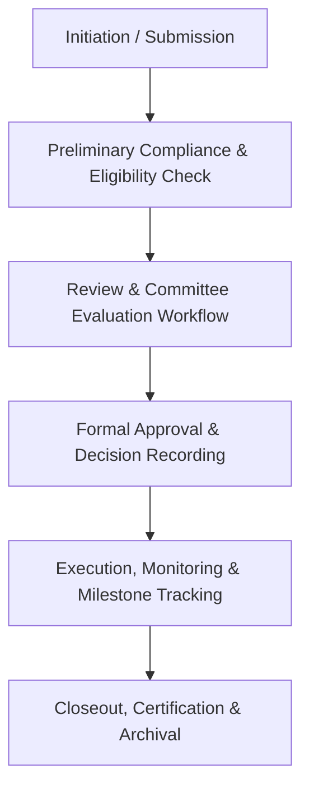
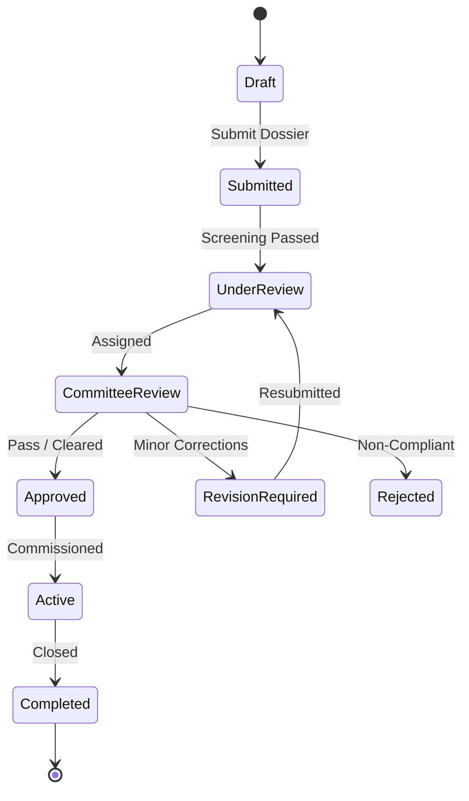

# MOD-04-03: Ethics Review Board & Protocol Approvals — SOFTWARE REQUIREMENTS SPECIFICATION

- **Module Identifier:** `MOD-04-03`
- **Implementation Phase:** `PHASE 04 - Research, Postgraduate & Governance`
- **System:** Integrated University Enterprise Resource Planning & Student Information Management System (MEMA ERP)
- **Document Version:** 1.0.0-PROD-SPEC
- **Status:** Approved Baseline / Ready for Implementation

---

## 1. Module Number and Name
- **Module ID:** `MOD-04-03`
- **Official Name:** Ethics Review Board & Protocol Approvals
- **Domain:** Research, Postgraduate & Governance

## 2. Phase & Implementation Order
- **Phase:** PHASE 04 - Research, Postgraduate & Governance
- **Implementation Sequence:** Foundational / Critical Path

## 3. Purpose and Objectives
Automates the Institutional Research Ethics Committee (IREC/IRB) operations: research protocol submissions (human/animal subjects), reviewer assignment, committee meeting management, approval certificates, renewal tracking, and adverse event reporting.

## 4. Scope
### 4.1 In-Scope
- Online research protocol submission with consent forms and tools
- Scientific and ethics reviewer allocation (single/double blind)
- Ethics committee meeting agenda formulation and decision logging
- Digital ethical clearance certificate generation with verifiable QR
- Protocol modification, annual renewal, and study closeout workflows
- Adverse event and protocol violation reporting mechanism

### 4.2 Out-of-Scope
- Detailed transactions managed by core foundational modules (e.g., student billing in MOD-01-09, staff records in MOD-03-01).

## 5. Actors / Users and Roles
| Role Name | Description | Access Level |
|---|---|---|
| **System Administrator** | Configures module policies, workflows, master registers, and user permissions. | System Admin |
| **Domain Coordinator / Officer** | Operates day-to-day ethics & compliance workflows, processes applications, and verifies compliance. | Staff |
| **Academic Staff / Committee Members** | Submits proposals, reviews submissions, records minutes, or performs evaluations. | Academic / Committee |
| **Students / External Stakeholders** | Submits requests, accesses self-service features, or tracks progress. | End User |

## 6. Role-Based Permissions (CRUD Matrix)
| Role | Create | Read | Update | Delete | Approve / Execute |
|---|---|---|---|---|---|
| Admin | YES | YES | YES | NO | YES |
| Officer | YES | YES | YES | NO | YES |
| Committee/Reviewer | NO | YES | Review | NO | Review |
| End User | Self | Self | Self | NO | NO |

## 7. End-to-End Workflows

### Workflow Step-by-Step Execution:
1. **Submission & Intake:** User submits proposal, application, request, or case via portal.
2. **Initial Screening:** System and administrative officers verify mandatory documentation and compliance criteria.
3. **Evaluation & Review:** Assigned reviewers, examiners, or committee members evaluate submission against rubrics.
4. **Approval / Resolution:** Formal sign-off, certificate generation, or resolution logging with digital signatures.
5. **Lifecycle Monitoring:** Ongoing tracking of milestones, deliverables, renewals, or follow-up action items.

## 8. User Actions
| User Role | Interface / View | Action Description | Precondition | Postcondition |
|---|---|---|---|---|
| End User | `Self-Service Portal` | Submit proposal / request / application | Authenticated user with valid credentials | Submission registered with unique tracking ID |
| Officer / Reviewer | `Evaluation Dashboard` | Review dossier, record score, and approve/reject | Assigned review task | Decision recorded in audit trail with rationale |

## 9. Functional Requirements
### FR-03-001: Core Ethics Review Board & Protocol Approvals Management
- **Description:** System shall manage the end-to-end lifecycle for ethics review board & protocol approvals with full compliance and state tracking.
- **Inputs:** Domain-specific submissions, metadata, attachments
- **Outputs:** Validated records, automated status transitions, and generated deliverables
- **Validation:** Strict schema validation and document integrity checks
### FR-03-002: Ethics Review Board & Protocol Approvals Reporting and Auditing
- **Description:** System shall provide comprehensive analytics, regulatory reporting, and milestone compliance tracking.
- **Inputs:** Date ranges, department filters, status codes
- **Outputs:** Audit-ready PDF, Excel, and CSV reports
- **Validation:** Reconciles against primary relational database records

## 10. Sub-Modules
| Sub-Module ID | Sub-Module Name | Core Responsibility |
|---|---|---|
| **SUB-03-01** | Intake & Registration Hub | Handles intake, verification, and initial processing of ethics review board & protocol approvals items. |
| **SUB-03-02** | Review & Evaluation Engine | Manages rubrics, peer reviews, committee evaluations, and scoring. |
| **SUB-03-03** | Milestone & Compliance Tracker | Tracks progress milestones, renewals, SLA deadlines, and closures. |

## 11. Features
- **Digital Workflow Engine:** Automated stage-gate approvals with configurable escalations and SLA timers.
- **Document Attachment & Versioning:** Integrated document upload with checksum validation, version history, and virus scanning.
- **Real-Time Tracking Dashboard:** Visual pipeline and Kanban-style progress monitoring for applicants and administrators.

## 12. Business Rules & Logic
- **BR-MOD-04-03-001 (Conflict of Interest Prevention):** Reviewers and committee members cannot evaluate submissions where they are named investigators, supervisors, or interested parties.
- **BR-MOD-04-03-002 (Document Immutability):** Once approved by committee or authority, final signed documents and certificates cannot be modified without formal amendment workflow.
- **BR-MOD-04-03-003 (Audit Trail Completeness):** Every evaluation score, status update, note, and decision must capture user ID, timestamp, IP address, and previous state.

## 13. Data Requirements & Entities
### Core PostgreSQL Relational Tables:
#### Table: `mod_04_03.primary_records`
*Description: Master data registry for Ethics Review Board & Protocol Approvals.*
```sql
-- Schema defined in detailed implementation phase
-- Core entity for Ethics Review Board & Protocol Approvals
-- Includes full audit columns (created_by, updated_by, created_at, updated_at, status)
```


## 14. Required Fields & Schema Specification
| Field Name | Data Type | Nullable | Constraints / Foreign Keys | Description |
|---|---|---|---|---|
| `id` | `UUID` | `NO` | PRIMARY KEY DEFAULT gen_random_uuid() | Primary unique identifier |
| `tracking_number` | `VARCHAR(64)` | `NO` | UNIQUE NOT NULL | Human-readable sequential tracking code |
| `status` | `VARCHAR(32)` | `NO` | Workflow status enum | Current lifecycle status |

## 15. Validation Rules
- **VR-MOD-04-03-001 [tracking_number]:** Must follow institutional numbering format e.g. UNIV/MOD/YYYY/XXXXX.

## 16. Approval Workflows & Multi-Tier Sign-Off
Multi-stage approval pipeline: Submitter -> Departmental Review -> Committee Evaluation -> Institutional Executive Sign-Off.

## 17. Notifications, Alerts & Triggers
| Event Trigger | Recipient Channel | Message Template Summary |
|---|---|---|
| **Application Received** | `Email + In-App` (Submitter) | Your submission for {{module_name}} (Tracking ID: {{tracking_number}}) has been received. |
| **Review Required** | `Email + In-App` (Reviewer / Committee) | A dossier (Tracking ID: {{tracking_number}}) has been assigned for your review. Due date: {{due_date}}. |

## 18. Dashboards & Analytics Widgets
- **Ethics Review Board & Protocol Approvals Executive Dashboard (Deans, Directors, Executive Committee):** Real-time pipeline volume, approval velocity, overdue items, compliance indicators, and strategic KPIs for ethics review board & protocol approvals.

## 19. Reports
| Report ID | Title | Frequency | Output Formats | Permitted Roles |
|---|---|---|---|---|
| `REP-03-01` | Ethics Review Board & Protocol Approvals Master Register | Monthly / On-Demand | PDF, Excel, CSV | Management, Auditors, Regulators |
| `REP-03-02` | Ethics Review Board & Protocol Approvals Performance & SLA Report | Quarterly | PDF, CSV | Quality Assurance, Senate |

## 20. Search, Filtering and Export Requirements
- **Search Capabilities:** Full-text search by title, tracking number, applicant name, and keywords.
- **Filters:** Status, Department, Date Range, Category, Reviewer.
- **Export Options:** PDF Dossier, Excel Summary, CSV Data, JSON Export.

## 21. Audit Trails and Logging
- **Audit Level:** Comprehensive append-only logging in `audit.audit_logs`.
- **Monitored Attributes:** All submissions, document uploads, reviewer comments, scores, approval decisions, and status transitions.
- **Tamper-Proofing:** Append-only database triggers with cryptographic hash chaining.

## 22. Security Requirements
- **Authentication:** Role-based access control (RBAC) with field-level redaction for sensitive submissions.
- **Data Protection:** TLS 1.3 in transit, AES-256 for stored documents and PII fields.
- **Session Security:** Token-based secure authentication with session timeouts.

## 23. Integrations / APIs
### Exposed REST Endpoints:
```text
GET  /api/v1/04/03
POST /api/v1/04/03
GET  /api/v1/04/03/reports
GET  /api/v1/04/03/dashboard
```
### External Inbound / Outbound Feeds:
Statutory regulatory reporting APIs, external funding body portals, and payment gateways.

## 24. Dependencies on Other Modules
- **Inbound Dependencies (Prerequisites):** MOD-04-01 (Research Grants), MOD-04-02 (Postgraduate Theses), MOD-01-01 (IAM)
- **Outbound Dependencies (Consuming Modules):** MOD-04-01, MOD-04-02, MOD-05-07 (Public Verification).

## 25. System-Generated Documents
- **Ethics Review Board & Protocol Approvals Official Documentation:** Format `PDF`. Standardized output certificates, transcripts, notices, and approval summaries for ethics review board & protocol approvals.

## 26. Statuses and Workflow States

- **State Descriptions:** Draft, Submitted, UnderReview, CommitteeReview, RevisionRequired, Approved, Rejected, Active, Completed, Archived.

## 27. Exception / Error Handling
| Error Code | HTTP Status | Trigger Condition | System Recovery Action |
|---|---|---|---|
| `ERR-03-001` | `400 Bad Request` | Missing mandatory documentation or invalid parameters | Highlight missing checklist items in UI. |
| `ERR-03-002` | `403 Forbidden` | Reviewer conflict of interest or unauthorized status change | Block action and log security warning in audit log. |

## 28. Accessibility and Usability Requirements
- **Compliance:** WCAG 2.2 AA compliant typography, contrast ratio >= 4.5:1, keyboard navigability, screen reader aria-labels.
- **Responsive Layout:** Adaptive desktop, tablet, and mobile viewport breakpoints (320px to 2560px).

## 29. Performance Requirements & SLOs
- **Response Time:** 95% of API requests respond in < 250ms.
- **Concurrency:** Supports 4,000 concurrent active users without degradation.
- **Availability:** 99.95% uptime target.

## 30. Compliance Requirements
National research regulatory frameworks (NACOSTI/equivalent), University Charter, statutory healthcare guidelines, and ISO 9001 Quality Management standards.

## 31. Acceptance Criteria, Test Scenarios & Future Extensibility
### 31.1 Acceptance Criteria
- [ ] **AC-1:** Complete lifecycle workflow for ethics review board & protocol approvals executes without data loss.
- [ ] **AC-2:** All approval gates enforce mandatory criteria and prevent unauthorized bypass.
- [ ] **AC-3:** Audit logs record all user interactions with zero modification vulnerability.
- [ ] **AC-4:** Reports export clean, reconciled data ready for statutory audits.

### 31.2 Test Scenarios
| Scenario ID | Test Case Title | Test Steps | Expected Outcome |
|---|---|---|---|
| `TC-03-01` | End-to-End Ethics Review Board & Protocol Approvals Lifecycle | 1. Submit initial dossier. 2. Pass administrative screening. 3. Complete review cycle. 4. Record committee decision. 5. Verify certificate generation. | Submission progresses smoothly across stages and outputs valid signed documentation. |

### 31.3 Future & Extensibility Considerations
- AI-assisted proposal similarity analysis and plagiarism screening.
- Blockchain-anchored credential and ethics certificate notarization.
- Mobile inspector app for on-site facility and clinic evaluations.
