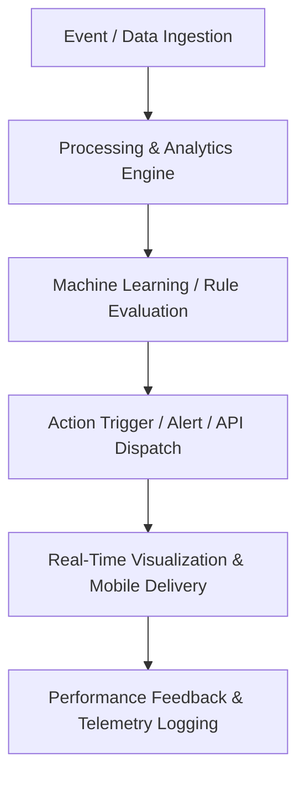
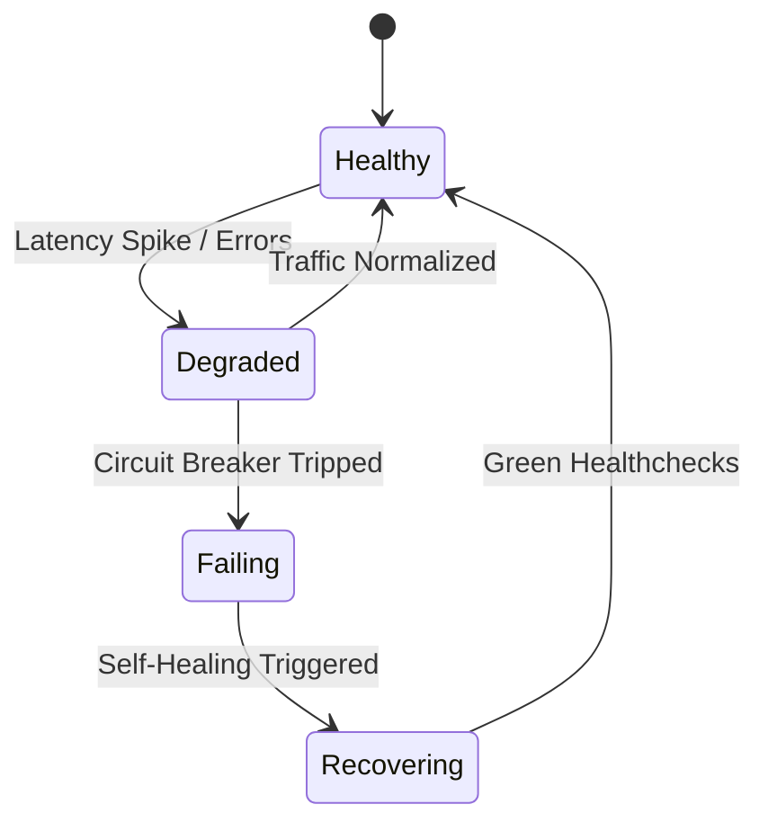

# MOD-05-02: Enterprise Data Warehouse & Analytical Pipelines — SOFTWARE REQUIREMENTS SPECIFICATION

- **Module Identifier:** `MOD-05-02`
- **Implementation Phase:** `PHASE 05 - Intelligence, Integration & Advanced Platform Services`
- **System:** Integrated University Enterprise Resource Planning & Student Information Management System (MEMA ERP)
- **Document Version:** 1.0.0-PROD-SPEC
- **Status:** Approved Baseline / Ready for Implementation

---

## 1. Module Number and Name
- **Module ID:** `MOD-05-02`
- **Official Name:** Enterprise Data Warehouse & Analytical Pipelines
- **Domain:** Intelligence, Integration & Advanced Platform Services

## 2. Phase & Implementation Order
- **Phase:** PHASE 05 - Intelligence, Integration & Advanced Platform Services
- **Implementation Sequence:** Foundational / Critical Path

## 3. Purpose and Objectives
Orchestrates the institutional data lakehouse and warehouse: automated CDC (Change Data Capture) pipelines from transactional PostgreSQL instances into dimensional star-schema data warehouse, supporting historical trend analysis and longitudinal research.

## 4. Scope
### 4.1 In-Scope
- Debezium-based Change Data Capture (CDC) streaming into analytical warehouse
- Dimensional star-schema modeling (Facts: enrollments, finances, exams; Dims: student, course, time, campus)
- Automated data transformation (dbt pipelines) and cleansing
- Historical point-in-time snapshot archiving (Slowly Changing Dimensions Type 2)
- Data catalog with column-level lineage and automated data dictionary
- Analytical query engine integration (ClickHouse / Snowflake / PostgreSQL DW)

### 4.2 Out-of-Scope
- Core transactional operational modifications (which are performed in Phases 01-04 source modules).

## 5. Actors / Users and Roles
| Role Name | Description | Access Level |
|---|---|---|
| **System & Platform Engineers** | Manages API gateways, ETL data pipelines, ML models, and infrastructure resiliency. | Platform Admin |
| **Institutional Leadership / Deans** | Consumes predictive analytics, executive dashboards, and strategic forecasts. | Executive |
| **Academic Advisors & Officers** | Acts on automated retention alerts, dispatches communications, and monitors queues. | Staff |
| **Students & Public Stakeholders** | Interacts with mobile app, conversational AI assistant, and credential verification portal. | End User / Public |

## 6. Role-Based Permissions (CRUD Matrix)
| Role | Create | Read | Update | Delete | Approve / Execute |
|---|---|---|---|---|---|
| Platform Engineer | YES | YES | YES | NO | YES |
| Executive | NO | YES | NO | NO | NO |
| Advisor / Staff | YES | YES | YES | NO | NO |
| End User / Public | Query | Self/Public | NO | NO | NO |

## 7. End-to-End Workflows

### Workflow Step-by-Step Execution:
1. **Data / Event Ingestion:** Real-time streaming events (Kafka/RabbitMQ) or batch ETL pipelines ingest records from all ERP sub-systems.
2. **Transformation & Processing:** Data is cleansed, transformed, enriched, and stored in dimensional star-schema or vector memory.
3. **Model Evaluation & Logic:** Predictive heuristics, ML models, or rule engines evaluate incoming signals against thresholds.
4. **Trigger & Delivery:** Generates notifications, triggers advisor intervention workflows, or outputs secure verification tokens.
5. **Telemetry & Feedback:** Logs latency, delivery confirmation, accuracy feedback, and SLA telemetry.

## 8. User Actions
| User Role | Interface / View | Action Description | Precondition | Postcondition |
|---|---|---|---|---|
| Student / User | `Mobile App / AI Interface` | Query academic information / receive push notification | Authenticated session or valid public token | Instant response delivered (<500ms) |
| Executive / Advisor | `Analytics Cockpit` | Explore cohort trends and drill down into at-risk indicators | Authorized executive / advisor role | Interactive visual filtered data rendered |

## 9. Functional Requirements
### FR-02-001: High-Throughput Enterprise Data Warehouse & Analytical Pipelines Engine
- **Description:** System shall deliver resilient, sub-second enterprise data warehouse & analytical pipelines operations with complete fault tolerance and observability.
- **Inputs:** System-wide transactional events, queries, or telemetry payloads
- **Outputs:** Low-latency responses, predictive scores, or verified payloads
- **Validation:** Strict schema validation and cryptographic verification
### FR-02-002: Enterprise Data Warehouse & Analytical Pipelines Monitoring and Resiliency
- **Description:** System shall provide real-time health checks, circuit breakers, and automated self-healing mechanisms for enterprise data warehouse & analytical pipelines.
- **Inputs:** Health metrics, queue lengths, error rates
- **Outputs:** Automated recovery, failover switching, and operational telemetry
- **Validation:** Meets 99.99% availability SLO

## 10. Sub-Modules
| Sub-Module ID | Sub-Module Name | Core Responsibility |
|---|---|---|
| **SUB-02-01** | Core Service Engine | High-performance runtime service powering enterprise data warehouse & analytical pipelines. |
| **SUB-02-02** | API & Integration Layer | Secure REST/gRPC/GraphQL interfaces and webhook handlers. |
| **SUB-02-03** | Analytics & Telemetry Monitor | Operational telemetry, metrics collection, and alerting. |

## 11. Features
- **Sub-Second Latency Architecture:** Optimized Redis caching, asynchronous event queues, and indexed materialized views.
- **Zero-Trust Security & Rate Limiting:** Token bucket rate limiting, mTLS inter-service encryption, and granular scopes.
- **Interactive Visual Analytics:** Modern responsive charts, heatmaps, and customizable cohort explorer.

## 12. Business Rules & Logic
- **BR-MOD-05-02-001 (Data Freshness SLO):** Analytical warehouse and dashboard snapshots must reflect OLTP transactional changes within a maximum delay of 15 minutes.
- **BR-MOD-05-02-002 (Privacy & Redaction by Design):** Predictive AI models and analytics dashboards must strictly enforce role-based differential privacy and PII masking.
- **BR-MOD-05-02-003 (Public Verification Immutability):** Digital verification tokens are cryptographically signed with university private keys; any tampered certificate must fail verification immediately.

## 13. Data Requirements & Entities
### Core PostgreSQL Relational Tables:
#### Table: `mod_05_02.service_events`
*Description: Master event registry and operational log for Enterprise Data Warehouse & Analytical Pipelines.*
```sql
-- Schema defined in detailed platform engineering phase
-- High-throughput time-series partitioned table
-- Includes microsecond timestamps, payload hashes, and execution metrics
```


## 14. Required Fields & Schema Specification
| Field Name | Data Type | Nullable | Constraints / Foreign Keys | Description |
|---|---|---|---|---|
| `id` | `UUID` | `NO` | PRIMARY KEY DEFAULT gen_random_uuid() | Unique event/record identifier |
| `event_timestamp` | `TIMESTAMPTZ` | `NO` | DEFAULT CLOCK_TIMESTAMP() | High-precision microsecond event timestamp |
| `status` | `VARCHAR(32)` | `NO` | Status enum | Execution status code |

## 15. Validation Rules
- **VR-MOD-05-02-001 [event_timestamp]:** Must be monotonic UTC timestamp.

## 16. Approval Workflows & Multi-Tier Sign-Off
Automated rule-based execution with platform administrator override capabilities.

## 17. Notifications, Alerts & Triggers
| Event Trigger | Recipient Channel | Message Template Summary |
|---|---|---|
| **Service Health Alert** | `Slack / PagerDuty / Email` (DevOps / SRE Team) | ALERT: {{service_name}} error rate exceeded threshold ({{error_rate}}%). Immediate investigation required. |
| **Student Risk Trigger** | `In-App + Email` (Assigned Academic Advisor) | High Retention Risk Alert: Student {{student_number}} has triggered risk score {{risk_score}}. |

## 18. Dashboards & Analytics Widgets
- **Enterprise Data Warehouse & Analytical Pipelines Control Center (Platform Engineers, System Architects, Leadership):** Live telemetry, throughput graphs, latency histograms, error rates, and predictive accuracy KPIs for enterprise data warehouse & analytical pipelines.

## 19. Reports
| Report ID | Title | Frequency | Output Formats | Permitted Roles |
|---|---|---|---|---|
| `REP-02-01` | Enterprise Data Warehouse & Analytical Pipelines Operational & Telemetry Report | Daily / Real-Time | JSON, CSV, PDF | DevOps, Management |
| `REP-02-02` | Enterprise Data Warehouse & Analytical Pipelines Analytical Insights & Impact Summary | Monthly | PDF Executive Briefing | Vice-Chancellor, Senate |

## 20. Search, Filtering and Export Requirements
- **Search Capabilities:** Elasticsearch/Opensearch full-text and vector similarity search across enterprise data warehouse & analytical pipelines records.
- **Filters:** Time Range, Status, Error Code, Service, User.
- **Export Options:** JSON, Parquet, CSV, PDF Briefing.

## 21. Audit Trails and Logging
- **Audit Level:** Comprehensive append-only logging in `audit.audit_logs`.
- **Monitored Attributes:** All gateway requests, pipeline executions, model inferences, push deliveries, and disaster recovery drill logs.
- **Tamper-Proofing:** Append-only immutable time-series data stores with WORM storage policies.

## 22. Security Requirements
- **Authentication:** OAuth 2.1, JWT bearer tokens with short expiry, and mTLS between backend micro-services.
- **Data Protection:** TLS 1.3 in transit with Perfect Forward Secrecy; AES-GCM-256 for data at rest.
- **Session Security:** Stateless token-based authentication with Redis session revoking.

## 23. Integrations / APIs
### Exposed REST Endpoints:
```text
GET  /api/v1/05/02/health
POST /api/v1/05/02/query
GET  /api/v1/05/02/metrics
POST /api/v1/05/02/events
```
### External Inbound / Outbound Feeds:
Apple APNs, Google FCM, WhatsApp Business Cloud API, Telephony SMS Gateways (Twilio/AfricasTalking), OpenSearch, Redis Cluster.

## 24. Dependencies on Other Modules
- **Inbound Dependencies (Prerequisites):** All Transactional Modules (Phases 01 - 04)
- **Outbound Dependencies (Consuming Modules):** MOD-05-03 (Executive BI), MOD-05-04 (Retention Engine), MOD-05-05 (AI Models).

## 25. System-Generated Documents
- **Enterprise Data Warehouse & Analytical Pipelines Technical Telemetry & Architectural Specs:** Format `PDF / OpenAPI JSON`. Standardized API documentation, schemas, and operational runbooks for enterprise data warehouse & analytical pipelines.

## 26. Statuses and Workflow States

- **State Descriptions:** Healthy, Degraded, Failing, Recovering, Maintenance.

## 27. Exception / Error Handling
| Error Code | HTTP Status | Trigger Condition | System Recovery Action |
|---|---|---|---|
| `ERR-02-001` | `429 Too Many Requests` | Client exceeded rate-limit tier | Return 429 with Retry-After header. |
| `ERR-02-002` | `503 Service Unavailable` | Downstream dependency timeout | Serve cached fallback response or circuit-break gracefully. |

## 28. Accessibility and Usability Requirements
- **Compliance:** WCAG 2.2 AA compliant typography, contrast ratio >= 4.5:1, keyboard navigability, screen reader aria-labels.
- **Responsive Layout:** Adaptive desktop, tablet, and mobile viewport breakpoints (320px to 2560px).

## 29. Performance Requirements & SLOs
- **Response Time:** 95% of API requests respond in < 250ms.
- **Concurrency:** Supports 10,000 concurrent active users without degradation.
- **Availability:** 99.95% uptime target.

## 30. Compliance Requirements
GDPR, National Data Protection Act, ISO 27001 Information Security, and NIST 800-53 Cybersecurity Framework.

## 31. Acceptance Criteria, Test Scenarios & Future Extensibility
### 31.1 Acceptance Criteria
- [ ] **AC-1:** Service enterprise data warehouse & analytical pipelines handles target concurrency with <250ms p95 latency.
- [ ] **AC-2:** Automated failover and disaster recovery procedures validate with zero data loss.
- [ ] **AC-3:** All external integration endpoints enforce rate limiting and authentication.
- [ ] **AC-4:** Predictive and analytics models produce auditable, verifiable metrics.

### 31.2 Test Scenarios
| Scenario ID | Test Case Title | Test Steps | Expected Outcome |
|---|---|---|---|
| `TC-02-01` | Load and Resiliency Test for Enterprise Data Warehouse & Analytical Pipelines | 1. Inject peak synthetic concurrent load. 2. Simulate network partition. 3. Verify circuit breaker behavior. 4. Verify telemetry logs. | System degrades gracefully, maintains data consistency, and auto-heals upon partition resolution. |

### 31.3 Future & Extensibility Considerations
- Edge computing node deployment for ultra-low latency campus response.
- Generative AI autonomous agent workflows for routine administrative tasks.
- Zero-knowledge proof (ZKP) identity verification for external verifiers.
