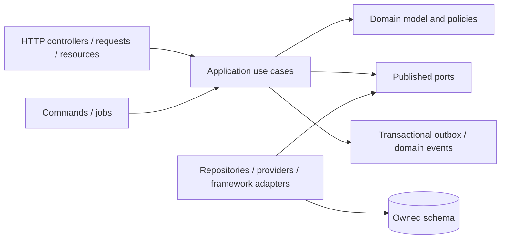

# Application and Module Architecture

## Deployable applications

`website`, `applicant`, `student`, `lecturer`, `staff`, `admin`, and `management` are independently deployable Next.js applications. Shared packages may expose UI, authentication helpers, generated API clients, types, configuration, utilities, observability, and testing support. Packages never import from applications.

## Backend layering

Each Laravel module follows this dependency direction:

- **Presentation:** parse protocol input, invoke one use case, serialize the contract; no business rules.
- **Application:** transaction boundary and workflow orchestration; calls published interfaces.
- **Domain:** invariants, states, value objects, policies, and effective-dated rules; framework-independent where practical.
- **Infrastructure:** Eloquent, storage, provider SDKs, queues, and framework implementations.

## Bounded contexts

| Context                        | Owns                                                               | Must not own                       |
| ------------------------------ | ------------------------------------------------------------------ | ---------------------------------- |
| Identity & access              | persons, users, credentials, roles, scopes, sessions               | Student/employee domain state      |
| Institution                    | campuses, faculties, departments, periods, reference data          | Curriculum outcomes                |
| CMS/public web                 | content, navigation, media metadata, publishing                    | Applicant decisions                |
| Admissions                     | prospects, applications, offers, admission decisions               | Student record after matriculation |
| Curriculum/course              | versioned programmes, curricula, courses, offerings                | Individual enrollment/result       |
| Student/SIS                    | student identity extension, statuses, official record              | Course capacity, ledger balances   |
| Enrollment/timetable           | registration, enrollment, sections, scheduling                     | Fee posting, final grades          |
| Finance                        | charges, payments, ledger, GL/AP/AR/bank                           | Academic eligibility decisions     |
| Examination/graduation         | assessment, marks, approvals, GPA, awards, credentials             | Teaching content                   |
| HR/payroll                     | employment, leave, appraisal, payroll inputs/results               | Student lifecycle                  |
| Procurement/assets             | sourcing, orders, receipts, inventory, assets                      | General-ledger policy              |
| Student affairs/health         | welfare, accommodation, cases; restricted sub-boundaries           | General administrative access      |
| Research/governance/DMS        | grants, ethics, postgraduate, committees, controlled documents     | Core student ledger                |
| Platform/integration/reporting | workflow, files, notifications, adapters, audit, derived analytics | Ownership of domain truth          |

## Cross-module interaction

Synchronous calls are used when the caller needs an authoritative decision or atomic result. Domain events plus an outbox are used for derived updates and integrations. Cross-module table access and Eloquent-model imports are CI violations. Reporting reads use approved projections or a replica, never undocumented joins into domain tables.
