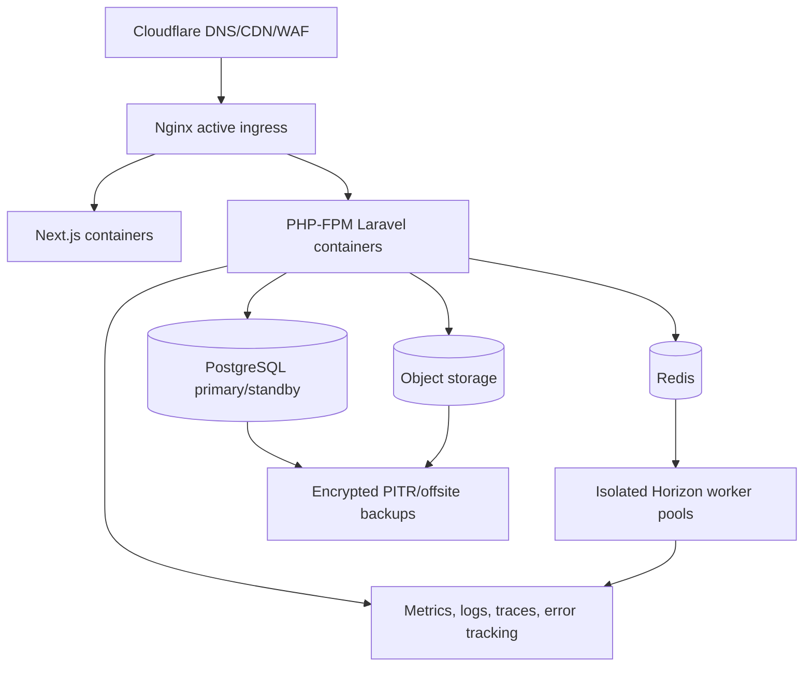

# Deployment Architecture

## Environments

Local, CI, development, staging, and production are isolated. Staging mirrors production topology and security controls with synthetic or masked data. Production access is least-privilege, MFA-protected, time-bound where possible, and audited.

## Release controls

Build once and promote immutable, signed artifacts. CI gates formatting, static analysis, module boundaries, unit/integration/contract/authorization tests, OpenAPI breaking changes, SAST, dependency and image scans, and application builds. Database changes use expand/migrate/contract; destructive contraction requires explicit approval, verified backup, rollback/forward-fix plan, and completed migration reconciliation.

Deployments use health-gated rolling or blue/green release. Feature flags separate deployment from activation. Rollback covers application artifacts; incompatible data changes require a tested forward-fix or compatible rollback path.

## Operations and recovery

Production runbooks cover database/Redis/object-store loss, worker backlog, provider outage, certificate/DNS failure, security incidents, key compromise, restore, and rollback. Nightly full backup plus five-minute WAL/PITR is the baseline; restore drills occur before Gate 0 and at least semi-annually. Kubernetes is introduced only at the ADR-011 trigger.
