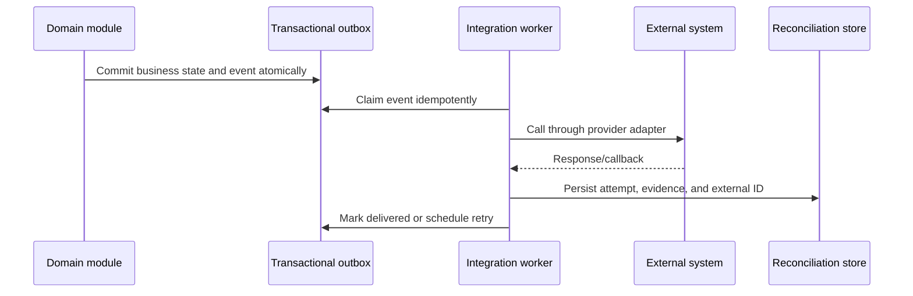

# Integration Architecture

## Pattern

## Mandatory adapter contract

Each integration documents owner, purpose, data classes, system of record, protocol/version, credentials, environment, rate limits, timeout, idempotency key, signature/authentication, retry/backoff, circuit breaker, reconciliation, observability, retention, and manual recovery. Raw payload retention must be privacy-reviewed.

| Integration             | ERP responsibility                                              | External responsibility                                |
| ----------------------- | --------------------------------------------------------------- | ------------------------------------------------------ |
| M-Pesa/banks            | Student account/GL, verification, deduplication, reconciliation | Transaction execution and provider evidence            |
| Moodle                  | Identity/enrollment/final-grade authority and sync status       | Learning content/activity and approved assessment feed |
| Library/Koha            | Identity and clearance orchestration                            | Circulation, fines, and item state                     |
| Email/SMS/push/WhatsApp | Template decision, consent/preference, dispatch log             | Delivery transport/status                              |
| Regulators/statutory    | Validated extract/submission and evidence                       | External acceptance/status                             |

Inbound webhooks authenticate before business parsing, deduplicate, record evidence, respond within provider limits, and queue safe processing. Outbound webhooks use per-subscriber HMAC, timestamp/replay protection, delivery logs, retry, disablement, and manual replay. No external failure may partially commit authoritative ERP state.
