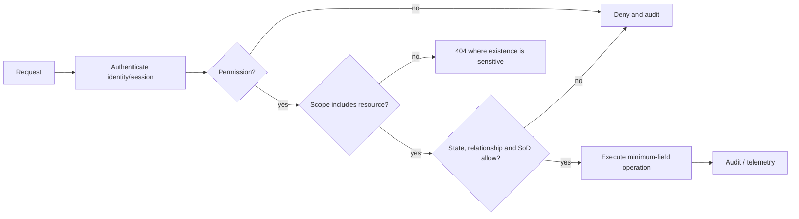

# Security Architecture

## Trust and authorization model

All browser, mobile, integration, queue, and administrator inputs are untrusted. Authentication establishes an identity, not authority. Each operation evaluates:

`identity + permission + organizational scope + resource state + purpose/relationship + separation of duties`

## Controls

- Sanctum same-site SPA sessions use `__Host-`, `HttpOnly`, `Secure`, and `SameSite=Lax`; CSRF applies to every mutation.
- Argon2id, breached-password checking, throttling, enumeration-safe reset, device revocation, and session rotation are mandatory.
- TOTP MFA is mandatory for privileged roles; recovery and break-glass paths are stronger-audited than ordinary login.
- Policies enforce query-level scope and field-level serialization. UUIDs are not an IDOR control.
- CSP, output encoding, allow-listed rich-text sanitization, parameterized SQL, outbound host allow-lists, and request limits mitigate common web threats.
- Uploads use size/MIME allow-lists, magic-byte validation, generated names, quarantine, malware scanning, non-public storage, and authorized signed retrieval.
- Secrets come from a managed runtime store. Sensitive fields use envelope/application encryption with named rotation and recovery procedures.
- Audit failure on protected mutations fails closed. Audit content minimizes secrets and unnecessary personal data.

## Data classification

| Class        | Examples                                                     | Additional requirements                                                                 |
| ------------ | ------------------------------------------------------------ | --------------------------------------------------------------------------------------- |
| Restricted   | Clinic, counselling, sensitive discipline                    | Dedicated boundary and roles, encrypted fields, audited reads, no platform-admin bypass |
| Confidential | Grades, finance, payroll, national IDs, bank details         | Scoped access, encrypted storage, controlled/export-audited fields                      |
| Internal     | Enrollment, timetable, ordinary staff directory              | Standard scoped RBAC                                                                    |
| Public       | Published website/catalogue, limited credential verification | Integrity controls, rate limits, privacy-minimized output                               |

## Threat-model gates

STRIDE/data-flow threat models are mandatory before authentication, payments, registration, grades, payroll, restricted health/counselling, file uploads, public APIs, data migration, and tenant enablement. Each identifies assets, actors, trust boundaries, abuse cases, mitigations, tests, owners, and residual risk. See `PLAN/05-SECURITY-AND-RBAC.md` for detailed controls.
