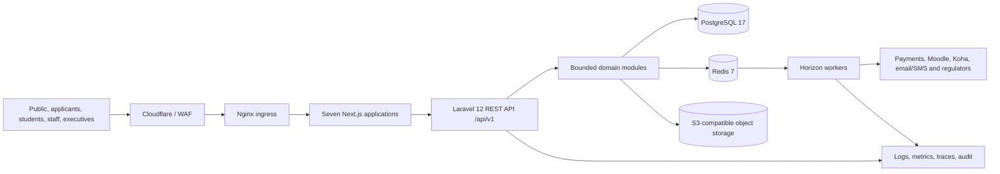

# University ERP System Architecture

**Status:** Accepted baseline, subject to documented ADR supersession  
**Decision source:** `PLAN/01-ARCHITECTURE-DECISIONS.md`

## Architectural style

The initial system is a single-institution, multi-tenant-shaped **modular monolith**. Laravel modules own business behavior and PostgreSQL schemas; audience-specific Next.js applications consume a contract-first REST API. Redis carries cache, sessions, coordination, and derived asynchronous work. S3-compatible storage owns documents. Nginx is the ingress; dedicated gateway, Kafka, Kubernetes, GraphQL, OpenSearch, and separate analytical engines are deferred until documented triggers occur.

## Core invariants

1. Modules access another module only through its published application interface or domain event.
2. Authoritative state is committed synchronously; queues carry only derived side effects.
3. Every request, job, event, record, file, cache key, and audit entry carries institution and correlation context.
4. Every action is authorized server-side by permission, scope, resource state, and separation-of-duty rules.
5. Financial, enrollment, and grade invariants are protected by database constraints and transactions, not UI checks.
6. Integration adapters translate external contracts; provider concerns never enter domain services.

## Failure posture

| Failure                                | Required behavior                                                                                                     |
| -------------------------------------- | --------------------------------------------------------------------------------------------------------------------- |
| Redis/cache unavailable                | Cache miss falls back safely; mutations requiring locks fail closed; queued work is delayed, never lost silently.     |
| External provider unavailable          | Circuit opens, operation is recorded as pending/failed, retry is idempotent, operators can reconcile.                 |
| Worker backlog                         | Authoritative transactions continue where safe; queue-specific alerts prevent LMS/report load from delaying payments. |
| Database unavailable                   | Mutations fail; no alternate store accepts truth; HA/restore runbook controls recovery.                               |
| Object store/virus scanner unavailable | Upload/download fails closed for protected files; metadata never claims a completed object prematurely.               |
| Identity service degraded              | Existing valid sessions follow policy; new authentication/elevation fails closed.                                     |

## Source hierarchy

Accepted ADRs supersede conflicting technology statements in older SRSD documents. Module SRSD files own detailed functional requirements. `docs/requirements/` governs cross-module requirements and unresolved policy. OpenAPI owns wire contracts. Code is never the sole record of a business rule.
